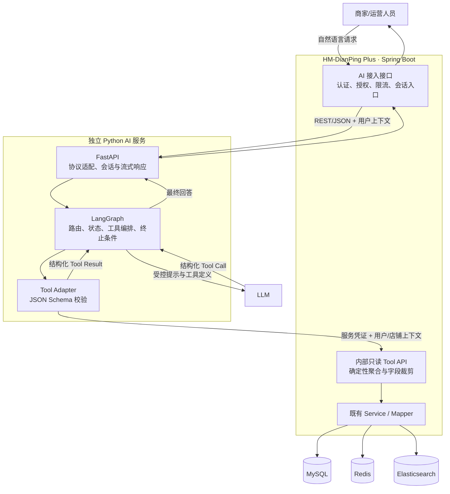
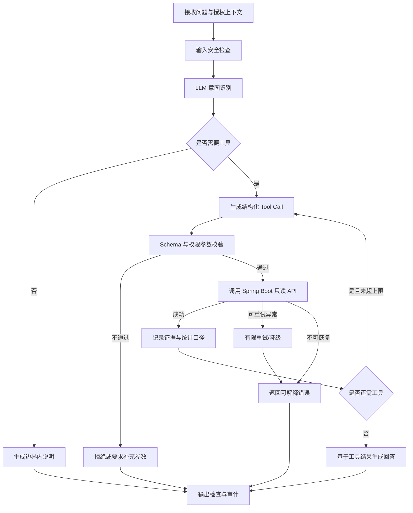

# AI 运营助手架构设计

## 1. 设计目标与原则

AI 运营助手面向商家和内部运营人员，把自然语言问题转换为受控、可审计的业务查询，并基于真实数据生成运营解释和建议。首期定位是“只读分析助手”，不代替订单、优惠券、店铺等核心业务服务，也不直接写入任何业务存储。

设计原则：

- Spring Boot 仍是业务数据与权限规则的唯一出口。
- FastAPI 承担 AI 服务接入和 Java/Python 协议适配。
- LangGraph 负责有边界的状态流转、Tool 调用和失败处理。
- LLM 负责理解问题、选择工具与组织回答，不拥有数据库凭据。
- 所有结论应尽量附带统计口径、时间范围和数据来源，数据不足时明确说明。

## 2. AI 助手业务场景

### 2.1 店铺经营概览

商家可询问：

- “我的店铺现在的评分、销量和评论数怎么样？”
- “店铺基础信息和营业时间是什么？”
- “帮我总结这家店当前的经营概况。”

助手调用店铺信息查询工具，返回商户有权限访问的店铺基础信息和公开经营指标，再生成简短说明。

### 2.2 订单趋势分析

商家可询问：

- “过去 7 天每天有多少优惠券订单？”
- “本月已支付和已核销订单占比是多少？”
- “和上一个同长度周期相比，订单量有什么变化？”

助手调用订单统计工具，根据明确时间范围和粒度返回聚合结果。销售金额只能基于现有优惠券支付金额与订单状态按固定口径计算，并在结果中标注统计口径，不能让模型自行推算缺失字段。

### 2.3 优惠券效果分析

商家可询问：

- “哪张优惠券下单最多？”
- “当前秒杀券库存和转化情况如何？”
- “有哪些券即将到期但使用率偏低？”

助手调用优惠券分析工具，组合优惠券、秒杀库存和订单聚合数据，输出领取/下单、支付、核销等可获得指标。若项目当前没有曝光量或领取量，就不能输出点击率、曝光转化率等不存在的指标。

### 2.4 热门数据洞察

运营人员可询问：

- “最近一周哪些店铺热度最高？”
- “评分、销量和评论增长较好的店铺有哪些？”
- “哪些内容或店铺值得重点关注？”

助手调用热门数据分析工具，在受限时间窗口和结果数量内返回聚合排行。首期“热门”必须采用确定性公式或已有排序字段，不能由 LLM 主观决定。

## 3. 为什么以 Agent 为主，而不是只做 RAG

Agent 与 RAG 并非互斥。这里选择 Agent 作为主架构，是因为首期问题的答案主要来自实时结构化业务数据，并且通常需要按问题动态选择一个或多个查询工具，而不是从静态文档中检索段落。

| 对比项 | 只使用 RAG | Tool-Calling Agent | 本项目选择 |
|---|---|---|---|
| 主要数据 | 文档、知识库、非结构化内容 | API 返回的实时结构化数据 | 订单、店铺、优惠券和排行均来自业务 API |
| 处理方式 | 检索相似文本后生成答案 | 理解意图、选择工具、组合结果 | 一个问题可能需要店铺信息与订单统计两个工具 |
| 数据时效 | 受索引更新时间影响 | 查询时获取当前数据 | 更适合运营数据分析 |
| 权限控制 | 文档切片过滤较复杂 | 每个 API 可执行确定性鉴权 | Java 服务按用户、商户和店铺校验 |
| 计算能力 | 不适合精确聚合 | 由后端按固定口径统计 | 避免 LLM 自己计算关键指标 |

RAG 仍可作为后续补充，用于查询活动规则、运营手册、平台政策和常见问题。届时 RAG 可以成为 Agent 的一个只读知识工具，但不替代业务数据工具。

## 4. 系统架构



逻辑主链路符合：

```text
Spring Boot
    ↓
FastAPI
    ↓
LangGraph
    ↓
LLM
```

需要注意，LLM 发起工具调用后，数据访问会沿 LangGraph → Tool Adapter → Spring Boot 内部只读 API 返回。Python 服务和 LLM 都不直连 MySQL、Redis、Elasticsearch 或 Kafka。

### 4.1 各组件职责

| 组件 | 职责 |
|---|---|
| Spring Boot AI 接入接口 | 沿用登录体系、校验用户身份、传递商户上下文、限流并返回统一协议 |
| Spring Boot 内部 Tool API | 执行字段白名单、数据权限和确定性聚合；只暴露 AI 所需数据 |
| FastAPI | 承接 Java 请求、管理超时和关联 ID、调用 LangGraph、支持普通或流式响应 |
| LangGraph | 保存会话状态，控制“理解→工具→校验→回答”流程及最大循环次数 |
| LLM | 识别意图、生成符合 Schema 的工具参数、基于工具结果组织自然语言回答 |
| 业务存储 | 继续由既有 Spring Service 访问，MySQL 仍是权威数据源 |

## 5. LangGraph 状态流程



建议的状态字段包括：`requestId`、`userId`、`merchantId`、授权店铺列表、用户问题、工具调用记录、工具结果摘要、错误信息、已执行步数和最终回答。用户身份与授权店铺列表由 Spring Boot 注入，不允许 LLM 修改。

## 6. Tool 设计

所有 Tool 都是只读工具；参数与响应采用严格 JSON Schema。`userId`、`merchantId` 等安全上下文由系统注入，不作为模型可自由填写的参数。

### 6.1 店铺信息查询：`query_shop_info`

**用途：** 查询单个授权店铺的基础信息与当前经营概览。

**模型可提供参数：**

| 参数 | 类型 | 约束 |
|---|---|---|
| `shopId` | Long | 必填，必须属于当前商家授权范围 |
| `includeMetrics` | Boolean | 可选，默认 true |

**建议返回：** `shopId`、名称、类型、区域、地址、营业时间、人均价格、评分、销量、评论数、`dataTime`。不返回内部备注或不必要的精确位置字段。

**数据来源：** Spring Boot 店铺查询服务；可以使用现有缓存读取能力，但鉴权必须先执行。

### 6.2 订单统计：`query_order_statistics`

**用途：** 按时间范围统计授权店铺优惠券订单趋势和状态分布。

**模型可提供参数：**

| 参数 | 类型 | 约束 |
|---|---|---|
| `shopId` | Long | 必填，必须在授权范围内 |
| `startTime` | ISO-8601 | 必填，不晚于结束时间 |
| `endTime` | ISO-8601 | 必填，首期跨度不超过 90 天 |
| `granularity` | Enum | `day` 或 `week` |
| `comparePreviousPeriod` | Boolean | 可选，默认 false |

**建议返回：** 总订单数、去重用户数、各状态订单数、按日/周趋势、可计算的支付金额、同比前一等长周期变化、币种/金额单位、统计口径与 `dataTime`。

**实现边界：** 聚合与金额计算由 Java/SQL 完成；LLM 只解释结果。查询必须通过 `tb_voucher.shop_id` 约束订单归属，不能只相信模型传入的店铺 ID。

### 6.3 优惠券分析：`analyze_vouchers`

**用途：** 分析授权店铺的普通券和秒杀券状态、库存与订单表现。

**模型可提供参数：**

| 参数 | 类型 | 约束 |
|---|---|---|
| `shopId` | Long | 必填，必须在授权范围内 |
| `startTime` / `endTime` | ISO-8601 | 可选，默认最近 30 天，最大 90 天 |
| `voucherIds` | Long[] | 可选，数量限制 |
| `status` | Enum[] | 可选，只接受后端定义值 |

**建议返回：** 券 ID、标题、类型、状态、支付/抵扣金额、秒杀开始和结束时间、当前数据库库存、订单量、支付量、核销量及固定口径下的比率。

**实现边界：** 没有曝光、点击或领取数据时，对应转化率返回 `unavailable` 和原因，不用订单量伪造完整漏斗。

### 6.4 热门数据分析：`query_hot_insights`

**用途：** 为平台运营人员提供店铺或内容的聚合排行和趋势线索。

**模型可提供参数：**

| 参数 | 类型 | 约束 |
|---|---|---|
| `scope` | Enum | `authorized_shops`；平台级范围仅对运营角色开放 |
| `dimension` | Enum | 首期支持 `shop`，其他维度后续扩展 |
| `startTime` / `endTime` | ISO-8601 | 必填，最大 30 天 |
| `metric` | Enum | 后端允许的销量、评论、评分或订单指标 |
| `limit` | Integer | 1～20，默认 10 |

**建议返回：** 排名、对象 ID/名称、指标值、趋势值、统计口径、时间范围和 `dataTime`。

**实现边界：** 排名由 Java/SQL 或既有统计结构按确定性规则生成；LLM 不能自行改变公式或把相关性描述成因果关系。

## 7. Java 与 Python 服务交互方式

### 7.1 首期通信方案

首期采用内网 HTTP REST + JSON，原因是实现简单、语言无关、便于联调和审计。链路分为两类：

1. Spring Boot 调用 FastAPI 的 AI 编排接口。
2. FastAPI Tool Adapter 回调 Spring Boot 的内部只读 Tool API。

建议接口语义：

```text
POST /internal/ai/v1/chat
Spring Boot -> FastAPI

GET/POST /internal/ai-tools/v1/...
FastAPI -> Spring Boot
```

本文只定义协议方向，不要求本阶段创建这些接口。

### 7.2 请求上下文

Spring Boot 发送给 FastAPI 的请求至少包含：

- `requestId`：全链路关联 ID。
- `conversationId`：会话标识，不作为授权依据。
- `userMessage`：用户原始问题。
- `userContext`：受签名保护的用户、角色、商户和授权店铺范围。
- `locale` 与客户端时间区。

FastAPI 调用 Tool API 时必须携带短时服务凭证、`requestId` 和不可由 LLM 生成的授权上下文。Spring Boot 每次仍重新鉴权，不能因为请求来自内网就默认可信。

### 7.3 响应协议

建议统一返回：

- `code`、`message`、`data`。
- `dataTime`、`timeRange`、`metricDefinition` 等数据口径。
- `traceId` 或 `requestId`。
- 可机器识别的错误类型，如参数错误、无权限、超时、上游不可用、数据为空。

普通响应足以支撑首期；若回答延迟影响体验，可在后续增加 SSE，但 Tool 结果不应原样流式暴露给浏览器。

### 7.4 超时与重试

- Spring Boot → FastAPI 设置连接与整体响应超时，并返回友好的“助手暂不可用”。
- Tool API 设置更短的单次超时，只有网络瞬时错误才有限重试。
- 所有工具是只读的，重试不会产生业务写入；仍需限制次数，防止放大故障。
- LangGraph 设置最大工具调用次数、最大循环步数和总执行时间，触发上限后终止并解释原因。
- 不在 AI 请求链路中复用 Kafka 秒杀 Topic，也不通过 Canal 获取查询结果。

## 8. 安全边界

### 8.1 数据访问边界

- Agent 只能调用白名单内的只读 Tool API。
- FastAPI 和 LLM 不配置 MySQL、Redis、ES、Kafka 或 Canal 的连接凭据。
- 禁止生成并执行 SQL、脚本、Spring Bean 名称或任意 URL。
- 首期不提供修改店铺、创建优惠券、调整库存、取消订单、退款等写工具。
- 即使将来增加写能力，也必须走既有 Spring 业务服务、二次确认和审计审批，不能直接写库。

### 8.2 身份与权限

- 用户身份在 Spring Boot 边界完成认证。
- `merchantId`、授权店铺范围和角色由服务端派生，不能接受模型覆盖。
- Spring Tool API 对每次调用执行对象级鉴权，防止通过更换 `shopId` 越权。
- 平台级热门分析只对明确的运营角色开放，商家默认只能查看自己的店铺。

### 8.3 LLM 与提示注入防护

- 系统提示、工具描述、用户输入和工具结果分层传递。
- 用户文本只能作为问题，不得被拼接成 SQL、URL 或鉴权条件。
- Tool 参数必须通过 JSON Schema、枚举、时间范围、数量和长度校验。
- 工具结果按数据处理，不执行其中出现的指令；店铺名称、优惠券规则等文本同样视为不可信内容。
- 输出前检查敏感字段、越权对象和不受证据支持的结论。

### 8.4 隐私、审计和成本控制

- 默认返回聚合数据，不向模型传递手机号、支付账号、用户明细等个人信息。
- 审计记录用户、工具名、脱敏参数、结果摘要、耗时、错误和模型版本，不记录数据库凭据。
- 对用户、商户和服务设置频率、并发、时间跨度和返回行数限制。
- 对高成本或重复问题可缓存脱敏聚合结果，但缓存 key 必须包含授权范围和统计口径。

## 9. 可靠性设计

- **确定性数据：** 数量、金额、排行和比例由 Java 查询或聚合产生，LLM 不负责关键指标计算。
- **有证据回答：** 最终答案只能引用本轮成功工具结果；无数据时明确返回无数据。
- **受控状态机：** LangGraph 限制节点、分支、步数、工具次数和超时，避免无限循环。
- **失败隔离：** LLM 或 FastAPI 不可用不影响现有店铺、搜索、秒杀和缓存链路。
- **可观测性：** Java 和 Python 使用同一 `requestId`，记录调用耗时、工具成功率、Token 使用量和错误分类。
- **模型降级：** 模型不可用时返回结构化失败提示；不使用臆测数据生成看似正常的答案。
- **版本治理：** Prompt、Tool Schema、Graph 和模型配置都应版本化，并通过固定问题集回归。

## 10. 与现有系统的关系

- Kafka 秒杀链路保持不变，AI 助手只读取已落库的订单统计。
- Elasticsearch 商户搜索保持不变；店铺信息工具可复用业务服务，但不把 ES 当主数据源。
- Canal 缓存失效链路保持不变；AI 助手不订阅 binlog。
- MySQL 仍是订单、优惠券和店铺数据的权威来源。
- 本阶段只形成设计文档，不新增 Java、Python、配置、SQL 或部署文件。
