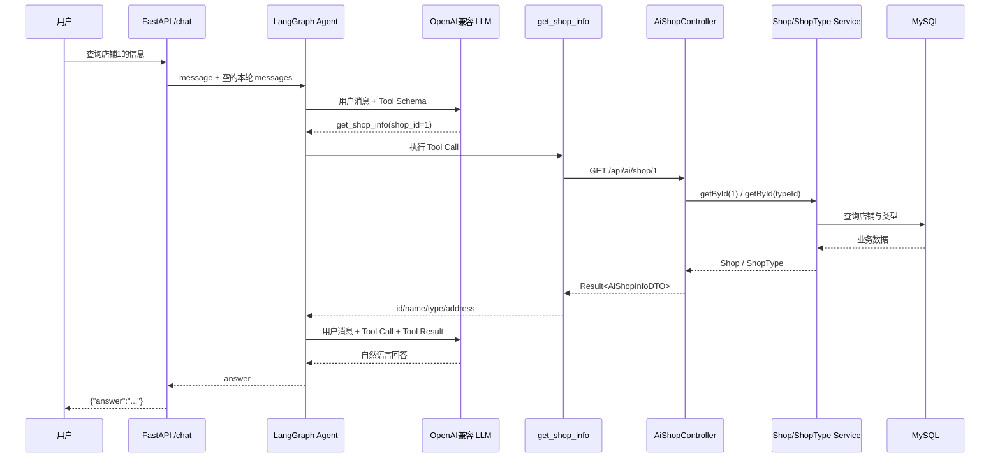
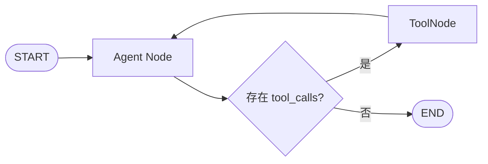

# AI Assistant Tool Calling 设计

## 1. 设计目标

Phase 2 将 Phase 1 的单节点 LLM 调用升级为可执行受控业务查询的 LangGraph Agent，并落地第一个真实业务工具 `get_shop_info`。

核心原则：

- Python 和 LLM 不直接连接 MySQL、Redis 或其他中间件。
- Spring Boot 是唯一业务数据出口，继续复用现有 Service 与 Mapper。
- Agent 只获得明确注册的只读 Tool，不具备任意 HTTP 或代码执行能力。
- 本阶段不引入 RAG、向量库、Memory 或多 Agent。
- 不修改 Kafka、Elasticsearch、Canal 和秒杀流程。

## 2. 整体调用链



## 3. Java 侧设计

### 3.1 专用接口

```http
GET /api/ai/shop/{id}
```

由独立 `AiShopController` 提供，不修改原 `ShopController`。Controller 只调用已有 `IShopService` 和 `IShopTypeService`，没有为 AI 创建数据库连接或重复 Mapper。

成功响应：

```json
{
  "success": true,
  "data": {
    "id": 1,
    "name": "103茶餐厅",
    "type": "美食",
    "address": "..."
  }
}
```

店铺不存在时保持项目统一 `Result` 协议：

```json
{
  "success": false,
  "errorMsg": "店铺不存在"
}
```

### 3.2 字段最小化

`AiShopInfoDTO` 只包含：

| 字段 | 来源 | 原因 |
|---|---|---|
| `id` | `tb_shop.id` | Tool 对象标识 |
| `name` | `tb_shop.name` | 回答店铺名称 |
| `type` | `tb_shop_type.name` | 返回可读类型而非内部 typeId |
| `address` | `tb_shop.address` | 回答店铺基础位置 |

图片、坐标、缓存字段、时间戳和完整实体均不暴露给 AI 服务。

### 3.3 接入规则

项目原登录拦截器默认拦截 `/api/ai/shop/**`。由于首期四个字段与现有公开店铺详情等价，`MvcConfig` 仅排除这一条只读路径，未放开 `/api/ai/**`。

该规则不能复制给未来订单统计或商户私有 Tool。敏感 Tool 必须增加服务身份与商户对象级授权。

## 4. Python Tool 设计

Tool 名称：`get_shop_info`

输入 Schema：

```json
{
  "shop_id": 1
}
```

约束：`shop_id` 必须为正整数。

运行流程：

1. 从 `SPRING_BOOT_BASE_URL` 读取 Java 服务地址。
2. 拼接固定路径 `/api/ai/shop/{shop_id}`。
3. 使用 `httpx.Client` 发起 5 秒超时的 GET 请求。
4. 检查 HTTP 状态和 Spring `Result.success`。
5. 再次对白名单字段做过滤后返回 Tool Result。

Tool 不能接收任意 URL，不接受 SQL，不读取 Java 数据源配置。即使 Java 将来向 DTO 增加字段，Python 仍只保留 `id`、`name`、`type`、`address`。

错误处理：

- 非正整数：`ToolException`。
- Spring Boot 连接或 HTTP 错误：统一为服务不可用，不向 LLM暴露内部堆栈。
- `success=false`：把业务错误转换为 Tool 错误内容。
- JSON 或 `data` 结构非法：明确标记上游响应无效。

## 5. LangGraph Agent 循环



`AgentState` 保留：

- `message`：原始用户输入。
- `answer`：最终自然语言回答。
- `messages`：本次请求内的 Human/AI/Tool 消息序列。

`messages` 只存在于单次 Graph 调用中，没有 Checkpointer，也不写入文件、Redis 或数据库，因此不是跨请求 Agent Memory。

Agent Node 第一次收到请求时加入 HumanMessage，并调用绑定了 `get_shop_info` 的模型：

- 模型返回 Tool Call：由 `tools_condition` 路由到 ToolNode。
- ToolNode 执行 HTTP Tool，把 ToolMessage 追加到状态后回到 Agent Node。
- 模型基于 Tool Result 返回普通文本：写入 `answer` 并进入 END。

## 6. 配置设计

`.env.example` 新增：

```dotenv
SPRING_BOOT_BASE_URL=http://localhost:8081
```

本地地址只是开发示例，不包含账号或密钥。生产环境应通过部署平台注入实际内网地址。

LLM 配置与 Spring Boot 地址分别按需校验：服务可以启动，但真正调用 Agent 时需要 LLM 配置；只有执行 Tool 时才要求 Spring Boot 地址。

## 7. 测试设计

### 7.1 Java 接口测试

- Mock `IShopService` 和 `IShopTypeService`。
- 验证 `/api/ai/shop/1` 的四个字段和统一响应。
- 验证 `images` 等未授权字段不存在。
- 验证店铺不存在时返回业务失败。

### 7.2 Python Tool 测试

- Mock `httpx.Client`，不依赖 Java 服务。
- 验证固定 URL、GET 请求、状态检查和字段过滤。

### 7.3 Graph 测试

- 第一次假模型响应 Tool Call。
- ToolNode 执行 `get_shop_info`。
- 第二次假模型生成最终回答。
- 验证模型调用两次且状态中存在 ToolMessage。

### 7.4 真实边界联调

- 启动真实 Spring Boot 与 MySQL。
- Python Tool 实际请求 `/api/ai/shop/1`。
- 使用确定性假模型触发真实 Tool，验证 Agent → ToolNode → Spring Boot → MySQL → Agent。
- 配置真实 DeepSeek 凭据后，再验证模型能自主选择 Tool 并组织自然语言回答。

## 8. 安全与演进边界

- 当前接口只返回已有公开店铺基础信息。
- Python 只允许调用代码中固定的 Spring Boot 路径。
- 不向 LLM提供数据库连接、Redis Key、Kafka Topic 或 ES Client。
- 当前没有商户私有授权模型，因此不能在此接口上继续增加订单和经营敏感字段。
- 下一阶段若增加订单统计，应先设计服务间认证和对象级权限，而不是扩大本接口 DTO。
