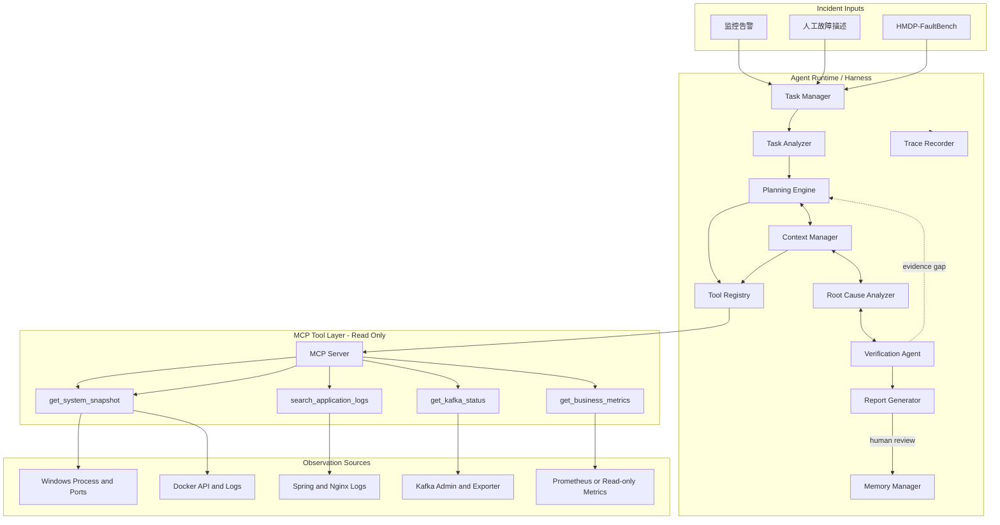
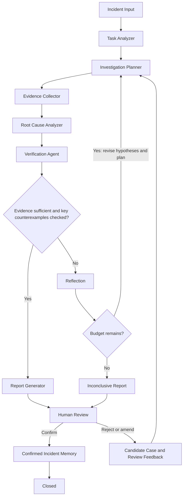
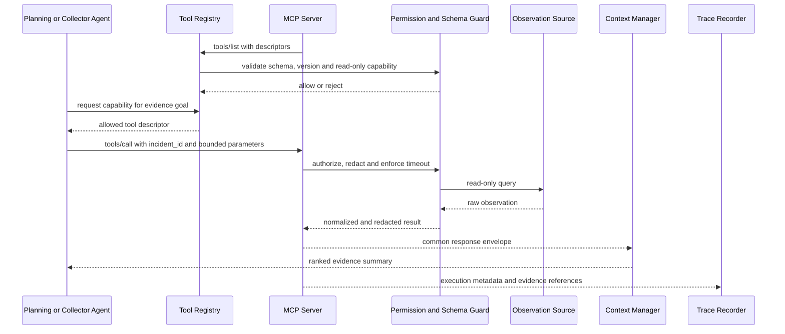
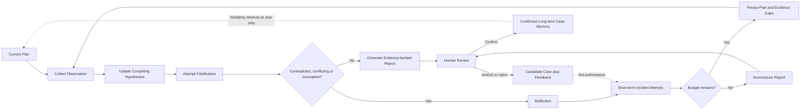

# HMDP AIOps Agent Harness 核心架构设计

## 1. 文档目标与项目定位

本文定义 HMDP AIOps Agent 的核心架构。该项目不是新的监控平台，也不是在大模型外包一层“监控查询工具”，而是一个独立于 HMDP Spring Boot 业务应用的、基于 Agent Harness 的只读智能故障诊断系统。

监控系统与 Agent 的职责边界如下：

| 能力 | 监控系统 | AIOps Agent |
| --- | --- | --- |
| 数据采集 | 采集日志、指标、进程、容器和消息队列状态 | 不重复建设采集系统，通过受控工具读取已有数据 |
| 异常发现 | 基于阈值、规则或异常检测产生告警 | 接收告警或人工故障描述并创建诊断任务 |
| 调查规划 | 通常使用固定仪表盘和 Runbook | 根据当前事故动态规划、调整和终止调查 |
| 根因分析 | 提供局部信号和人工排查入口 | 建立竞争假设，收集支持与反对证据并主动证伪 |
| 修复执行 | 可由运维平台或人工执行 | 首版不执行修复，只输出带证据的建议并等待人工决策 |

Agent 的核心价值是：理解故障目标，管理调查任务，动态选择工具，压缩观测上下文，验证而不是迎合初始假设，并形成可审计、可复现的诊断结论。

### 1.1 设计原则

1. **独立部署**：AIOps Agent 与 Spring Boot、现有经营分析 `ai-assistant` 分离，拥有独立的进程、配置、状态和故障域。
2. **只读诊断**：工具不得启动、停止、重启服务，不得修改数据库、Redis、Kafka offset、Topic 或业务配置。
3. **证据优先**：历史案例和模型常识只能生成线索，当前事故结论必须由当前环境证据支持。
4. **动态规划**：工作流定义阶段和约束，不固定工具调用顺序。
5. **主动证伪**：高置信假设必须经过独立验证；存在关键反例时不得输出确定根因。
6. **上下文有界**：原始观测数据保存在模型上下文之外，只将排序、去重后的关键证据送入模型。
7. **全程可审计**：记录调查目标、决策摘要、工具调用、证据引用和假设变化，但不保存模型隐式思维链。
8. **Human-in-the-loop**：人工确认报告和事故归档；Agent 不具备自动修复能力。

## 2. HMDP 诊断基线

当前系统是运行在 Windows 本机上的 Spring Boot 单体应用，外围依赖由 Docker Compose 管理：

- Nginx `8080`：静态前端及 `/api` 反向代理。
- Spring Boot `8081`：用户、商户、优惠券、秒杀等业务接口。
- MySQL `3306/3307`：权威业务数据。
- Redis `6379`：登录态、商户缓存、GEO、BitMap、ZSet、秒杀库存和 Redis Stream。
- Kafka `9092`：默认秒杀订单异步链路，包含主 Topic、Retry Topic 和 DLT。
- Elasticsearch `9200`：商户名称搜索，异常时降级至 MySQL。
- Canal `11111`：监听 `tb_shop` binlog，目前负责删除 Redis 商户缓存。
- 现有 AI Assistant `8000`：商家经营分析服务，不承担故障诊断。

秒杀主链路为“Redis Lua 准入与预扣库存 → Kafka 投递 → Consumer 手动 ACK → MySQL 事务扣库存并创建订单”。Redis Stream 仍作为灰度回退链路常驻。这个跨 Redis、Kafka、MySQL 的链路是首期重点诊断对象：单组件健康不等于端到端业务正确，Agent 必须能比较跨组件时间线和状态。

## 3. Agent Harness 整体架构



Harness 是控制面，MCP Server 是受控数据访问面。模型不能直接访问文件系统、中间件凭据或任意查询接口；所有观测访问必须经过 Tool Registry 和 MCP 权限策略。

## 4. Agent Runtime / Harness 模块

### 4.1 Task Manager

Task Manager 是事故任务的唯一入口和生命周期所有者。

职责：

- 接收监控告警、人工描述或 FaultBench 样本。
- 创建不可变的全局 `incident_id`，后续计划、证据、工具调用、报告和记忆全部关联该标识。
- 规范化事故来源、初始症状、影响范围、严重级别和调查时间窗。
- 管理任务状态、取消、超时、失败恢复和人工等待状态。
- 为任务分配工具调用数、墙钟时间和 Token 三类预算。
- 保证同一个告警重复到达时可以通过外部事件 ID 或症状指纹去重。

生命周期：

```text
created -> analyzing -> investigating -> verifying -> reporting
        -> awaiting_human -> closed
```

任一执行态均可进入 `cancelled`、`timed_out` 或 `failed`。达到预算上限不等价于诊断成功，必须生成带“不确定”状态的报告。

### 4.2 Planning Engine

Planning Engine 生成带版本号的 `InvestigationPlan`。计划不是预写死的 Runbook，而是根据事故类别、系统拓扑、历史案例和实时 Observation 逐步演化。

每个计划步骤描述：

- 本步骤要验证的调查目标或假设。
- 需要获得的证据类型。
- 可选工具，而不是唯一固定工具。
- 前置条件、优先级和预估成本。
- 成功、失败、跳过和终止条件。

收到新证据后，Planning Engine 可以新增、重排、合并或跳过步骤。每次重规划产生新版本，并保存 `change_reason`、被修改步骤及预算变化。模型不得删除历史计划版本。

### 4.3 Context Manager

Context Manager 位于原始观测数据与模型之间，解决日志和指标规模远大于模型上下文的问题。

处理流程：

1. 将工具输出拆分为带来源的 `Evidence`。
2. 按事故时间窗对齐日志、指标和 Kafka 状态。
3. 去除重复日志、健康心跳和与故障无关的稳定序列。
4. 提取异常点、状态转折、错误聚类、支持证据和反例。
5. 按相关度、时效性、可信度、新颖度进行排序。
6. 为不同 Agent 阶段构建不同的上下文视图。

建议的排序分数为：

```text
priority = relevance * 0.40
         + reliability * 0.25
         + recency * 0.20
         + novelty * 0.15
```

权重是初始默认值，后续由 FaultBench 调优。原始大结果保存在外部证据存储中，模型只接收事实摘要、少量代表样本、时间线、反例及 `raw_ref`。摘要不得丢失时间、单位、采集来源和数据完整性标记。

### 4.4 Tool Registry

Tool Registry 通过 MCP discovery 动态发现工具，不把工具实现硬编码到 Agent 工作流。

每个工具注册项包含：

- 名称、版本和 MCP Server 身份。
- 输入/输出 JSON Schema。
- 人类可读描述及适用场景。
- 所需权限与数据敏感级别。
- 超时、最大重试数、并发限制和速率限制。
- 是否幂等、是否只读、健康状态和最近失败信息。

注册流程：发现 → Schema 校验 → 能力分类 → 权限白名单匹配 → 健康探测 → 发布到 Agent。声明不清、包含写入能力或超出 v1 清单的工具默认拒绝注册。Registry 可以动态下线不健康工具，并把降级原因提供给 Planner。

### 4.5 Memory Manager

Memory Manager 同时管理短期任务记忆和长期事故记忆，二者具有不同的可信边界。

- 短期记忆按 `incident_id` 隔离，保存当前计划、压缩证据、假设、工具结果引用、预算和执行游标，用于多轮调查及进程恢复。
- 长期记忆保存经过人工确认的历史事故、根因、关键证据、无效调查路径、处置结果和复盘标签。
- 未经人工确认的报告可以保存为候选案例，但不会进入权威相似案例检索结果。
- 相似案例仅用于生成候选假设或调整调查优先级，不能直接提高当前根因置信度。

### 4.6 Trace Recorder

Trace Recorder 使用追加写语义记录每一步可审计事件：

- 阶段目标和决策摘要。
- 当前计划版本和步骤 ID。
- 工具名称、脱敏参数、开始/结束时间、结果状态与耗时。
- 工具结果摘要和 `evidence_id`。
- 假设的新增、保留、降权、否定及原因。
- Reflection 触发原因、预算变化和终止原因。
- 模型、提示模板版本、输入/输出 Token 数。
- 报告版本、人工审核结果和最终关闭状态。

Trace 不保存模型隐式思维链。需要审计的是“要验证什么、采取了什么动作、依据什么证据改变了什么结论”，而不是模型内部逐字推理。工具原始结果独立保存，通过引用和校验值关联，避免轨迹体积无限增长。

## 5. 统一数据模型

### 5.1 IncidentTask

| 字段 | 含义 |
| --- | --- |
| `incident_id` | 全局唯一事故 ID |
| `external_event_id` | 可选的外部告警 ID，用于去重 |
| `source` | `alert`、`human` 或 `faultbench` |
| `title` / `description` | 原始故障描述 |
| `severity` | `critical`、`high`、`medium`、`low` |
| `affected_components` | 初始受影响组件，可在调查中修正 |
| `observation_window` | 需要检查的起止时间 |
| `status` | 任务生命周期状态 |
| `budgets` | 最大时间、工具调用数和 Token 数 |
| `created_at` / `updated_at` | 生命周期时间戳 |
| `deadline_at` | 可选调查截止时间 |

### 5.2 InvestigationPlan 与 PlanStep

`InvestigationPlan` 包含 `incident_id`、`plan_version`、总体目标、候选假设、步骤列表、退出条件、预算分配、`change_reason` 和创建时间。

`PlanStep` 包含：

- `step_id`、`objective`、`hypothesis_ids`。
- `required_evidence`、`candidate_tools`。
- `priority`、`estimated_cost`、`dependencies`。
- `status`：`pending/running/succeeded/failed/skipped`。
- `observation_summary`、`produced_evidence_ids`。

### 5.3 Evidence

每条证据必须可追溯：

| 字段 | 含义 |
| --- | --- |
| `evidence_id` | 证据唯一 ID |
| `incident_id` | 所属事故 |
| `kind` | `log`、`metric`、`topology`、`kafka_status` 等 |
| `source` | 数据源和采集工具 |
| `collected_at` | 实际采集时间 |
| `observation_window` | 证据描述的时间窗口 |
| `summary` | 不改变事实语义的压缩摘要 |
| `reliability` | 数据来源可信度，范围 `0..1` |
| `relevance` | 与当前事故相关度，范围 `0..1` |
| `freshness` | 时效性评分，范围 `0..1` |
| `raw_ref` / `checksum` | 原始数据引用与校验值 |
| `supports` / `contradicts` | 支持或反驳的假设 ID |
| `completeness` | `complete`、`partial`、`unknown` |

### 5.4 Hypothesis

`Hypothesis` 包含陈述、涉及组件、创建来源、支持证据、反对证据、缺失证据、置信度、状态和最后更新时间。状态为 `candidate/supported/contradicted/verified/inconclusive`。

置信度不是模型的主观措辞强度，必须由证据覆盖度、来源独立性、反例检查和数据完整性共同决定。没有执行反例检查的假设最高只能处于 `supported`，不能进入 `verified`。

### 5.5 ToolDescriptor 与 ToolExecution

`ToolDescriptor` 保存工具注册信息；`ToolExecution` 保存一次具体调用的 `request_id`、工具版本、脱敏参数、超时、重试次数、状态、耗时、返回摘要、错误类型和证据引用。

### 5.6 AgentTraceEvent 与 IncidentCase

`AgentTraceEvent` 是追加式轨迹事件，包含序号、阶段、目标摘要、动作、Observation 摘要、假设变化、预算消耗和时间戳。

`IncidentCase` 是长期记忆中的事故案例，至少包含症状指纹、系统组件、时间线、人工确认根因、关键证据、被否定假设、最终处置、验证结果、复盘标签和人工审核信息。

## 6. 动态 Agent Workflow



### 6.1 阶段契约

| 阶段 | 输入 | 输出 | 可调用工具 | 退出条件 |
| --- | --- | --- | --- | --- |
| Incident Input | 告警、人工描述或评测样本 | 原始事件 | 无 | 已创建 `incident_id` |
| Task Analyzer | 原始事件、系统静态拓扑 | 标准化症状、组件、时间窗、严重级别 | `get_system_snapshot` | 最小调查范围明确，或标记输入不足 |
| Investigation Planner | 标准化任务、短期记忆、相似案例线索 | 版本化计划和候选假设 | 只读取 Tool Registry 元数据 | 每个计划步骤有证据目标和预算 |
| Evidence Collector | 计划步骤、上下文预算 | 去重、带来源的证据集合 | 四个 v1 工具 | 获得所需证据、工具失败或步骤预算耗尽 |
| Root Cause Analyzer | 当前证据、竞争假设 | 假设状态、证据缺口、置信度 | 默认不直接调用工具 | 形成待验证假设或要求重规划 |
| Verification Agent | 最高置信假设、反例清单 | `verified/contradicted/inconclusive` 结果 | 从四个工具中选择独立验证来源 | 已证伪、已通过反例检查或证据仍不足 |
| Report Generator | 已验证假设、证据、轨迹、预算状态 | 可审核诊断报告 | 无 | 报告包含事实、推断、不确定性和证据引用 |
| Incident Memory | 报告与人工反馈 | 确认案例或候选案例 | 无 | 人工确认或退回修改 |

### 6.2 停止策略

满足以下全部条件时可以输出“已定位”报告：

- 至少一个根因假设具有两个相互独立的数据源支持，或一个直接、权威的数据源支持。
- 已检查至少一个合理反例。
- 证据时间窗口覆盖故障发生前后。
- 不存在未解释的高可信冲突证据。

达到工具、时间或 Token 预算时必须停止继续调查，并输出“不确定诊断”、当前最可能假设、缺失证据和人工下一步，不得用模型常识填补缺失数据。

## 7. MCP Tool Layer v1

### 7.1 MCP 调用与注册流程



v1 只允许注册下列四个工具。即使 MCP Server 暴露其他工具，Registry 也不得将其提供给模型。

### 7.2 统一响应 Envelope

```json
{
  "request_id": "req_01J...",
  "incident_id": "inc_20260918_0001",
  "collected_at": "2026-09-18T17:10:12+08:00",
  "status": "ok",
  "data": {},
  "warnings": [],
  "evidence_refs": ["evi_01J..."],
  "source": {
    "name": "source-name",
    "freshness": "live",
    "completeness": "complete"
  },
  "duration_ms": 126
}
```

`status` 只能是 `ok`、`partial`、`timeout` 或 `error`。部分数据不得伪装成完整成功；工具错误应作为 Observation 进入 Planner，而不是被 Harness 静默吞掉。

### 7.3 get_system_snapshot

用途：获取诊断开始时的最小系统拓扑和运行状态，避免在未知环境上直接猜测组件故障。

输入：

```json
{
  "incident_id": "inc_20260918_0001",
  "time_range": {
    "start": "2026-09-18T16:55:00+08:00",
    "end": "2026-09-18T17:10:00+08:00"
  },
  "components": ["spring-boot", "redis", "kafka", "mysql"]
}
```

`components` 可省略；省略时返回已登记的全部组件。时间范围最长 24 小时。

`data`：

```json
{
  "environment": "windows-local",
  "services": [
    {
      "name": "spring-boot",
      "status": "up",
      "endpoint": "127.0.0.1:8081",
      "latency_ms": 8,
      "observed_by": ["tcp_probe", "managed_process"]
    }
  ],
  "dependencies": [
    {
      "from": "spring-boot",
      "to": "kafka",
      "status": "unknown",
      "reason": "no dependency-level health signal"
    }
  ],
  "alerts": []
}
```

数据来源：Windows 进程与端口、`scripts/status.ps1` 的只读状态逻辑、Docker API、容器健康检查和已开放的健康端点。

权限：`read:system`。禁止调用启动、停止和重启脚本，禁止修改容器或进程。超时 10 秒，因网络或瞬时读取失败最多重试一次。

### 7.4 search_application_logs

用途：在受控范围内检索 Spring、Nginx 和容器日志，并返回可用于时间线和错误聚类的脱敏事件。

输入：

```json
{
  "incident_id": "inc_20260918_0001",
  "start_time": "2026-09-18T16:55:00+08:00",
  "end_time": "2026-09-18T17:10:00+08:00",
  "services": ["spring-boot"],
  "levels": ["WARN", "ERROR"],
  "query": "Kafka OR timeout",
  "correlation_id": null,
  "limit": 200
}
```

`data`：

```json
{
  "matches": [
    {
      "timestamp": "2026-09-18T17:02:14.311+08:00",
      "service": "spring-boot",
      "level": "ERROR",
      "event_code": "KAFKA_SEND_FAILED",
      "message": "Kafka order message send failed",
      "correlation_id": "corr_01J...",
      "source_ref": "log://spring-boot/2026-09-18#offset-18293"
    }
  ],
  "level_counts": {"WARN": 3, "ERROR": 7},
  "patterns": [
    {"pattern": "Kafka order message send failed", "count": 7}
  ],
  "truncated": false
}
```

数据来源：`target/runtime` 下的 Spring 输出日志、Nginx `access.log`/`error.log`、Docker 容器日志或后续只读日志聚合接口。

权限：`read:logs`。只能访问配置白名单路径和服务；单次最多 500 条、最长 24 小时；必须屏蔽验证码、Authorization、Token、API Key、密码、手机号等敏感信息；禁止任意文件读取。超时 15 秒，最多重试一次。

### 7.5 get_kafka_status

用途：判断 Broker、Topic、消费者组、分区 lag、Retry/DLT 是否能解释当前业务症状。

输入：

```json
{
  "incident_id": "inc_20260918_0001",
  "topics": [
    "hmdp.seckill.order.create.v1",
    "hmdp.seckill.order.retry.v1",
    "hmdp.seckill.order.dlt.v1"
  ],
  "consumer_groups": [
    "hmdp-seckill-order-create-v1",
    "hmdp-seckill-order-retry-v1",
    "hmdp-seckill-order-dlt-log-v1"
  ],
  "include_partitions": false
}
```

`data`：

```json
{
  "cluster_reachable": true,
  "broker_count": 1,
  "topics": [
    {"name": "hmdp.seckill.order.create.v1", "partition_count": 12, "available": true}
  ],
  "consumer_groups": [
    {
      "group_id": "hmdp-seckill-order-create-v1",
      "state": "STABLE",
      "member_count": 1,
      "total_lag": 0,
      "oldest_unconsumed_age_ms": 0
    }
  ],
  "retry": {"estimated_backlog": 0},
  "dlt": {"estimated_backlog": 0},
  "warnings": []
}
```

数据来源：Kafka AdminClient、消费者组 API、只读 JMX/exporter 指标。分区明细仅在验证需要时返回，避免默认占用大量上下文。

权限：`read:kafka`。禁止生产消息、提交或重置 offset、创建/删除 Topic、改变配置、重放 DLT。超时 10 秒，最多重试一次。

### 7.6 get_business_metrics

用途：读取能够表达业务链路结果的受控时间序列，而不是仅检查基础设施是否存活。

输入：

```json
{
  "incident_id": "inc_20260918_0001",
  "metric_names": [
    "seckill.request.accepted",
    "seckill.kafka.send.failed",
    "seckill.order.created",
    "seckill.order.dlt"
  ],
  "start_time": "2026-09-18T16:55:00+08:00",
  "end_time": "2026-09-18T17:10:00+08:00",
  "granularity": "1m"
}
```

`data`：

```json
{
  "series": [
    {
      "metric": "seckill.kafka.send.failed",
      "unit": "count",
      "points": [
        {"timestamp": "2026-09-18T17:02:00+08:00", "value": 7}
      ],
      "aggregate": {"sum": 7, "max": 7, "avg": 0.47},
      "anomalies": [
        {"timestamp": "2026-09-18T17:02:00+08:00", "kind": "spike"}
      ]
    }
  ],
  "data_completeness": "complete"
}
```

首期指标白名单包括秒杀请求受理/拒绝、Kafka 发送成功/失败、订单创建、Retry/DLT、HTTP 业务失败、ES 搜索降级和依赖错误等诊断指标。未采集的指标必须返回 `partial` 或明确的 unavailable 警告。

数据来源：Prometheus 或独立只读采集层。Agent 不直接执行任意 SQL、Redis 命令或 PromQL。

权限：`read:business_metrics`。只接受指标白名单；最长查询 24 小时；单次最多 20 个序列；粒度不得低于采集分辨率。超时 10 秒，最多重试一次。

## 8. Reflection、自我纠错与 Memory



### 8.1 Reflection 触发条件

- 关键假设被高可信工具证据否定。
- 两个或更多数据源相互冲突。
- 工具超时、返回部分数据或所需数据不存在。
- 连续工具调用没有产生新证据。
- 最高置信假设仍低于报告阈值。
- 当前计划成本将超过剩余预算。

每轮 Reflection 必须输出结构化差异：保留、否定和新增的假设，新增或已满足的证据缺口，调整后的计划步骤，以及剩余工具、时间和 Token 预算。

### 8.2 自我纠错示例

初始事件为“秒杀请求成功但订单迟迟未生成”。第一版计划认为 Kafka 消费停滞是最可能原因：

1. `get_kafka_status` 显示 Broker 可达、主消费者组为 `STABLE`、lag 为 0。
2. 该 Observation 与“消息积压导致订单未生成”假设冲突，Hypothesis 被标记为 `contradicted`，而不是继续选择支持它的日志。
3. Reflection 发现缺失证据是“消息是否成功发送”和“订单创建是否因数据库失败回滚”。
4. Planning Engine 调整计划，使用 `search_application_logs` 检查发送失败和事务异常，并使用 `get_business_metrics` 比较请求受理数、Kafka 发送失败数与订单创建数。
5. 如果发送失败与请求/订单缺口时间一致，Agent 可将调查重点转向 Redis Lua 成功后 Kafka 发送失败的跨系统不一致窗口；如果发送正常但事务异常增长，则转向数据库连接池或库存事务路径。

这类纠错要求 Agent 根据 Observation 改变调查方向，而不是生成一次答案后结束。

### 8.3 Memory 存储结构

短期记忆采用按 `incident_id` 分区的任务状态存储：

```text
incident_state
  incident_task
  plan_versions[]
  evidence_index[]
  hypotheses[]
  tool_executions[]
  trace_cursor
  budget_state
  report_drafts[]
```

原始工具结果存放在独立证据存储中，短期记忆只保存 `raw_ref`、校验值和压缩摘要。任务关闭后按保留策略归档或删除原始敏感数据。

长期记忆由结构化案例库和语义索引组成：

```text
incident_case
  case_id
  symptom_fingerprint
  affected_components[]
  confirmed_root_cause
  key_evidence_ids[]
  rejected_hypotheses[]
  resolution_summary
  verification_result
  review_tags[]
  human_confirmation
  embedding_reference
```

检索时先使用组件、错误类别和时间模式做结构化过滤，再进行语义相似度排序。返回结果必须标注相似度、人工确认状态和案例时间，避免旧案例被当成当前事实。

## 9. Human-in-the-loop 与安全边界

人工参与点：

1. 人工可以补充或修正事故范围，但不能直接把未经验证的猜测设为已确认根因。
2. Agent 在工具预算明显增加、需要扩大敏感日志范围或跨越默认 24 小时时间窗时请求人工批准。
3. 最终报告进入 `awaiting_human`，人工确认、修订或驳回。
4. 只有确认报告可以写入权威长期记忆。

首版不注册任何写工具，也不输出可直接自动执行的修复调用。报告可以给出人工操作建议和验证步骤，但必须明确风险、前置检查和预期结果。MCP Server 使用最小权限身份，日志结果在进入模型前脱敏，所有工具调用均关联 `incident_id` 和审计轨迹。

## 10. HMDP-FaultBench

HMDP-FaultBench 用于评测 Agent 是否正确调查故障，而不只评价最终回答是否流畅。

### 10.1 样本结构

```json
{
  "fault_id": "hmdp-kafka-consumer-stopped-001",
  "title": "Kafka consumer stopped",
  "injection": {
    "description": "Stop only the order consumer in an isolated benchmark environment",
    "start_offset_seconds": 30
  },
  "environment_snapshot": "artifact://faultbench/.../before.json",
  "incident_input": {
    "symptom": "Seckill requests are accepted but orders are not created",
    "observation_window_seconds": 900
  },
  "expected_root_causes": ["kafka_order_consumer_not_running"],
  "required_evidence": [
    "consumer group has no active member",
    "consumer lag increases after accepted requests"
  ],
  "optional_evidence": ["no order-created metrics in the same window"],
  "distractor_evidence": ["redis latency remains normal"],
  "budgets": {
    "max_tool_calls": 8,
    "max_duration_seconds": 180,
    "max_total_tokens": 30000
  },
  "recommended_tools": ["get_kafka_status", "get_business_metrics"],
  "trajectory_expectations": {
    "must_attempt_falsification": true,
    "forbidden_actions": ["restart_service", "reset_offset"]
  }
}
```

推荐工具不是固定答案路径。只要 Agent 在预算内获得等价的权威证据，就不因调用顺序不同而扣分。

### 10.2 首批故障场景

1. Spring Boot 进程或端口不可达。
2. Redis 不可用或命令延迟显著上升。
3. Kafka 消费者停止并产生持续 lag。
4. Retry/DLT 异常增长。
5. MySQL 连接池耗尽或事务连续失败。
6. Elasticsearch 不可达，搜索持续降级到 MySQL。
7. Canal 断连，商户缓存未及时失效。
8. Redis 已预扣而 Kafka 发送失败，导致 Redis、Kafka、MySQL 秒杀状态不一致。

故障注入只能在隔离的 FaultBench 环境执行，不属于生产 Agent 权限。

### 10.3 核心指标

| 指标 | 定义 |
| --- | --- |
| Root Cause Accuracy | Top-1/Top-k 根因是否匹配基准根因或允许的等价表述 |
| Evidence Accuracy | 所引用证据对必须证据的召回率、对无关/错误证据的精确率，以及来源是否有效 |
| Tool Efficiency | 有效调用占比、冗余调用数、重复查询数和预算超限率 |
| Diagnosis Time | 从创建 `incident_id` 到生成可人工审核报告的墙钟时间 |
| Token Cost | Task、Planner、Analyzer、Verifier、Report 各阶段及全任务 Token 消耗 |

除五项核心指标外，轨迹检查还验证：是否保存证据来源、是否检查反例、假设被否定后是否重规划、是否越权以及结论能否从证据重放。评分采用确定性规则、结构化证据匹配和人工盲审组合，不以另一个 LLM 对文风的单一评分作为结果。

## 11. 诊断报告契约

最终报告必须包含：

1. `incident_id`、事故状态和调查时间范围。
2. 影响组件、用户影响和业务影响。
3. 按时间排序的关键事件。
4. 已证实事实及各自 `evidence_id`。
5. 根因结论、置信度和证据覆盖说明。
6. 已排除假设及反驳证据。
7. 数据缺口、工具失败和不确定性。
8. 只供人工执行的建议、风险和验证步骤。
9. 工具调用数、耗时、Token 和计划版本摘要。
10. 人工审核区：确认、修订或驳回。

如果根因未达到验证条件，标题和状态必须明确使用“未确定”或“最可能假设”，不得用确定性语言掩盖证据不足。

## 12. 边界与演进约束

- 本设计不要求修改现有 Spring Boot 业务代码；Agent 通过旁路观测源和只读 MCP 工具工作。
- 当前观测数据缺失时，工具应返回 `partial`，文档设计不假定不存在的指标已经可用。
- 未来新增 MCP 工具必须经过权限、Schema、超时和 FaultBench 回归评审；不能因模型需要而开放任意 Shell、SQL、PromQL 或 Redis 命令。
- 自动修复不在本项目首版范围内。即使未来增加执行面，也必须与诊断 MCP Server 隔离并要求独立授权和逐次人工批准。
- 现有经营分析 `ai-assistant` 不与 AIOps Agent 共进程，也不共享业务工具权限。

该架构把模型放在受约束、可恢复、可追踪的 Harness 中：模型负责提出和修正调查策略，Harness 负责生命周期、权限、上下文、证据、预算、记忆和审计。最终可信度来自可验证证据链，而不是一次性生成答案的语言流畅度。
