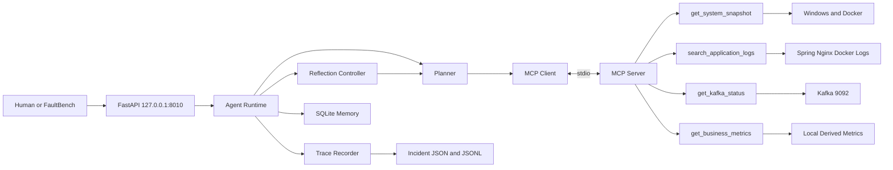

# HMDP AIOps Agent MVP 实施计划

## 1. 文档目标

本文将《Agent Harness 核心架构设计》收敛为一个能在当前 Windows 本地开发环境中独立运行、可以诊断 HMDP 常见故障并可被重复评测的 MVP。

仓库当前未包含 `docs/aiops/00_architecture_analysis.md`，因此本文的系统基线来自实际仓库结构、运行脚本、Docker Compose 配置以及 `docs/aiops/01_agent_harness_design.md`。本文不会补建 00 文档，也不要求修改 Spring Boot 业务代码。

MVP 的目标不是一次实现完整 AIOps 平台，而是验证以下最小闭环：

```text
故障输入
  -> 创建 incident
  -> 动态生成调查计划
  -> 通过四个只读 MCP 工具收集证据
  -> 根据 Observation 反思并调整计划
  -> 输出可追溯诊断报告
  -> 人工确认
  -> 保存简单事故记忆
  -> 在 FaultBench 中重复评测
```

## 2. MVP 定位与范围

### 2.1 MVP 必须保留的能力

MVP 只保留六个核心能力：

1. **Agent Runtime**：创建和执行事故任务，管理状态、预算、超时和最终报告。
2. **Planner**：基于事故描述和当前证据生成、调整调查步骤。
3. **MCP Tool Layer**：提供四个固定、只读、参数受限的工具。
4. **Reflection**：根据工具 Observation 更新或否定假设，并决定继续、重规划或结束。
5. **Trace**：记录计划、工具调用、证据引用、假设变化、成本和结论。
6. **简单 Memory**：使用 SQLite 保存当前任务和人工确认后的历史案例，提供基于标签和关键词的相似案例检索。

### 2.2 MVP 明确不实现

- 不实现自动修复、服务重启、Kafka offset 重置、Redis Key 修改或数据库写入。
- 不建设 Prometheus、Loki、Grafana、Alertmanager 等完整监控链路。
- 不支持 Kubernetes、云资源或多主机拓扑。
- 不实现 MCP 工具动态发现、热注册、第三方工具市场或复杂权限协商。
- 不实现多 Agent 并行协作、分布式任务调度和跨节点恢复。
- 不实现向量数据库、Embedding 案例检索或复杂知识图谱。
- 不修改 Spring Boot、Nginx、Kafka、Redis、MySQL、Elasticsearch、Canal 的业务代码或现有配置。
- 不为缺失的指标伪造数据；当前环境没有信号时返回 `partial` 或 `unavailable`。

### 2.3 MVP 与未来完整版对比

| 维度 | Windows 本地 MVP | 未来完整版 |
| --- | --- | --- |
| 部署 | Windows 单机，Python 主机进程 | 多环境部署，可支持容器平台和多集群 |
| 调度 | 单进程、单个活动 incident，其余排队 | 分布式任务队列，多 incident 并行 |
| Agent | 一个受控诊断 Runtime | 多角色协作、专家路由和策略编排 |
| Planner | 结构化 LLM 计划，步骤数和轮次有上限 | 分层计划、复杂依赖、策略学习 |
| MCP | 固定四工具，静态白名单 | 动态发现、版本协商、能力健康管理 |
| 数据源 | Windows、Docker、文件日志、Kafka、少量派生指标 | 完整指标、日志、Trace、CMDB 和告警平台 |
| Memory | SQLite + 关键词/标签检索 | 关系存储、向量索引、案例治理和生命周期管理 |
| Trace | SQLite 元数据 + JSONL/JSON 原始产物 | 集中式审计、可视化回放和跨模型比较 |
| Evaluation | 本地故障脚本与小规模 FaultBench | 持续回归、覆盖率治理和在线效果评估 |
| 修复 | 无，仅输出人工建议 | 独立执行面；仍需授权、审批和审计 |

未来完整版不是 MVP 的前置条件。MVP 先证明 Agent 能用有限数据完成“计划—取证—证伪—报告”闭环，再决定是否投资完整观测平台。

## 3. 本地运行架构

### 3.1 技术选择

| 能力 | MVP 选择 | 选择原因 |
| --- | --- | --- |
| 语言 | Python 3.11 | 与现有 `ai-assistant` 技术栈一致，Windows 支持成熟 |
| API | FastAPI + Uvicorn | 提供 incident 创建、查询和人工审核接口 |
| Agent 状态图 | LangGraph | 现有仓库已有使用经验，适合循环和 checkpoint |
| 模型 | OpenAI-compatible Chat Model | 沿用环境变量配置，不绑定特定厂商 |
| 结构化模型 | Pydantic | 校验计划、证据、假设、报告和 MCP 数据 |
| MCP | 官方 Python MCP SDK 的 stdio transport | 本地无额外端口，Agent 可直接托管子进程生命周期 |
| 任务与 Memory | SQLite（WAL） | 单机零运维、可事务恢复、足够支撑 MVP |
| 原始产物 | `data/incidents/{incident_id}/` JSON/JSONL | 避免把大日志写入 SQLite，可直接审计和回放 |
| Kafka 读取 | Python Kafka Admin 客户端 | 直接读取 Broker、Topic、Group 和 offset，不解析易变 CLI 文本 |
| Windows 状态 | `psutil`、固定 PowerShell 查询和 Docker CLI | 获得进程、端口和容器状态，不开放任意 Shell |
| 测试 | pytest | 单元、契约、集成和 FaultBench 统一运行 |

不复用现有 `ai-assistant` 进程。两者可以共享模型服务配置方式，但不共享 Runtime、Memory、工具和端口。

### 3.2 进程与端口

- `aiops-agent-api`：FastAPI 主进程，默认监听 `127.0.0.1:8010`。
- `aiops-mcp-server`：由 Agent Runtime 启动并托管的长生命周期 stdio 子进程，不监听网络端口。
- SQLite：本地文件，不开放端口。
- HMDP 原有端口保持不变：Nginx `8080`、Spring Boot `8081`、现有 AI Assistant `8000`、MySQL `3306/3307`、Redis `6379`、Kafka `9092`、Elasticsearch `9200`、Kibana `5601`、Canal `11111`。

stdio MCP 的目的不是把 Agent 和工具实现永久耦合，而是在 Windows MVP 阶段降低部署和鉴权复杂度。Runtime 仍通过 MCP 协议调用工具，不直接导入工具函数。

### 3.3 MVP 组件图



## 4. MVP 代码目录结构

后续编码阶段新增独立目录 `aiops-agent/`，不把代码放入 Java 包或现有 `ai-assistant/`：

```text
aiops-agent/
├── README.md
├── pyproject.toml
├── .env.example
├── api/
│   ├── __init__.py
│   ├── main.py                  # FastAPI 入口
│   ├── schemas.py               # HTTP 请求/响应模型
│   └── routes/
│       ├── incidents.py         # 创建、查询 incident
│       └── reviews.py           # 人工确认、修订、驳回
├── runtime/
│   ├── __init__.py
│   ├── orchestrator.py          # Harness 主循环
│   ├── task_manager.py          # incident 生命周期与队列
│   ├── planner.py               # 结构化调查计划生成
│   ├── reflection.py            # 假设更新和重规划决策
│   ├── reporter.py              # 诊断报告生成
│   ├── budgets.py               # 工具、时间、Token 预算
│   ├── context.py               # 证据去重、压缩、排序
│   └── models.py                # Incident/Plan/Evidence/Hypothesis
├── mcp/
│   ├── __init__.py
│   ├── server.py                # stdio MCP Server 入口
│   ├── client.py                # Runtime 使用的 MCP Client
│   ├── manifest.py              # 固定四工具静态清单
│   ├── policy.py                # 参数边界、权限、脱敏、超时
│   ├── schemas.py               # 公共 MCP Envelope
│   ├── tools/
│   │   ├── system_snapshot.py
│   │   ├── application_logs.py
│   │   ├── kafka_status.py
│   │   └── business_metrics.py
│   └── adapters/
│       ├── windows.py           # 进程、端口和 TCP 探测
│       ├── docker.py            # docker compose/inspect 只读适配
│       ├── log_files.py         # 路径白名单、解析和脱敏
│       ├── kafka.py             # Admin API 只读适配
│       └── local_metrics.py     # 日志和状态派生指标
├── memory/
│   ├── __init__.py
│   ├── store.py                 # SQLite Repository
│   ├── retrieval.py             # 标签和关键词相似案例检索
│   ├── models.py
│   └── migrations/
│       └── 001_initial.sql
├── trace/
│   ├── __init__.py
│   ├── recorder.py              # 追加式 Trace 记录
│   ├── redaction.py
│   └── replay.py                # 从 Trace 重放诊断轨迹
├── evaluation/
│   ├── README.md
│   ├── faultbench.py            # Benchmark Runner
│   ├── evaluator.py             # 五项指标计算
│   ├── scenarios/               # FaultBench 样本定义
│   ├── fixtures/                # 可复现日志和工具结果
│   └── injectors/               # 仅限隔离环境的故障注入/恢复
├── scripts/
│   ├── start-aiops.ps1
│   ├── stop-aiops.ps1
│   ├── status-aiops.ps1
│   └── run-faultbench.ps1
├── data/
│   └── .gitkeep                 # SQLite 与运行产物由 gitignore 排除
└── tests/
    ├── unit/
    ├── contract/
    ├── integration/
    └── e2e/
```

目录职责保持单向依赖：`api -> runtime -> mcp client/memory/trace`；MCP 工具不依赖 Runtime，Memory 不调用 MCP，Evaluation 只通过公开 API 或 Runtime 测试入口驱动系统。

## 5. Agent Runtime 最小设计

### 5.1 Incident 生命周期

MVP 使用以下状态：

```text
queued -> analyzing -> planning -> investigating -> reflecting
       -> reporting -> awaiting_human -> closed
```

异常状态为 `failed`、`timed_out` 和 `cancelled`。MVP 同一时间只执行一个 incident，后续请求进入 SQLite 队列，避免并发任务争抢本机日志和模型预算。

默认预算：

- 最多 8 次 MCP 工具调用。
- 最多 2 次 Reflection 重规划。
- 最多 180 秒墙钟时间。
- 最多 30,000 总 Token。
- 单个工具遵循自身 10 或 15 秒超时。

预算可以通过配置缩小，但 API 不允许请求方无限放大。预算耗尽后生成 `inconclusive` 报告并等待人工审核。

### 5.2 Planner

Planner 每轮接收：

- 标准化事故描述和时间窗。
- 当前候选假设与支持/反对证据。
- 剩余预算。
- 四个固定工具的描述和 Schema。
- 最多 3 个经过人工确认的相似案例摘要。

Planner 使用结构化输出生成最多 5 个待执行步骤。每个步骤必须包含 `objective`、`hypothesis_id`、`required_evidence`、`tool_name`、`tool_arguments`、`expected_observation` 和 `stop_condition`。

Runtime 在调用 MCP 前再次用 Pydantic 和 Tool Policy 校验参数。Planner 不能生成工具白名单之外的动作，不能生成 Shell、SQL、PromQL 或 Redis 命令。

### 5.3 Evidence 与 Context

MVP 不实现复杂的 Context Manager 服务，但保留一个轻量 `runtime/context.py`：

- 为每次工具结果生成 `evidence_id`。
- 记录来源、时间窗、完整性和原始结果引用。
- 对重复日志按规范化消息聚类。
- 每个日志模式最多保留 3 个代表样本。
- 时间序列仅保留异常点、聚合值和前后变化。
- 发送给模型的证据上限默认 20 条。
- 优先保留反对当前最高置信假设的证据。

原始输出写入 `data/incidents/{incident_id}/evidence/`，SQLite 只保存摘要和路径。

### 5.4 Reflection

每完成一个计划步骤后，Reflection Controller 运行一次结构化判断：

```text
continue       当前计划仍有效，执行下一步骤
replan         假设被否定、证据冲突或出现更高价值方向
report         已满足根因验证条件
inconclusive   无预算或现有数据无法继续验证
```

触发 `replan` 时必须输出：

- 哪个假设被何种 Observation 支持或否定。
- 当前缺少的证据。
- 为什么原计划需要调整。
- 下一轮允许使用的工具和剩余预算。

MVP 根因达到 `verified` 的最低条件是：存在一个直接权威证据，或两个相互独立的间接证据；并且至少检查过一个合理反例。否则报告只能使用“最可能原因”或“证据不足”。

### 5.5 Trace

MVP 同时写入：

- SQLite `trace_events`：便于查询生命周期和成本。
- `data/incidents/{incident_id}/trace.jsonl`：保存顺序稳定、可回放的完整事件。

事件类型固定为：

```text
incident_created
plan_created
tool_started
tool_completed
evidence_added
hypothesis_updated
reflection_completed
report_generated
human_reviewed
incident_closed
```

Trace 保存阶段目标和决策摘要，不保存模型隐式思维链。工具参数和返回摘要必须先脱敏；LLM API Key、Authorization、验证码、手机号和数据库密码不得进入 Trace。

## 6. MCP Tool Layer MVP

### 6.1 静态工具清单

MVP 不实现动态工具发现。`mcp/manifest.py` 显式列出并锁定：

1. `get_system_snapshot`
2. `search_application_logs`
3. `get_kafka_status`
4. `get_business_metrics`

MCP Server 仍通过协议返回工具清单，但 Runtime 会验证返回集合与本地静态 manifest 完全一致；多出、缺失或 Schema 变化都会使启动自检失败。

### 6.2 get_system_snapshot

实现范围：

- 检查固定端口 `8080/8081/8000/3306/3307/6379/9092/9200/5601/11111`。
- 查询受管 PID 文件和对应 Windows 进程。
- 读取根 Compose 的只读容器状态和 health 状态。
- 对 Spring、Redis、Kafka、MySQL、ES、Canal 做有限 TCP 探测。

不调用 `start-all.ps1`、`stop-all.ps1`、`docker compose up/down/restart` 或 `taskkill`。Docker 不可用时返回 `partial`，同时保留端口和进程结果。

### 6.3 search_application_logs

路径白名单：

- `target/runtime/spring-boot.out.log`
- `target/runtime/spring-boot.error.log`
- `nginx-1.18.0/logs/access.log`
- `nginx-1.18.0/logs/error.log`
- 明确列出的 Docker 容器日志读取接口

实现内容：时间窗过滤、级别过滤、关键词检索、常见堆栈合并、消息模式聚类、最多 500 条结果和敏感信息脱敏。拒绝绝对路径、`..`、通配路径和任意文件名。

### 6.4 get_kafka_status

使用只读 Kafka Admin API 获取：

- Broker 是否可达。
- 三个固定秒杀 Topic 是否存在及分区数。
- 三个固定消费者组状态、成员数、当前 offset、末端 offset 和 lag。
- Retry/DLT backlog 的可用近似值。

Topic 和 Group 默认固定为 HMDP 配置值，可通过 Agent 自身环境变量覆盖，但调用参数不得查询任意集群对象。工具不生产消息、不提交 offset、不创建 Topic、不重放 DLT。

### 6.5 get_business_metrics

MVP 不引入 Prometheus。该工具只返回可以从现有本地数据可信派生的指标：

- Spring/Nginx 日志中的请求、错误和超时计数。
- 秒杀“请求已受理”“Kafka 发送失败”“消费成功”“进入 DLT”等已存在日志事件计数。
- Kafka 当前 lag 和消费者状态的快照指标。
- 组件端口/容器状态在诊断时间窗中的采样结果。

日志不存在、时间戳无法解析或历史采样未启动时，相关指标标记为 `unavailable`，整个响应为 `partial`。MVP 不通过任意 SQL 或 Redis 查询补齐指标，也不把当前快照伪装成历史时间序列。

### 6.6 工具公共约束

- 所有输入、输出均经 Pydantic Schema 校验。
- 所有调用必须携带已存在的 `incident_id`。
- 工具返回统一 envelope 和 `evidence_refs`。
- 只允许访问 localhost 和配置的 HMDP 本地端点。
- 每个工具最多自动重试一次，重试仍计入工具预算。
- 工具失败作为 Observation 返回给 Reflection，不由 Runtime 静默替换为成功结果。

## 7. 简单 Memory

### 7.1 SQLite 表

MVP 初始 Schema：

| 表 | 用途 |
| --- | --- |
| `incidents` | incident 输入、状态、预算、时间和最终结论 |
| `plan_versions` | 每次计划及重规划原因 |
| `evidence` | 证据摘要、来源、支持/反对假设和原始文件引用 |
| `hypotheses` | 假设状态、置信度和证据关联 |
| `tool_executions` | 工具调用参数摘要、结果、耗时和错误 |
| `trace_events` | 追加式 Agent 轨迹 |
| `incident_cases` | 人工确认或候选历史案例 |
| `human_reviews` | 确认、修订、驳回和审核备注 |

SQLite 使用 WAL 和事务，所有记录按 `incident_id` 查询。数据库文件、运行日志和事故原始产物加入 `aiops-agent/.gitignore`，FaultBench fixture 除外。

### 7.2 相似案例检索

MVP 不使用 Embedding。检索规则为：

1. 只检索 `human_confirmation=confirmed` 的案例。
2. 按组件标签、错误类别、症状关键词和根因标签打分。
3. 返回最多 3 条案例摘要。
4. 明确标注案例时间和匹配原因。
5. 相似案例只能生成 Planner 线索，不能作为当前 `Evidence`。

## 8. 本地 API 与人工闭环

MVP 最小 API：

| 方法与路径 | 用途 |
| --- | --- |
| `POST /incidents` | 提交故障描述和观察时间窗，返回 `incident_id` |
| `GET /incidents/{incident_id}` | 查询任务状态、预算和报告摘要 |
| `GET /incidents/{incident_id}/trace` | 获取脱敏轨迹和证据引用 |
| `GET /incidents/{incident_id}/report` | 获取完整诊断报告 |
| `POST /incidents/{incident_id}/review` | 人工确认、修订或驳回报告 |
| `GET /health` | Agent、SQLite 和 MCP 子进程健康状态 |

接口只监听 `127.0.0.1`。`review` 只改变 Agent 自己的报告和 Memory，不调用 HMDP 修复动作。

## 9. 开发阶段与验收标准

### Phase 1：Agent 骨架

目标：在没有真实 HMDP 工具的情况下跑通 Incident → Plan → Observation → Reflection → Report → Review 的状态机。

实施内容：

- 创建 `aiops-agent` 工程、配置加载、FastAPI 和 PowerShell 启停脚本。
- 定义 Incident、Plan、Evidence、Hypothesis、Trace、Report Pydantic 模型。
- 实现 SQLite 初始 Schema、Task Manager、预算控制和单任务队列。
- 实现 Planner、Reflection、Reporter 的结构化模型调用。
- 使用确定性 Fake MCP Client 返回 fixture Observation。
- 实现 JSONL Trace 和人工 review API。

验收标准：

- Windows PowerShell 可以启动、查看状态并停止 Agent，不依赖 Docker。
- `POST /incidents` 返回唯一 `incident_id`，状态按预期流转。
- 使用 fixture 可完成至少一次“假设被否定后重规划”的完整运行。
- 预算耗尽时生成 `inconclusive` 报告，不继续调用模型或工具。
- 进程重启后可从 SQLite 查询历史任务和 Trace。
- 单元测试覆盖状态迁移、预算、Schema 校验和 Reflection 分支，全部通过。

### Phase 2：MCP 工具

目标：完成独立 stdio MCP Server 和四个固定只读工具的契约实现。

实施内容：

- 实现 MCP Server、Client、静态 manifest 和启动自检。
- 实现 Windows/Docker、日志、Kafka 和本地派生指标适配器。
- 实现超时、一次重试、路径白名单、端点白名单和脱敏。
- 为每个工具准备正常、部分数据、超时和错误 fixture。

验收标准：

- Runtime 只通过 MCP 协议调用工具，不直接导入工具实现。
- MCP 工具集合与静态 manifest 不一致时 Agent 拒绝进入 ready 状态。
- 四个工具的输入、输出均通过契约测试。
- 日志工具无法读取白名单外文件，敏感字段在返回和 Trace 中均被遮蔽。
- Kafka 工具测试证明没有 produce、commit、alter、delete 等调用路径。
- 工具超时和部分失败能够形成 `partial/error` Observation 并触发 Reflection。

### Phase 3：接入 HMDP

目标：在不修改业务代码的前提下，让 Agent 读取当前 Windows + Docker 本地环境并生成真实诊断报告。

实施内容：

- 配置 HMDP 端口、Compose 文件、日志路径、Kafka Topic 和 Group 白名单。
- 对接 `target/runtime`、Nginx 日志、Docker 状态和本地 Kafka。
- 实现健康环境基线采集和数据缺失说明。
- 使用真实环境运行一次健康诊断和一次人工描述诊断。

验收标准：

- Spring Boot 业务代码、配置、Docker Compose 和现有脚本无变更。
- `get_system_snapshot` 能同时展示 Windows 进程/端口和 Docker 容器状态；Docker 未启动时返回 `partial`。
- `search_application_logs` 能在指定时间窗返回 Spring/Nginx 结果，并限制在 500 条以内。
- Kafka 可用时返回三个 Topic/Group 的状态和 lag；不可用时在 10 秒内返回错误证据。
- `get_business_metrics` 对可派生指标给出来源，对缺失指标明确返回 unavailable。
- 最终报告中的每项事实可以追溯至 `evidence_id` 和原始产物。

### Phase 4：故障注入

目标：在隔离的本地测试环境中制造可恢复故障，验证 Agent 会调整计划而不是只给出一次性答案。

实施内容：

- 编写只作用于明确容器/PID 的注入器和对应恢复器。
- 每个注入器先保存基线状态，要求显式 `--confirm-local-test`，并在 finally 阶段尝试恢复。
- 首批场景：Spring 端口不可达、Kafka Broker 不可达、MySQL 容器不可达、预制 Retry/DLT 日志异常、健康 Kafka 反驳初始 Kafka 假设。
- 保存每次运行的工具结果、Trace 和人工预期证据。

验收标准：

- 注入器拒绝非本地目标和未知容器名，不执行宽泛终止命令。
- 每个场景都有独立的 `inject`、`verify`、`recover` 和恢复验证步骤。
- 中断测试后，恢复器能把目标组件恢复到注入前状态，数据卷不被删除。
- “初始怀疑 Kafka、实际 Kafka 正常”的场景中，Trace 明确记录假设被否定并转向下一证据缺口。
- Agent 全程没有执行修复工具；故障恢复由 FaultBench Harness 在隔离环境负责。

### Phase 5：Benchmark

目标：形成可重复运行的 HMDP-FaultBench MVP，并用量化指标判断 Agent 是否真的改进。

实施内容：

- 固化 Phase 4 场景 Schema、预期根因、必需证据、干扰证据和预算。
- 实现 Trace 回放、确定性证据匹配和指标计算。
- 记录模型、提示版本、随机性参数、工具版本和环境快照。
- 输出 Markdown 和 JSON 两种 Benchmark 报告。

MVP 首轮门槛：

| 指标 | 验收门槛 |
| --- | --- |
| Root Cause Accuracy | 首批场景 Top-1 不低于 70% |
| Evidence Accuracy | 必需证据 F1 不低于 0.75，且无伪造 evidence ID |
| Tool Efficiency | 中位工具调用数不超过 6，单场景不超过 8 |
| Diagnosis Time | 本地单场景 P95 不超过 180 秒，不含故障注入时间 |
| Token Cost | 单场景中位总 Token 不超过 20,000，硬上限 30,000 |

验收标准：

- 同一 fixture 场景可离线重复运行，不依赖 HMDP 实时状态。
- 在线故障场景记录注入前后环境快照和恢复结果。
- Benchmark 失败能定位到根因、证据、工具效率、时间或 Token 中的具体维度。
- 报告包含每个场景的 Trace 摘要和 Reflection 次数，而不是只展示最终答案。

## 10. 测试策略

### 单元测试

- Incident 状态机和非法状态迁移。
- 预算扣减、超时和停止条件。
- Planner/Reflection 结构化输出校验。
- 证据去重、日志聚类和敏感信息脱敏。
- SQLite 事务、恢复和人工确认约束。

### 契约测试

- 四个 MCP 工具的输入、响应 envelope 和错误形态。
- 静态 manifest 与 MCP Server 工具集合一致性。
- `partial/timeout/error` 不被转换成成功。
- API 返回的 incident、Trace 和报告 Schema 稳定。

### 集成测试

- Runtime 启动 stdio MCP 子进程并在退出时回收。
- 真实 Windows 端口和进程查询。
- Docker 可用/不可用两种状态。
- 本地 Kafka 可用、Topic 缺失、Group 无成员和 Broker 不可达。
- 真实日志时间窗过滤和最大结果限制。

### 端到端测试

- 健康系统诊断不会虚构异常。
- Kafka 故障可以定位到 Broker/Group 证据。
- 初始假设错误时发生 Reflection 和重规划。
- 无证据场景输出不确定报告。
- 人工确认后案例可被检索，驳回案例不会作为权威记忆返回。

## 11. 安全与运行约束

- Agent、MCP 和 SQLite 只在本机运行；API 默认仅绑定 `127.0.0.1`。
- `.env` 保存模型地址和密钥并由 Git 忽略，日志和 Trace 不输出密钥值。
- MCP 子进程使用固定可执行入口和固定参数，不接受模型生成的命令行。
- Docker 适配器只允许 `ps/inspect/logs` 等只读操作；生产 Runtime 不包含 FaultBench 注入器模块。
- FaultBench 注入器通过独立入口执行，要求显式本地确认并校验容器名、项目目录和恢复步骤。
- 所有时间在存储中使用带时区 ISO 8601；展示默认使用 `Asia/Shanghai`。
- Agent 报告中的操作均为人工建议，不应自动复制执行；涉及数据修改的建议必须标注风险和前置备份要求。

## 12. MVP 完成定义

满足以下条件后，MVP 可以被视为完成：

1. Windows 本机能够一键启动 Agent API 和 stdio MCP Server，并能安全停止。
2. 真实 HMDP 环境可通过四个只读工具获得系统、日志、Kafka 和有限业务指标证据。
3. 至少一个场景展示初始假设被证据否定后自动重规划。
4. 每份报告都能从 `evidence_id` 回溯到工具调用和原始产物。
5. Agent 无任何自动修复、任意 Shell、任意 SQL、任意 PromQL 或中间件写入能力。
6. 人工确认后才写入权威案例 Memory。
7. Phase 1—5 的自动化测试和验收门槛全部通过。
8. HMDP Spring Boot 业务代码、现有配置和 Docker 编排保持不变。

这个 MVP 的成功标准不是覆盖所有故障，而是用最少组件证明 Agent Harness 能在真实本地系统上形成受控、会自我纠错、可审计且可评测的故障诊断闭环。
