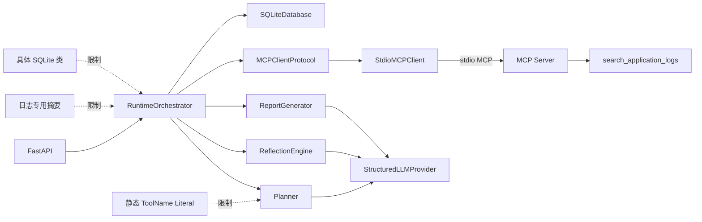

# AIOps Agent Runtime 架构审查

## 1. 审查目标与结论

本文审查当前 `aiops-agent` 的 Agent Runtime，判断其是否具备进入 MCP Tool Layer 的架构条件。审查范围包括 Runtime、LLM Provider、stdio MCP Client/Server、Evidence、Trace、SQLite Memory 及现有自动化测试。

需要先澄清当前代码状态：项目已经不再处于“Fake MCP 等待替换”的阶段。`FakeMCPClient` 已移除，当前链路已经是：

```text
RuntimeOrchestrator
  -> MCPClientProtocol
  -> StdioMCPClient
  -> stdio MCP Server
  -> search_application_logs
```

因此，本次审查中的“是否满足进入 MCP Tool Layer”分为两个层次：

1. **单一日志工具的一期 MCP 接入**：已满足，当前实现已经能通过真实 MCP 协议完成工具发现、调用、结果校验、Evidence 持久化和 Trace 记录。
2. **继续扩展 Kafka、Redis、MySQL 等异构工具**：有条件通过。在增加第二类工具之前必须先消除工具名称、Evidence 模型和日志专用处理逻辑中的静态耦合。

最终结论为：**MCP 传输边界通过，Agent Runtime 的多工具抽象尚未通过；允许保留并继续验证现有日志工具，不建议直接叠加 Kafka、Redis 或 MySQL 工具。**

## 2. 总体评分

| 检查项 | 结论 | 当前成熟度 | 主要依据 |
| --- | --- | ---: | --- |
| Runtime 与 Tool 实现解耦 | 部分满足 | 70% | Runtime 仅依赖 `MCPClientProtocol`，但 `ToolName` 和摘要逻辑仍绑定日志工具 |
| Fake MCP 可无侵入替换 | 满足，且已完成替换 | 90% | Fake 已被真实 stdio Client 替换；构造器和 API 均支持注入协议实现 |
| Planner/Reflection/Reporter 通过接口调用 | 部分满足 | 75% | 三者统一依赖 `StructuredLLMProvider`，但 Orchestrator 仍直接依赖三个具体类 |
| Evidence 支持多来源 | 不满足 | 35% | `source_tool` 是单工具 Literal，缺少 kind、窗口、来源、完整性、原始引用等一等字段 |
| Trace 支持 trajectory evaluation | 部分满足 | 60% | 主轨迹齐全，但缺少模型、Token、预算、Schema 版本、终止原因和证据关系字段 |
| 多轮 Reflection loop | 部分满足 | 70% | 已有循环、重规划和预算，但只执行每版计划的第一个步骤，错误会直接终止 Incident |
| Memory 接口可扩展 | 部分满足 | 40% | SQLite Schema 可增量扩展，但没有 Memory/Repository 接口、恢复游标和长期案例模型 |

## 3. 当前运行时边界



该边界已经阻止 Runtime 直接导入 `mcp/server.py` 或工具函数，这是当前最重要的架构成果。剩余问题主要不是“是否走 MCP”，而是“Runtime 是否真正按通用工具和通用证据运行”。

## 4. 分项审查

### 4.1 Runtime 是否与 Tool 实现解耦

结论：**传输和调用层已解耦，语义层仍有耦合。**

已满足的部分：

- `RuntimeOrchestrator` 构造器依赖 `MCPClientProtocol`，不依赖 `StdioMCPClient` 或任何工具函数，见 `aiops-agent/runtime/orchestrator.py:32`。
- `MCPClientProtocol` 只暴露 `get_tool_schemas()` 和 `call()`，见 `aiops-agent/runtime/mcp_client.py:44`。
- 默认实现由 API 组合根创建，测试或未来实现可以注入其他 Client，见 `aiops-agent/api/main.py:18-31`。
- Runtime 不导入 `mcp/server.py`，也不知道日志文件的读取实现。

仍然耦合的部分：

- `ToolName` 被声明为 `Literal["search_application_logs"]`，见 `aiops-agent/runtime/plans.py:12`。MCP 虽然执行了 `tools/list`，但 Planner 的 Pydantic 模型仍只接受一个编译期工具名。
- `_summarize_observation()` 直接读取 `data.events` 和 `data.warnings`，并固定生成 `Application log evidence` 摘要，见 `aiops-agent/runtime/orchestrator.py:295-308`。
- 默认 Mock LLM 的 Planner 和 Reflection 了解日志 Envelope 内部结构，因此增加 Kafka 工具时还必须修改 Mock Provider。

判断：当前 Runtime 与“日志读取实现”解耦，但未与“日志工具语义”解耦。对一期单工具足够，对异构 MCP Tool Layer 不足。

### 4.2 Fake MCP 是否可以无侵入替换为真实 MCP Client

结论：**满足，而且替换已经完成。**

当前不存在生产 Fake Client。真实实现 `StdioMCPClient`：

- 使用官方 SDK 的 `Client` 和 `StdioServerParameters` 启动独立进程。
- 通过 `list_tools` 获取 Schema，并缓存工具清单。
- 通过 `call_tool` 获取 `structured_content`。
- 对启动、传输、超时、工具错误和 Evidence Envelope 校验失败进行分类。
- 不接受 Planner 生成的命令行或 Server 路径；Server 入口由本地配置固定。

现有测试覆盖 MCP Server 启动、工具清单、Runtime 真实调用、非法路径和工具错误 Trace：

- `aiops-agent/tests/test_mcp_layer.py:31`
- `aiops-agent/tests/test_mcp_layer.py:42`
- `aiops-agent/tests/test_mcp_layer.py:85`
- `aiops-agent/tests/test_runtime.py:33`

仍需注意：`MCPClientProtocol` 是结构化 `Protocol`，不是带生命周期约束的完整 Client 接口。未来若改为长连接 Client，需要增加 `start/close/healthcheck` 或异步上下文契约，但这不影响当前替换结论。

### 4.3 Planner、Reflection、Reporter 是否完全通过接口调用

结论：**LLM 调用层满足，Runtime 组件层部分满足。**

优点：

- Planner、Reflection、Reporter 都只通过 `StructuredLLMProvider.generate_structured()` 访问模型。
- OpenAI-compatible 与 Mock Provider 实现相同抽象，业务组件不感知 HTTP 或 Mock 细节。
- 每个阶段都有独立 Pydantic 输出模型，并启用 `extra="forbid"`。
- Reporter 不接受模型生成的 Evidence ID，而是由本地 Evidence 集合绑定报告引用。

不足：

- `RuntimeOrchestrator` 的依赖类型仍是具体 `Planner`、`ReflectionEngine` 和 `ReportGenerator`，不是 `PlannerProtocol`、`ReflectionProtocol`、`ReporterProtocol`。
- Prompt 文本内嵌在具体类中，没有模板 ID、版本号或 Prompt Registry，Trace 也无法标识实际使用的提示版本。
- Reporter 对 `confirmed`、`root_cause` 和 `confidence` 的语义一致性没有本地策略校验；结构合法不等于结论有足够证据。

判断：替换模型 Provider 无需修改三个业务组件，但替换 Planner/Reflection/Reporter 的策略实现仍依赖具体类签名。MVP 可接受，后续做基准对比或多策略实验时应补齐阶段接口。

### 4.4 Evidence 是否支持日志、Kafka、Redis、MySQL 多种来源

结论：**当前不支持，应在增加第二种工具前重构。**

当前优点：

- Evidence 有稳定 `evidence_id`，并与 Incident、Plan Step 关联。
- MCP 返回的 Evidence ID 被原样保留，避免 Runtime 重新生成后失去工具结果关联。
- `observation` 使用字典，理论上可保存不同载荷。
- MCP Envelope 已包含 `source`、`timestamp`、`completeness` 和 `data`。

关键缺口：

1. `Evidence.source_tool` 使用单工具 `Literal`，Kafka、Redis、MySQL 工具结果无法通过模型校验。
2. `kind`、`source`、`completeness` 只埋在 `observation` JSON 中，无法可靠索引、过滤或评分。
3. 缺少 `observation_window`，不能区分“采集时间”和“证据描述的业务时间窗口”。
4. 缺少 `raw_ref`、`checksum` 或 artifact 引用，当前完整日志事件直接写入 SQLite JSON。
5. 缺少 `reliability`、`relevance`、`freshness`，Context Manager 无法进行证据排序。
6. 缺少 `supports`、`contradicts` 或证据—假设关联表，无法计算 Evidence Accuracy 和反例覆盖率。
7. Server 与 Client 分别定义了一份 `EvidenceEnvelope`，没有共享 Schema 版本，存在协议漂移风险。
8. 当前 Envelope 只有 `complete/partial`；`timeout/error` 被抛为异常，没有形成可供 Reflection 使用的 Observation。

这部分是当前最明确的扩展阻塞点。

### 4.5 Trace 是否满足 Agent trajectory evaluation

结论：**可以回放主流程，尚不足以完成 HMDP-FaultBench 的完整轨迹评估。**

当前已记录：

- Incident 创建。
- Plan 版本、假设和步骤。
- Tool 开始、成功、失败、耗时和 Evidence ID。
- Evidence 加入上下文。
- Hypothesis 更新、状态、决策与置信度。
- Reflection 完成。
- Report 生成。
- 每个 Incident 内严格递增的 `sequence`。

因此，当前 Trace 已能回答：Agent 计划了什么、调用了什么工具、获得了哪条 Evidence、如何更新假设以及最终报告是什么。

缺失项：

- LLM Provider、模型名称、Prompt 模板版本、请求耗时、输入/输出 Token。
- 每轮剩余工具、Reflection、时间和 Token 预算。
- MCP Server 身份、工具 Schema/version digest、request ID、重试次数和 timeout 配置。
- Reflection 使用的 Evidence ID 列表、被否定和新增假设的显式差异。
- Plan 重规划原因与前后差异。
- 任务终止原因，例如证据充分、预算耗尽、工具不可用或人工终止。
- 原始 Evidence 的 `raw_ref/checksum`，无法验证报告引用是否对应未篡改数据。
- 人工审核流程虽然枚举了事件类型，但当前没有写入路径。

基于现有 Trace 可以计算粗粒度 Diagnosis Time、调用次数和步骤顺序；还不能可靠计算 Token Cost、Evidence Accuracy、证伪覆盖率和可复现轨迹一致性。

### 4.6 Orchestrator 是否支持多轮 Reflection loop

结论：**结构上支持，执行语义尚不完整。**

已实现：

- `while final_reflection is None` 驱动多轮循环，见 `aiops-agent/runtime/orchestrator.py:114`。
- `continue` 和 `replan` 都会回到 Planner，产生递增 Plan 版本。
- 工具调用数和重规划次数有上限。
- Evidence 会跨轮累积并输入下一轮 Planner 和 Reflection。
- `report/inconclusive` 可以终止循环。

限制：

- 每个 Plan 允许 1—5 个步骤，但 Orchestrator 永远只执行 `plan.steps[0]`，见 `aiops-agent/runtime/orchestrator.py:115`。模型和执行器契约不一致。
- `max_reflections` 实际限制的是重规划次数，不是 Reflection 调用总数；字段命名与计数语义不一致。
- `max_duration_seconds` 和 `max_total_tokens` 已建模但没有执行检查。
- `continue` 与 `replan` 当前行为完全相同，没有“继续当前计划下一步”的语义。
- MCP timeout、缺失工具和工具错误会直接把 Incident 标记为 `failed`，不会作为 Observation 交给 Reflection 选择替代路径。
- 没有检测“连续调用没有新 Evidence”或重复工具/参数循环。
- Plan Step 没有 persisted execution status，进程重启后无法从步骤游标恢复。

判断：当前循环可以演示一次 Reflection 重规划，但还不是健壮的多工具调查状态机。

### 4.7 Memory 接口是否可以扩展

结论：**存储结构可扩展，但尚不存在真正的 Memory 接口。**

当前 SQLite 已保存 Incident、Plan、Evidence、Hypothesis、Trace 和 Report，能够支持单进程 MVP 的事后查询。JSON 字段也为 Schema 演进保留了一定空间。

主要问题：

- `RuntimeOrchestrator` 直接依赖具体 `SQLiteDatabase`，没有 `IncidentRepository`、`EvidenceStore`、`TraceStore` 或 `MemoryStore` 协议。
- `SQLiteDatabase` 同时承担连接、Schema 初始化和所有领域对象持久化，职责过宽。
- 只有 save/list/get 的局部方法，没有加载完整 `IncidentTask`、当前 Plan、执行游标并恢复任务的接口。
- 没有长期 `IncidentCase`、人工确认状态、症状指纹、标签、相似案例检索和候选案例隔离。
- 没有事务把“状态迁移 + Trace + Evidence”作为一个原子操作提交。
- `CREATE TABLE IF NOT EXISTS` 只能初始化，缺少 Schema 版本和迁移机制。
- 原始大 Evidence 与结构化 Memory 使用同一个 SQLite 数据库，未来日志量增加后会影响查询和备份。

判断：可以在当前 Schema 上继续做短期试验，但若进入任务恢复、长期案例检索或并发执行，应先抽象 Repository/Memory 接口。

## 5. 当前优点

1. **控制面与工具执行面已经分离**：Runtime 不导入工具函数，真实调用经过 stdio MCP。
2. **依赖注入路径清晰**：MCP Client 和 LLM Provider 都可从 API 组合根注入。
3. **结构化输出边界明确**：LLM、MCP、Incident、Plan、Evidence、Reflection 和 Report 均经过 Pydantic。
4. **默认只读且权限面小**：MCP Server 只有一个日志工具，路径有逻辑和解析后双重白名单检查。
5. **失败可见**：工具发现和调用失败会写入 `tool_failed` Trace，Incident 不会伪装为成功。
6. **证据引用稳定**：MCP Evidence ID 贯穿 Evidence、Trace 和 Report。
7. **具备最小 Reflection 闭环**：Plan 版本、累积 Evidence、重规划和预算终止均已出现。
8. **有真实协议测试**：测试不是直接调用工具函数，而是启动 MCP Server 并通过 stdio 完成调用。

## 6. 潜在重构点

以下重构会提高长期清晰度，但不全部是新增第二个工具的前置条件：

1. 将 `RuntimeOrchestrator` 拆为 Task State Machine、Tool Executor、Evidence Normalizer 和 Trace Recorder，避免单类同时承担全部流程。
2. 为 Planner、Reflection、Reporter 定义独立 Protocol，使规则版、LLM 版和 Benchmark 固定策略可以互换。
3. 将 Prompt 提取为带 `template_id/version` 的模板，并把版本写入 Trace。
4. 将 `SQLiteDatabase` 拆为连接管理和领域 Repository。
5. 引入 `ToolExecution` 模型，替代散落在 Trace payload 中的工具调用状态。
6. 为 Trace payload 定义按事件类型区分的 Pydantic 模型，减少任意 JSON 造成的字段漂移。
7. 将原始日志结果移入 artifact 存储，SQLite 只保留摘要、引用和 checksum。
8. 统一 Server/Client Evidence Envelope，通过共享契约包或生成的 JSON Schema 管理版本。

## 7. MCP 接入前必须修改项

由于一期日志 MCP 已经接入，本节的“接入前”指：**在接入 Kafka、Redis、MySQL 或第二个异构 MCP 工具之前。**

### P0-1：移除静态单工具类型耦合

- 将 `ToolName = Literal["search_application_logs"]` 改为通用工具标识。
- LLM 输出完成 Pydantic 校验后，再根据本次 MCP discovery 得到的授权工具集合校验 `tool_name`。
- 增加本地只读 manifest，校验 MCP Server 身份、工具集合、输入 Schema 和只读权限；不能仅相信 Server 返回的工具清单。

验收：新增一个测试工具时，不需要修改 Plan/Evidence 的类型定义；未在 manifest 中的工具仍被拒绝。

### P0-2：建立跨来源 Evidence 契约

Evidence 至少应一等化以下字段：

- `kind`
- `source` 与 `source_tool`
- `collected_at` 与 `observation_window`
- `completeness/status`
- `summary`
- `raw_ref/checksum`
- `supports/contradicts`
- 可选的 `reliability/relevance/freshness`

工具专属数据保留在 `data`，但 Runtime、Memory 和 Evaluation 不应通过解析工具专属 `data` 才能知道来源和完整性。

### P0-3：移除 Orchestrator 中的日志专用逻辑

- `_summarize_observation()` 不应了解 `events/warnings`。
- 由 MCP 工具返回通用摘要，或由按 `kind` 注册的 Evidence Adapter 负责归一化。
- Planner/Reflection 接收归一化 Evidence，不直接消费无限增长的原始日志事件。

验收：Kafka 状态工具接入时不修改 `RuntimeOrchestrator`。

### P0-4：将工具失败建模为 Observation

当前 timeout/error 会直接终止 Incident。对 Agent Harness，更合理的行为是：

- 不可恢复的 MCP Server 启动失败可以使任务失败。
- 单个工具的 timeout、partial 或 error 应产生结构化 `ToolExecution` 和错误 Evidence。
- Reflection 根据错误类型、剩余预算和替代工具决定重试、重规划或生成不确定报告。

验收：一个工具超时后，若还有其他授权工具和预算，Incident 不直接进入 `failed`。

### P0-5：解决 Plan Step 执行契约

必须二选一：

1. 明确 MVP 每版计划只能有一个 Step，并将模型约束改为恰好一个；或
2. 实现 Step 队列、状态、依赖和“continue 执行下一步”的语义。

当前“模型允许最多五步、执行器只执行第一步”的状态不能带入多工具阶段。

### P0-6：增加敏感信息和上下文边界

- 日志进入 LLM 和 Trace 前必须完成 Token、验证码、Authorization、手机号等脱敏。
- Tool 参数写入 Trace 前使用统一 redactor，不能依赖每个工具参数恰好无敏感信息。
- 原始日志事件需要字符数、事件数和 Token 三重预算；模型只接收有界摘要和代表样本。

### P0-7：补齐最小评测 Trace 字段

在开始 HMDP-FaultBench 数据采集前，Trace 至少增加：

- `model/provider`
- `prompt_template_id/version`
- LLM 与工具耗时
- 输入/输出 Token
- 当前和剩余预算
- Tool request ID、Server/Schema 版本
- Reflection 使用的 Evidence ID
- 重规划原因
- 最终停止原因

否则后续运行产生的历史轨迹无法补录这些关键评测信息。

## 8. 可以延后的优化项

以下内容不阻塞第二个只读工具的契约开发，可以在 MCP 功能正确后迭代：

1. **持久 MCP 子进程或连接池**：当前每次工具调用重新启动 stdio Server，性能一般但隔离清晰，MVP 可接受。
2. **全异步 Runtime**：当前同步 Orchestrator 在 FastAPI 同步线程中运行；没有并发工具需求时可以保留。
3. **并行 Evidence 收集**：等多个互不依赖工具稳定后再实现。
4. **自动重试、熔断和退避**：先保证错误是结构化 Observation，再增加策略。
5. **向量 Memory 和相似案例检索**：不影响 MCP 工具层协议正确性。
6. **长期 IncidentCase 治理**：可在人工审核 API 完成后实现。
7. **独立 artifact 服务**：MVP 可以先使用本地文件引用，之后再替换对象存储。
8. **Trace UI 和可视化回放**：先稳定事件 Schema，再建设 UI。
9. **多 Agent 并行调查**：当前单 Orchestrator 足够验证 Harness 主链路。
10. **动态工具热发现**：MVP 应继续使用静态只读 manifest，不需要工具市场或运行时热注册。

## 9. 建议的进入门槛

### 当前日志 MCP 一期

- [x] Runtime 不导入工具实现。
- [x] 真实 stdio MCP Client/Server。
- [x] MCP 工具发现与结构化调用。
- [x] 路径白名单。
- [x] 缺失文件返回 partial。
- [x] 工具成功和失败 Trace。
- [x] Evidence ID 贯穿持久化和报告。

结论：**通过。**

### Kafka/Redis/MySQL 等下一阶段工具

- [ ] 动态授权工具名校验替代单工具 Literal。
- [ ] 静态 manifest 与 MCP discovery/Schema 启动自检。
- [ ] 通用、多来源 Evidence 模型。
- [ ] Orchestrator 不包含日志专用字段解析。
- [ ] 工具 error/timeout 进入 Reflection，而不是直接终止任务。
- [ ] Plan Step 契约与执行器一致。
- [ ] 日志和 Trace 脱敏、上下文预算生效。
- [ ] FaultBench 所需最小 Trace 字段齐全。

结论：**暂不通过。完成 P0-1 至 P0-7 后再进入多来源 MCP Tool Layer。**

## 10. 最终判断

当前 Runtime 的方向正确：MCP 已经成为真实进程边界，LLM 已经成为可替换 Provider，Evidence、Trace 和 SQLite 也构成了可运行的最小闭环。主要风险不在“有没有 MCP”，而在现有通用接口下面仍保留了单一日志工具的静态假设。

建议下一步不要立即实现 Kafka 或 Redis 连接。先完成工具授权、通用 Evidence、错误 Observation、Step 执行语义和最小评测 Trace 五个核心边界，再扩展数据源。这样新增工具只需要实现 MCP Tool 和对应 Evidence Adapter，而不需要持续修改 Orchestrator 主循环。
