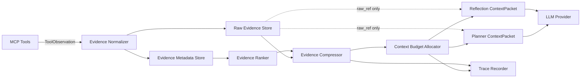

# AIOps Agent Context Engineering 设计

## 1. 文档目标

本文在现有 Agent Harness、MCP Tool Layer 和 P0 通用契约基础上，设计 AIOps Agent 的上下文管理机制。目标不是让模型读取更多数据，而是让模型在可控预算内看到与当前调查目标最相关、可追溯且相互平衡的证据。

本文只描述设计，不修改当前 Python、Java、Docker、Nginx 或 MCP 实现。设计继续遵循以下边界：

- Agent 独立于 Spring Boot，业务系统不因上下文管理而修改。
- MCP 工具保持只读；Context Manager 不获得 Shell、任意 SQL、Redis 命令或修复权限。
- Agent 不执行自动修复，最终结论仍进入 Human-in-the-loop。
- 不保存或输出模型隐式思维链，只记录可审计的输入选择、证据引用、决策摘要和裁剪原因。
- 原始观测数据不是模型上下文；模型上下文是从原始数据派生出的、受预算约束的证据视图。

## 2. 当前基线与问题

P0 契约重构后，当前 `Evidence` 已具备多来源基础字段：

- `evidence_id`
- `status`: `success | partial | error | timeout`
- `kind`
- `source`
- `source_tool`
- `collected_at`
- `observation_window`
- `summary`
- `completeness`
- `raw_ref`
- `data`
- `error`

这组字段已经可以表达日志证据、工具失败和未来 Kafka、Redis、MySQL 证据。但是当前 Planner 和 Reflection 仍将累计 Evidence 通过 `model_dump()` 整体放入 LLM 输入。随着日志事件、指标序列和分区明细增长，会出现以下问题：

1. 原始事件或大体积 `data` 挤占真正有用的故障事实。
2. 越早采集的证据长期占据上下文，新的反例可能无法进入模型。
3. 重复日志和相邻时间序列造成 Token 浪费，并放大偶然噪声。
4. `partial/error/timeout` 与完整业务证据混排，模型可能错误地把“未采到”理解为“没有异常”。
5. Planner 与 Reflection 需要的信息不同，但当前没有阶段化上下文视图。
6. 上下文被截断时没有审计记录，后续无法解释模型为何没有使用某条证据。

因此，下一阶段需要在 Runtime 与 LLM Provider 之间增加逻辑上的 `Context Manager`。它不改变工具事实，也不替模型判断根因；它只负责将 Evidence 转换为有界、可追溯的 `ContextPacket`。

## 3. 总体架构



Context Manager 由五个职责组成：

1. `Evidence Normalizer`：校验通用 Envelope，并将来源专属结果转换为有界事实。
2. `Evidence Ranker`：围绕当前目标、假设和证据缺口排序，而不是使用固定时间顺序。
3. `Evidence Compressor`：脱敏、去重、聚合并生成不同粒度的证据视图。
4. `Context Budget Allocator`：按阶段和优先级装配上下文，确保输入不超过预算。
5. `Context Trace Recorder`：记录选择、压缩、裁剪和预算使用，但不复制原始敏感数据。

Context Manager 必须是 Planner、Reflection 和 Reporter 访问 Evidence 的唯一模型输入入口。领域持久化仍保存完整的结构化 Evidence；Context Manager 只生成一次调用所需的只读快照。

## 4. 统一上下文对象

### 4.1 EvidenceCard

`EvidenceCard` 是供排序和模型消费的轻量视图，不替代持久化 `Evidence`：

```json
{
  "evidence_id": "evi_...",
  "kind": "application_log",
  "source": "hmdp.spring_boot.runtime_logs",
  "source_tool": "search_application_logs",
  "status": "success",
  "completeness": "complete",
  "collected_at": "2026-09-19T10:20:30+08:00",
  "observation_window": {
    "start": "2026-09-19T10:10:00+08:00",
    "end": "2026-09-19T10:20:00+08:00"
  },
  "summary": "订单消费者出现 38 次超时，集中在 10:16-10:18。",
  "facts": [
    {
      "fact_id": "fact_1",
      "statement": "10:16-10:18 出现 38 次消费超时",
      "relation": "supports",
      "hypothesis_id": "hyp_kafka_consumer_stalled"
    }
  ],
  "representative_samples": [
    {
      "sample_ref": "artifact://...#line=218",
      "text": "[REDACTED bounded excerpt]"
    }
  ],
  "raw_ref": "artifact://incident/.../logs.jsonl",
  "score": 0.86,
  "score_reasons": ["time_aligned", "supports_current_hypothesis", "authoritative_source"]
}
```

约束：

- `facts` 必须能追溯到同一个 `evidence_id`，必要时进一步关联 `sample_ref`。
- `representative_samples` 是已脱敏、限长的片段，不是原始结果副本。
- `raw_ref` 只作为审计和人工复核引用，不要求 LLM 能直接读取。
- `score` 是上下文选择分数，不是根因置信度，也不改变 Evidence 的真实性。
- `error/timeout` Evidence 可以形成 EvidenceCard，但其事实只能描述工具失败或证据缺口，不能证明业务组件异常。

### 4.2 ContextPacket

每次 LLM 调用都生成独立 `ContextPacket`：

```text
ContextPacket
  context_id
  incident_id
  stage                       # planner / reflection / reporter
  context_policy_version
  created_at
  incident_digest
  current_goal
  hypothesis_ledger[]
  selected_evidence[]         # EvidenceCard
  conflicts[]
  evidence_gaps[]
  decision_history[]          # 有界的决策摘要，不含隐式思维链
  available_tools[]           # 仅 Planner 使用
  budget
  selection_metadata
```

`ContextPacket` 是不可变快照。重规划后创建新的 `context_id`，不能原地覆盖旧上下文，否则无法回放 Agent 当时看到了什么。

## 5. Evidence Ranking

### 5.1 排序目标

Evidence Ranking 回答的是“本轮模型首先应该看到哪些证据”，不是“哪条证据证明了根因”。排序必须随调查目标、当前假设和阶段变化：同一条 Kafka lag 证据在调查消费停滞时可能排名很高，在调查登录失败时应被降低。

排序采用“硬过滤 → 评分 → 多样性重排”三步。

### 5.2 硬过滤

以下 Evidence 不进入候选集合：

- `incident_id` 不匹配。
- Schema 校验失败或来源未通过 Tool Registry。
- 数据尚未完成脱敏。
- 明显超出 Incident 时间范围，且没有被标记为基线对照。
- `raw_ref` 指向非白名单位置或引用已失效。
- 完全重复且已有等价 EvidenceCard 的结果。

被过滤不等于删除。它仍保留在 Evidence Store，并在 Context Trace 中记录排除原因。

### 5.3 评分维度

首版建议使用确定性、可解释的加权评分：

```text
ranking_score =
    0.30 * goal_relevance
  + 0.20 * hypothesis_impact
  + 0.15 * source_reliability
  + 0.10 * temporal_alignment
  + 0.10 * completeness_value
  + 0.10 * novelty
  + 0.05 * actionability
  - redundancy_penalty
  - stale_penalty
  - sensitivity_penalty
```

各维度取值为 `0.0-1.0`：

| 维度 | 含义 |
| --- | --- |
| `goal_relevance` | Evidence 与当前 Action objective、症状和组件的匹配度 |
| `hypothesis_impact` | 是否能支持或证伪当前高优先级假设，证伪证据不得被降权 |
| `source_reliability` | 来源权威性和采集方式可靠性；直接组件状态通常高于文本推断 |
| `temporal_alignment` | 观察窗口与故障窗口、症状峰值的重合程度 |
| `completeness_value` | 完整结果高于部分结果；但关键失败信息仍可保留 |
| `novelty` | 相对于已选 Evidence 是否提供新事实、反例或新时间段 |
| `actionability` | 是否能明确下一证据缺口或下一只读调查动作 |

`status` 不能被简单映射为真实性分数：

- `success` 表示工具成功并且结果完整，不表示业务状态健康。
- `partial` 仍可能包含关键异常，但必须携带缺失范围。
- `error/timeout` 只表明采集失败；当它阻断关键验证时可被高优先级展示为 evidence gap。

### 5.4 多样性重排

只按总分截取 Top-K 容易得到十条相同异常日志。因此在评分后执行多样性约束：

- 同一 `source_tool + kind + fingerprint` 默认只保留一个主 EvidenceCard，其余聚合为计数。
- 至少保留一条支持证据和一条反对证据；没有反对证据时显式标记“未取得反例”，不能省略。
- 高置信假设必须优先分配证伪证据配额。
- 单一数据源默认不超过 Evidence 预算的 50%；只有当前明确是单来源调查时才可放宽。
- `error/timeout/partial` 单独保留在“数据缺口”区域，不与正常事实混为一组。
- 时间线异常优先保留故障前基线、故障开始、峰值和恢复四类代表点，而不是连续输出所有点。

同分时按 `collected_at`、`evidence_id` 稳定排序，保证相同输入能得到可复现的上下文。

## 6. Evidence Compression

### 6.1 压缩层级

Evidence 使用四级视图，越靠后体积越小：

| 层级 | 内容 | 主要消费者 |
| --- | --- | --- |
| L0 Raw Artifact | 原始日志、完整分区状态、原始时间序列或工具返回 | 人工审计、离线复现 |
| L1 Normalized Evidence | 通用 Envelope、结构化字段和有界 `data` | Runtime、Memory、Evaluation |
| L2 EvidenceCard | 摘要、关键事实、代表样本、来源引用和排序信息 | Planner、Reflection |
| L3 Incident Digest | 跨 Evidence 的时间线、冲突、已知事实和证据缺口 | 后续轮次、Reporter |

模型默认只接收 L2 和 L3。L0 不直接进入 Prompt；确需查看细节时，Planner 应生成新的有界工具查询，而不是把整个 artifact 注入上下文。

### 6.2 压缩流水线

每条 Evidence 按以下顺序处理：

1. **校验**：验证 Evidence Envelope、时间窗口、来源和状态。
2. **脱敏**：移除 Token、Authorization、验证码、手机号、Cookie、密钥和个人信息。
3. **规范化**：统一时间格式、单位、组件名称和状态枚举。
4. **去重**：根据来源、错误签名、规范化消息和时间桶生成 fingerprint。
5. **聚合**：计算次数、速率、最大值、分位数、lag 增量或连接池饱和时长。
6. **异常提取**：保留峰值、突变点、首次发生、恢复点和与故障窗口重合的事件。
7. **代表采样**：每种异常模式只保留少量脱敏样本，并给出总数和覆盖窗口。
8. **摘要**：生成事实性 Summary，明确异常、正常、冲突和缺失信息。
9. **引用绑定**：每个事实绑定 `evidence_id` 和可选 `sample_ref`。

压缩优先采用确定性规则和来源 Adapter。可以使用 LLM 对已有结构化事实做语言压缩，但必须满足：

- LLM 摘要不能新增原 Evidence 中不存在的事实。
- 摘要中的数字、时间、组件和状态必须能回指结构化字段。
- 无法确认的信息使用“未知/未采集”，不能补全。
- LLM 摘要失败时退回确定性模板，不阻断调查。

### 6.3 来源专属压缩策略

日志：

- 按异常类型、logger、错误签名、correlation ID 和分钟桶聚合。
- 保留首次、峰值和最近一次代表样本。
- 堆栈只保留异常类型、首层业务栈和稳定指纹，完整堆栈放在 Raw Artifact。

时间序列指标：

- 保留基线、当前值、最小/最大/均值、变化率、异常区间和缺失区间。
- 使用下采样或分段摘要，不向模型发送每个采样点。

组件状态：

- 优先保留状态变化、异常实体和分布离群值。
- 正常实体使用聚合计数，例如“11/12 分区正常，1 个分区 lag 异常”。

## 7. Context Budget

### 7.1 预算模型

上下文预算不能只限制 Evidence 条数。每个阶段同时控制：

- `max_input_tokens`
- `max_output_tokens`
- `max_evidence_tokens`
- `max_evidence_cards`
- `max_samples_per_card`
- `max_chars_per_sample`
- `max_tool_schema_tokens`
- `max_history_events`
- `max_source_share`

单次输入预算计算为：

```text
effective_input_budget = min(
  configured_stage_cap,
  model_context_window - output_reserve - safety_margin
)
```

如果 Provider 无法提供可靠 tokenizer，使用字符数保守估算 Token，并预留至少 15% 安全空间。生产轨迹必须记录估算方式，不能把估算值冒充实际 Token。

### 7.2 阶段预算建议

以下比例是输入预算内的初始建议，可配置而非写死：

| 内容 | Planner | Reflection |
| --- | ---: | ---: |
| 系统策略与输出 Schema | 12% | 12% |
| Incident 与当前目标 | 12% | 10% |
| Tool Manifest 摘要 | 18% | 0% |
| 当前假设/Action/Observation | 12% | 25% |
| EvidenceCard 与 Incident Digest | 36% | 43% |
| 裁剪安全余量 | 10% | 10% |

Reporter 应使用单独预算，只读取最终假设账本、关键 EvidenceCard、排除项、时间线和缺口；不读取完整工具结果或完整 Trace payload。

### 7.3 超预算裁剪顺序

预算不足时按以下顺序处理：

1. 删除重复样本，只保留聚合数。
2. 将低优先级 EvidenceCard 降级为单行摘要和 `evidence_id`。
3. 合并相同来源、相同 fingerprint 的 Card。
4. 压缩旧计划历史，只保留最近一次变化和关键否定原因。
5. 移除低相关、陈旧且不影响当前假设的证据。
6. 最后才裁剪 Tool 描述；Planner 使用的工具名、权限和必要输入字段不可被裁掉。

以下信息是不可裁剪项：

- Incident 核心症状与观察窗口。
- 当前目标、当前假设和当前 Action。
- 最新 Observation，包括其 `status/completeness/error`。
- 最高置信假设的关键反例。
- 所有会改变结论的冲突和证据缺口。
- 每条被引用事实的 `evidence_id`。
- 剩余调查预算和只读安全约束。

若不可裁剪项已经超过预算，系统不得静默截断，应生成 `context_budget_exceeded`，要求重新压缩或输出不确定诊断。

## 8. Raw Evidence 与 Summary 分离

### 8.1 存储边界

Raw Evidence 与可供模型消费的 Summary 分开保存：

```text
Raw Evidence Store
  artifact bytes / JSONL / time-series payload
  immutable raw_ref
  checksum
  size_bytes
  content_type
  source metadata
  redaction state
  retention policy

Evidence Metadata Store
  Evidence common fields
  bounded normalized data
  summary
  raw_ref + checksum
  compression version

Context Snapshot Store
  context_id
  selected EvidenceCard
  token/character estimates
  selection and trimming metadata
  packet checksum
```

MVP 可以使用 Incident 隔离的本地 artifact 目录和 SQLite 元数据，不要求对象存储。无论使用何种介质，都必须满足：

- Raw Artifact 不直接嵌入 SQLite Trace。
- `raw_ref` 不能接受模型生成的任意路径，只能由采集层产生。
- Artifact 默认只读，校验值用于发现采集后篡改。
- 原始敏感数据和脱敏样本使用不同引用，模型只能看到脱敏版本。
- Summary 的修改不会覆盖 Raw Artifact；重新压缩产生新版本。
- Evidence 过期或删除后保留不可访问标记，不能留下指向其他文件的悬空复用引用。

### 8.2 `data` 的边界

通用 Evidence 中的 `data` 只保存有界、结构化、可索引的事实，不承担原始载荷存储：

- 允许：聚合计数、状态、分位数、异常实体、有限样本引用。
- 不允许：数千行日志、完整堆栈集合、所有 Kafka 分区历史、完整 Redis INFO、任意 SQL 结果集。

当前日志工具仍可能把有限事件放入 `data`。在 Context Manager 接入后，这些事件必须先转换为 EvidenceCard；Planner/Reflection 不再直接接收 `data` 全量内容。

## 9. Planner 输入上下文

Planner 的任务是选择“下一次只读 Action”，因此只需要知道事故目标、已有事实、竞争假设、缺口、可用工具和预算，不需要完整 Trace 或 Raw Evidence。

建议输入格式：

```json
{
  "context_meta": {
    "context_id": "ctx_plan_...",
    "policy_version": "context-v1",
    "stage": "planner",
    "truncated": true,
    "selected_evidence_ids": ["evi_1", "evi_2"],
    "excluded_evidence_count": 14
  },
  "incident": {
    "incident_id": "inc_...",
    "title": "秒杀订单延迟",
    "description": "用户反馈订单创建缓慢",
    "observation_window": {"start": "...", "end": "..."},
    "remaining_budget": {"tool_calls": 3, "reflections": 2}
  },
  "current_state": {
    "goal": "定位订单创建延迟发生在哪个只读可观测环节",
    "last_action": "search_application_logs",
    "last_decision": "replan"
  },
  "hypotheses": [
    {
      "hypothesis_id": "hyp_1",
      "statement": "订单消费者停滞",
      "status": "unverified",
      "confidence": 0.45,
      "supporting_evidence_ids": ["evi_1"],
      "contradicting_evidence_ids": []
    }
  ],
  "evidence_digest": {
    "confirmed_facts": [],
    "contradictions": [],
    "data_gaps": ["尚无消费者组状态"],
    "evidence_cards": []
  },
  "available_tools": [
    {
      "tool_name": "search_application_logs",
      "description": "...",
      "input_schema": {},
      "permission": "read:application_logs",
      "server": "hmdp-readonly-tools"
    }
  ]
}
```

Planner 规则：

- 仍然只输出一个 Action，不输出多步骤队列。
- `available_tools` 只来自已通过 Manifest 与 discovery 校验的 Registry。
- 历史案例如未来接入，只能放在 `investigation_leads`，不得混入 `confirmed_facts`。
- EvidenceCard 的排名只帮助选择信息，Planner 不能把排名分数当作根因置信度。

## 10. Reflection 输入上下文

Reflection 的任务是评价“最新 Observation 如何改变当前假设”，所以最新 Observation 和关键反例优先级高于历史摘要。

建议输入格式：

```json
{
  "context_meta": {
    "context_id": "ctx_reflect_...",
    "policy_version": "context-v1",
    "stage": "reflection",
    "selected_evidence_ids": ["evi_latest", "evi_counterexample"]
  },
  "current_hypothesis": {
    "hypothesis_id": "hyp_1",
    "statement": "Kafka 消费停滞导致订单延迟",
    "status": "unverified",
    "confidence_before": 0.55
  },
  "executed_action": {
    "step_id": "step_2_get_kafka_status",
    "objective": "验证消费者是否停滞",
    "tool_name": "get_kafka_status"
  },
  "latest_observation": {
    "evidence_id": "evi_latest",
    "status": "success",
    "completeness": "complete",
    "summary": "消费者组稳定且 lag 为 0",
    "facts": [],
    "raw_ref": "artifact://..."
  },
  "comparison_set": {
    "supporting": [],
    "contradicting": [],
    "conflicting": [],
    "data_gaps": []
  },
  "decision_history": [
    {
      "plan_version": 1,
      "decision": "replan",
      "reason_summary": "日志不足以确认 Kafka 停滞"
    }
  ],
  "remaining_budget": {"tool_calls": 2, "reflections": 1}
}
```

Reflection 规则：

- 最新 Observation 不得因分数较低而被裁剪。
- 必须明确区分 `supports / contradicts / insufficient / conflict`。
- `partial` 必须展示缺失范围；`error/timeout` 必须展示错误类型和是否可重试。
- 工具调用失败只形成数据缺口，不能直接把对应组件判为根因。
- 输出仍为 `continue/replan/report/inconclusive`；上下文不足或预算耗尽时优先 `inconclusive`，不得补造证据。

## 11. Trace 中记录上下文裁剪

### 11.1 事件设计

后续实现时建议增加三类可审计事件：

- `evidence_compressed`
- `context_built`
- `context_trimmed`

这属于 Trace Schema 的后续扩展，本设计不要求本次修改现有枚举。每次 LLM 调用至少产生一个 `context_built` 事件；发生裁剪时额外记录 `context_trimmed`。

### 11.2 Trace payload

```json
{
  "context_id": "ctx_...",
  "stage": "reflection",
  "context_policy_version": "context-v1",
  "candidate_evidence_count": 28,
  "selected_evidence_ids": ["evi_1", "evi_7"],
  "excluded": [
    {"evidence_id": "evi_2", "reason": "duplicate_fingerprint"},
    {"evidence_id": "evi_9", "reason": "budget_low_priority"}
  ],
  "compression": {
    "raw_bytes": 824311,
    "normalized_chars": 48120,
    "context_chars": 10340,
    "estimated_input_tokens": 3180,
    "estimator": "chars_conservative_v1"
  },
  "budget": {
    "max_input_tokens": 6000,
    "evidence_token_cap": 2600,
    "used_estimated_tokens": 3180,
    "remaining_estimated_tokens": 2820
  },
  "truncated": true,
  "packet_checksum": "sha256:..."
}
```

Trace 必须记录：

- 排序与压缩策略版本。
- 候选、选中和排除 Evidence ID。
- 排除原因和关键分数维度，而不是模型思维链。
- 压缩前后大小、估算或实际 Token、预算和截断标志。
- 输入 ContextPacket 的校验值，支持离线复现。
- Prompt 模板、Provider 和模型标识；实际 Token 可在 Provider 返回后补充。

Trace 不应记录：

- 完整原始日志、完整指标序列或完整 Tool 返回。
- API Key、Authorization、个人信息或未脱敏样本。
- 模型隐藏推理过程。
- 可由 `raw_ref` 获取的大对象副本。

HMDP-FaultBench 可以利用这些事件判断：Agent 是否看到关键证据、是否因预算丢失反例、是否反复选择重复 Evidence，以及 Token Cost 是否由有效信息构成。

## 12. Kafka、Redis、MySQL 多来源 Evidence 接入

### 12.1 接入原则

未来增加来源时不修改 Planner、Reflection 或 Orchestrator 的通用上下文格式。每个新工具只需要：

1. 在只读 Tool Manifest 中注册并通过 MCP discovery 校验。
2. 返回现有通用 `ToolObservation` Envelope。
3. 为对应 `kind` 注册来源 Adapter，将有限 `data` 转换为事实、异常、基线和代表样本。
4. 声明来源可靠性、时间语义、压缩策略和敏感字段规则。
5. 通过跨来源 Context 测试和故障场景评测。

本文不新增这些 MCP Tool，只定义未来证据如何进入 Context Manager。

### 12.2 Kafka Evidence

建议 `kind`：`kafka_consumer_status`、`kafka_delivery_metric`。

有界 `data`：

- consumer group 状态、成员数。
- 总 lag、lag 增量和异常分区 Top-N。
- offset 时间点、rebalance 次数。
- Retry/DLT 聚合状态。

压缩规则：正常分区聚合计数，只展开异常分区 Top-N；长时间序列保留基线、增长速率、峰值和恢复点。Kafka 状态只能描述消息链路，不单独证明数据库订单是否落库，需要与业务指标、日志或 MySQL Evidence 交叉验证。

### 12.3 Redis Evidence

建议 `kind`：`redis_health`、`redis_metric`、`redis_business_consistency`。

有界 `data`：

- 可达性、命令延迟分位数、错误率。
- 内存、eviction、blocked clients、连接池聚合状态。
- 经白名单定义的秒杀计数一致性摘要。

压缩规则：不返回完整 `INFO`，只返回白名单字段和异常变化；不读取任意业务 Key，不向模型暴露验证码、会话或 Token。缓存命中率下降是症状证据，不应自动等同于 Redis 根因。

### 12.4 MySQL Evidence

建议 `kind`：`mysql_connectivity`、`mysql_pool_status`、`mysql_transaction_metric`。

有界 `data`：

- 连接可达性。
- 连接池 active/idle/pending/max、等待时间、超时次数。
- 事务成功/回滚聚合和慢查询类别 Top-N。
- 经预定义只读查询得到的业务一致性聚合。

压缩规则：禁止任意 SQL；不返回用户行、订单明细或完整 SQL 参数；连接池时间序列保留饱和区间和与事故窗口的重合度。连接池正常只能反驳“连接池耗尽”，不能证明全部数据库路径正常。

### 12.5 跨来源关联

Context Manager 按统一时间轴组织 Evidence：

```text
请求受理 -> Redis 预扣 -> Kafka 发送 -> Kafka 消费 -> MySQL 事务提交
```

关联使用观察窗口、组件、业务动作和可用 correlation ID，而不是仅依赖文本相似度。跨来源摘要应明确：

- 同时发生的事实。
- 先后顺序和可能的因果方向。
- 相互支持或冲突的 Evidence ID。
- 未覆盖的链路环节。
- 时间戳精度和时钟偏差风险。

任何跨来源因果结论仍由 Root Cause Analyzer/Reflection 形成；Context Manager 只提供时间对齐后的事实与冲突，不替代诊断。

## 13. 失败、冲突与降级策略

- 压缩失败：保留确定性字段和原 Summary，标记 `compression_degraded`。
- Token 估算失败：按字符上限执行更保守裁剪，并在 Trace 标记 estimator unavailable。
- Raw Artifact 不可用：保留已有 Summary，但把可审计性降级并形成 evidence gap。
- 多来源冲突：双方都保留，不选择性删除；标记时间窗口、来源和完整性差异。
- 唯一关键证据为 `partial`：允许进入上下文，但报告必须保留不确定性。
- Context Store 写入失败：不得在无轨迹情况下继续生成确定性报告；任务应降级为不确定或失败。
- 压缩结果与 Raw Evidence 校验不一致：拒绝该摘要进入模型，等待重新压缩或人工检查。

## 14. 分阶段落地建议

### Stage 1：有界上下文入口

- 在 Planner/Reflection 前建立统一 ContextPacket。
- 禁止直接传递 Evidence `data` 全量内容。
- 实现 Evidence 数量、样本、字符和 Token 估算四类上限。
- 为当前日志 Evidence 实现确定性去重、聚合和代表样本。

验收：同一 Incident 注入大量重复日志时，LLM 输入大小保持有界，最新 Observation 和关键反例仍存在。

### Stage 2：排序与审计

- 实现可解释评分和来源多样性重排。
- 持久化 ContextPacket 元数据和裁剪 Trace。
- 记录策略版本、Evidence 选择原因和预算使用。

验收：给定相同 Incident、Evidence 和策略版本，选中 Evidence 集合及顺序可复现；FaultBench 能判断关键 Evidence 是否被模型看到。

### Stage 3：Raw Artifact 分离

- 原始大结果移至独立 artifact 存储。
- SQLite 只保存通用字段、有界数据、摘要、引用和校验值。
- 支持摘要重新生成和版本化。

验收：删除模型上下文快照不会删除 Raw Artifact；重新压缩不会改变原始证据；Trace 不含大对象和敏感原文。

### Stage 4：多来源 Adapter

- 在真实 Kafka、Redis、MySQL 工具获准后逐一增加 Adapter。
- 增加时间对齐、冲突检测和跨来源摘要。
- 使用 HMDP-FaultBench 校准排序权重与预算，而不是凭主观调整。

验收：新增来源不修改 Planner/Reflection 输入 Schema；单一高容量来源不能淹没其他来源的反例。

## 15. 验收标准

上下文管理机制进入实现阶段前，应满足以下设计验收：

- [x] Evidence Ranking 有明确维度、惩罚项、稳定排序和多样性约束。
- [x] Evidence Compression 区分 Raw、Normalized、EvidenceCard 和 Incident Digest。
- [x] Context Budget 同时约束 Token、字符、Evidence 数、样本数和单来源占比。
- [x] Raw Evidence 与 Summary 分离，模型不能直接消费大体积原始载荷。
- [x] Planner 与 Reflection 使用不同的阶段化 ContextPacket。
- [x] 最新 Observation、关键反例、Evidence ID 和证据缺口不可静默裁剪。
- [x] Trace 能记录压缩、排序、选择、排除、预算和 ContextPacket 校验值。
- [x] Kafka、Redis、MySQL 通过来源 Adapter 接入，不向 Runtime 泄漏工具专属大对象。
- [x] `partial/error/timeout` 被当作完整性或采集缺口，不被误判为业务根因。
- [x] 不引入自动修复、写工具或对 Spring Boot 的改动。

## 16. 结论

Context Engineering 是 Agent Harness 的证据控制面，而不是一个通用文本截断器。它必须保证三件事：模型看到的信息足以验证或证伪当前假设；输入规模在每轮都可预测；任何未进入模型的证据都能解释为什么被排除。

本设计以现有通用 Evidence Envelope 为基础，通过 EvidenceCard、ContextPacket、阶段预算和可审计裁剪建立 LLM 前的强制边界。后续即使接入 Kafka、Redis 和 MySQL，原始日志、分区明细、指标序列和数据库状态也不会被直接堆入 Prompt，而是以有来源、有时间、有完整性、有引用的有限事实参与诊断。
