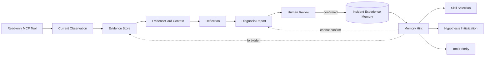
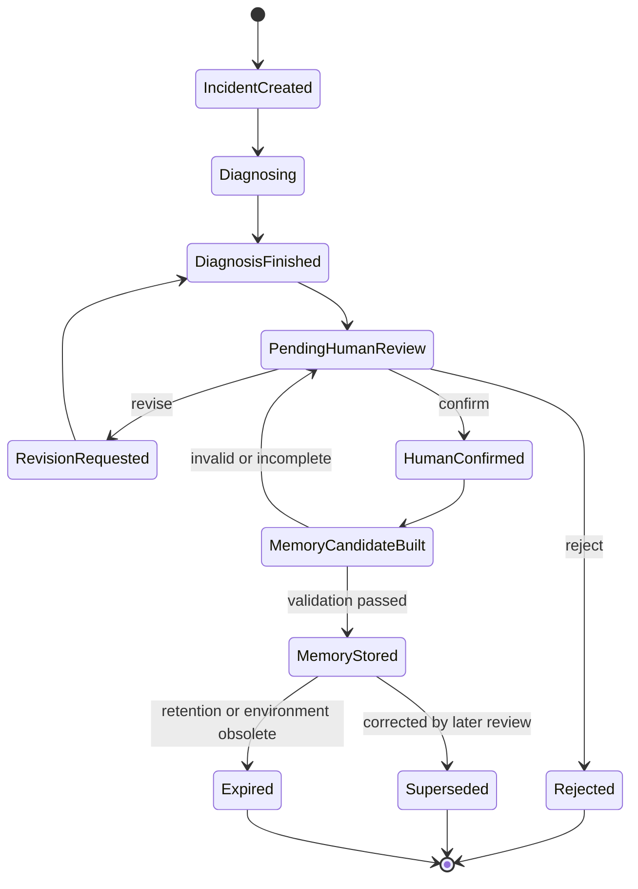
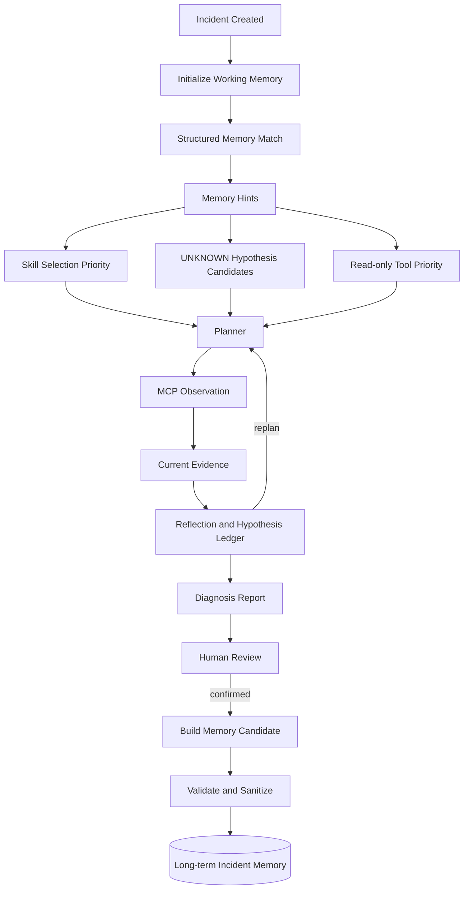

# HMDP AIOps Incident Experience Memory 设计

## 1. 文档目标与边界

本文设计 AIOps Agent 的 Incident Experience Memory，使 Agent 能复用经过人工确认的历史事故经验，同时保持当前事故的诊断结论严格由当前 Evidence 支撑。

Memory 不是知识库，不是监控数据仓库，也不是 Evidence 的替代品。它只保存“过去如何表现、最终确认了什么、哪些调查步骤有效”的结构化经验，并将这些经验转换成带明确历史来源的调查线索。

本设计遵循以下边界：

- AIOps Agent 继续独立于 HMDP Spring Boot 项目。
- 不修改 Java、Docker、Nginx 或现有业务配置。
- 不实现自动修复或 Action Execution。
- 不引入 Vector Database、RAG 或 Embedding。
- 未经人工确认的诊断不得进入权威长期 Memory。
- Memory 不得直接作为 Evidence，不得直接决定当前 Incident 的 Root Cause。
- Memory 中的 Action Proposal 即使曾被批准，也不能绕过当前 Incident 的 Permission Gateway 和人工审批。

---

## 2. Memory 与 Evidence 的区别

### 2.1 定义

**Evidence 是当前事故事实。**

Evidence 来自当前 Incident 时间窗口内的只读 Observation，例如 Kafka consumer 状态、业务指标、应用日志或工具错误。它携带采集时间、来源、完整性和 Evidence ID，可以支持或反驳当前 Hypothesis。

**Memory 是历史事故经验。**

Memory 来自已经完成诊断并经过人工确认的历史 Incident。它保存症状、人工确认根因、抽象证据模式、有效调查路径和获批建议，用于给当前调查提供先验方向，但不能证明当前系统正在发生同样的故障。

### 2.2 强类型隔离

| 维度 | Evidence | Incident Memory |
| --- | --- | --- |
| 语义 | 当前事故的观测事实 | 历史事故的已确认经验 |
| 产生方式 | MCP Observation 经校验和规范化 | Diagnosis Report 经人工确认后提炼 |
| 作用范围 | 当前 `incident_id` | 可被后续 Incident 检索 |
| 时效性 | 由 `collected_at` 和 Observation Window 确定 | 必须标注历史时间、环境和版本 |
| 可否支持当前 Hypothesis | 可以 | 不可以，只能创建候选 Hypothesis |
| 可否进入 Evidence refs | 可以使用 `evidence_id` | 禁止；只能使用 `memory_id` |
| 可否决定 Root Cause | 多来源充分 Evidence 可以支撑结论 | 禁止 |
| 数据内容 | 当前事实、完整性、原始引用 | 抽象模式、调查经验和人工结论 |
| 可信边界 | Tool 来源、采集质量和交叉验证 | 人工确认状态、案例质量和适用范围 |

系统必须使用不同对象和命名空间：

```text
EvidenceCard
  evidence_id: evi_...
  current_fact: true

MemoryHint
  memory_id: mem_...
  current_fact: false
  role: investigation_lead
```

禁止将 `memory_id` 写入 `supporting_evidence_refs` 或 `contradicting_evidence_refs`。Hypothesis Ledger 的 Evidence 引用必须能在当前 Incident 的 Evidence Store 中解析。

### 2.3 数据流隔离



虚线表示禁止的数据流：Memory 不能被包装成当前 Evidence，也不能跳过调查直接生成确认根因。

---

## 3. Memory 生命周期

### 3.1 主生命周期



核心路径为：

```text
Incident Created
  -> Diagnosis Finished
  -> Human Confirmed
  -> Memory Stored
```

### 3.2 各阶段规则

#### Incident Created

- 创建 Short-term Working Memory。
- 保存当前任务目标、预算、选中的 Skill、调查游标和 Hypothesis Ledger 引用。
- 可以检索历史 Memory 生成调查线索。
- 不创建长期 Incident Memory。

#### Diagnosis Finished

- Reporter 输出 Evidence-backed Diagnosis Report。
- Candidate Builder 可以生成 `IncidentMemoryCandidate`，但状态只能是 `pending_human_confirmation`。
- Candidate 不参与后续 Incident 的权威匹配，不提高任何当前假设置信度。
- 不确定诊断可以保留为审核材料，但默认不生成长期经验。

#### Human Confirmed

人工审核至少确认：

- 症状描述是否准确。
- Root Cause 是否被当前 Evidence 充分支持。
- 关键 Evidence Pattern 是否正确抽象。
- 调查路径中哪些步骤真正有效，哪些是冗余或误导。
- Action Proposal 是否经过批准；未批准 Proposal 不得写入 approved 字段。
- 是否包含敏感日志、用户数据、Token、密钥或不应长期保留的原始内容。

人工可以 `confirm / revise / reject`。只有 `confirm` 或修订后再次 `confirm` 才进入 Memory Stored。

#### Memory Stored

- 分配不可变 `memory_id` 和版本号。
- 保存人工审核身份、时间、理由和来源 Incident。
- 建立结构化字段索引，用于后续确定性匹配。
- 写入 `memory_stored` Trace。
- 原始 Evidence 仍遵循其自身保留策略；长期 Memory 只保存抽象模式和必要引用元数据。

### 3.3 更新、纠错与删除

- 已存 Memory 不原地静默改写。人工修订产生新版本，旧版本标为 `superseded`。
- HMDP 架构、Topic、消费者组或业务流程发生变化时，可将不再适用的 Memory 标为 `obsolete`。
- 到达保留期限或包含不应保存的数据时标为 `expired` 并按审计策略清理。
- 被撤销的人工作结论必须停止参与匹配，但保留最小审计记录。

---

## 4. Memory 内容模型

### 4.1 IncidentExperienceMemory

建议的长期 Memory 主对象：

```text
IncidentExperienceMemory
  memory_id
  schema_version
  memory_version
  source_incident_id
  status                    # confirmed / superseded / obsolete / expired
  symptom_profile
  confirmed_root_cause
  evidence_patterns[]
  successful_investigation_path[]
  approved_action_proposal?
  applicability
  quality
  human_confirmation
  created_at
  updated_at
```

### 4.2 Symptom Profile

`symptom_profile` 描述当时用户或 Monitoring 看到的现象，不预写根因：

```json
{
  "summary": "秒杀订单创建延迟",
  "symptom_codes": [
    "seckill.order_creation_delay",
    "kafka.lag_increase"
  ],
  "affected_components": ["voucher-order", "kafka"],
  "severity": "high",
  "source": "alert",
  "temporal_pattern": "sustained_over_2_windows"
}
```

`symptom_codes` 使用受控词表，不保存整段 Prompt。原始用户描述如需保留，应先脱敏、限长并与结构化字段分开。

### 4.3 Confirmed Root Cause

`confirmed_root_cause` 只保存人工确认后的结论：

```json
{
  "root_cause_code": "kafka.consumer_unavailable",
  "summary": "秒杀订单消费者无活跃成员，导致消息积压",
  "component": "voucher-order-consumer",
  "confirmation_basis": "human_confirmed_evidence_chain"
}
```

检索到该字段时，必须重命名为 `historical_root_cause` 或 `candidate_hypothesis` 后再进入 Planner Context，禁止以 `confirmed_fact` 命名。

### 4.4 Evidence Pattern

Memory 不长期复制完整日志或当前 Evidence。它保存去标识化的模式：

```json
{
  "pattern_id": "pat_kafka_consumer_down_v1",
  "source_kind": "kafka_consumer_status",
  "conditions": [
    {"field": "member_count", "operator": "eq", "value_class": "zero"},
    {"field": "lag", "operator": "gt", "value_class": "configured_threshold"}
  ],
  "corroborating_patterns": [
    "business.upstream_aligned_downstream_drop",
    "log.consumer_stopped"
  ],
  "required_source_diversity": 2
}
```

Evidence Pattern 表达“过去哪些事实组合有诊断价值”，不表达“当前这些事实已经存在”。只有当前工具重新采集并产生 Evidence 后，Hypothesis Ledger 才能更新为 `SUPPORTED` 或 `CONTRADICTED`。

### 4.5 Successful Investigation Path

保存可审计的有效步骤，不保存模型隐式思维链：

```json
[
  {
    "sequence": 1,
    "objective": "定位秒杀链路转化下降阶段",
    "tool_name": "get_business_metrics",
    "outcome": "localized_after_kafka_publish"
  },
  {
    "sequence": 2,
    "objective": "验证消费者是否存活及是否积压",
    "tool_name": "get_kafka_status",
    "outcome": "member_zero_and_lag_high"
  },
  {
    "sequence": 3,
    "objective": "获取独立应用侧证据",
    "tool_name": "search_application_logs",
    "outcome": "consumer_stopped_pattern_found"
  }
]
```

路径只保存工具名、目标、结果类别和必要参数类别；不保存密钥、任意查询、完整工具结果或自由形式 Chain-of-Thought。

### 4.6 Approved Action Proposal

只有经过人工批准的 Proposal 才能进入 Memory：

```json
{
  "proposal_name": "restart_consumer",
  "risk_level": "low",
  "approval_record_id": "approval_...",
  "approved_at": "2026-09-21T10:30:00+08:00",
  "reason_summary": "Consumer confirmed unavailable",
  "rollback_plan_summary": "Restore previous process and configuration",
  "verification_plan_summary": "Verify members return and lag decreases",
  "execution_recorded": false
}
```

`approved` 不等于 `executed`，更不等于“可在未来自动执行”。后续 Incident 命中该 Memory 时，Agent 最多复用 Proposal 模板；仍必须重新生成 Proposal、重新关联当前 Evidence，并再次经过 Permission Gateway 和人工审批。

### 4.7 Applicability 与质量

每条 Memory 还应保存：

- HMDP 应用版本或 Git revision。
- 相关 Topic、Consumer Group 和组件身份的归一化标签。
- 环境：local、benchmark、staging 或 production-readonly。
- 适用前置条件和明确排除条件。
- 人工确认等级、Evidence 来源数量、是否检查关键反例。
- 有效期、最后复核时间和是否已被新版本替代。

---

## 5. Short-term Working Memory

### 5.1 定位

Short-term Working Memory 是当前 Incident 的可恢复执行状态，不是历史经验库。它按 `incident_id` 隔离，在诊断期间服务于多轮 Planner、Tool、Reflection 和 Reporter。

内容包括：

- Incident 目标、症状、时间窗口和预算。
- 当前 Plan 版本与下一步 Action。
- 已选 Skill 和版本。
- Evidence ID、EvidenceCard、数据完整性和证据缺口。
- Hypothesis Ledger 的当前状态。
- 已调用工具、结果状态和重试计数。
- Context 裁剪摘要和执行游标。
- 最终报告及 Human Review 状态。

Short-term Working Memory 只保存 Evidence 引用和压缩视图，不复制无限量 Raw Evidence。当前 Agent 的 Incident、Plan、Evidence、Hypothesis、Trace 和 Report SQLite 表可以共同形成该投影视图，不需要再建立一个无边界的大 JSON 对象。

### 5.2 生命周期与保留

- Incident 创建时初始化。
- 每轮计划、Evidence、Reflection 后事务性更新。
- 进程重启时可按执行游标恢复，但恢复前必须重新检查预算和工具状态。
- Incident 关闭后进入短期保留期，之后按审计和隐私策略归档或清理。
- 它不能被另一个 Incident 直接读取；跨 Incident 复用必须经过 Long-term Incident Memory 的人工确认边界。

---

## 6. Long-term Incident Memory

### 6.1 定位

Long-term Incident Memory 是人工确认的结构化事故经验集合。其目标是减少重复调查成本，而不是积累任意文档。

只允许写入：

- 人工确认的症状与 Root Cause。
- 人工审核过的 Evidence Pattern。
- 被证明有效的调查路径。
- 经批准的 Action Proposal 摘要。
- 适用范围、排除条件和质量元数据。

禁止写入：

- 未确认的 LLM 猜测。
- Raw 日志全文、任意 SQL、Token、密钥或个人信息。
- 没有来源 Incident 的自由文本知识。
- 未批准或被拒绝的 Action Proposal 作为“成功经验”。
- 自动执行凭据或绕过治理的命令。

### 6.2 SQLite 结构

本地 Windows MVP 使用 SQLite，不新增外部数据库：

| 表 | 用途 |
| --- | --- |
| `incident_memories` | 主记录、版本、状态、来源 Incident、人工确认信息 |
| `memory_symptom_tags` | 受控症状、组件、严重级别和时间模式 |
| `memory_evidence_patterns` | 规范化字段条件和来源组合 |
| `memory_investigation_steps` | 有效工具顺序、目标和结果类别 |
| `memory_action_proposals` | 已批准 Proposal 摘要和审批记录引用 |
| `memory_reviews` | confirm、revise、reject、supersede 审计记录 |

使用普通 B-tree 索引：

- `status + component`
- `symptom_code`
- `root_cause_code`
- `source_kind + pattern_id`
- `environment + app_version`
- `confirmed_at`

不建立向量列，不生成 Embedding，不接入 Milvus、Elasticsearch 向量索引或外部 RAG 服务。

---

## 7. Memory 检索与匹配

### 7.1 确定性匹配

Memory Matcher 使用结构化字段过滤和可解释评分：

1. 只选择 `status = confirmed` 且未过期、未被替代的 Memory。
2. 按环境、组件和版本适用范围过滤。
3. 使用受控症状标签、来源类型和已观察到的模式计算分数。
4. 返回最多 3 条 Memory Hint，并说明每条命中的字段。
5. 分数相同按人工确认时间和 `memory_id` 稳定排序。

建议评分仅用于调查优先级：

| 匹配项 | 最高分 |
| --- | ---: |
| 组件完全匹配 | 25 |
| symptom code 重合 | 25 |
| 当前已知 Evidence Pattern 重合 | 20 |
| 环境和应用版本兼容 | 10 |
| 历史调查路径中的工具当前仍可用 | 10 |
| 案例质量与新鲜度 | 10 |

总分不是 Root Cause confidence，也不能写入 Hypothesis 的 Evidence-grounded confidence。Memory Hint 应分别暴露 `match_score` 和 `matched_fields`。

### 7.2 分阶段检索

- **Incident 刚创建**：只能依据症状、组件、来源和严重级别匹配。
- **第一轮 Evidence 后**：可以加入当前 Evidence Pattern 做二次排序。
- **Reflection 后**：只在出现新组件或新证据缺口时刷新，避免每轮重复检索造成锚定。
- **Reporter**：可以列出“参考过的历史案例”，但不能把它们列入 Evidence 清单。

### 7.3 MemoryHint

返回 Planner 的对象应明确降权：

```json
{
  "memory_id": "mem_...",
  "role": "investigation_lead",
  "historical_incident_time": "2026-09-01T09:30:00+08:00",
  "match_score": 78,
  "matched_fields": ["kafka", "seckill.order_creation_delay"],
  "candidate_hypothesis": "历史案例根因为 Kafka consumer unavailable",
  "recommended_skill_ids": ["kafka-consumer-diagnosis"],
  "recommended_tool_order": [
    "get_business_metrics",
    "get_kafka_status",
    "search_application_logs"
  ],
  "warning": "Historical experience only; validate with current Evidence"
}
```

---

## 8. Memory 允许影响的三个位置

### 8.1 Skill 选择

Memory 可以提高已匹配 Skill 的优先级：

- 当前 Incident 的静态 trigger 仍是第一道匹配条件。
- Memory 只能推荐已安装、版本兼容的 Skill。
- Memory 不能动态下载 Skill，不能注入外部指令。
- 若 Memory 推荐与当前症状明显冲突，Skill Registry 应忽略该推荐并记录原因。

### 8.2 Hypothesis 初始化

历史 Root Cause 可以转换成新的候选 Hypothesis，但必须：

- 初始状态为 `UNKNOWN`。
- `origin = historical_memory` 与 `source_memory_id` 单独记录。
- 不附加 supporting Evidence。
- 不继承历史案例的 Root Cause confidence。
- 必须由当前 Evidence 更新为 `SUPPORTED`、`CONTRADICTED` 或 `REJECTED`。

例如：

```text
Memory Hint: historical Kafka consumer failure
  -> create Hypothesis "Current consumer may be unavailable"
  -> status UNKNOWN
  -> get_kafka_status
  -> current member_count > 0 and lag normal
  -> status CONTRADICTED
```

### 8.3 Tool 优先级

Memory 可以调整多个已授权 Observation Tool 的调查顺序：

- 只能在 Tool Registry 已注册的 READ_ONLY 工具内排序。
- 不能增加工具权限或绕过 Permission Gateway。
- 不能覆盖预算、超时、路径白名单或参数 Schema。
- Planner 仍应根据当前 Evidence 缺口决定是否采纳。
- 历史路径中的工具已下线或版本不兼容时必须跳过。

---

## 9. 明确禁止的 Memory 用法

以下行为必须在模型输入适配器、Schema 和评测中同时禁止：

1. 将 Memory 转换成 `Evidence` 或伪造 `evidence_id`。
2. 将“历史案例根因”写入当前 Incident 的 `confirmed_facts`。
3. 因 Memory 高分直接把 Hypothesis 标为 `SUPPORTED`。
4. 未调用当前 Observation Tool 就确认 Root Cause。
5. 把历史 Action Approval 复用于当前 Incident。
6. 使用 Memory 绕过 Tool Registry、Permission Gateway 或 Human-in-the-loop。
7. 把未经人工确认的候选案例加入权威检索结果。
8. 保存或复现模型隐式 Chain-of-Thought。
9. 通过相似案例补齐当前缺失的指标、日志或时间窗口。

---

## 10. Runtime 集成设计

### 10.1 组件

```text
WorkingMemoryManager
  管理当前 Incident 的可恢复状态投影

IncidentMemoryCandidateBuilder
  从 Report、Trace、Hypothesis Ledger 和人工反馈生成候选案例

HumanMemoryReviewService
  处理 confirm / revise / reject

IncidentExperienceStore
  保存版本化长期 Memory

DeterministicMemoryMatcher
  使用结构化字段和规则评分返回 MemoryHint

MemoryContextAdapter
  将 Hint 放入 investigation_leads，而不是 EvidenceCards
```

Memory 不是 MCP Tool。它属于 Agent 内部控制面，不代表外部业务系统 Observation，因此不应注册进 Tool Manifest。

### 10.2 Agent 流程



### 10.3 Context 格式

Planner Context 应明确分区：

```text
incident
selected_skill
current_hypotheses
confirmed_current_facts       # 仅来自当前 Evidence
evidence_cards                # 仅当前 Incident
investigation_leads
  memory_hints                # 历史经验，非事实
available_tools
budget
```

Reflection 默认不需要读取完整 Memory。它只需要当前 Hypothesis、当前 Evidence 和 Evidence 缺口。若必须显示 Hypothesis 来源，只提供 `source_memory_id` 标签，不提供历史结论正文，减少确认偏差。

---

## 11. Trace 与审计

建议增加以下事件：

| Trace Event | 内容 |
| --- | --- |
| `working_memory_initialized` | incident_id、schema version |
| `memory_retrieved` | memory IDs、匹配字段、规则版本、分数 |
| `memory_hint_applied` | 影响了 Skill、Hypothesis 或 Tool priority 中哪一项 |
| `memory_candidate_created` | source incident、report、candidate version |
| `memory_reviewed` | confirm/revise/reject、审核人和时间 |
| `memory_stored` | memory_id、版本、质量校验结果 |
| `memory_superseded` | 新旧版本关联及原因 |
| `memory_expired` | 保留或失效原因 |

Trace 不记录 Raw Evidence、完整日志、敏感字段或隐式思维链。`memory_retrieved` 必须能解释为什么命中，便于评测 Memory 是否造成错误锚定。

---

## 12. 安全、质量与失效控制

| 风险 | 控制措施 |
| --- | --- |
| 错误结论污染 Memory | 只有人工确认报告可写入；修订采用版本化 |
| 历史案例造成确认偏差 | MemoryHint 明确标记非 Evidence；Hypothesis 初始 UNKNOWN |
| 旧架构经验误导 | 保存版本和适用范围；obsolete/superseded 不参与匹配 |
| 单一历史案例权重过高 | 最多返回 3 条，分数不转换成根因置信度 |
| 敏感日志长期保留 | 只保存抽象 Pattern；写入前脱敏和字段白名单 |
| 历史审批被复用 | Approval 只作为经验字段；当前 Incident 必须重新治理 |
| 检索结果不可解释 | 使用确定性字段评分，记录 matched_fields 和规则版本 |
| Candidate 未经确认被检索 | 存储状态隔离；Matcher 只查询 confirmed |

Memory 写入必须具备幂等键，例如 `source_incident_id + human_review_version`，避免重复确认产生多个等价案例。相同根因的多个 Incident 可以分别保存，但 Matcher 应对高度重复案例做簇级限量，避免数量多的案例压制其他候选。

---

## 13. Evaluation 设计

Memory 评测不能只检查“是否找到了相似案例”，还要检查它是否改善调查且没有污染证据链。

建议为 HMDP-FaultBench 增加两个隔离赛道：

- `memory_disabled`：完全不加载历史经验，作为基线。
- `memory_enabled_confirmed_only`：只加载测试命名空间中的人工确认 Memory。

指标：

1. **Skill Selection Gain**：是否更早选择正确 Skill。
2. **Hypothesis Recall Gain**：正确根因是否更早进入 UNKNOWN 候选集合。
3. **Tool Efficiency Gain**：达到相同诊断正确率时工具调用是否减少。
4. **Diagnosis Time Gain**：到达可审核报告的时间是否缩短。
5. **Evidence Independence**：最终支持证据是否全部来自当前 Incident。
6. **Memory Anchoring Error**：历史案例错误时，Agent 是否仍能被当前反例纠正。
7. **Stale Memory Rejection**：版本或环境不兼容 Memory 是否被过滤。
8. **Approval Isolation**：历史批准 Proposal 是否从未绕过当前治理。

必须包含反例场景：历史上相同症状由 Kafka Consumer 故障引起，但当前 Kafka 正常、数据库连接池异常。合格 Agent 应把 Memory 初始化的 Kafka 假设更新为 `CONTRADICTED`，继续获取当前 Evidence，而不是复制历史 Root Cause。

---

## 14. 分阶段实施建议

### Phase IM1：Working Memory 投影

- 将当前 Incident、Plan、Evidence、Hypothesis、Trace 和预算组织成可恢复视图。
- 不增加跨 Incident 检索。
- 验收：进程恢复后不会丢失当前调查游标，且不会复制 Raw Evidence。

### Phase IM2：Human-confirmed Memory Store

- 增加 Memory Candidate、人工 confirm/revise/reject 和 SQLite 结构。
- 实现脱敏、Schema 校验、版本化和 supersede。
- 验收：未确认 Candidate 无法被 Matcher 返回。

### Phase IM3：Deterministic Memory Matcher

- 实现组件、症状、环境、版本和模式的规则评分。
- 输出最多 3 条可解释 MemoryHint。
- 验收：不依赖 Vector Database、Embedding 或外部检索服务。

### Phase IM4：Planner 集成与 FaultBench

- MemoryHint 只影响 Skill、UNKNOWN Hypothesis 和 Tool priority。
- 增加 memory enabled/disabled 对照评测和锚定反例。
- 验收：Evidence Independence 为 100%，且 Memory 不降低 Root Cause Accuracy。

---

## 15. 验收清单

- [ ] Evidence 与 Memory 使用不同模型、ID 和 Context 分区。
- [ ] Memory 明确表示历史经验，不被计入当前 Evidence。
- [ ] 生命周期覆盖 Incident Created、Diagnosis Finished、Human Confirmed、Memory Stored。
- [ ] 长期 Memory 包含 symptom、root cause、evidence pattern、successful investigation path 和 approved action proposal。
- [ ] 未确认、被拒绝、过期或被替代的 Memory 不参与匹配。
- [ ] Memory 只能影响 Skill 选择、Hypothesis 初始化和 Tool 优先级。
- [ ] Memory 初始化的 Hypothesis 状态必须为 UNKNOWN。
- [ ] Memory 不得直接决定 Root Cause 或增加 Evidence-grounded confidence。
- [ ] 历史 Action Approval 不得复用于当前 Incident。
- [ ] Short-term Working Memory 与 Long-term Incident Memory 的边界清晰。
- [ ] 检索基于 SQLite 结构化字段和确定性评分。
- [ ] 不引入 Vector Database、RAG 或 Embedding。
- [ ] 全生命周期具备 Human-in-the-loop、版本化与审计 Trace。

## 16. 结论

Incident Experience Memory 的价值不是让 Agent “记住答案”，而是让它记住经过人工确认的调查经验。当前 Incident 的事实仍只能来自当前 Evidence；历史 Memory 只能帮助 Agent 更快选择 Skill、建立待验证 Hypothesis 和安排只读工具顺序。

通过 Short-term Working Memory、Human-confirmed Long-term Incident Memory、确定性结构化匹配和严格的 Evidence 隔离，AIOps Agent 可以积累经验而不退化为“相似案例即答案”的知识库系统，也不需要引入 Vector Database、RAG 或 Embedding。
