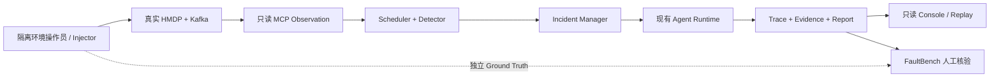

# HMDP AIOps 真实故障演示方案（Phase P1）

## 1. 目标、范围与真实性分级

本文设计两个在**隔离的本地 Windows / Docker 演示环境**中可验证的故障流程。注入由操作员或独立评测 Harness 完成；AIOps Agent 始终只读，不拥有注入、恢复或自动修复工具。演示前应快照测试数据、准备专用券/用户/Topic，并取得恢复责任人确认。禁止对共享或生产环境执行本文注入。

要区分以下三种展示，不得混称：

| 级别 | Observation | 注入对象 | 可以宣称 |
| --- | --- | --- | --- |
| Fixture Demo | 固定模拟返回 | 无真实基础设施故障 | Harness、UI、评测契约可重复运行 |
| Real Kafka Data-plane Demo | 真实 Broker/Consumer Group/offset | 隔离环境的真实消费端或测试消息 | Kafka 观测、Detection、Incident、诊断链路真实运行 |
| Full Business-path Demo | 真实业务请求与多阶段计数 | 生产端继续工作、消费端独立受控 | 端到端业务影响与根因得到当前 Evidence 交叉验证 |

当前代码已具备真实只读 `get_kafka_status`、日志搜索、从日志推导的 `get_business_metrics`、30 秒 Kafka 巡检、确定性规则和 Incident Manager；`console_demo` 仍是 Fixture，不计入真实故障成功率。**当前 Spring Boot 中 Kafka 生产者与 `VoucherOrderKafkaConsumer` 同进程，且没有现成的只暂停该 Listener 的管理端点。直接停止 Spring Boot 会同时停止正常业务生产，不能充当“生产正常而 Consumer Down”的完整业务演示。** 本阶段不改 Java 或运行时，因此完整业务版必须先由隔离环境提供经验证的消费端独立控制能力；否则仅展示明确标注的数据面演示。

现有默认 Topic 为 `hmdp.seckill.order.create.v1`，Consumer Group 为 `hmdp-seckill-order-create-v1`（以实际环境变量覆盖值为准）。HMDP 8081、Agent API 8010、Console 5173；日志白名单为 `target/runtime/spring-boot.out.log` 与 `target/runtime/spring-boot.error.log`。不要使用 `scripts/stop-all.ps1` 注入 Kafka Consumer Down：它会停掉应用与依赖，使因果关系不可辨。

## 2. 演示前共同检查

1. 使用专用本地数据库、Redis 数据和测试券/用户；记录快照与恢复方案。确认 Topic、Group、Kafka 地址在 HMDP 与 Agent 配置中一致；记录故障前 `member_count > 0`、可读 committed offset、`total_lag` 低于阈值。
2. 确认 Agent API、Monitoring Scheduler 与 Console 分别运行。Scheduler 的唯一默认 Schedule 是 `get_kafka_status` 每 30 秒一次，Detector 仅对 `success` Observation 生效。
3. 记录基线：连续至少两次巡检正常，日志白名单可读，测试券库存充足。预先确认演示消息总数足以越过 `AIOPS_KAFKA_LAG_THRESHOLD`（默认 1000），且不会在恢复后污染非测试订单。
4. 为诊断运行选择 Provider：默认 Mock 只验证结构化 Harness；若宣称“模型自主诊断”，应显式配置真实 OpenAI-compatible Provider，并单独记录模型、提示和运行预算。不要将 Fixture 或脚本化响应当成真实 LLM 成功。
5. 建立独立注入记录：目标环境、操作者、开始/结束时间、注入前后探针、测试数据 ID、恢复验证。注入记录是评测 Ground Truth，不作为 Agent Evidence 传给 Planner。



## 3. Scenario 1：Kafka Consumer Down

### 3.1 故障注入方式与可行性门槛

**目标故障**：订单 Topic 上有新消息，而主 Consumer Group 无活跃成员、已提交 offset 停止前进并形成积压。只允许在隔离环境由操作员控制；不增加 Agent Tool。

- 完整业务版的前提是已有、经预演的“仅停止/暂停主订单 Listener，业务生产者仍可接受请求”的外部运维控制。当前单进程部署不满足此前提，不应把简单停 JVM 描述成 Consumer-only 注入。
- 当前代码不改动时可用的数据面替代方案：先让测试 Consumer Group 产生有效 committed offset；在隔离环境停止承载消费者的 HMDP 进程，随后由**独立的测试生产端**向专用 Topic 写入足量、受控的有效测试消息。该方案能真实验证 Kafka lag → 自动 Signal → Incident → Agent，但不证明“停机期间 HMDP 请求仍正常”。测试生产端属于评测注入面，绝不可注册为 MCP Tool。
- 两种方案都须事先验证 `get_kafka_status` 返回 `status=success`、`offsets_complete=true`。若 Group 从未提交 offset，工具可能只返回 partial；Detector 不会因此触发。不得通过修改 Agent 输出或手工插入 Signal 冒充自动检测。

### 3.2 观察指标与触发条件

| 观测 | 预期 | 说明 |
| --- | --- | --- |
| `member_count` | `0` | Kafka Group 真实成员状态，不由日志猜测 |
| `total_lag` | `> AIOPS_KAFKA_LAG_THRESHOLD` | 真实 end offset 与 committed offset 之差 |
| `offsets_complete` | `true` | 不完整 offset 只能报告证据缺口 |
| Topic / Group | 与预检一致 | 避免误诊其他消费者组 |
| 日志 | Consumer 退出/连接变化若存在可作为交叉证据 | 停 JVM 不保证出现 `consumer stopped unexpectedly` 文本，不得补造 |
| 业务请求 / 订单创建 | 仅完整业务版验证 | 数据面替代方案不能声称请求持续正常 |

默认规则 `kafka-consumer-down-v1` 需要 `member_count == 0 AND lag > threshold` **连续两个 success 巡检窗口**，30 秒一次，2 分钟 lookback；满足后产生 `AnomalySignal`。相同 Topic + Group 指纹在 10 分钟 cooldown 内不应产生重复 Incident。工具 error/timeout/partial 不构成 Consumer Down 证据。

### 3.3 自动 Incident 与 Agent 诊断路径

```text
真实 Kafka 状态 → get_kafka_status → Observation Store
→ 连续窗口 Detector → AnomalySignal
→ Incident Manager 去重并创建 Incident
→ Skill Registry 选择 kafka-consumer-diagnosis
→ Planner 选择只读工具 → Kafka Evidence
→ Reflection 验证 / 重规划 → 可用时搜索应用日志
→ Hypothesis Ledger 更新 → Report → Permission Check（只展示）
```

演示时在 Console 查看 `anomaly_detected`、`incident_created`、`skill_selected` / `skill_loaded`、`tool_called`、`evidence_created`、`hypothesis_updated`、`diagnosis_completed`。Tool 顺序由 Planner 选择，不把固定顺序当作成功条件。Trace Replay 只回放已保存事件，不再次访问 Kafka。

### 3.4 最终 Report 与恢复

在 `member_count=0`、lag 超阈值且 Observation 完整时，报告可确认“测试 Group 无活跃 Consumer，消息积压与订单异步创建延迟一致”，引用当前 Kafka Evidence ID。只有实际采到对应日志，才可进一步说“应用日志记录 Consumer 退出”。若日志缺失，应写明该证据缺口并降低断言范围；若只停止了单体 JVM，不能说业务请求持续成功。`restart_consumer` 即使作为 Proposal 出现，也只显示 `REQUIRE_APPROVAL`，Agent 不执行。

恢复由操作员在隔离环境完成：撤销注入、恢复测试进程/监听器，连续两次确认 `member_count > 0` 且 lag 下降；核对测试订单、Retry/DLT 和测试数据清理。恢复动作与时间必须写入注入记录，不回填为 Agent 自动处置。

**中止条件**：非隔离环境、无法区分生产/消费故障、offset 不完整、工具非 success、超出测试消息或时间预算、恢复路径未经预演。中止后只能展示 Fixture Demo 或“不确定诊断”，不得宣称真实自动闭环成功。

## 4. Scenario 2：Kafka 正常，但订单创建异常

### 4.1 注入与触发方式

在隔离环境保持 Kafka Broker 与主 Consumer Group 正常、`member_count > 0`、lag 低且 offset 可读，同时由操作员对**测试专用 MySQL 依赖或测试订单数据**施加受控故障，使订单创建不能完成。不得影响共享数据库；不增加 MySQL MCP Tool。操作员通过独立 Ground Truth 探针确认订单失败与恢复，但这些探针结果不直接送给 Agent。

**当前自动 Detector 只有 Kafka Consumer Down 规则。** Kafka 正常时它不会创建 Signal/Incident。此场景应通过人工提交症状创建 Incident，或等待未来被明确实现的业务异常 Detector；本阶段绝不模拟成自动触发。Incident 描述可以包含“订单创建异常、怀疑 Kafka”，但不得把注入真相传给 Agent。

### 4.2 Business Metrics、反例与进一步调查

期望调查逻辑：

1. `get_business_metrics` 比较秒杀请求、Lua 准入、Kafka 发送、订单创建成功/失败；只使用工具实际标为 `observed_metrics` 的计数。业务指标来自两个白名单 Spring Boot 日志的有界扫描，**不是 Prometheus 或数据库精确计数**。
2. `get_kafka_status` 返回 Group 有成员、lag 正常且 offset 完整。这是“Kafka 消费停滞”假设的反例，Hypothesis Ledger 应记录 `CONTRADICTED`，不能因历史 Kafka 案例或 Skill 指导继续把 Kafka 认作根因。
3. 继续 `search_application_logs` 查消费失败、事务异常、Retry/DLT 相关日志，并把日志与指标窗口对齐。若证据只定位到“Kafka 之后的持久化阶段”，报告应写“下游异常，具体 MySQL 根因未由当前只读工具独立证实”。

当前 HMDP 日志并不稳定提供五个标准指标标记：`get_business_metrics` 可能返回 partial，只有部分计数可观察。MySQL 故障也可能经 Retry/DLT 路由使主 Topic lag 仍正常。**不能把缺失的 `order_created_success_count` 当作零，也不能由 Kafka 正常直接推定 MySQL 故障。** 如果 Metrics partial 后 Reflection 提前输出 `inconclusive`，应如实展示为当前能力边界；不得修改 Fixture 或报告来制造“完整链路诊断”。

### 4.3 Report 与验收级别

- 满足真实 Evidence 的最低演示：Kafka 正常 Evidence 反驳 Kafka 假设；日志或可用业务指标显示订单阶段异常；Agent 继续调查或给出有证据边界的 `inconclusive` Report。
- 满分演示另需经过预检的完整业务指标和有效日志证据，并在真实 Provider 下重复运行验证 Planner/Reflection 轨迹；当前未宣称达到该级别。
- 报告应分列已确认事实、被排除的 Kafka 假设、下游证据、缺失证据、人工后续检查建议。不得生成 MySQL 自动修复、重启或数据变更动作。

## 5. 展示记录与通过标准

每次演示保留：环境快照、故障注入/恢复收据、Incident ID、Observation refs、Evidence refs、完整 Trace、Report、Tool 状态、权限结果和 Console Replay 截图；屏蔽密钥、用户信息和真实订单数据。Fixture 与真实运行结果分开标注和统计。

Scenario 1 的自动链路通过条件是连续真实 Kafka success Observation、规则触发、去重 Incident、Evidence-grounded Report、人工恢复验证。Scenario 2 的通过条件首先是 Kafka 正常反例确实进入 Context 与 Hypothesis Ledger；在业务指标不完整时接受明确的不确定结论，不接受虚构 MySQL 根因。超时、工具失败、环境注入失败须分别归因，不以漂亮的 Console 页面代替诊断正确性。
