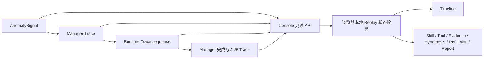

# Agent Run Trace Replay 设计（Phase P1）

## 1. 定位与边界

Trace Replay 是**已完成 Incident 的只读、确定性时间线投影**，目的是让面试展示、故障复盘和 FaultBench 评价能看到 Agent 当时如何选 Skill、调用 Tool、纳入 Evidence、调整 Hypothesis、Reflection 并形成 Report。它不是重新运行 Agent：不调用 LLM、MCP、Kafka、数据库业务接口，也不重新生成诊断或执行 Action。

Replay 只读取现有 `GET /api/incidents/{id}` 的 `traces`、`evidence`、`report` 等只读投影；不新增 SQLite schema 或 Agent Runtime 事件。记录时 Trace 已写入数据库；观看时只在浏览器内按顺序裁剪展示。它不展示模型隐式思维链、原始日志全文或超出 Console API 白名单的 Tool payload。

## 2. 现有 Trace 来源与合并顺序

| 来源 | 事件 | 稳定顺序依据 |
| --- | --- | --- |
| AnomalySignal | `anomaly_detected` | Signal 的创建时间与 `signal_id` |
| Incident Manager Trace | `incident_created`、`diagnosis_started`、`diagnosis_completed`、`action_proposal_created`、`permission_checked` | 存储追加顺序 |
| Agent Runtime Trace | `skill_selected`、`skill_loaded`、`plan_created`、`tool_started`、`tool_completed`/`tool_failed`、`evidence_added`、`hypothesis_created`/`hypothesis_updated`、`reflection_completed`、`report_generated` 等 | `sequence` |

Console API 已合并三路事件，保留 `event_id`、`created_at`、`source`、`sequence`、`raw_event_type` 与安全的 `payload`。它将 `tool_started` 映射为 UI 的 `tool_called`，将 `evidence_added` 映射为 `evidence_created`，原始事件名仍可审计。

**排序规则**：首先按“异常信号 → Manager 创建/启动 → Runtime sequence → Manager 完成/治理”的因果阶段合并；同一流内按持久化序列。真实运行时应与 `created_at` 时间顺序一致；若 Fixture 时钟或不同进程的时钟有偏差，Replay 仍保持 Tool 在 Evidence 之前、Report 在 Reflection 之后，并显示原始时间戳，而不是对所有来源做可能颠倒因果关系的裸时间戳排序。P1 不重写历史时间戳，也不伪造单调时间。

## 3. Replay 状态机

`position` 范围为 `0..N`，其中 `N = traces.length`；`visibleEvents = traces.slice(0, position)`。进入 Replay 时 `position=0`，不显示未来证据或最终答案。每点“下一步”只递增一次；播放模式按固定节奏逐步前进，到末尾自动停止。上一步、开头和退出都只更改浏览器状态，退出后不改变 Incident 数据。组件卸载时清除定时器。

| 画面区域 | 只从当前 `visibleEvents` 推导 | 禁止提前展示 |
| --- | --- | --- |
| Timeline | 到当前步为止的事件和原始时间戳 | 未来 Trace |
| Skill | 已出现的 `skill_selected` / `skill_loaded` | 未加载的 Skill 指导内容 |
| Tool Calls | 已出现的 `tool_called` | 未发生的工具调用或其结果 |
| Evidence | 已出现的 `evidence_created.payload.evidence_id` 与现有 EvidenceCard 的交集 | 未来 Evidence、原始 Observation dump |
| Hypothesis Update | 按 `hypothesis_created` / `hypothesis_updated` payload 重建当前 status、confidence | 只用数据库最终 Hypothesis 状态倒灌过去 |
| Reflection | 最近一个已出现的 `reflection_completed` 决策摘要 | 隐式思维链 |
| Report | 仅在 `report_generated` 后显示现有 Report | 先于生成事件泄露根因 |

只有 `payload.evidence_id` 能链接当前 Incident 的 EvidenceCard；找不到对应 Card 时显示证据缺失，不借历史 Memory 或其他 Incident 补齐。Hypothesis 支持/反驳引用必须仍属于当前 Incident。`partial/error/timeout` Tool 事件作为观察缺口回放，不能被视觉样式误称为诊断事实。

## 4. Console 交互（P1 实现）

Incident Detail 顶部新增 `Replay` 按钮。开启后显示当前事件、进度、开头/上一步/播放-暂停/下一步控件，以及分阶段的 Timeline、Skill、Tool Calls、Evidence、Hypothesis、Reflection、Report。原详情仍可一键返回。自动播放不发送网络请求；API 只在进入 Incident Detail 时读取一次。Proposal 仍是独立的只读治理页，Replay 中的治理事件可以出现在 Timeline，但不提供审批/执行控件。

交互与辅助说明：按钮有文本及 `aria-label`，进度条声明当前/总事件数；空 Trace 显示明确空态；离线或 404 使用 Console 既有错误处理。长 Timeline 在局部滚动容器中展示，避免控制栏被推出视口。当前实现以 700 ms/事件自动播放；这只是展示节奏，不代表实际诊断耗时，真实耗时以 Trace 原始时间计算。

## 5. 数据完整性与审计

- 每个事件通过 `event_id` 标识，Runtime 通过 `sequence` 维护追加顺序。Replay 不覆盖、删改或补写 Trace。
- Report 只有在 `report_generated` 后出现；若历史数据库缺失对应 Report，应显示“记录不完整”，不能根据 Trace summary 重新写报告。
- 事件关联优先使用 `evidence_id`、`hypothesis_id`、`skill_id`、`proposal_id`。没有链接的事件仍显示，但标记无法完成对应状态投影。
- 对多进程时钟偏差保留原始 `created_at`，回放顺序使用前述因果合并规则；未来如需严格跨源时间基准，可新增采集时 monotonic/ingest timestamp，但本阶段不改 schema。
- API 只返回用于展示的有界字段；原始日志、Secret、Token、个人信息不进入 Replay。Trace 既不是模型隐式思维链，也不是可执行操作清单。

## 6. 验收与未来扩展

P1 验收：Kafka Fixture/真实 Incident 均可打开 Replay；在 Kafka Evidence 产生前看不到 Evidence；在 `hypothesis_updated` 前看不到未来置信度；`report_generated` 前看不到根因；播放结束自动暂停；关闭后不会调用 MCP/LLM，也不修改数据库。前端单测覆盖逐步状态和自动播放，完整 Demo 可从 Dashboard 导航到 Incident 再进入 Replay。

FaultBench 后续可从同一 Trace 计算 Tool Efficiency、Hypothesis Convergence Steps 和治理合规性；Replay 是这些指标的可视化审计界面，不是指标计算 Oracle。若未来 Trace 数量很大，可在 API 增加分页/按序流式读取和校验摘要，但 P1 保持现有 Incident 范围与只读接口。
