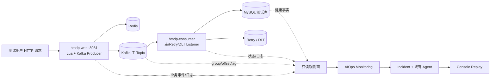

# P2：真实故障演示环境设计

> 状态：设计稿。本阶段仅新增本文档；以下 profile、脚本、Docker overlay、观测能力均**尚未实现**。演示环境只用于隔离的本地 Windows / Docker 测试数据，不用于生产。Agent 保持只读，故障注入与恢复由操作员在 Agent 之外执行。

## 1. 当前问题与可验证基线

当前只有一个 `HmDianPingApplication` 启动入口。它在同一 JVM 内装配 HTTP 秒杀入口 `VoucherOrderServiceImpl`、`VoucherOrderKafkaProducer`、主/Retry `VoucherOrderKafkaConsumer`、`VoucherOrderDltConsumer` 和订单 MySQL 事务服务。一次秒杀请求由 Redis Lua 准入，Web 等待 Kafka Broker 确认后返回订单号；**返回“已受理”不等于 MySQL 订单已创建**。Kafka 消费成功后才确认 offset，失败可转入 Retry Topic / DLT。

因此直接停止现有 Spring Boot 进程会同时停止 HTTP、Producer 和 Consumer；即使 Kafka group 的 member 变为 0，也无法证明“业务继续生产而消费者单独故障”。现有 `scripts/start-all.ps1` 只启动一个 Spring Boot 进程，`target/runtime/spring-boot.*.log` 也只对应这一路进程。

现有 AIOps 能力的边界同样必须如实展示：

| 能力 | 当前事实 | 对 P2 的影响 |
| --- | --- | --- |
| Kafka 巡检与规则 | `get_kafka_status` 可读真实 group、offset、`member_count`、`total_lag`；`kafka-consumer-down-v1` 要求 `member_count=0` 且 lag 大于阈值，连续两个 success 窗口 | 拆分后可自动产生 Kafka Down Signal、Incident、Diagnosis；须先有有效 committed offset |
| 业务指标 | `get_business_metrics` 从两个固定 `spring-boot.*.log` 中扫描标记；缺标记时返回 partial | 不能把缺失计数当 0；拆分后还需解决双进程日志来源与指标完整性 |
| 日志搜索 | `search_application_logs` 仅允许现有固定日志路径 | 新 Web/Consumer 日志不会自动进入 Agent Evidence |
| MySQL 诊断 | 当前没有 MySQL Health MCP Tool，也没有 MySQL/订单失败自动检测规则 | “Kafka 正常、MySQL 异常”目前最多人工触发并给出有边界的诊断，不能宣称已自动闭环 |
| Console Replay | 回放已存 Trace，不重跑 Tool/LLM | 可审计真实运行，但页面展示本身不是故障真实性证明 |

目标架构是**真实业务请求 → 真实 Kafka / MySQL 状态 → Monitoring → Signal → Incident → 既有 Agent Runtime → Console Replay**。Scenario 1 可先打通自动链路；Scenario 2 在观测与检测能力补齐前只能做真实注入加人工 Incident。Fixture 与真实运行结果必须分开标注。

## 2. 最小服务拆分：`hmdp-web` 与 `hmdp-consumer`

### 2.1 决策与职责

优先使用**同一 Maven 模块、同一可执行 JAR、两个 Spring Profile / 两个独立 JVM**，不复制实体、Mapper、订单事务代码，也不引入服务间 RPC。以后若运维需求扩大，再评估 Maven 多模块；P2 不先做大规模业务重构。

| 角色 | `hmdp-web` | `hmdp-consumer` |
| --- | --- | --- |
| HTTP | 保留 8081、登录/秒杀等原接口 | `web-application-type=none`，不开放 HTTP |
| Redis Lua + Kafka 生产 | 保留秒杀准入与主 Topic 生产 | 不接受业务请求；保留内部 Kafka Producer Bean，仅供失败转发 Retry/DLT 使用 |
| Kafka Listener | 主、Retry、DLT Listener **不注册/不启动** | 主、Retry、DLT Listener 都启动，维持原 Consumer Group / Topic / ACK 语义 |
| 订单 MySQL 事务 | 原类与 Mapper 可保持装配，Web 不执行 Kafka 订单落库 | 原 `VoucherOrderTransactionalService` 执行库存扣减与订单插入 |
| 其他后台消费者 | Redis Stream 订单消费线程关闭；Canal 可留在唯一 Web 进程 | Redis Stream 线程关闭；`CANAL_ENABLED=false`，避免双实例订阅 |
| 日志 | 独立 `hmdp-web.out/error.log` | 独立 `hmdp-consumer.out/error.log` |

`VoucherOrderKafkaConsumer` 和 `VoucherOrderDltConsumer` 需要一个**默认兼容旧部署**的条件开关，例如 `hmdp.kafka.listeners.enabled`：未配置时仍为 true；仅 Web Profile 设置 false，Consumer Profile 设置 true。原因是项目显式创建了多个自定义 `ConcurrentKafkaListenerContainerFactory`，不能未经验证就假定通用 `spring.kafka.listener.auto-startup=false` 会控制全部自定义容器。应通过真实 Group member 检查验证 Web 完全不入组。

`VoucherOrderStreamConsumer` 在 `@PostConstruct` 中无条件启动 Redis Stream 后台线程；仅关闭 Kafka Listener 不够。为 Kafka 演示 Profile 增加同样默认兼容旧部署的启动条件，Web/Consumer 均关闭 Redis Stream 消费，避免旧 Stream 待处理消息在任一进程落库。`CanalClient` 已读取 `CANAL_ENABLED`，Consumer Profile 显式设为 false；Web 只保留一个 Canal 实例。此处是**生命周期隔离**，不改 Lua、Kafka 消息格式、事务、重试/ACK 业务逻辑。



### 2.2 不变量与回退

- 两进程使用同一版本 JAR、相同主/Retry/DLT Topic 和 Consumer Group 配置；正式演示不同时运行旧单体进程，否则旧 Listener 会留在同一 group，停新 Consumer 也不会出现 `member_count=0`。
- 保持默认单体启动路径与既有 `scripts/start-all.ps1` 原样可用；新 Profile 必须显式启用，不能改变未指定 Profile 时的行为。
- Web 与 Consumer 共享**隔离测试** Redis/Kafka/MySQL 数据，但各有 PID、日志、环境变量和停止边界。保留原事务幂等与唯一约束；不能靠清空真实数据来重置演示。
- 拆分验收先做角色断言：只启动 Web 时 HTTP 可用但主/Retry/DLT group 无成员；启动 Consumer 后主 group 有成员；停止 Consumer 后 Web 和 Broker 保持可用，测试秒杀请求仍可发送消息。

## 3. Scenario 1：Kafka Consumer Down

### 3.1 故障注入与自动链路

```text
正常：测试请求 → hmdp-web → Redis Lua → Kafka 主 Topic
      → hmdp-consumer → MySQL 订单记录

注入：操作员仅停止 hmdp-consumer 进程；hmdp-web、Kafka、Redis、MySQL 均继续运行。
      使用少量不同测试用户和充足测试券库存产生受理请求。

观测：Kafka group member_count → 0；committed offset 停止前进；
      Topic end offset 增长，total_lag 超过隔离环境阈值。
      Web 侧 Kafka 发送仍成功，Consumer 侧订单创建停止增长。

自动：两次连续完整巡检 → AnomalySignal → 去重 Incident
      → Skill / Planner → Kafka Evidence → Reflection / Report → Console Replay。
```

默认 `AIOPS_KAFKA_LAG_THRESHOLD=1000` 不适合用上千真实测试订单强行越线。**仅在隔离演示 Agent 配置中**可降低阈值（如 5），预检时确认规则实际加载该阈值，再用大于阈值数量的有效测试请求；这不修改 Agent Harness 或生产配置。巡检默认每 30 秒一次，连续两个 `success` Observation 才触发，不能将 `partial/error/timeout` 算作 Consumer Down。必须先让主 Group 有 committed offset，且 Kafka Tool 报告 `offsets_complete=true`；否则本次演示判为前提失败。

真实验收证据包括：Web HTTP 持续响应、Broker 确认的测试消息、Consumer PID 已停止、主 Group `member_count=0`、lag 增长、两个 Observation 引用、Signal/Incident ID、Kafka Evidence ID、Report 和 Replay。订单成功以 MySQL 记录为准，HTTP 受理数与订单落库数只是不同阶段，不能混为一个“成功率”。日志 Evidence 若缺失应明确标为缺口，不制造 `consumer stopped unexpectedly` 文本。Incident 的 `RESOLVED` 仅表示**诊断流程结束**，不表示业务故障已恢复。

恢复由操作员重新启动 Consumer，并验证 group 成员恢复、lag 下降、测试订单最终落库及 Retry/DLT 状态；Agent 不启动进程、不重放消息、不执行 Proposal。若长时间停机可能使测试券 Redis 预扣与 MySQL 落库产生暂时不一致，恢复前后必须核对测试数据。

## 4. Scenario 2：Kafka 正常但订单创建异常

### 4.1 注入选择与预期现象

首选给 **Consumer 独立数据库连接**串接可控故障代理，Web 保持直连隔离 MySQL。两进程和 Kafka 已正常运行后，由操作员让代理阻断 Consumer→MySQL，或在单独的后续实验中限制 Consumer 连接池；不直接停共享 MySQL 容器，以免 Web 查询、Canal 和其他依赖一同故障，破坏“Kafka 正常”的对照条件。代理仅属于测试环境注入面，不注册为 Agent Tool，也不能接触共享数据库。

Web 的秒杀请求仍完成 Lua 与 Kafka Broker 确认；Consumer 主 Group 仍有活跃成员。订单事务失败后，现有 Kafka 错误处理可将消息转到 Retry/DLT 并确认源 offset，所以**主 Topic lag 可能保持正常**；“lag 正常”仅反驳 Consumer 停止/主 Topic 持续积压，不能单独证明 MySQL 根因。应观察订单落库下降、消费失败日志、Retry/DLT 变化，以及从**Consumer 同一路径**采集的数据库不可达或连接池异常事实。恢复代理后还需按现有 Retry/DLT 机制核验测试订单，不能假设所有消息自动重新落库。

### 4.2 Agent 诊断与当前缺口

期望诊断序列不是固定脚本：Business Metrics 指示“请求、Lua 准入、Kafka 发送存在，但订单创建下降”；`get_kafka_status` 显示 group 有成员且主 lag 正常；Hypothesis Ledger 将“Kafka Consumer Down”标为 `CONTRADICTED`；日志及未来只读 MySQL Health Evidence 支持“Consumer→MySQL 路径故障”或更具体的连接池假设。最终 Report 必须引用本次 Incident 的 Evidence，并列出反例与未证实部分。

**当前无法承诺这一场景自动触发和确认 MySQL 根因。** 现有 Detector 仅有 Kafka Consumer Down 规则；业务计数依赖固定单体日志且可能 partial；没有 Consumer 视角 MySQL Health MCP Tool。P2 第一阶段可以用**真实注入 + 人工症状 Incident**展示 Kafka 假设被当前证据反驳，并如实输出 `inconclusive`。只有以后补齐完整业务阶段指标、基于其生成的自动异常规则、Consumer 路径的只读 MySQL Evidence 与对应测试后，才能宣称“业务异常 → 自动 Incident → MySQL 根因支持”。这类扩展属于观测/Tool/Detection 边界，不要求改 Agent Runtime、Planner/Reflection Harness 或引入自动修复。

## 5. 所需能力与改造范围预测

| 优先级 | 未来可能变化的文件/目录（预测，不是本轮修改） | 目的与验收 |
| --- | --- | --- |
| P2-A 必需 | `src/main/java/com/hmdp/kafka/consumer/VoucherOrderKafkaConsumer.java`、`VoucherOrderDltConsumer.java`；`src/main/java/com/hmdp/service/impl/VoucherOrderStreamConsumer.java` | 加少量默认兼容的生命周期条件；确认 Web 无 Kafka/Redis Stream 消费者，Consumer 独立可停 |
| P2-A 必需 | `src/main/resources/application-aiops-web.yaml`、`application-aiops-consumer.yaml`（命名待实现时确认） | 配置角色、Kafka Listener/Canal/Stream 开关及无 Web 端口的 Consumer；原 `application.yaml` 默认行为保持不变 |
| P2-A 必需 | `scripts/aiops-demo/start-web.ps1`、`start-consumer.ps1`、`stop-consumer.ps1`、`status.ps1` | Windows 分别管理 PID、环境变量与日志；`stop-consumer` 仅供操作员故障注入，绝不暴露给 Agent |
| P2-A 验证 | `src/test/java/...` 新角色/集成测试 | 校验 Listener 只在 Consumer 注册、原事务/Retry/DLT 不变，Web 在 Consumer 停止时仍可生产 |
| P2-B 可选环境 | `docker/aiops-demo/` 或单独 Compose overlay | 隔离 MySQL、Kafka、Redis 与 Consumer 专用故障代理；不覆盖现有根 Compose、不删除旧卷 |
| P2-B 观测 | 独立 Web/Consumer 日志采集或现有 `search_application_logs` / `get_business_metrics` 的**只读来源白名单扩展** | 两进程日志带 role、时间窗和来源；缺数据返回 partial，不共享写入一个日志文件冒充单一来源 |
| P2-B 诊断 | 未来 `get_mysql_health` 只读 MCP Tool 与 Manifest；Consumer 侧可观测连接池/数据库连通性 | Probe 与 Consumer 使用相同目标路径；只读、限时、限权限，不能执行任意 SQL 或改库 |
| P2-B 自动触发 | Monitoring 中新增订单失败/成功率规则和持久化 Schedule | 业务异常连续窗口产生 Signal、Incident；与 Kafka Down Rule 分开版本化和评测 |

业务阶段指标优先考虑小范围结构化事件或受限采集器：请求受理、Lua 成功、Kafka Broker 确认、Consumer 事务成功/失败、Retry/DLT，全部带时间窗、role 与可追踪的测试订单关联。当前日志扫描未覆盖全部标记；不能用“缺失就是零”填补。MySQL Tool 若只从 Agent 主机直连数据库，而 Consumer 通过故障代理访问，可能错误地报告“DB 健康”；设计与测试必须保证探针视角一致。连接池耗尽还需要 Consumer 本地池指标，单次 `SELECT 1` 不足以确认。

**不在本阶段改造**：订单算法、Lua 逻辑、Kafka 消息契约、MySQL 事务与 ACK/Retry/DLT 语义、原黑马点评 Vue 前端、核心 Agent Harness、Action Executor。必要的小范围 Java 条件开关也只在后续用户确认实施阶段编码。

## 6. Windows 启动流程与 Demo 步骤（拟实施流程）

以下是实施后的目标操作顺序，不代表脚本现已存在：

1. 使用**专用本地数据卷与测试券/用户**启动 Docker 依赖；检查 MySQL、Redis、Kafka 健康及 Topic/Group 配置。保留现有 `docker-compose.yml`、`scripts/start-all.ps1` 作为单体回退路径；P2 演示不运行旧单体启动脚本。
2. 一次构建 JAR；分别以 `aiops-web`、`aiops-consumer` Profile 在 Windows 启动两个隐藏后台进程。Web 监听 8081，Consumer 不监听 HTTP；分别保存 PID 和独立 `out/error` 日志。确认只存在一个主 Consumer Group 成员来源，且 Web 发送测试消息、Consumer 可落库。
3. 启动现有 AIOps API（默认 8010）、Monitoring Scheduler（默认 Kafka 30 秒 Schedule）与独立 Console（开发端口默认 5173）；确认 Agent 连接的 Kafka Topic/Group 与两进程一致，Console 显示**真实运行**而非 `console_demo` Fixture。
4. Scenario 1：操作员仅停止 Consumer，继续由 Web 发出少量测试秒杀请求；等待两次完整 Kafka Observation，核验 Signal/Incident/Report/Replay；操作员恢复 Consumer 并核验订单与 lag。
5. Scenario 2：保持两个 JVM 运行，操作员只断开 Consumer 的测试 MySQL 路径；核验 Kafka 正常和订单事务失败。P2-A 仅人工提交 Incident 且允许不确定结论；P2-B 观测与规则完成后，才验收自动 Incident 和 MySQL-supported Report。恢复代理后核验 Retry/DLT 与测试订单。

每次 Demo 保存：基线与恢复探针、注入时间与操作者、Web/Consumer PID、消息/订单测试 ID、Observation/Signal/Incident/Evidence ID、Trace、Report、Console Replay 截图和失败归因。注入 Ground Truth 独立保存，不喂给 Agent；如使用 Mock Provider 必须标识，不能称为真实模型自主诊断。

## 7. 风险控制、验收门槛与回滚

- **隔离**：仅本地专用数据库、Topic/Group、测试券与测试账号；注入前确认目标进程 PID、Compose project 和数据卷。不得停共享 MySQL/Kafka、误停 Web 或对生产地址执行脚本。
- **最小改动**：同一 JAR 双 Profile，条件开关默认保持单体旧行为；保留原启动脚本、配置和数据卷。新脚本和 Compose overlay opt-in。实施时先跑现有 Java/Python/Console 测试，再跑角色隔离与真实链路测试。
- **数据安全**：限定测试订单数量、库存和时长；在 Redis 预扣与 MySQL 最终状态核对前不删除消息、Topic 或数据库记录。重试/DLT 中的未完成订单由人工按现有业务语义处理，不自动重放。
- **观测真实性**：`partial/error/timeout` 不算故障成立；日志缺失不能伪造；HTTP 已受理不等于订单成功；Kafka lag 正常不等于 MySQL 正常。Report 的每项断言必须追溯当前 Evidence。
- **回滚**：操作员撤销代理故障、重启 Consumer 并验证 offset/订单恢复；停止两角色进程后可按原 `scripts/start-all.ps1` 启动单体。切换前先确认无残留 Consumer 组成员与未处理测试消息，避免两个部署形态并行消费。

P2-A 验收：无需 Fixture，真实 Web 请求在 Consumer 独立停止后仍进入 Kafka；连续 Kafka 观测自动生成唯一 Incident；Agent 只读诊断并能在 Console Replay 逐步查看证据；人工恢复通过。P2-B 验收：Kafka 保持健康时，真实订单阶段异常由完整业务观测自动生成 Incident；Agent 依据 Kafka 反例与 Consumer 视角 MySQL Evidence 更新假设，输出有证据边界的 Report。**若 P2-B 前置能力未实现，Scenario 2 只能标为“真实故障 + 人工触发诊断”，不能计入自动闭环成功。**
