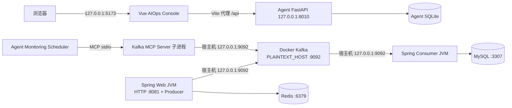

# 真实 Demo 运行环境对齐审查（Phase P2.2.1）

结论：P2.2 的 `get_kafka_status` 失败**不是本轮已证实的 Kafka 地址/端口不一致**。宿主机 Spring 双 JVM 和宿主机 AIOps Agent 均配置为访问 Kafka 对外的 `localhost`/`127.0.0.1:9092`；演示时 Agent 的 Topic、Group 覆盖也与隔离业务链路一致。直接故障点是 `mcp_tools/kafka_status.py` 将 `default_api_timeout_ms` 传给当前虚拟环境的 `kafka-python 2.3.2` `KafkaConsumer`，该版本不接受这个配置键，构造对象时抛出 `KafkaConfigurationError`。本审查不修改代码、Docker 或 Kafka 配置。

## 1. 当前拓扑和地址



| 层 | 已配置地址/角色 | 证据与判断 |
| --- | --- | --- |
| Docker Kafka | 根 `docker-compose.yml` `include` 子文件 `docker/kafka/docker-compose-kafka.yml`；`apache/kafka:3.9.2`，KRaft 单节点。`PLAINTEXT_HOST://:9092` 映射宿主 `9092:9092`，对外宣告 `PLAINTEXT_HOST://localhost:9092`；容器内 `PLAINTEXT://:19092` 宣告 `hmdp-kafka:19092`；Controller `:29093`。 | 宿主机客户端应连 `127.0.0.1:9092` 或 `localhost:9092`，**不是** `localhost:19092`。`19092` 仅供同 Docker 网络的客户端使用，未发布到宿主机。`29093` 不是业务客户端端口。[Kafka 官方 Broker 配置](https://kafka.apache.org/43/configuration/broker-configs/)说明 advertised listener 是 Broker 返回给客户端的地址。 |
| Spring Web/Consumer | `application.yaml` 的 `spring.kafka.bootstrap-servers` 默认 `${KAFKA_BOOTSTRAP_SERVERS:127.0.0.1:9092}`，两个 JVM 均运行在 Windows 宿主机。Web 监听 HTTP 8081，Consumer 无 HTTP 入口。 | P2.2 在隔离 Topic/Group 上真实完成生产、消费和 MySQL 落库，证明演示当时此路径可用。 |
| Agent Runtime/MCP | `config.py` 默认 `127.0.0.1:9092`；`StdioMCPClient` 将该值及 Topic/Group 显式传给 MCP 子进程，`mcp/server.py` 读取后调用 `KafkaPythonStatusReader`。 | Agent 是宿主机 Python 进程，使用宿主机 listener 合理；无 Agent 容器网络地址转换需求。 |
| Console | Vite `127.0.0.1:5173`，`/api` 代理到 FastAPI `127.0.0.1:8010`。 | Console 不直连 Kafka，前端端口/代理不是此次 Kafka MCP 配置错误的成因。 |

注意：Compose 的 `"9092:9092"` 未限定 `127.0.0.1`，理论上可能在宿主其他网卡暴露该端口。这是本地演示的安全检查项，**不是** `default_api_timeout_ms` 错误原因。本阶段不改 Compose。

本次审查（2026-09-22）运行 `docker compose ps -a kafka` 显示 Kafka 为 `exited`，宿主 9092 没有监听；这是 P2.2 演示结束后恢复的状态。这里核查的是**配置和既有演示证据**，没有重启 Broker，也不能把当前离线状态误报成 P2.2 运行时的连通性故障。

## 2. Agent 环境变量与演示目标对齐

`aiops-agent/.env.example` 是样例，当前不存在实际 `aiops-agent/.env`；当前检查进程未设置 `KAFKA_BOOTSTRAP_SERVERS`、`KAFKA_VOUCHER_ORDER_TOPIC`、`KAFKA_CONSUMER_GROUP`、`AIOPS_DATABASE_PATH`。因此当前 `load_settings()` 的默认值是：

| 参数 | 当前默认/生效值 | P2.2 演示进程的目标 |
| --- | --- | --- |
| `KAFKA_BOOTSTRAP_SERVERS` | `127.0.0.1:9092` | 未覆盖，仍为 `127.0.0.1:9092` |
| `KAFKA_VOUCHER_ORDER_TOPIC` | `hmdp.seckill.order.create.v1` | `hmdp.aiops.p22.20260921.main` |
| `KAFKA_CONSUMER_GROUP` | `hmdp-seckill-order-create-v1` | `hmdp-aiops-p22-20260921-main` |
| `AIOPS_KAFKA_LAG_THRESHOLD` | `1000` | `1`，仅用于三笔测试单演示 |

P2.2 使用进程级环境变量启动 Scheduler，没有写入 `.env`，所以**当前默认 Topic/Group 与上次隔离演示不同**是预期状态，不是上次采集报错的原因。隔离 SQLite `aiops-agent/data/p22_real_20260921.db` 里的两条 `monitoring_collection_runs` 观测均为 `error`，其 `data.topic`/`data.consumer_group` 分别是上述隔离 Topic/Group，说明演示时覆盖已传入 MCP。下次重跑若忘记再次设置覆盖，将可能查询原业务 Topic/Group，构成配置漂移。配置优先级为进程环境变量高于 `.env`，高于代码默认值；`get_settings()` 在进程内缓存，修改变量后应重启 Agent/Scheduler，而不是假定运行中自动生效。

建议只读核查命令（Kafka 必须已启动；不要在本阶段启动它）：

```powershell
# 在启动 Scheduler 的同一终端核对目标，而非只查看 .env.example
Get-Item Env:KAFKA_BOOTSTRAP_SERVERS,Env:KAFKA_VOUCHER_ORDER_TOPIC,Env:KAFKA_CONSUMER_GROUP -ErrorAction SilentlyContinue
cd aiops-agent
.\.venv\Scripts\python.exe -c "from config import load_settings; s=load_settings(); print(s.kafka_bootstrap_servers, s.kafka_default_topic, s.kafka_default_consumer_group)"
```

## 3. `kafka-python` 参数兼容性：直接原因

- 项目依赖范围是 `kafka-python>=2.2.10,<3.0`；本机 `aiops-agent/.venv` 实装版本为 **2.3.2**。
- `mcp_tools/kafka_status.py` 的 `KafkaPythonStatusReader.read()` 先构造 `KafkaAdminClient`，再构造 `KafkaConsumer(..., default_api_timeout_ms=self.timeout_ms, ...)`。
- 对当前安装包进行只读检查：`'default_api_timeout_ms' in KafkaConsumer.DEFAULT_CONFIG` 为 **False**，而 `request_timeout_ms`、`api_version_auto_timeout_ms` 均为 **True**。`KafkaAdminClient.list_consumer_group_offsets(..., partitions=...)` 等后续方法签名在当前版本中存在，但其真实运行仍须在修复后回归。
- [上游 `kafka-python` 2.3.2 源码](https://github.com/dpkp/kafka-python/blob/2.3.2/kafka/consumer/group.py)的 `KafkaConsumer.DEFAULT_CONFIG` 无此键，构造函数会拒绝未知配置。**不要依据当前 master/开发版文档推断已安装的 2.3.2 支持该参数**。
- 两次真实演示采集在健康与故障窗口都返回相同的 `KafkaConfigurationError: Unrecognized configs: {'default_api_timeout_ms'}`。错误发生在 Python Consumer 对象配置校验阶段，不能从返回的 `broker_reachable: false` 断言 Broker 不可达：`collect_kafka_status()` 的异常兜底对**任意**异常都填该值。上一轮业务 JVM 与 Kafka CLI 的真实收发、lag 验证也与“Broker 一直不可达”不符。

这解释了为何故障已真实发生却无自动 Incident：`get_kafka_status` 返回 `error` → Detector 只接受 `success` Observation → 无 `AnomalySignal` → Incident Manager 不会触发 Diagnosis → Console 没有该真实 Incident。本机隔离 DB 中两个采集状态为 `error`，`anomaly_signals=0`、`managed_incidents=0`。这不是规则已经证明 Kafka 正常，也不是应手工创建 Incident 的理由。

## 4. 修复方案与再次验收（本阶段均不执行）

1. **P0：另立代码任务修复客户端兼容性。** 对当前固定依赖版本，最小方案是移除 `KafkaConsumer` 构造中的不支持参数；保留其确实支持的 `request_timeout_ms`、`api_version_auto_timeout_ms`，继续由 MCP 外层限时。不要只修改 Docker 地址或重试次数来掩盖参数错误。修改后先用当前虚拟环境做配置契约测试，再在隔离 Topic/Group 上做真实只读调用，确认 `success`、真实 `member_count`、offset 和 lag。若选择升级库，必须先锁定并验证目标版本、API 语义及测试结果，不能假定依赖范围自动解决。
2. **P1：固化演示进程配置检查。** Web/Consumer/Agent 均打印或在启动前核对非敏感的 bootstrap、主 Topic 和 Group；Web/Consumer 的主 Group 必须与 Agent 查询 Group 完全相同。区分宿主 `127.0.0.1:9092` 与容器内 `hmdp-kafka:19092`。任何一端迁入 Docker 后重新选择正确 listener，不能沿用宿主 `localhost`。Agent API 和 Scheduler 应使用同一隔离 DB 路径，以便 Console 看到 Scheduler 创建的 Incident。
3. **P1：重跑真实检测，不注入 Fixture。** 健康阶段应 `success` 且 lag 0；Consumer 停止后需连续两次 `success`，均满足 `member_count=0` 且 `lag > AIOPS_KAFKA_LAG_THRESHOLD`，默认采集间隔 30 秒、规则 lookback 2 分钟。只有随后看到 Signal、自动 Incident、诊断 Trace 和 Console 详情，才能宣称 P2.2 自动闭环通过。若 offset 未建立、Topic 不存在或分区数据不完整，`partial` 也不能触发规则；先消除这些证据缺口。
4. **P2：避免观测误导。** 未来可把客户端初始化错误与 Broker 网络错误分开呈现，避免当前所有异常都被标成 `broker_reachable: false`。双 JVM 日志路径与现有日志 MCP 白名单不一致是另一条独立的证据完整性问题，不应与本次 Kafka 参数错误混淆。

审查结论的范围：已证实配置键不兼容；已核对静态 listener/端口、当前默认设置和上次演示观测。由于本轮 Kafka 容器处于退出状态，**未进行新一轮实时 Broker 连接、MCP 成功调用或自动 Incident 验收**。
