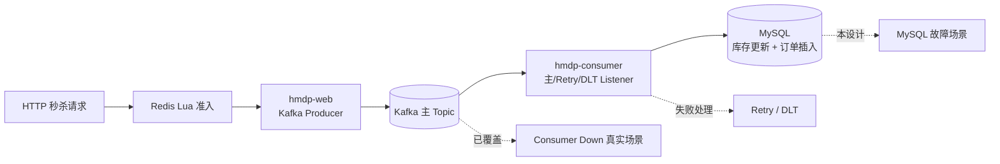
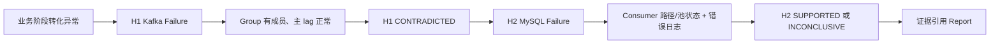
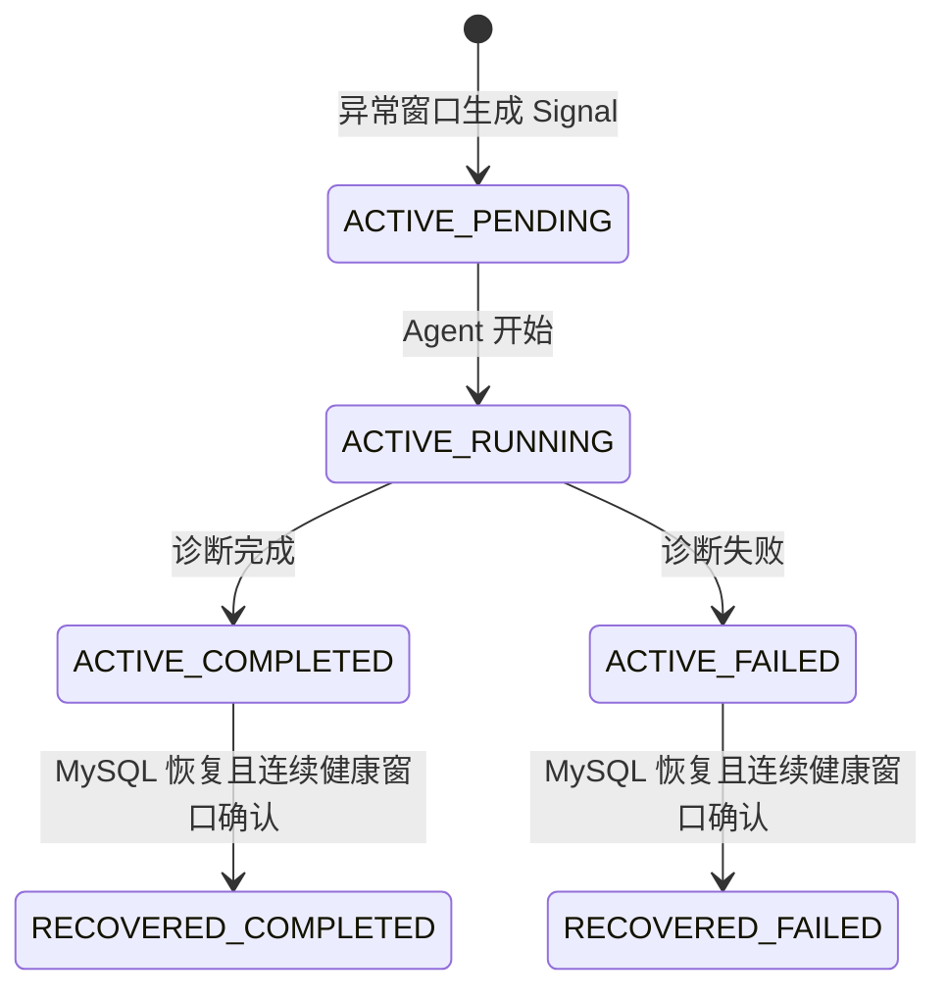

# Phase P3：MySQL 故障诊断真实场景设计

> 状态：仅设计，未注入故障、未新增 Tool 或规则、未验证自动闭环。适用范围仅为隔离的本地 Windows + Docker 演示环境。故障注入与恢复由操作员执行；AIOps Agent 保持只读，不执行修复。本文以当前代码为准；早期文档中把 `RESOLVED` 用作“诊断完成”的描述已由 P2.3 的独立状态语义取代。

## 1. 当前业务链路与已知边界



Web 和 Consumer 已按两个 JVM / Spring Profile 隔离；Consumer 调用 `VoucherOrderTransactionalService`，在一个数据库事务中检查幂等、扣减 `tb_seckill_voucher` 库存并插入 `tb_voucher_order`。HTTP 返回订单号表示 Lua 准入和 Kafka 发布已受理，**不是**订单已落库。消费端事务失败会走已有有限重试与 Retry/DLT；主 Topic offset 和 lag 可能仍然正常，不能用“lag=0”推断订单创建成功。

现有 Kafka Consumer Down 演示已验证独立停止 Consumer、Group 无成员和真实消息积压；MySQL 异常尚未有相应只读观测、自动检测规则和端到端验收。当前 `get_business_metrics` 只扫描 `target/runtime/spring-boot.out.log`、`spring-boot.error.log` 的有限日志片段，五项计数可能缺失或 `partial`，尚不能当作双 JVM 的完整精确指标。当前 Detector 的规则模型仅接受 `kafka_consumer_down` 条件，默认 Scheduler 只采 Kafka。以下 MySQL Tool 和复合规则均是**预测改造**，不是已存在能力。

## 2. 故障注入方案

共同前提：专用测试库、Topic/Group、券和账号；先完成一笔基线订单并记录相应 MySQL 行、Kafka offset 与日志；核对 Web/Consumer PID、MySQL 容器及数据卷。限定少量请求、注入时长和人工恢复责任人。注入 Ground Truth 与 Agent Evidence 分库存放，不能提前写入 Incident 描述。

| 方案 | 注入和预期 | 优点 | 缺点与隔离要求 | 人工恢复 |
| --- | --- | --- | --- | --- |
| A：停止 MySQL Docker | 操作员只对**专用演示 Compose 实例**停止 MySQL 容器；Consumer 事务报连接错误，订单落库停止。 | 简单、可重复、数据库不可达信号明确。 | 整库停机会同时影响 Web 的其他查库接口、Canal 等组件；不适合作为“仅 Consumer→MySQL 路径异常”的严格对照。容器自动重启策略须预检，否则可能自行恢复。不得用于共享 `hmdp-mysql-data` 或正在服务他人的实例。 | 操作员启动**同一**容器与数据卷；确认 DB ready、表和测试行仍在，不删除卷、不重建库。 |
| B：Consumer 专属连接路径/连接池异常（首选） | 让 Consumer 的 `SPRING_DATASOURCE_URL` 指向隔离故障代理或专用测试 DB 端点，Web 保持原连接；在正常启动后阻断 Consumer→DB，模拟连接超时。连接池耗尽变体仅通过 Consumer 专属的测试 Profile/配置和受控负载使 active 达上限、idle 为 0、等待超时。 | Web→Redis Lua→Kafka 仍可工作，Kafka Broker 与 Consumer Group 仍健康，因果边界清楚；可区分网络不可达与池耗尽。 | 需要新增隔离代理/启动配置和 Consumer 侧池指标采集；直接在共享 MySQL 上制造大量连接不合格。代理探针若从 Agent 主机直连原 DB，会误报“健康”；必须标注 Consumer 实际访问路径。 | 操作员解除代理阻断，或停止测试负载并恢复原池参数后重启专用 Consumer；核验连接、事务、Retry/DLT 和订单。 |

优先实施 B 的“Consumer 连接路径断开”；连接池耗尽是第二个独立子场景，不能把网络超时误写为 Hikari 耗尽。A 可作为粗粒度“数据库不可用”备选演示，但 Report 必须注明故障影响超出了订单 Consumer。所有注入开关属于演示控制面，**不得注册为 MCP Tool 或 Agent Action**。

## 3. 待新增只读观测：`get_mysql_health`

需要该 Tool。现有 Kafka 状态只能排除 Consumer Down，日志可指向 SQL/连接错误，均不能独立证明 Consumer 访问的 MySQL 目标或 Hikari 池状态。单纯从 Agent 主机执行 `SELECT 1` 也不能证明 Consumer 经故障代理的连接可用；Hikari active/idle 必须来自 Consumer JVM 的只读遥测，当前项目未配置可直接依赖的 Actuator/Micrometer 池指标端点。实施时应先确定安全的数据来源，不能把不存在的指标填成 0。

建议契约（未来实现，示例值不是本次实测）：

```json
{
  "request": {
    "incident_id": "inc_example",
    "target_role": "hmdp-consumer",
    "observation_window": "2026-09-22T10:00:00+08:00/2026-09-22T10:02:00+08:00"
  },
  "observation": {
    "status": "partial",
    "kind": "mysql_health",
    "source": "hmdp-consumer/mysql-path",
    "source_tool": "get_mysql_health",
    "summary": "Consumer MySQL path is unreachable; pool metrics unavailable.",
    "completeness": "partial",
    "data": {
      "database_reachable": false,
      "hikari_active": null,
      "hikari_idle": null,
      "connection_timeout_count": 3,
      "error_count": 3,
      "target_role": "hmdp-consumer"
    }
  }
}
```

实际实现沿用项目统一 `ToolObservation` / Evidence Envelope（含 `evidence_id`、采集时间、来源与原始引用）；上例只展示核心字段，`status`、`completeness` 和数据质量应保持一致：探针能确认不可达但拿不到池指标时，可报告 `partial` 并保留已证实事实；探针自身无法运行时返回结构化 `error/timeout`，不可当作数据库故障。`hikari_active`、`hikari_idle`、连接等待超时次数、SQL/连接错误次数若无可靠来源用 `null`/“unavailable”，禁止伪造 0。计数需带窗口、单位、采集来源和角色；错误次数区分连接错误与业务 SQL 错误。必要时将 DB 存活探针与 Consumer JVM 池指标分成同一工具的两个来源，并分别标注完整性。

Tool Manifest 预测：`category=observation`、`permission_level=READ_ONLY`、`risk_level=none`、`approval_required=false`；目标地址/角色白名单，超时和返回量上限，不接受任意 SQL、JDBC URL、文件路径或 Agent 输入的凭据。若使用 SQL 探活，只允许固定只读语句和只读账号；禁止写入、DDL、连接终止、改池参数或自动重启。敏感 JDBC 地址与异常堆栈需脱敏。探针与 Consumer 路径不一致时，报告只能说“Agent 探针路径可达”，不得作为 Consumer 路径健康反例。

## 4. Detection：跨来源业务异常信号

拟新增版本化规则 `order-persistence-failure-v1`，与现有 `kafka-consumer-down-v1` 并存而不改其含义。需要按**相同测试券/链路、相同固定时间桶**关联 Business Metrics、Kafka 和 MySQL Observation；不得直接比较历史累计数，也不得把缺失阶段计数视为 0。

| 阶段 | 候选判定（阈值均在隔离演示配置中确定） | 证据质量门槛 |
| --- | --- | --- |
| 业务异常候选 | 请求、Lua 准入和 Kafka publish 均有量；订单成功率相对健康基线明显下降，或订单失败数上升。成功率分母采用有资格进入订单阶段的请求，不能直接用所有 HTTP 请求。 | 每个计数必须在 `observed_metrics` 中、窗口一致、来源完整，样本量达到下限；否则 `insufficient`。 |
| Kafka 排除/分流 | Broker 可达、目标 Topic 存在、Group 有成员、offset 完整、主 lag 未异常；同时检查 Retry/DLT 趋势。 | Kafka `success` 且 `offsets_complete=true`；主 lag 正常只反驳“Consumer 停止/主 Topic 积压”，不证明订单成功。 |
| MySQL 支持 | Consumer 路径不可达，或 Hikari active 达上限、idle 为 0 且连接等待超时上升；与订单失败/日志时间窗重叠。 | 来自 Consumer 同路径的只读事实；区分连接问题、SQL 约束/库存不足及其他业务错误。 |
| 发 Signal | 至少连续两个完整异常窗口满足业务条件，并有 MySQL 支持；以环境、Consumer 角色、Topic/Group 和 DB 目标别名构造 fingerprint，设置 cooldown。 | `partial/error/timeout` 不进入确认窗口。缺 MySQL 支持时可发较宽泛“订单持久化异常待定位”信号，但不能命名为 MySQL 根因。 |

拟输出 `AnomalySignal` 包含 `rule_id/version`、上述 fingerprint、严重度、窗口事实及各来源 `observation_refs`。`IncidentManager` 仍复用同一 Runtime，但现有请求映射硬编码 `affected_components=["kafka"]`、标题为 Kafka anomaly，必须在实施阶段扩展成按规则映射，不能把 MySQL Signal 伪装成 Kafka Down。现有 `DetectionRule.condition` 只接受 Kafka 条件、Detector 以单个 Observation `source_kind` 触发；跨来源窗口关联、规则存储、Scheduler 采集计划均需新增最小实现。所有阈值需先以健康基线定标，避免用“只要订单数没涨”在低流量窗口误报。

## 5. Agent 诊断路径与结论边界

期望轨迹是**证据驱动而非固定调用顺序**。展示样例：

1. `get_business_metrics`：HTTP/Lua/Kafka publish 仍有成功记录，订单成功下降或失败上升；若日志源不完整，则标 `partial` 并继续调查，不能推断真实成功率。
2. 初始假设 H1“Kafka 消费端停滞”。`get_kafka_status` 显示 Broker 和 Group 正常、成员存在、offset 完整、主 lag 低；Hypothesis Ledger 把 H1 标为 `CONTRADICTED`，同时保留“Retry/DLT 中可能有失败单”的开放问题。
3. 新假设 H2“Consumer→MySQL 连接不可用/连接池耗尽”。`get_mysql_health` 给出路径或池事实，`search_application_logs` 给出 Consumer 事务/连接超时及 Retry/DLT 相关错误；H2 只有在独立证据和时间窗对齐时才 `SUPPORTED`。若仅 DB 可达而池指标缺失，不能排除池耗尽；若日志是库存不足或唯一约束，不能误报连接故障。
4. Reflection 先尝试证伪 H2：检查目标角色/路径是否一致、异常前后窗口、恢复后事实及错误类型。Report 引用当前 Incident 的 Evidence ID、H1 的反例、H2 的支持证据、数据缺口和置信度；工具失败时输出不确定结论，不凭注入脚本 Ground Truth 补全。



现有 Kafka Skill 可以指导跨来源调查，但 Skill 不是 Evidence；未来可补充 MySQL 专项 Skill，不能让其预设结论。Action Proposal 若出现，只能展示与审批，不在本场景执行任何修复。

## 6. 恢复与 Incident 状态



图中前缀是 **Incident status**，后缀是 **diagnosis_status**；`ACTIVE / COMPLETED` 仍是未恢复故障，Dashboard 不显示 Healthy。P2.3 当前自动恢复判定仅针对 Kafka Consumer Down；MySQL 场景需新增独立恢复规则：Consumer 同路径数据库可达、连接池等待超时回落、订单阶段成功率恢复，并以少量新的测试订单实际落库作人工验收。至少两个完整、同 fingerprint、晚于最后异常信号的健康窗口才允许 `ACTIVE → RECOVERED`；`partial/error/timeout`、无业务流量或仅容器重启都不算恢复。若先前消息进入 Retry/DLT，还需人工确认这些测试订单的最终状态；新订单恢复不自动等于旧订单全部成功。`ACKNOWLEDGED` 是后续人工确认状态，不是诊断完成或自动修复。

方案 A 由操作员重新启动同一 MySQL 容器；方案 B 由操作员解除 Consumer 专属注入并恢复池参数/测试负载。Agent 不拥有容器、进程、SQL 写入或重放权限。恢复前后的 MySQL 表记录、Retry/DLT 与 Redis 预扣状态只做**限定测试数据的只读核对**；不自动清理或补偿。

## 7. 预计文件变化与实施验收（本阶段不修改）

| 未来可能涉及的文件/范围 | 目的 |
| --- | --- |
| `aiops-agent/mcp_tools/mysql_health.py`、`aiops-agent/mcp/server.py`、`tool_manifest.json`、MCP 相关测试 | 增加白名单、只读 MySQL / Consumer 池观测契约；不开放 SQL 或修复动作。 |
| `aiops-agent/monitoring/detector/{models,rules,detector,signal_store}.py`、Scheduler/Store 与测试 | 支持多来源时间窗和版本化业务持久化异常规则；保留原 Kafka 规则。 |
| `aiops-agent/incident/manager.py`、`aiops-agent/context/`、`aiops-agent/reasoning/` 与测试 | 按 Signal 生成业务组件上下文，保留跨来源 Evidence 与假设反例；添加 MySQL 专属恢复确认。 |
| `aiops-agent/mcp_tools/business_metrics.py`、日志 Tool 白名单及测试 | 让 Web/Consumer 分离日志的阶段指标有明确来源、时间窗和完整性；缺数据仍返回 partial。 |
| 演示专用配置/脚本或 Compose overlay；必要时极小的 Consumer 只读遥测适配 | 隔离故障代理、独立日志和 Consumer 池指标。是否改 Spring 配置/增加只读指标出口须单独评审，不改订单事务逻辑。 |
| `docs/aiops/faultbench/`、`aiops-agent/evaluation/` 与 Console 验收测试 | 新增真实 MySQL 场景 Ground Truth、工具/证据/轨迹/恢复评测；真实与 Fixture 分开统计。 |

拟议演示顺序：健康基线与测试单落库 → 操作员只注入 Consumer 的 MySQL 路径故障 → 经 HTTP 发少量新测试单并确认 Kafka publish 正常 → 观察业务转化、Kafka 正常及 MySQL/日志异常 → 连续窗口自动 Signal/Incident → Console 查看 Skill、Tool、Evidence、H1→H2、Report → 操作员撤销故障 → 连续健康窗口与新订单落库 → Incident 变 `RECOVERED`。若只完成 A 的整库停止，展示时必须注明 Web 其他查库业务也受影响；若任一观测前提失败，则只报告局部事实或 `inconclusive`，不得称自动 MySQL 根因诊断通过。

风险门槛：禁止共享/生产数据库注入；不清空数据卷、不改数据库结构、不删除 Topic/offset；预先核对目标容器、代理、PID 与恢复命令；限制请求量和持续时间；日志/报告脱敏；将 Tool、Context、模型、Detection 和注入失败分别归因。验收所需的证据包括真实 HTTP 受理、Broker 发送、Group 状态、同券 MySQL 订单数、Consumer 错误、MySQL 路径/池观测、Signal/Incident ID、Evidence refs、Trace 与恢复后订单核验，不能仅凭漂亮的 Console 页面通过。
