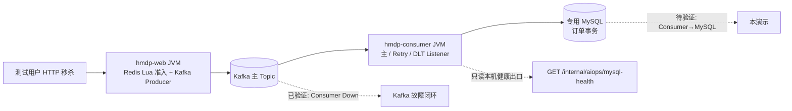
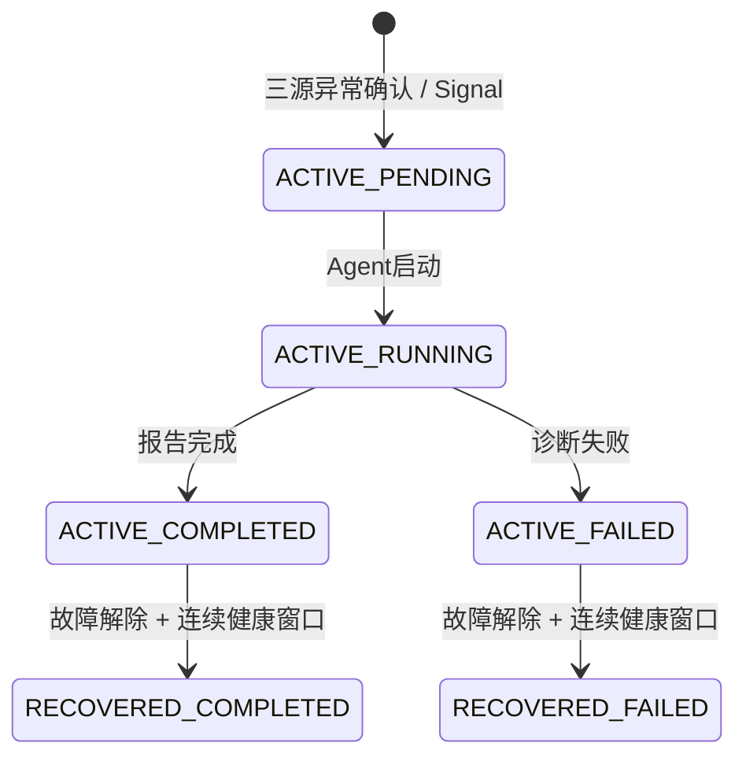

# Phase P4.3：MySQL Persistence Failure 真实演示环境设计

> 状态：仅设计，未注入真实 MySQL 故障，未修改 Agent、Java、Docker 或 Console。适用范围是专用、可恢复的本地 Windows 演示环境。以下“预期”均不是本阶段实测结论；Fixture 通过不等于真实闭环通过。

## 1. 当前运行拓扑与验收基线

两个 JVM 使用同一构建产物，`web` Profile 保留 HTTP/Producer，不启动 Listener；`consumer` Profile 启动 Listener 和订单事务，不暴露业务 HTTP。真实业务路径为 HTTP → Redis Lua → Kafka Producer → 主 Topic → Consumer → MySQL。HTTP 返回订单号仅表示请求被受理，**不是订单已落库**。Consumer 事务失败后可能经现有错误处理器转到 Retry/DLT；主 Topic lag 保持正常不能证明订单创建成功。

Kafka Consumer Down 的独立停止、Group 无成员、lag 增长和订单延迟已在 `13_kafka_consumer_failure_demo.md` 的隔离数据上验证；后续 Kafka MCP 兼容性和主动诊断闭环按现有实现推进。本阶段的 **MySQL 真实故障、自动 Signal/Incident、恢复识别仍待验证**。现有只读 `get_mysql_health` 通过 Consumer JVM 的 loopback 端口（默认 `18082`）读取实际 DataSource 的连接校验与 Hikari 瞬时 active/idle；累计连接超时数、错误数目前为 `null/unavailable`，不可展示为零。

## 2. 故障注入方案比较与推荐

共同前提：另建专用测试数据库实例及**独立命名的数据卷**、测试券/账号、主/Retry/DLT Topic 和 Consumer Group；两个 JVM 指向同一专用数据库。现有根 `docker-compose.yml` 将卷显式命名为 `hmdp-mysql-data`，**仅更换 Compose project name 不会隔离该卷**。未能核实独立卷及目标容器身份时，禁止注入。

| 方案 | 注入方式与真实性 | 影响范围 | 人工恢复与关键风险 |
| --- | --- | --- | --- |
| A：停止 MySQL Docker | 操作员只停止专用演示栈的 MySQL 容器，模拟真实整库不可用；链路结果明确。 | Consumer 订单持久化与 Web 其他查库接口都可能受影响，Canal 等依赖也会受影响；**不是**“仅 Consumer 路径故障”。 | 对已核对的专用容器执行停止/启动，不移除容器或卷；等原数据库健康后核对测试表和基线订单。若使用共享 `hmdp-mysql-data`，本方案禁止执行。 |
| B：Consumer 专属 MySQL 连接路径故障（推荐） | Web 直连专用 MySQL，Consumer 经专用本地 TCP 故障代理连接同一 MySQL；基线成功后由操作员仅切断/重置代理上游，模拟 Consumer→DB 连接故障。 | Web、Broker 和主 Consumer Group 可保持正常，更利于证伪 Kafka；专用 Consumer 的订单事务受影响。 | 恢复代理连接并验证 Consumer 重新获取有效连接。代理必须**先于 JVM 启动**且基线可用；连接中断可能表现为 `null/timeout` 而非 `false/connection_failed`，须先预检当前 Detector 是否能接收，不能伪造健康响应。 |

推荐先准备 B，再用 A 作为隔离环境下的备用“整库不可用”对照。B 不代表 MySQL 服务器宕机，报告应写“Consumer 到 MySQL 的持久化连接路径故障”；A 的报告应注明 Web 的数据库依赖也受影响。连接池耗尽是另一个故障类型，不能把 TCP 断连当作 Hikari 耗尽；本演示不通过大量连接压垮共享 MySQL。

故障开关只供操作员在演示控制面使用，**不得注册为 MCP Tool、Action Executor 或 Agent 自动修复动作**。演示数据和注入 Ground Truth 与 Agent Evidence 分开保存，不能将“已停 MySQL/已切代理”写进 Incident 描述引导模型。

## 3. Agent 观测链路与假设轨迹

- `get_business_metrics`：比较两次同一采集计划的五项计数增量，观察请求、Lua 准入、Kafka 发送和订单创建转化。它只能定位链路阶段，不能单独证明 MySQL 根因。
- `get_kafka_status`：目标 Topic 存在、Group 有活跃成员、offset 完整、分区未截断、lag 与状态正常时，反驳“Consumer 停止/主 Topic 积压”这一 H1；**不**排除消息已转入 Retry/DLT。
- `get_mysql_health`：只采 `source_role=hmdp-consumer` 的固定本机出口。当前 P4.2 规则要求明确 `database_reachable=false` 且 `connection_test_status` 为 `invalid/connection_failed/timeout/acquisition_error`；字段缺失、角色不符、MCP `error/timeout` 不构成 MySQL 根因。Hikari active/idle 若不可用记为 `null`，不能补造错误数。
- `search_application_logs`：计划中的独立复核，需看到 Consumer 事务/连接错误并与订单和观测窗口对齐，同时排除库存不足、重复订单等业务失败。**当前确定性 Runtime 的 MySQL FaultBench 路径在 MySQL Evidence 后即生成报告，不能声称已自动调用 Log Tool。** 若演示必须在 Console 展示第四步日志 Tool Call，应在后续实施阶段先完善 Planner/Reflection 与双 JVM 日志来源并验收；本阶段不编码。

Hypothesis Ledger 应显示 H1 从 `UNKNOWN` 到 `CONTRADICTED`，H2 从 `UNKNOWN` 到 `SUPPORTED`，各状态变化引用本次 Tool 产生的 Evidence ID。Agent/LLM 不能生成 Evidence ID，历史 Fixture 或操作员 Ground Truth 不能充当当前事故证据。若日志缺失，报告须列出“缺少独立日志复核”，降低结论强度；不得用 Console 的完整画面替代证据核验。

### 演示前必须打通的数据质量门槛

当前 `get_business_metrics` 只扫描 `target/runtime/spring-boot.out.log` 与 `spring-boot.error.log` 的有界尾部，并依赖五类日志标记；双 JVM 分开输出时可能长期 `partial`，计数窗口还会因尾部滚动而回退。不能让两个 JVM 盲目写同一日志文件来“凑齐”指标。后续应设计**白名单内的 Web/Consumer 分源采集或只读计数出口**，保留角色、时间窗和缺失状态，并证明两次完整快照的增量可用。未达到此门槛时，`order-persistence-failure-v1` 不会产生可信 Signal，演示只能停在环境预检。

Consumer 健康探针在借连接超时、探针繁忙或部分 SQL 异常时可能返回 `database_reachable=null`；P4.2 规则目前不会据此确认 MySQL。对 B 方案必须先在隔离环境预检故障方式是否稳定得到**真实的** `false/connection_failed` 等可接受组合。若只得到 `null/timeout`，标记为证据不足并单独评审规则/出口语义，不准篡改 Observation 或 Fixture 使其触发。

## 4. `order-persistence-failure-v1` 的真实触发条件

当前 Scheduler 默认约每 30 秒分别采业务、Kafka、MySQL；MySQL Observation 到达时在 5 分钟 lookback 内关联三源。规则不是“订单下降即 MySQL”：

1. 同一业务采集计划至少有两次 `success/complete` 快照，五项计数都在 `observed_metrics`，无 `unavailable_metrics`，增量非负且新请求数达到门槛。
2. Lua 准入增量/请求增量 ≥ 0.9，Kafka 发送增量/Lua 增量 ≥ 0.9；订单成功/发送 < 0.8 **或**失败增量 > 0。
3. 晚于第二次业务快照的 Kafka Observation 为 `success/complete`，目标 Topic/Group 明确、成员数 > 0、offset 完整、分区未截断、状态 `stable/normal`，总 lag 不超过配置阈值。
4. Consumer MySQL Observation 为同角色、同路径，明确连接校验失败；`partial` 可保留已证实的失败字段，`error/timeout` 是观测失败而非数据库故障。

全部满足才生成 `AnomalySignal`，保存**前后业务、Kafka、MySQL 四个已持久化 Observation 引用**、窗口事实、rule/version 与 Topic/Group/Consumer 角色 fingerprint；10 分钟 cooldown 防止重复 Signal，Incident Manager 对相同活动 fingerprint 去重并触发现有 Agent Runtime。Kafka 异常则走 Kafka 排查，业务指标缺失或工具异常为 `insufficient`，不创建错误的 MySQL Incident。当前规则的 `min_request_delta=1` 是代码安全下限，**不是**真实演示的统计充分性：实施时需以健康基线确定实际样本量和阈值，少量订单不一定足以稳定演示。

## 5. 恢复状态与尚缺能力

图中前缀为 Incident `status`，后缀为 `diagnosis_status`：**`ACTIVE / COMPLETED` 仍是未恢复故障**，Dashboard 不得显示 Healthy。当前实现的自动恢复判定只覆盖 Kafka Consumer Down；MySQL 规则在 `evaluate_recovery` 中尚未参与，故即使人工恢复 MySQL，MySQL Incident 也会保持 `ACTIVE`。这是后续实施项，不能在本阶段宣称自动 `RECOVERED` 已可用。

建议 MySQL 恢复条件：操作员解除专属注入或重启专用 MySQL 后，至少两个连续、同 fingerprint、晚于最后异常的健康窗口；Consumer 实际路径 `database_reachable=true/valid`，业务阶段出现新的请求、发布和订单成功增量，Kafka 仍健康，并以**新测试单实际落库**人工复核。若无流量、计数 `partial`、探针 `error/timeout`、旧消息仍留在 Retry/DLT，均不能仅凭容器变为 running 宣称整体恢复。旧订单的最终状态单独人工核对；Agent 不重放、不补偿、不清理。

## 6. 分阶段实施计划与文件变化预测

本阶段**只新增本文档**。后续每阶段独立评审、实施和验收：

| 阶段 | 工作与可验证出口 | 预计文件范围（非本轮修改） |
| --- | --- | --- |
| E1：隔离环境 | 建专用 Compose overlay/演示配置与**新卷名**，保留原栈；固定独立 Topic/Group/券/账号，记录容器 ID、JVM PID、端口、恢复负责人。先通过健康订单落库基线。 | 演示专用 Compose overlay、`scripts/aiops-demo/`、演示配置与文档；不改订单事务或表结构。 |
| E2：Consumer 专属故障路径 | Consumer JDBC 指向专用代理，Web 直连同一专用 MySQL；正常时健康探针、订单事务成功。人工断开代理并核验真正的 Consumer `false/connection_failed` 等 Observation；若只出现 `null`，停止演示并评审语义。 | 演示代理配置/启动脚本、Consumer 启动参数；必要的探针契约/测试单独评审，不改业务处理。 |
| E3：真实观测对齐 | Web/Consumer 分源日志或只读计数采集；验证五项业务指标完整、两次快照增量非负、Kafka offset 完整，Agent 与 JVM 使用同一 Topic/Group，MySQL 端口一致。 | `aiops-agent/mcp_tools/business_metrics.py`、日志白名单/采集适配、相关测试与配置；可选极小只读 Java 遥测出口，须另行批准。 |
| E4：自动诊断 | 只用真实 HTTP 测试单触发 Observation → Signal → Incident → Runtime；核对 H1 反驳、H2 支持、Evidence 引用、报告与 Console Replay。日志第四步需先实现和验收，不得用 Fixture 充数。 | Agent Planner/Reflection、日志采集及集成测试（如确需）；`evaluation` 真实场景 Ground Truth 单独标记。 |
| E5：恢复识别 | 人工撤销故障，连续健康窗口、新订单落库、旧测试消息状态核对；确认 ACTIVE→RECOVERED 后 Dashboard 才显示 Healthy。 | `monitoring/detector/` 的 MySQL 恢复规则、`incident/` 状态测试、真实 FaultBench 评测。 |

## 7. 安全 Demo 步骤与证据清单

1. **预检而非注入**：确认不是生产/共享数据库；检查专用 Compose 配置最终卷名、容器 ID、MySQL 映射端口、Web/Consumer JDBC 地址、Kafka Topic/Group、Consumer 健康出口端口。原 `hmdp-mysql-data` 若仍被引用即停止。记录回退方式，不使用会删除卷/数据的命令。
2. 启动专用 MySQL/Redis/Kafka 和故障代理（方案 B）；先启动 Consumer（Java 17 保留现有 `--add-opens=java.base/java.lang.invoke=ALL-UNNAMED` 参数并显式开启 loopback MySQL 健康出口），再启动 Web。完成至少一笔 HTTP 基线测试单，核对其 Kafka 发送、Consumer 消费及专用库订单行；采集两轮健康 Observation。
3. 操作员仅切断**已核对的 Consumer 专属代理**；备选 A 只能停止专用 MySQL 容器。用少量不同测试账号经原 HTTP 秒杀入口继续下单，不直接向 Kafka 生产、不直接写 MySQL。HTTP 受理、Topic end offset、Group 成员/lag、Retry/DLT、同券数据库订单数分别留证；避免在故障中无限发单。
4. 从 Agent 的 Monitoring Store 核对三源状态与四个 `observation_refs`。若业务指标 `partial`、Kafka offset 不完整、MySQL 仅 `null/timeout`，如实记录 `insufficient` 并停止“自动 Incident 成功”验收；不得手工 `POST /incidents` 或运行 Fixture/`console_demo` 冒充真实触发。
5. 若规则真正触发，记录 Signal ID、Incident ID、ACTIVE 状态、诊断状态、Skill、Tool 顺序、Evidence、H1/H2 变化、Report 和 Console Replay。验证日志证据是否实际存在；未自动调用 Log Tool 时标注当前三步诊断边界。Action Proposal 可展示，不审批执行任何修复。
6. 操作员撤销故障，验证 Consumer 连接恢复、**新的**测试订单落库、Kafka/Retry/DLT 与先前订单状态。MySQL 恢复检测未实现前 Incident 仍为 ACTIVE，应如实展示；实现 E5 并通过健康窗口后才验收 RECOVERED。保留测试数据供追溯，不删除数据、Topic、offset 或卷。

截图/输出建议放在本地 `target/runtime/p43-demo/`（不提交含 token、手机号、验证码、JDBC 凭据的原始材料）。最小证据包包含：环境隔离配置核对、基线订单 ID 的只读查验、故障段 HTTP 受理数、Kafka Group/offset、Consumer MySQL 端点响应、业务指标完整性、Signal/Incident/Trace、恢复后新订单与状态。最终报告分别列“已验证”“未验证”“失败归因（Tool/Context/Detector/Agent/环境）”，不以单张 Console 截图代替链路验收。

**硬性禁止：**生产数据库或共享数据卷上的故障注入；`docker compose down -v`、删表/删数据/删 Topic/重置 offset；Agent 自动修复、数据库写操作和自动重放。任何隔离目标无法精确确认时先停在只读预检。
