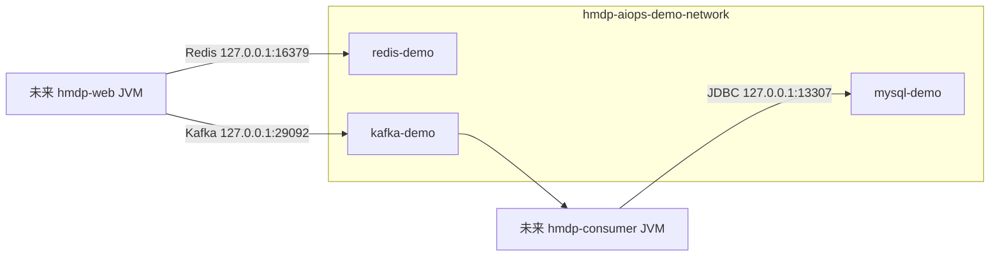

# Phase E1：AIOps MySQL Demo 隔离环境

> 状态：隔离环境已于 2026-09-23 在本地 Windows + Docker Desktop 完成静态校验、实际启动、健康检查、幂等重启和停止验证。本阶段没有启动业务 JVM、没有发送订单、没有注入 MySQL 故障，也没有修改业务代码、表结构、Agent、Detector 或 Console。

## 1. 原 Docker 环境盘点

根 `docker-compose.yml` 的 project name 是 `hmdp-local`，通过 `include` 合并 Kafka、Elasticsearch/Kibana 和 Canal 三个子 Compose，并在根文件定义 MySQL、Redis。所有对外端口均为本机开发用途。

| 来源 | 服务 | 容器名 | 宿主端口 | 持久化卷 | 网络 |
| --- | --- | --- | --- | --- | --- |
| 根 Compose | `mysql` | `hmdp-mysql` | `127.0.0.1:3307 → 3306` | `hmdp-mysql-data` | 隐式 `hmdp-local_default` |
| 根 Compose | `redis` | `hmdp-redis` | `127.0.0.1:6379 → 6379` | `hmdp-redis-data` | 隐式 `hmdp-local_default` |
| `docker/kafka/docker-compose-kafka.yml` | `kafka` | `hmdp-kafka` | `9092 → 9092` | `hmdp-kafka-data` | 隐式 `hmdp-local_default`；Docker 内 listener 为 `19092` |
| `docker/elasticsearch/docker-compose-es.yml` | `elasticsearch` | `hmdp-elasticsearch` | `127.0.0.1:9200 → 9200` | `hmdp-elasticsearch-data` | `hmdp-es-network` |
| 同上 | `kibana` | `hmdp-kibana` | `127.0.0.1:5601 → 5601` | `hmdp-kibana-data` | `hmdp-es-network` |
| `docker/canal/docker-compose-canal.yml` | `canal-server` | `hmdp-canal` | `127.0.0.1:11111 → 11111` | `hmdp-canal-data`、`hmdp-canal-logs` | `hmdp-canal-network` |

原环境的风险点：

- 原卷使用显式全局名称；仅更换 Compose project name **不会**隔离 `hmdp-mysql-data` 等卷。
- 原服务使用固定全局 `container_name`，Demo 若复用服务定义会发生容器名冲突。
- 3307、6379、9092 已属于原环境；Demo 复用会端口冲突或让 JVM/Agent误连原实例。
- 原 Kafka advertised listener 指向 `localhost:9092`，复制后若只改 published port 而不改 advertised listener，客户端仍会被引导到原 Broker。
- 根 Compose 还包含 ES、Kibana、Canal；MySQL 演示不需要它们。复用根 Compose 会扩大启动、停止和故障影响范围。
- 根 MySQL 的初始化数据位于现有卷中；任何整库停止、清理或重建都可能影响此前 Kafka 演示数据。

## 2. Demo 隔离方案

新增的 `docker-compose.aiops-demo.yml` 是完整独立 Compose，不 include 原文件，只包含当前演示必需的 MySQL、Redis、Kafka。它采用固定 project `hmdp-aiops-demo`、独立容器名、独立 bridge 网络和独立命名卷；只把端口绑定到 `127.0.0.1`。



### Docker 资源清单

| 类型 | 名称 | 说明 |
| --- | --- | --- |
| Compose project | `hmdp-aiops-demo` | 启停脚本始终显式传入 |
| 容器 | `hmdp-aiops-demo-mysql` | 服务名 `mysql-demo`，MySQL 8.0.30 |
| 容器 | `hmdp-aiops-demo-redis` | 服务名 `redis-demo`，Redis 7 |
| 容器 | `hmdp-aiops-demo-kafka` | 服务名 `kafka-demo`，Kafka 3.9.2 KRaft |
| 网络 | `hmdp-aiops-demo-network` | 独立 bridge；不加入原 `hmdp-local_default` |
| 数据卷 | `hmdp-aiops-demo-mysql-data` | 唯一挂载到 `/var/lib/mysql`，不复用 `hmdp-mysql-data` |
| 数据卷 | `hmdp-aiops-demo-redis-data` | 挂载到 `/data` |
| 数据卷 | `hmdp-aiops-demo-kafka-data` | 挂载到 `/var/lib/kafka/data`，保存 Topic/offset |
| Kafka 运行卷 | `hmdp-aiops-demo-kafka-config` | 显式接管镜像 `/mnt/shared/config`，避免匿名卷 |
| Kafka 运行卷 | `hmdp-aiops-demo-kafka-secrets` | 显式接管镜像 `/etc/kafka/secrets`，避免匿名卷 |

| 依赖 | 默认宿主地址 | 原环境地址 | 结果 |
| --- | --- | --- | --- |
| MySQL Demo | `127.0.0.1:13307` | `127.0.0.1:3307` | 不冲突 |
| Redis Demo | `127.0.0.1:16379` | `127.0.0.1:6379` | 不冲突 |
| Kafka Demo | `127.0.0.1:29092` | `127.0.0.1:9092` | 不冲突 |

端口可在启动前通过 `AIOPS_DEMO_MYSQL_PORT`、`AIOPS_DEMO_REDIS_PORT`、`AIOPS_DEMO_KAFKA_PORT` 覆盖。Kafka 的 host advertised listener 使用同一个 `AIOPS_DEMO_KAFKA_PORT`，不会回落到原 9092。覆盖端口前仍须检查占用；Compose 绑定失败会让启动脚本失败，不会静默连接其他服务。

MySQL 使用项目现有 `hmdp.sql` **只读挂载**，仅在新 Demo 卷第一次创建时初始化原有表，不修改 SQL 或表结构。健康检查必须看到项目所需 10 张表。所有服务设置显式优雅停止窗口；停止后保留容器、卷、数据库和 Kafka 数据。

## 3. 独立 Kafka Topic 与 Consumer Group

启动脚本通过 Demo Broker 的 Docker 内地址 `kafka-demo:19092` 幂等创建三个单分区 Topic：

- `hmdp.aiops.mysql-demo.order.main.v1`
- `hmdp.aiops.mysql-demo.order.retry.v1`
- `hmdp.aiops.mysql-demo.order.dlt.v1`

后续双 JVM 演示固定使用主 Consumer Group `hmdp-aiops-mysql-demo-consumer-v1`，Retry/DLT Group 也必须使用带 `hmdp-aiops-mysql-demo-` 前缀的专用名称。Kafka Group 不是 Compose 静态资源；只有 Consumer JVM 实际加入后才会出现在 Broker 中。因此 E1 验收的是 Topic 已存在、Group 名已保留且不与原 Group 重名，**不是** Consumer 已启动或 Group 已消费。

未来 JVM/Agent 连接参数应保持一致：

```powershell
# 两个 JVM
--spring.kafka.bootstrap-servers=127.0.0.1:29092
--hmdp.kafka.topics.voucher-order=hmdp.aiops.mysql-demo.order.main.v1
--hmdp.kafka.topics.voucher-order-retry=hmdp.aiops.mysql-demo.order.retry.v1
--hmdp.kafka.topics.voucher-order-dlt=hmdp.aiops.mysql-demo.order.dlt.v1
--spring.kafka.consumer.group-id=hmdp-aiops-mysql-demo-consumer-v1

# Consumer JDBC / Web Redis（后续阶段启动时使用）
--spring.datasource.url=jdbc:mysql://127.0.0.1:13307/hmdp?useSSL=false&serverTimezone=UTC&allowPublicKeyRetrieval=true
--spring.redis.port=16379

# Agent
$env:KAFKA_BOOTSTRAP_SERVERS = '127.0.0.1:29092'
$env:KAFKA_VOUCHER_ORDER_TOPIC = 'hmdp.aiops.mysql-demo.order.main.v1'
$env:KAFKA_CONSUMER_GROUP = 'hmdp-aiops-mysql-demo-consumer-v1'
```

这些是下一阶段运行参数。本阶段没有启动 Web/Consumer/Agent，也没有改应用配置。

## 4. 启停脚本与安全边界

从仓库根目录启动：

```powershell
.\scripts\aiops-demo\start-demo.ps1
```

脚本只引用 `docker-compose.aiops-demo.yml` 和 project `hmdp-aiops-demo`，先执行 `docker compose config --quiet`，再 `up --detach --wait`，等待三个服务健康后幂等创建专用 Topic。任一步失败都会返回错误，不会转而操作根 Compose。

停止：

```powershell
.\scripts\aiops-demo\stop-demo.ps1
```

停止脚本只执行该 Demo project 的 `stop`，不执行资源销毁命令，不删除容器、网络、Topic 或任何卷。再次执行启动脚本会使用原 Demo 数据继续运行。脚本不包含故障注入、MySQL stop 单服务、SQL、Topic 删除、offset 重置或 Agent 调用。

## 5. 隔离验收结果

2026-09-23 实际验证如下：

1. `docker compose ... config` 成功，展开结果只有三个 Demo 服务、一个 Demo 网络和五个显式 Demo 卷；没有 `hmdp-mysql-data`、`hmdp-redis-data` 或 `hmdp-kafka-data` 引用。
2. 启动脚本成功；MySQL、Redis、Kafka 均进入 `healthy`。MySQL 初始化表数为 10，Redis 返回 `PONG`，Kafka 三个专用 Topic 均存在，主 Topic为 1 分区、1 副本、ISR 为 1。
3. 实际容器标签均为 `com.docker.compose.project=hmdp-aiops-demo`，均只连接 `hmdp-aiops-demo-network`。MySQL、Redis、Kafka 数据目录分别挂载对应 Demo 数据卷；最终 Kafka 容器的三个 volume mount 均为显式 `hmdp-aiops-demo-*` 名称。
4. 实际端口为 `127.0.0.1:13307`、`127.0.0.1:16379`、`127.0.0.1:29092`，与原 3307/6379/9092 不冲突。未暴露到非 loopback 地址。
5. 启动脚本重复执行成功，专用 Topic 保留且不会重复创建；证明启动过程幂等、Kafka 数据卷可恢复。
6. 停止脚本成功：MySQL 和 Redis 退出码为 0，Kafka 收到正常终止信号后为 143；三个容器保持 `Exited`，五个 Demo 卷和 Demo 网络全部保留。
7. 原 `hmdp-local` 六个容器在验收前已停止；验收后其退出时间仍为 16–23 小时前，未被启动、重建或停止。原核心卷创建时间保持不变：`hmdp-mysql-data` 为 2026-09-10、`hmdp-redis-data` 为 2026-09-10、`hmdp-kafka-data` 为 2026-09-07。

最终状态是：**Demo 依赖已停止但资源完整保留**。下一阶段可直接运行启动脚本恢复环境。本阶段没有故障注入，也没有验证 HTTP → Kafka → Consumer → MySQL 业务链路；该验证属于后续 E2/E3。

### 约束

- 禁止把该环境连接到生产或共享数据库。
- 禁止删除 Demo 或原环境的数据卷；停止只使用提供的停止脚本。
- 禁止删除 Topic、重置 offset、清空表或清理测试订单。
- 禁止将未来的故障开关注册为 MCP Tool 或自动 Action。
- 在开始真实故障演示前，必须再次核对容器名、卷名、端口、JDBC URL、Topic 和 Group 全部带 Demo 隔离语义。
