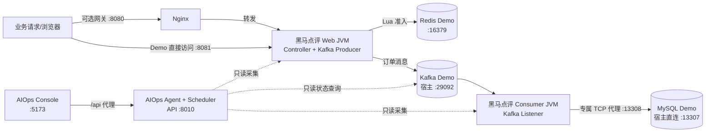

# AIOps 手动演示指南

> 适用对象：本地开发者、项目验收人员和面试演示者。本文以 Windows PowerShell、仓库根目录 `E:\work\code\java\hm-dianping-total` 和隔离的 `hmdp-aiops-demo` 环境为基准。
>
> 安全边界：所有故障操作只能用于本机隔离 Demo 环境。脚本不会自动修复业务、删除 Docker Volume 或修改数据库结构；不要把这些命令指向生产或共享环境。

## 0. 演示前准备

需要预先安装并可从 PowerShell 调用：

- Docker Desktop，并确保 `docker compose version` 可用；
- JDK 8 与 Maven；
- Python 3.11 或更高版本；
- Node.js 18 或更高版本及 npm；
- 可选：LLM 的 OpenAI-compatible API 凭据。没有凭据时可使用 `mock` Provider 验证完整工程链路。

后文所有命令默认从仓库根目录执行：

```powershell
Set-Location 'E:\work\code\java\hm-dianping-total'
```

建议为 Web、Consumer、Agent API、Monitoring Scheduler、Console 分别打开一个 PowerShell 窗口。不要关闭仍需运行的窗口。

## 1. 系统整体结构



### 1.1 核心组件职责

| 组件 | 作用 | 是否承载业务请求 |
|---|---|---|
| 黑马点评 Web | 暴露 HTTP 接口，执行秒杀 Redis Lua 准入并向 Kafka 发送订单消息；不启动 Kafka Listener | 是 |
| 黑马点评 Consumer | 监听 Kafka、执行订单消费并写入 MySQL；不暴露业务 Controller | 否 |
| Kafka Demo | 保存订单消息、Consumer Group offset 和 lag | 否 |
| Redis Demo | 保存登录验证码、秒杀库存和准入状态 | 否 |
| MySQL Demo | 保存黑马点评测试数据和最终订单 | 否 |
| AIOps Agent | 只读调用 MCP 工具，管理 Monitoring、Detection、Incident、Diagnosis、Trace 和 Governance | 否 |
| AIOps Console | 展示健康状态、Incident、Skill、工具调用、Evidence、Hypothesis、Report、Proposal 和 Replay | 否 |

### 1.2 主要端口

| 端口 | 服务 | 说明 |
|---:|---|---|
| `8080` | Nginx | 原黑马点评网关入口，可选；隔离 Demo Compose 不负责启动它。打不开时可直接使用 `8081` 验证业务。
| `8081` | hmdp-web | 秒杀 HTTP 入口和业务 API。Demo 订单脚本固定调用本机 `8081`。
| `8010` | AIOps Agent | FastAPI 只读 API，例如 `/health`、`/api/incidents`、`/api/monitoring/summary`。
| `5173` | AIOps Console | Vue 3/Vite 开发服务器；开发代理把 `/api` 转发到 `127.0.0.1:8010`。

排障时还会用到以下内部端口：

| 端口 | 用途 |
|---:|---|
| `29092` | Kafka 对宿主机的地址；Java 和 Agent 均应使用 `127.0.0.1:29092` |
| `16379` | Redis Demo 对宿主机端口 |
| `13307` | Web 直连 MySQL Demo 的端口 |
| `13308` | Consumer 专属 MySQL TCP 代理；MySQL 故障演示只停止此代理 |
| `18081` | Web JVM 只读业务指标出口 |
| `18082` | Consumer JVM 只读 MySQL Health 出口 |
| `18083` | Consumer JVM 只读业务指标出口 |

## 2. 手动启动顺序

启动顺序固定为：Docker 依赖 → Java Web → Java Consumer → Agent API 与 Scheduler → Console。Web 可以先于 Consumer 启动，但在 Consumer 入组前不要发送演示订单。

### 2.1 第一步：启动 Docker 依赖

在终端 1 执行：

```powershell
& .\scripts\aiops-demo\start-demo.ps1
```

该脚本只操作 Compose Project `hmdp-aiops-demo`，启动：

- `hmdp-aiops-demo-mysql`；
- `hmdp-aiops-demo-mysql-consumer-proxy`；
- `hmdp-aiops-demo-redis`；
- `hmdp-aiops-demo-kafka`；
- 三个隔离 Topic：main、retry、DLT。

预期输出：四个服务均为 `running`，带健康检查的服务为 `healthy`，最后显示：

```text
AIOps demo dependencies are ready.
MySQL direct (Web):       127.0.0.1:13307
MySQL Consumer proxy:     127.0.0.1:13308
Redis:                    127.0.0.1:16379
Kafka:                    127.0.0.1:29092
Consumer group:           hmdp-aiops-mysql-demo-consumer-v1
```

再次确认：

```powershell
docker compose --project-name hmdp-aiops-demo `
  --file .\docker-compose.aiops-demo.yml ps
```

失败排查：

- Docker 命令不可用：启动 Docker Desktop，等待引擎完全就绪；
- `13307`、`13308`、`16379` 或 `29092` 被占用：执行 `Get-NetTCPConnection -State Listen` 查找占用进程，不要随意停止不属于 Demo 的服务；
- MySQL 长时间不健康：查看 `docker logs hmdp-aiops-demo-mysql --tail 100`；首次初始化会比后续启动慢；
- Kafka 不健康：查看 `docker logs hmdp-aiops-demo-kafka --tail 100`，并确认没有用旧容器占用 `29092`；
- 不要执行 `docker compose down -v`，它会删除隔离 Demo 数据卷。

### 2.2 第二步：构建并启动 Java Web

首次运行或 Java 代码变化后先构建：

```powershell
mvn.cmd test
mvn.cmd -DskipTests package
```

在终端 2 启动 Web：

```powershell
java -jar .\target\hm-dianping-0.0.1-SNAPSHOT.jar `
  --spring.profiles.active=web,web-aiops-demo
```

预期输出：

- Spring Boot 启动成功并监听 `8081`；
- 应用名为 `hmdp-web-aiops-demo`；
- Kafka Producer 可连接 `127.0.0.1:29092`；
- 不出现 Kafka Consumer Listener 入组日志；
- `18081` 的业务指标出口可访问。

只读验证：

```powershell
Invoke-RestMethod -Uri 'http://127.0.0.1:8081/shop-type/list'
Invoke-RestMethod -Uri 'http://127.0.0.1:18081/internal/aiops/business-metrics/web' |
  ConvertTo-Json -Depth 8
```

失败排查：

- `8081` 被占用：`Get-NetTCPConnection -LocalPort 8081 -State Listen`；
- Redis 连接失败：确认 Profile 中使用 `127.0.0.1:16379`，并执行 `docker exec hmdp-aiops-demo-redis redis-cli ping`；
- Kafka 连接失败：确认启动日志使用 `127.0.0.1:29092`，不是容器内部地址 `kafka-demo:19092`；
- 数据库失败：Web 应直连 `127.0.0.1:13307`，不应连接 Consumer 专属代理 `13308`；
- Jar 不存在：重新运行 Maven package，并确认 `target/hm-dianping-0.0.1-SNAPSHOT.jar` 已生成。

### 2.3 第三步：启动 Java Consumer

在终端 3 执行：

```powershell
java --add-opens=java.base/java.lang.invoke=ALL-UNNAMED `
  -jar .\target\hm-dianping-0.0.1-SNAPSHOT.jar `
  --spring.profiles.active=consumer,consumer-aiops-demo
```

`--add-opens` 用于当前 JDK/MyBatis-Plus 的反射兼容，不要省略。

预期输出：

- 应用名为 `hmdp-consumer-aiops-demo`；
- 不启动业务 Web Server/Controller；
- Consumer Group `hmdp-aiops-mysql-demo-consumer-v1` 成功入组；
- 主 Topic 为 `hmdp.aiops.mysql-demo.order.main.v1`；
- `18082` MySQL Health 和 `18083` Consumer 业务指标出口可访问。

只读验证：

```powershell
Invoke-RestMethod -Uri 'http://127.0.0.1:18082/internal/aiops/mysql-health' |
  ConvertTo-Json -Depth 8

Invoke-RestMethod -Uri 'http://127.0.0.1:18083/internal/aiops/business-metrics/consumer' |
  ConvertTo-Json -Depth 8
```

正常 MySQL Health 的关键语义是 `database_reachable=true`、`connection_test_status=valid`、`health_state=HEALTHY`。某些累计指标不可用时可能为 `null`；不要把“未采集”当成数值 `0`。

失败排查：

- Consumer 无法连接 MySQL：确认 `hmdp-aiops-demo-mysql-consumer-proxy` 正在运行，且 JDBC 地址为 `127.0.0.1:13308`；
- Group 没有成员：检查 Consumer 日志中的 Topic、Group、反序列化或认证错误；
- 出现反射访问错误：确认启动命令包含 `--add-opens=java.base/java.lang.invoke=ALL-UNNAMED`；
- `18082` 或 `18083` 被占用：用 `Get-NetTCPConnection -LocalPort 18082,18083 -State Listen` 定位占用者。

### 2.4 第四步：启动 AIOps Agent 和 Monitoring Scheduler

首次使用时安装 Python 环境：

```powershell
python -m venv .\aiops-agent\.venv
.\aiops-agent\.venv\Scripts\python.exe -m pip install -r .\aiops-agent\requirements.txt
```

复制配置模板：

```powershell
Copy-Item .\aiops-agent\.env.example .\aiops-agent\.env -ErrorAction SilentlyContinue
```

在 `aiops-agent/.env` 中至少确认以下 Demo 配置：

```dotenv
AIOPS_HOST=127.0.0.1
AIOPS_PORT=8010
AIOPS_DATABASE_PATH=./data/aiops.db
AIOPS_REPLAY_DIRECTORY=./data/console-replays
HMDP_PROJECT_ROOT=..

KAFKA_BOOTSTRAP_SERVERS=127.0.0.1:29092
KAFKA_VOUCHER_ORDER_TOPIC=hmdp.aiops.mysql-demo.order.main.v1
KAFKA_CONSUMER_GROUP=hmdp-aiops-mysql-demo-consumer-v1
AIOPS_KAFKA_LAG_THRESHOLD=1

AIOPS_MYSQL_HEALTH_PORT=18082
AIOPS_BUSINESS_METRICS_WEB_PORT=18081
AIOPS_BUSINESS_METRICS_CONSUMER_PORT=18083
```

LLM 配置也写在 `aiops-agent/.env`。无外网或无 Key 时使用：

```dotenv
AI_MODEL_PROVIDER=mock
AI_MODEL_THINKING=disabled
```

使用真实 OpenAI-compatible Provider 时填写 `AI_MODEL_BASE_URL`、`AI_MODEL_API_KEY`、`AI_MODEL_NAME`，不要把真实 Key 提交到 Git 或写入本文档。Planner、Reflection、Reporter 可分别设置超时；超时会保留已有 Evidence 并形成结构化的 partial diagnosis，而不是让 API 返回未处理的 500。

先导入只读 Replay 数据：

```powershell
Set-Location .\aiops-agent
.\.venv\Scripts\python.exe -m evaluation.replay_catalog
Set-Location ..
```

在终端 4 启动 Agent API：

```powershell
Set-Location .\aiops-agent
.\.venv\Scripts\python.exe -m uvicorn api.main:app --host 127.0.0.1 --port 8010
```

预期输出包含 `Uvicorn running on http://127.0.0.1:8010`。验证：

```powershell
Invoke-RestMethod -Uri 'http://127.0.0.1:8010/health'
Invoke-RestMethod -Uri 'http://127.0.0.1:8010/api/monitoring/summary' |
  ConvertTo-Json -Depth 8
```

在终端 5 启动 Monitoring Scheduler：

```powershell
Set-Location .\aiops-agent
.\.venv\Scripts\python.exe -m monitoring.scheduler
```

API 与 Scheduler 是两个进程。只启动 API 可以打开 Console，但不会持续采集、检测并自动创建 Incident。

失败排查：

- ModuleNotFound：确认当前目录是 `aiops-agent`，并使用它自己的 `.venv`；
- `8010` 被占用：`Get-NetTCPConnection -LocalPort 8010 -State Listen`；
- Kafka Observation 为 error：检查 `.env` 是否仍是默认的 `9092`，Demo 必须为 `29092`；
- Scheduler 没有采集：确认它与 API 使用同一份 `.env` 和同一个 `AIOPS_DATABASE_PATH`；
- LLM 鉴权或超时：先切换 `AI_MODEL_PROVIDER=mock` 区分本地链路问题和模型网络问题。

### 2.5 第五步：启动 AIOps Console

在终端 6 执行：

```powershell
Set-Location .\aiops-console
npm.cmd install
npm.cmd run dev
```

`aiops-console/.env.example` 的默认配置是：

```dotenv
VITE_AIOPS_API_BASE_URL=/api
```

Vite 会将 `/api` 代理到 `http://127.0.0.1:8010`。预期输出显示：

```text
Local: http://127.0.0.1:5173/
```

打开 [http://127.0.0.1:5173](http://127.0.0.1:5173)。Dashboard 每 5 秒刷新，Incident 详情每 3 秒刷新；页面应显示“实时监控中”和最后更新时间。

失败排查：

- 依赖安装失败：确认 Node/npm 版本和网络，删除依赖前先确认目录仅为 `aiops-console/node_modules`；
- 5173 被占用：`Get-NetTCPConnection -LocalPort 5173 -State Listen`；
- 页面显示“Agent Offline”：先直接访问 `http://127.0.0.1:8010/health`，再检查 Vite 终端的代理错误；
- 配置变更未生效：修改 `.env` 后需要重启 `npm run dev`。

## 3. 正常状态验证

故障演示前必须建立健康基线，否则无法区分“注入导致的变化”和启动残留问题。

### 3.1 一次性健康检查

```powershell
& .\scripts\aiops-demo\runtime\demo-health-check.ps1
```

它会用中文检查 Docker、Spring Web、Consumer 内部出口、Agent、Console 和可选 Nginx。Nginx `8080` 未运行不影响隔离 Demo；核心必需项是 Docker、`8081`、`18081`、`18082`、`18083`、`8010`、`5173`。

### 3.2 发送一批正常订单

使用全新的本地测试手机号。脚本会走真实 HTTP 登录、Redis Lua、Kafka Producer、Kafka Topic、Consumer 和 MySQL，不绕过业务链路：

```powershell
$baseline = & .\scripts\aiops-demo\Invoke-SeckillDemoOrders.ps1 `
  -Infrastructure aiops-demo `
  -Phase manual_baseline `
  -Phones @('19920926001','19920926002') `
  -Stock 10 `
  -IUnderstandLocalTestData | ConvertFrom-Json

$baseline
$voucherId = [long]$baseline.voucher_id
```

预期：`attempted=2`、`accepted=2`，并返回两个 `order_ids`。手机号和同一 Voucher 的“一人一单”约束会保留；重复演示时请更换手机号。

### 3.3 确认订单落库

等待数秒后执行只读 SQL：

```powershell
docker exec hmdp-aiops-demo-mysql mysql -uroot -p123456 hmdp `
  -e "SELECT id,user_id,voucher_id,create_time FROM tb_voucher_order ORDER BY create_time DESC LIMIT 10;"
```

预期：可看到刚才返回的订单 ID。若通过环境变量修改过 Demo 密码，应使用实际密码。

### 3.4 确认 Kafka 正常

查看 Group 状态：

```powershell
docker compose --project-name hmdp-aiops-demo `
  --file .\docker-compose.aiops-demo.yml exec --no-TTY kafka-demo `
  /opt/kafka/bin/kafka-consumer-groups.sh `
  --bootstrap-server kafka-demo:19092 `
  --describe --group hmdp-aiops-mysql-demo-consumer-v1 --state
```

再查看 offset 和 lag：

```powershell
docker compose --project-name hmdp-aiops-demo `
  --file .\docker-compose.aiops-demo.yml exec --no-TTY kafka-demo `
  /opt/kafka/bin/kafka-consumer-groups.sh `
  --bootstrap-server kafka-demo:19092 `
  --describe --group hmdp-aiops-mysql-demo-consumer-v1
```

预期：Group 有 1 个活动成员，主 Topic 的 `LAG` 为 `0`。容器内 CLI 使用 `kafka-demo:19092`；宿主机上的 Java/Agent 使用 `127.0.0.1:29092`，二者不要混用。

### 3.5 确认 MySQL 和业务指标正常

```powershell
Invoke-RestMethod -Uri 'http://127.0.0.1:18082/internal/aiops/mysql-health' |
  ConvertTo-Json -Depth 8

Invoke-RestMethod -Uri 'http://127.0.0.1:18081/internal/aiops/business-metrics/web' |
  ConvertTo-Json -Depth 8

Invoke-RestMethod -Uri 'http://127.0.0.1:18083/internal/aiops/business-metrics/consumer' |
  ConvertTo-Json -Depth 8
```

预期：

- MySQL 为 `HEALTHY`；
- Web 的请求、Lua 准入和 Kafka 发送计数随订单增长；
- Consumer 的订单创建成功计数随之增长，失败计数不增长。

### 3.6 确认 Console Healthy

打开 Dashboard：

- 顶部状态为“健康 Healthy”；
- Active Incident 数量为 `0`；
- 最近巡检时间持续更新；
- 已导入的 Replay 项可以列出，但 `replay_only=true` 的历史记录不会计入 Active Incident。

诊断完成不等于故障恢复。真实故障存在时，即使 `diagnosis_status=COMPLETED`，Incident 仍应保持 `ACTIVE`，Dashboard 不能显示 Healthy。

## 4. Kafka Consumer Down 故障演示

### 4.1 注入前检查

确认：

1. Consumer Group 有 1 个成员且 lag 为 0；
2. 已成功发送至少一批基线订单并建立 committed offset；
3. Agent API 和 Scheduler 都在运行；
4. `.env` 中 `AIOPS_KAFKA_LAG_THRESHOLD=1`；
5. 不存在未恢复的 MySQL 故障。

### 4.2 停止 Consumer

切换到运行 Consumer 的终端 3，按 `Ctrl+C`，等待 JVM 退出。不要停止 Web、Kafka 或 Agent。

记录故障开始时间：

```powershell
$kafkaFaultStartedAt = Get-Date
$kafkaFaultStartedAt.ToString('o')
```

检查 Group：

```powershell
docker compose --project-name hmdp-aiops-demo `
  --file .\docker-compose.aiops-demo.yml exec --no-TTY kafka-demo `
  /opt/kafka/bin/kafka-consumer-groups.sh `
  --bootstrap-server kafka-demo:19092 `
  --describe --group hmdp-aiops-mysql-demo-consumer-v1 --state
```

预期：Group 的活动成员数降为 `0`，或状态显示为空组。

### 4.3 Consumer 停止后继续发送订单

使用基线创建的 `$voucherId` 和新的手机号：

```powershell
$kafkaFaultOrders = & .\scripts\aiops-demo\Invoke-SeckillDemoOrders.ps1 `
  -Infrastructure aiops-demo `
  -Phase kafka_consumer_down `
  -VoucherId $voucherId `
  -Phones @('19920926003','19920926004','19920926005') `
  -IUnderstandLocalTestData | ConvertFrom-Json

$kafkaFaultOrders
```

预期：HTTP 请求仍被 Web 接受并返回订单 ID；消息进入 Kafka，但 Consumer 不会创建对应 MySQL 订单。

### 4.4 观察 Kafka lag

```powershell
docker compose --project-name hmdp-aiops-demo `
  --file .\docker-compose.aiops-demo.yml exec --no-TTY kafka-demo `
  /opt/kafka/bin/kafka-consumer-groups.sh `
  --bootstrap-server kafka-demo:19092 `
  --describe --group hmdp-aiops-mysql-demo-consumer-v1
```

预期：main Topic 的 `LOG-END-OFFSET` 增长、`CURRENT-OFFSET` 不变、`LAG > 1`。若显示 `-` 或没有 offset，说明健康基线未建立，先恢复 Consumer 并成功消费一次后再重试。

### 4.5 等待自动 Incident

Scheduler 默认按周期采集，Kafka 规则需要连续健康格式的异常 Observation，通常等待约 60～90 秒。不要手工调用 `POST /incidents`，否则不能证明 Monitoring → Detection → Incident 自动链路。

可同时观察：

```powershell
Invoke-RestMethod -Uri 'http://127.0.0.1:8010/api/monitoring/summary' |
  ConvertTo-Json -Depth 8

Invoke-RestMethod -Uri 'http://127.0.0.1:8010/api/incidents' |
  ConvertTo-Json -Depth 12
```

Console 预期展示：

- 新 Incident 的故障状态为“进行中 ACTIVE”；
- 诊断状态从 `PENDING` → `RUNNING` → `COMPLETED`；
- 选择 Kafka Consumer Diagnosis Skill；
- 工具调用包含 Kafka 状态，必要时包含日志/业务指标；
- Evidence 显示 `member_count=0` 和增长的 lag；
- Kafka Consumer Failure Hypothesis 得到支持；
- Report 给出证据化结论；
- Action Proposal 只展示，不执行任何重启。

### 4.6 恢复 Consumer

在新的 Consumer 终端重新运行：

```powershell
java --add-opens=java.base/java.lang.invoke=ALL-UNNAMED `
  -jar .\target\hm-dianping-0.0.1-SNAPSHOT.jar `
  --spring.profiles.active=consumer,consumer-aiops-demo
```

观察 Group 恢复为 1 个成员，lag 最终回到 0。再等待连续健康窗口，Incident 才从 `ACTIVE` 变为 `RECOVERED`。诊断完成本身不会触发恢复。

恢复后重新查询订单表，确认积压订单被消费。若进入 Retry/DLT，应保留记录并按只读方式分析；本项目不会自动重放或修复。

## 5. MySQL Consumer 专属故障演示

该场景只切断 Consumer → MySQL 的 TCP 代理。Web 仍直连 Demo MySQL，因此登录、测试券创建和 Kafka Producer 路径保持可用；真实 MySQL 容器、Volume 和数据均不会被删除。

### 5.1 注入前检查

确保 Kafka 故障已经恢复：

- Consumer Group 成员数为 1；
- lag 为 0；
- MySQL Health 为 `HEALTHY`；
- 业务指标出口均可访问；
- Agent API 与 Scheduler 正常运行。

建议先记录 before 值：

```powershell
$beforeWeb = Invoke-RestMethod -Uri 'http://127.0.0.1:18081/internal/aiops/business-metrics/web'
$beforeConsumer = Invoke-RestMethod -Uri 'http://127.0.0.1:18083/internal/aiops/business-metrics/consumer'
$beforeMySql = Invoke-RestMethod -Uri 'http://127.0.0.1:18082/internal/aiops/mysql-health'

$beforeWeb | ConvertTo-Json -Depth 8
$beforeConsumer | ConvertTo-Json -Depth 8
$beforeMySql | ConvertTo-Json -Depth 8
```

### 5.2 注入 Consumer MySQL 路径故障

```powershell
& .\scripts\aiops-demo\inject-consumer-mysql-fault.ps1
```

预期输出：

```text
Consumer-only MySQL path fault is active.
Demo MySQL remains running and healthy; no volume or data was changed.
```

安全核对：

```powershell
docker compose --project-name hmdp-aiops-demo `
  --file .\docker-compose.aiops-demo.yml ps --all mysql-demo mysql-consumer-proxy
```

预期：`mysql-demo` 仍为 healthy，`mysql-consumer-proxy` 已停止。

### 5.3 继续通过 HTTP 发送订单

使用新的手机号：

```powershell
$mysqlFaultOrders = & .\scripts\aiops-demo\Invoke-SeckillDemoOrders.ps1 `
  -Infrastructure aiops-demo `
  -Phase mysql_persistence_timeout `
  -VoucherId $voucherId `
  -Phones @('19920926006','19920926007') `
  -IUnderstandLocalTestData | ConvertFrom-Json

$mysqlFaultOrders
```

预期：Web 端 HTTP/Lua/Kafka 发送仍成功；Consumer 仍在 Kafka Group 中，但订单持久化失败或进入重试路径。

### 5.4 观察三类证据

业务指标：

```powershell
Invoke-RestMethod -Uri 'http://127.0.0.1:18081/internal/aiops/business-metrics/web' |
  ConvertTo-Json -Depth 8
Invoke-RestMethod -Uri 'http://127.0.0.1:18083/internal/aiops/business-metrics/consumer' |
  ConvertTo-Json -Depth 8
```

应观察到请求、Lua 准入、Kafka 发送增加，而订单创建成功没有等量增加，或失败计数增加。

Kafka 状态：

```powershell
docker compose --project-name hmdp-aiops-demo `
  --file .\docker-compose.aiops-demo.yml exec --no-TTY kafka-demo `
  /opt/kafka/bin/kafka-consumer-groups.sh `
  --bootstrap-server kafka-demo:19092 `
  --describe --group hmdp-aiops-mysql-demo-consumer-v1 --state
```

应保持活动成员，Kafka 并非 Consumer Down；lag 可能为 0 或仅短暂波动。这是反驳 Kafka 根因的重要 Evidence。

MySQL Health：

```powershell
Invoke-RestMethod -Uri 'http://127.0.0.1:18082/internal/aiops/mysql-health' |
  ConvertTo-Json -Depth 8
```

真实超时场景的预期语义为：

```json
{
  "database_reachable": null,
  "connection_test_status": "timeout",
  "health_state": "DEGRADED",
  "failure_class": ["CONNECTION_TIMEOUT"]
}
```

具体池指标或累计错误数若无法可信采集，应为 `null`/`unavailable`，不能伪造为 0。

### 5.5 在 Console 观察诊断收敛

复合 Detection 需要 Business Metrics、Kafka、MySQL 三源 Observation。等待采集窗口后，预期看到：

1. Business Metrics Evidence：准入和发送正常、订单落库异常；
2. 初始 H1：Kafka Consumer Failure；
3. Kafka Evidence：Group 有成员，反驳 H1，H1 变为 `CONTRADICTED`；
4. MySQL Evidence：`CONNECTION_TIMEOUT`，支持 H2；
5. H2 MySQL Persistence Failure 变为 `SUPPORTED`；
6. Report 引用实际 Evidence ID，说明“Kafka 正常但 Consumer 数据库路径退化”；
7. Proposal 仅供审批展示，不执行动作。

如果 Business Metrics 缺失、任何 Observation 为 error，或三源时间窗口无法关联，Detector 应返回 insufficient，而不是猜测 MySQL 根因。

### 5.6 恢复 MySQL 路径

```powershell
& .\scripts\aiops-demo\restore-consumer-mysql-path.ps1
```

验证代理和健康出口：

```powershell
docker compose --project-name hmdp-aiops-demo `
  --file .\docker-compose.aiops-demo.yml ps mysql-demo mysql-consumer-proxy

Invoke-RestMethod -Uri 'http://127.0.0.1:18082/internal/aiops/mysql-health' |
  ConvertTo-Json -Depth 8
```

预期代理恢复、MySQL 回到 `HEALTHY`。使用新的手机号再发送一笔订单并确认成功落库。连续健康窗口确认后，Incident 才进入 `RECOVERED`。

恢复脚本只恢复网络路径，不执行数据修复、删除或自动重放。故障期间消息的 Retry/DLT 状态应单独核对。

## 6. Replay 演示

Replay 用于在没有 Docker、Java 或真实 LLM 的情况下稳定展示已经记录的真实事故轨迹。它只读取保存的投影，不重新调用 Agent、LLM、MCP，也不会创建或修复 Incident。

### 6.1 导入 Replay

```powershell
Set-Location .\aiops-agent
.\.venv\Scripts\python.exe -m evaluation.replay_catalog
Set-Location ..
```

确认 `aiops-agent/.env` 包含：

```dotenv
AIOPS_REPLAY_DIRECTORY=./data/console-replays
```

重启 Agent API 后打开 Console。Dashboard 应列出：

- `Kafka 消费者停机 · 真实记录`；
- `MySQL 持久化失败 · 真实记录`。

### 6.2 回放步骤

1. 从 Dashboard 点击一个“已记录 RECORDED”的 Incident；
2. 点击“轨迹回放”；
3. 使用“播放”“暂停”“上一步”“下一步”；
4. 依次讲解 Skill 选择、Tool Call、Evidence、Hypothesis 置信度变化、Reflection、Report 和只读 Proposal；
5. MySQL Replay 重点展示 Kafka Hypothesis 被反证、MySQL Hypothesis 得到支持。

Replay Incident 不计入实时 Active Incident，也不会改变 Dashboard 的 Healthy 判断。演示时要明确说它是“真实 Observation 的只读录像”，不是当前正在发生的故障。

## 7. 常见问题

### 7.1 `http://127.0.0.1:8080` 打不开

`8080` 是可选 Nginx 网关，隔离 Demo Compose 和手动流程都不会自动启动它。先直接验证：

```powershell
Invoke-RestMethod -Uri 'http://127.0.0.1:8081/shop-type/list'
```

若 `8081` 正常，则业务 Web 已就绪，AIOps 演示可继续。确需展示 Nginx 时，再单独启动原项目 Nginx，并核对其 upstream 指向 `8081`：

```powershell
Get-NetTCPConnection -LocalPort 8080 -State Listen -ErrorAction SilentlyContinue
```

不要为了让 `8080` 可用而修改隔离 Demo Compose。

### 7.2 `http://127.0.0.1:5173` 打不开

检查 Console 终端是否仍在运行：

```powershell
Set-Location .\aiops-console
npm.cmd install
npm.cmd run dev
```

再检查端口：

```powershell
Get-NetTCPConnection -LocalPort 5173 -State Listen -ErrorAction SilentlyContinue
```

若页面能打开但显示“Agent Offline”，问题通常在 `8010` 或 Vite API 代理，不是 Vue 页面崩溃。

### 7.3 `http://127.0.0.1:8010` 打不开

在 `aiops-agent` 目录重新启动：

```powershell
Set-Location .\aiops-agent
.\.venv\Scripts\python.exe -m uvicorn api.main:app --host 127.0.0.1 --port 8010
```

检查：

```powershell
Invoke-RestMethod -Uri 'http://127.0.0.1:8010/health'
Get-NetTCPConnection -LocalPort 8010 -State Listen -ErrorAction SilentlyContinue
```

重点核对 Python 版本、虚拟环境依赖、`.env` 格式和 SQLite 路径权限。API 正常但没有自动 Incident 时，确认 `python -m monitoring.scheduler` 也在运行。

### 7.4 Kafka 连接失败

先区分宿主地址与容器地址：

- Java Web、Java Consumer、Agent：`127.0.0.1:29092`；
- Kafka 容器内 CLI：`kafka-demo:19092`。

检查：

```powershell
docker compose --project-name hmdp-aiops-demo `
  --file .\docker-compose.aiops-demo.yml ps kafka-demo

docker logs hmdp-aiops-demo-kafka --tail 100

Select-String -Path .\aiops-agent\.env `
  -Pattern 'KAFKA_BOOTSTRAP_SERVERS|KAFKA_VOUCHER_ORDER_TOPIC|KAFKA_CONSUMER_GROUP'
```

Demo 应分别为 `127.0.0.1:29092`、`hmdp.aiops.mysql-demo.order.main.v1`、`hmdp-aiops-mysql-demo-consumer-v1`。地址、Topic 或 Group 任一漂移都会让 Agent 读取到错误状态。

### 7.5 LLM 超时或返回不完整

先查看 `aiops-agent/.env`：

```dotenv
AI_MODEL_THINKING=disabled
AI_MODEL_TIMEOUT_SECONDS=30
AI_MODEL_PLANNER_TIMEOUT_SECONDS=30
AI_MODEL_REFLECTION_TIMEOUT_SECONDS=30
AI_MODEL_REPORTER_TIMEOUT_SECONDS=30
```

处理顺序：

1. 检查 Base URL、模型名和 API Key 是否对应同一 Provider；
2. 从 Agent 日志区分连接超时、鉴权失败和 JSON Schema 校验失败；
3. 临时切换 `AI_MODEL_PROVIDER=mock`。若 mock 流程正常，说明 Monitoring/MCP/Runtime 本地链路正常，问题位于模型服务；
4. 真实 Provider 超时时，接口应返回结构化 partial diagnosis，已有 Evidence 和 Trace 应保留，Console 不应收到未处理的 HTTP 500；
5. 不要把 API Key 粘贴到截图、文档、终端录屏或 Git 提交中。

### 7.6 Console 一直 Healthy，但已经制造故障

依次确认：

1. Monitoring Scheduler 是否启动；
2. API 和 Scheduler 是否使用同一个 SQLite 文件；
3. Kafka 故障是否同时满足 `member_count=0` 与 `lag > 1`，且达到连续观察窗口；
4. MySQL 故障是否收集到 Business Metrics、Kafka、MySQL 三源 Observation；
5. Observation 是否为 `success/partial` 的可判定数据，而不是 `error/timeout`；
6. 当前查看的是实时 Incident，不是 `replay_only` 历史记录。

### 7.7 订单请求成功，但数据库没有订单

HTTP 返回的是准入/消息受理结果，不等于持久化已经完成。检查顺序：

1. Consumer Group 是否有成员；
2. main Topic lag 是否增长；
3. Consumer 日志是否出现数据库连接或事务错误；
4. `18082` MySQL Health 是否为 HEALTHY；
5. `mysql-consumer-proxy` 是否运行；
6. 是否因重复手机号和 Voucher 触发“一人一单”约束。

## 8. 演示结束与安全清理

先在各终端使用 `Ctrl+C` 停止 Console、Scheduler、Agent API、Consumer 和 Web，再停止 Demo Docker 服务：

```powershell
& .\scripts\aiops-demo\stop-demo.ps1
```

该脚本只停止 Demo 资源，不删除 Volume 和数据。不要使用 `down -v`。下次演示可再次运行 `start-demo.ps1`，并使用新的测试手机号；需要保留的 Incident/Replay 和 SQLite 文件不要手工删除。
