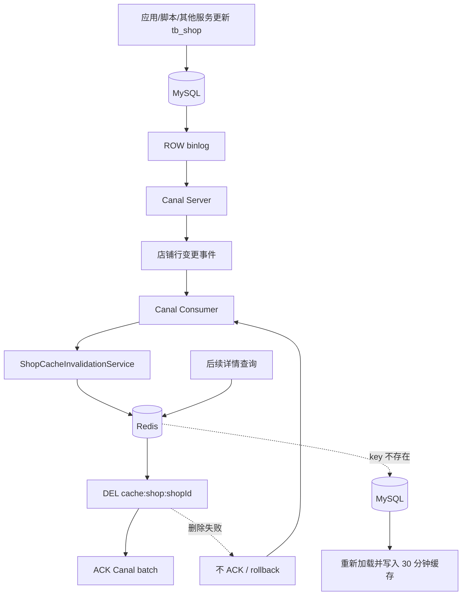

# Canal 店铺缓存一致性架构设计

## 1. 设计范围

本阶段只进行分析和设计，不修改 Java、配置、SQL、Lua，也不启动 Canal。

首期目标仅是监听 MySQL `tb_shop` 的行级变更，自动删除店铺详情缓存：

```text
cache:shop:{shopId}
```

以下内容不在首期范围：

- Redis GEO `shop:geo:{typeId}` 的重建。
- Elasticsearch `shop_index` 的增量同步。
- 其他表的缓存失效。
- Kafka、Redis Stream 或复杂消息平台接入。

后续可以让同一份标准化商户变更事件分别驱动详情缓存、Redis GEO 和 ES，但首期应保持消费者职责单一。

## 2. 当前缓存流程分析

### 2.1 ShopService 详情查询

`ShopServiceImpl.queryById(Long id)` 当前调用：

```java
cacheClient.queryWithPassThrough(
    CACHE_SHOP_KEY,
    id,
    Shop.class,
    this::getById,
    CACHE_SHOP_TTL,
    TimeUnit.MINUTES
)
```

实际链路：

```text
GET /shop/{id}
      ↓
ShopController.queryShopById
      ↓
ShopServiceImpl.queryById
      ↓
CacheClient.queryWithPassThrough
      ↓
GET cache:shop:{id}
  ├─ 有 JSON：反序列化并返回
  ├─ 值为空字符串：按不存在返回
  └─ key 不存在：查询 MySQL
                    ├─ 店铺存在：写正缓存 30 分钟
                    └─ 店铺不存在：写空字符串 2 分钟
```

### 2.2 Redis key 设计

| Key | 类型 | 当前用途 | 生命周期 | 读写位置 |
| --- | --- | --- | --- | --- |
| `cache:shop:{id}` | String JSON | 店铺详情正缓存 | 30 分钟 | `CacheClient.queryWithPassThrough` 读写；`ShopServiceImpl.update` 删除 |
| `cache:shop:{id}` | String 空字符串 | 防止不存在店铺反复穿透 MySQL | 2 分钟 | `CacheClient.queryWithPassThrough` 读写 |
| `lock:shop:{id}` | String | 互斥锁/逻辑过期重建锁 | 代码中固定 10 秒 | `CacheClient.queryWithMutex`、`queryWithLogicalExpire`；当前详情查询未启用 |
| `shop:geo:{typeId}` | GEO | 按类型附近店铺查询 | 当前无显式 TTL | `ShopServiceImpl.queryShopByType` 读取；不属于本次详情缓存失效范围 |

`RedisConstants.LOCK_SHOP_TTL=10` 已定义，但 `CacheClient.tryLock` 当前直接写死 10 秒，两者语义一致但常量没有被使用。

### 2.3 缓存空值

当 MySQL 查询不到店铺时，系统向同一个 `cache:shop:{id}` 写入空字符串并设置 2 分钟 TTL。

优点：避免恶意或重复查询不存在 ID 持续打到 MySQL。

一致性影响：如果空值写入后该 ID 对应的店铺被新增，旧空值在 TTL 到期前仍会让接口返回“店铺不存在”。Canal 监听 `INSERT` 并删除该 key，可以缩短这段不一致窗口。

### 2.4 缓存重建能力

`CacheClient` 已包含三类策略：

| 策略 | 当前是否启用 | 行为 |
| --- | --- | --- |
| 缓存穿透 `queryWithPassThrough` | 是 | key 未命中时同步查 MySQL，并写正缓存或空值。 |
| 互斥锁 `queryWithMutex` | 否 | key 未命中后竞争 `lock:shop:{id}`，获锁者查库并重建。 |
| 逻辑过期 `queryWithLogicalExpire` | 否 | 返回逻辑过期旧值，由获锁线程异步重建。 |

因此当前 Canal 只需执行缓存删除；删除后的第一次读请求仍由已启用的 pass-through 逻辑重新加载，无需 Canal 主动把完整 Shop 写进 Redis。

## 3. 当前缓存一致性问题

### 3.1 应用更新与旧缓存

当前 `ShopServiceImpl.update` 的流程：

```text
开启数据库事务
      ↓
updateById(shop)
      ↓
DEL cache:shop:{id}
      ↓
事务提交
```

正常情况下，删除缓存后下一次查询会读取新数据库值并回填。但是仍有以下窗口：

1. 数据库更新成功但 Redis 删除失败，旧值继续保留，最长可持续到 30 分钟 TTL 到期。
2. Redis 删除发生在事务提交前；并发读可能在这段时间查询到数据库旧值并重新写回缓存，事务随后提交，Redis 又变成旧数据。
3. 数据库事务最终回滚但缓存已经删除，虽然不会返回脏数据，但会造成无效失效和额外回源。
4. 运维 SQL、管理脚本或其他服务直接更新 `tb_shop` 时，不经过 `ShopServiceImpl.update`，缓存完全不会删除。

### 3.2 新增店铺与空值缓存

`ShopController.saveShop` 直接调用继承的 `shopService.save(shop)`，没有详情缓存处理。如果新店铺 ID 之前因查询写入过空值缓存，接口可能继续返回不存在，直到 2 分钟 TTL 到期。

### 3.3 删除与未来写入口

当前 Controller 没有删除店铺接口，但未来删除、批量任务或外部数据修正同样可能绕过本地缓存删除。将一致性完全绑定在某一个 Java 写方法上，无法覆盖所有数据变更来源。

### 3.4 产生原因

根本原因是 MySQL 与 Redis 是两个独立系统：

- MySQL 事务不能原子提交 Redis `DEL`。
- 当前删除动作依赖业务代码主动执行。
- Redis 删除失败没有持久化重试来源。
- 缓存重建与数据库事务并发执行时存在时序竞争。

## 4. 目标架构



简化流程：

```text
MySQL
  ↓
binlog
  ↓
Canal
  ↓
Cache Invalidator
  ↓
Redis 删除 cache:shop:{id}
  ↓
下一次读请求按现有逻辑重新加载
```

这是基于缓存失效的最终一致方案，不是 MySQL 与 Redis 的分布式强事务。正常延迟取决于事务提交、binlog 传输、Canal 消费和 Redis 删除耗时。

## 5. Canal 职责边界

### 5.1 Canal 负责

- 伪装为 MySQL replica，连接 MySQL 并订阅 binlog。
- 只接收已经写入 binlog 的提交变更。
- 按配置过滤目标库和 `tb_shop` 表。
- 解析 `INSERT`、`UPDATE`、`DELETE` 行变更。
- 将原始 Entry 提供给业务 Canal Consumer。
- 保存/管理消费位点，使连接恢复后可以继续拉取。

Canal 不应该理解 `cache:shop:` 这类业务 key，也不应该直接把数据库行写进 Redis。

### 5.2 业务应用负责

- 把 Canal Entry 转换为标准化商户变更事件。
- 正确提取店铺 ID：INSERT/UPDATE 读取 after columns，DELETE 读取 before columns。
- UPDATE 如果主键发生变化，同时失效旧 ID 和新 ID。
- 调用缓存删除服务删除 `cache:shop:{id}`。
- Redis 删除成功后 ACK Canal 批次。
- 删除失败时不 ACK 或 rollback，使事件可以重试。
- 对重复事件做幂等处理并记录日志、指标和告警。
- 下一次读请求通过现有 CacheClient 从 MySQL 重新加载，而不是让 Canal Consumer 主动构造缓存值。

### 5.3 为什么只删不更新缓存

- 删除是幂等操作，重复执行安全。
- Consumer 不需要复制完整的缓存序列化和 TTL 规则。
- 避免 binlog 行镜像不完整或字段转换错误直接污染缓存。
- 缓存值始终由现有业务查询逻辑从权威 MySQL 构建。
- 冷数据被修改后不会被 Canal 强制加载进 Redis。

## 6. 事件和消费设计

### 6.1 监听范围

建议 destination：`hmdp-shop-cache`。

建议过滤表达式：

```text
hmdp\.tb_shop
```

实际数据库名必须以部署环境的 datasource 配置为准，禁止在代码中硬编码生产库名。

### 6.2 标准化事件

建议内部事件字段：

| 字段 | 用途 |
| --- | --- |
| `schemaName` | 校验来源数据库。 |
| `tableName` | 校验只处理 `tb_shop`。 |
| `eventType` | INSERT、UPDATE、DELETE。 |
| `shopId` | 要失效的当前店铺 ID。 |
| `oldShopId` | 主键变化时额外失效旧 key。 |
| `executeTime` | 数据库事件时间，用于观测延迟。 |
| `binlogFile` / `position` | 排障、去重审计和位点定位。 |

首期不需要把所有 Shop 字段封装进事件，因为失效缓存只需要 ID。

### 6.3 批次确认

建议采用 Canal Client 的批量拉取与显式确认：

```text
connect + subscribe
        ↓
getWithoutAck(batchSize)
        ↓
批次为空：短暂等待后继续
        ↓
解析 tb_shop 行变更
        ↓
收集并去重 shopId
        ↓
批量 DEL cache:shop:{id...}
        ↓
全部成功：ack(batchId)
任一失败：rollback(batchId)，稍后重试
```

不要在拿到 batch 后立即 ACK，否则进程在 Redis 删除前崩溃会造成不可恢复的缓存失效事件丢失。

## 7. 代码改造方案

以下是下一实现阶段建议，当前不落地代码。

### 7.1 新增 Canal 配置

建议文件：

- `config/canal/CanalProperties.java`：host、port、destination、username、password、filter、batchSize、retryInterval。
- `config/canal/CanalConfig.java`：创建 `CanalConnector` 和消费执行器，支持通过配置启停。

建议配置前缀：

```yaml
hmdp:
  canal:
    enabled: false
    host: 127.0.0.1
    port: 11111
    destination: hmdp-shop-cache
    filter: hmdp\\.tb_shop
    batch-size: 100
    retry-interval: 1000
```

默认先关闭，待本地 Canal、MySQL binlog 和测试就绪后再灰度开启。

### 7.2 新增 Canal Consumer

建议文件：

- `canal/consumer/ShopCanalConsumer.java`
- `canal/event/ShopChangeEvent.java`

职责：

- 连接、订阅、拉取、解析和过滤 Canal Entry。
- 将一批事件中的店铺 ID 去重。
- 调用缓存删除服务。
- 严格执行成功 ACK、失败 rollback。
- 连接断开时有限退避重连。

Consumer 不直接拼 Redis key，避免基础设施解析逻辑和业务缓存规则耦合。

### 7.3 新增缓存删除服务

建议文件：

- `service/ShopCacheInvalidationService.java`
- `service/impl/ShopCacheInvalidationServiceImpl.java`

建议能力：

```java
void invalidate(Long shopId);
void invalidate(Collection<Long> shopIds);
void invalidateAfterCommit(Long shopId);
```

职责：

- 统一生成 `CACHE_SHOP_KEY + shopId`。
- 使用 Redis 批量删除降低往返次数。
- 将不存在 key 的删除视为成功。
- 记录删除数量、耗时和失败原因。
- 为应用内写流程提供事务提交后快速失效能力。

### 7.4 需要调整的店铺写流程

建议分两步灰度，而不是一次删除现有保护：

#### 第一步：Canal 上线

- 保留 `ShopServiceImpl.update` 现有直接删除，Canal 再执行一次幂等删除，形成独立兜底。
- 新增和未来删除操作由 Canal 自动覆盖。
- 验证 Canal 延迟、重复消费、断线恢复和 Redis 故障重试。

#### 第二步：统一本地失效入口

- `ShopServiceImpl.update`：将直接 `StringRedisTemplate.delete` 收敛为 `ShopCacheInvalidationService.invalidateAfterCommit(id)`。
- `ShopController.saveShop`：业务保存应逐步收敛到显式 Service 方法，提交后失效新 ID，及时清除可能存在的空值缓存。
- 未来删除/批量更新：提交后调用同一个失效服务。
- Canal 继续保留，覆盖直接改库、其他应用写入和本地删除失败。

这里不使用固定延迟的“删除—等待—再删除”方案。应用内 after-commit 删除用于低延迟，Canal binlog 事件用于独立、可恢复的最终一致兜底。

### 7.5 不需要修改的流程

- `ShopServiceImpl.queryById` 和 `CacheClient.queryWithPassThrough` 的回源与写缓存规则。
- 店铺按类型查询与 Redis GEO。
- Elasticsearch 搜索查询。
- Kafka 秒杀、订单事务和 Lua。

## 8. 基础设施前置条件

### 8.1 MySQL

- 开启 `log_bin`。
- 使用 ROW 格式的 binlog。
- 建议完整行镜像，确保 before/after 字段足够解析。
- 为 Canal 创建最小权限账号，授予复制相关权限和目标库读取权限。
- Canal server-id 必须与 MySQL 拓扑中的其他实例唯一。
- binlog 保留时间必须覆盖最长故障恢复窗口，不能在 Canal 离线期间被提前清理。

所有变更需要先在本地/测试环境验证，生产账号和密码不能写入仓库。

### 8.2 Canal

- 独立 destination 订阅店铺缓存事件。
- 过滤器只包含目标 `tb_shop`，减少无关数据解析。
- 持久化消费位点。
- 提供健康检查、连接状态、消费延迟和最后成功位点。

## 9. 异常处理设计

### 9.1 Canal 断开

流程：

```text
连接/拉取异常
      ↓
记录 destination、异常和最后 batch/位点
      ↓
关闭失效连接
      ↓
固定或指数退避重连（设置上限）
      ↓
重新 subscribe
      ↓
从服务端已确认位点继续消费
```

要求：

- 不丢弃未 ACK batch。
- 重连循环不能无间隔占满 CPU 或刷爆日志。
- 连续失败达到阈值后告警，但 Consumer 继续按退避策略恢复。
- 监控“当前时间 - 最近已消费 binlog 时间”，而不只监控 TCP 是否连接。

### 9.2 Redis 删除失败

- 当前 batch 不 ACK，调用 rollback。
- 退避后重新获取并再次删除。
- 记录 shopId、batchId、binlog 位点和异常。
- Redis 恢复后重复 `DEL` 即可，不需要补偿写入。
- 持续失败必须告警；不能为了推进位点而跳过事件。
- 如果使用批量删除，需要明确命令是否整体成功，异常时把整个 batch 当作未完成处理。

### 9.3 重复事件

重复来源包括 ACK 响应丢失、Consumer 在删除后 ACK 前崩溃、rollback 重放或 Canal 重连。

处理方式：

- Redis `DEL` 不存在的 key 仍可视为业务成功，天然幂等。
- 同一 batch 内先对 shopId 去重。
- 不依赖内存“只处理一次”集合保证正确性，进程重启后该集合会丢失。
- 日志可携带 binlog file/position 用于排障，但首期无需额外幂等数据库。

### 9.4 毒性事件

无法解析 ID、表结构不符合预期或事件类型未知时，不能无限静默重试阻塞所有后续事件：

- 记录完整定位信息和脱敏后的字段元数据。
- 有限次数重试后写入本地失败记录或专用失败表。
- 触发告警，由人工修复后决定跳过或重新消费。
- 首期不为此引入 Kafka/DLT，但必须保留可审计证据。

## 10. 一致性时序

推荐最终时序：

```text
应用更新 MySQL
      ↓
事务提交
      ├─ after-commit 快速 DEL（应用内写入）
      ↓
MySQL 写入 binlog
      ↓
Canal 消费并再次 DEL（独立兜底）
      ↓
ACK batch
```

直接 SQL 或其他服务写入没有 after-commit 快速删除，但仍会通过 binlog -> Canal 失效缓存。

## 11. 测试与验收计划

### 单元测试

- INSERT、UPDATE、DELETE 正确提取店铺 ID。
- UPDATE 主键变化时同时删除新旧 key。
- 一批重复 ID 只生成一次删除。
- Redis 删除成功才 ACK。
- Redis 删除失败执行 rollback，不 ACK。
- 空 batch 不执行 Redis 操作。
- 非目标库/表事件被忽略。

### 集成测试

1. 查询店铺详情预热 `cache:shop:{id}`。
2. 直接在 MySQL 更新店铺，绕过业务代码。
3. 验证 Canal 收到 UPDATE 并删除缓存。
4. 再次查询详情，验证返回新值并重新写缓存。
5. 先查询不存在 ID形成空值缓存，再 INSERT 同 ID，验证空值被删除。
6. 停止 Redis，制造删除失败；恢复后验证事件重放并最终删除。
7. 停止 Canal/Consumer，产生多次更新；重启后验证从位点恢复。

### 验收指标

- 直接修改 `tb_shop` 也能自动删除 `cache:shop:{id}`。
- Redis 删除失败时 batch 不被错误 ACK。
- 重复事件不会造成业务错误。
- Consumer 重启后未确认事件可以恢复。
- 日志能够通过 shopId、batchId 和 binlog 位点定位问题。
- 不影响现有详情查询、ES 搜索、Redis GEO 和 Kafka 秒杀模块。

## 12. 预计文件清单

下一实现阶段预计新增：

- `src/main/java/com/hmdp/config/canal/CanalProperties.java`
- `src/main/java/com/hmdp/config/canal/CanalConfig.java`
- `src/main/java/com/hmdp/canal/event/ShopChangeEvent.java`
- `src/main/java/com/hmdp/canal/consumer/ShopCanalConsumer.java`
- `src/main/java/com/hmdp/service/ShopCacheInvalidationService.java`
- `src/main/java/com/hmdp/service/impl/ShopCacheInvalidationServiceImpl.java`
- 对应解析、ACK/rollback、幂等和集成测试。

预计后续修改：

- `pom.xml`：增加与项目 Java/Spring Boot 基线兼容的 Canal Client 依赖。
- `application.yaml` 或独立 profile：增加可关闭的本地 Canal 配置。
- `ShopServiceImpl`：第二阶段将直接删除收敛为事务提交后统一失效服务。
- `ShopController`：新增店铺写入逐步收敛到显式 Service 方法；外部协议保持不变。

本设计阶段不执行上述代码和配置变更。
