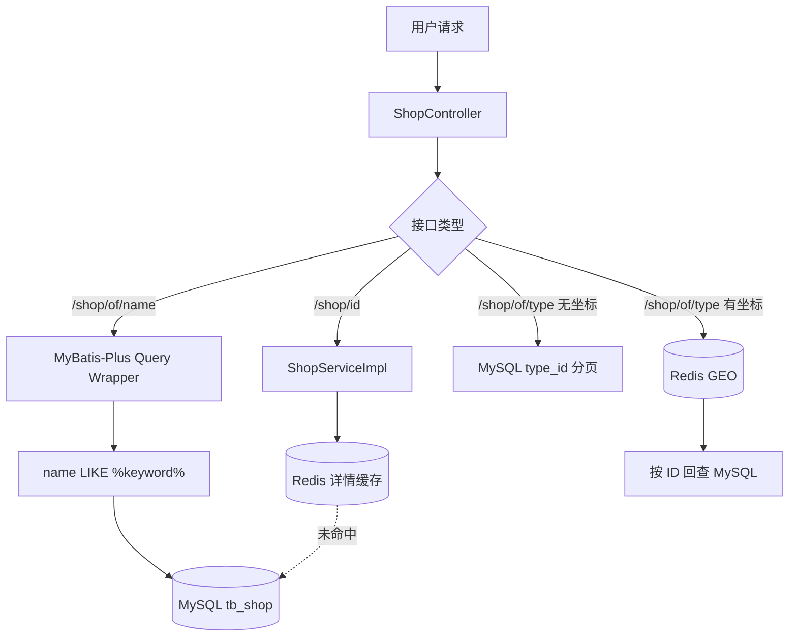
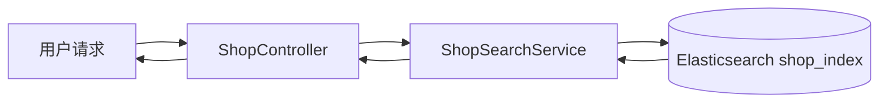

# Elasticsearch 商户搜索架构设计

## 1. 设计范围

本阶段仅分析和设计，不修改代码。首期 Elasticsearch 改造聚焦商户名称搜索接口 `GET /shop/of/name`，目标是在保持 HTTP 接口兼容的前提下，增加中文分词、相关性排序和后续组合检索能力。

店铺详情、店铺写入、按类型查询和 Redis GEO 附近店铺查询暂时保持原实现，避免一次改造同时影响缓存、地理查询和搜索三个链路。

## 2. 当前店铺搜索流程

### 2.1 Controller

`ShopController` 暴露四类店铺接口：

| 接口 | 方法 | 当前职责 |
| --- | --- | --- |
| `GET /shop/{id}` | `queryShopById` | 调用 `IShopService.queryById` 查询店铺详情。 |
| `POST /shop` | `saveShop` | 通过 `IShopService.save` 新增店铺。 |
| `PUT /shop` | `updateShop` | 调用 `IShopService.update` 更新店铺。 |
| `GET /shop/of/type` | `queryShopByType` | 按类型分页；带坐标时使用 Redis GEO 查询附近店铺。 |
| `GET /shop/of/name` | `queryShopByName` | 名称搜索逻辑直接位于 Controller，通过 MyBatis-Plus 链式查询访问 MySQL。 |

当前名称搜索代码没有进入独立的 Service 方法。Controller 根据 `name` 是否为空拼接 `LIKE` 条件，使用 `current` 页码和 `SystemConstants.MAX_PAGE_SIZE=10` 分页，最后只返回 `page.getRecords()`。

### 2.2 Service

`IShopService` 继承 MyBatis-Plus `IService<Shop>`，显式声明：

- `queryById(Long id)`；
- `update(Shop shop)`；
- `queryShopByType(Integer typeId, Integer current, Double x, Double y)`。

`ShopServiceImpl` 的现有职责：

- 店铺详情使用 `CacheClient.queryWithPassThrough`，Redis key 为 `cache:shop:{id}`，未命中时查询 MySQL；
- 更新店铺时先更新 MySQL，再删除对应 Redis 详情缓存；
- 类型查询不带坐标时使用 MySQL 分页；
- 类型查询带坐标时先使用 `shop:geo:{typeId}` 做 5 公里 GEO 搜索，再按 ID 回查 MySQL 并恢复距离顺序。

名称搜索并没有专用的 `ShopService` 方法，而是借助 `IService.query()` 从 Controller 直接构造条件。

### 2.3 Mapper

`ShopMapper` 仅继承 `BaseMapper<Shop>`，没有商户搜索专用方法，也没有对应的 `ShopMapper.xml`。名称搜索、ID 回查和类型过滤均由 MyBatis-Plus Wrapper 生成 SQL。

### 2.4 当前数据库查询方式

名称搜索等价于：

```sql
SELECT ...
FROM tb_shop
WHERE name LIKE CONCAT('%', :name, '%')
LIMIT :offset, 10;
```

当 `name` 为空时不会添加 `LIKE` 条件，相当于分页读取全部店铺。`tb_shop` 只有主键和 `type_id` 普通索引，名称字段没有适用于模糊搜索的索引；前置通配符通常无法利用普通 B-Tree 索引。

当前各查询链路如下：



## 3. 当前搜索存在的问题

### 3.1 MySQL `LIKE` 扫描成本

`LIKE '%关键字%'` 带前置通配符，数据增长后容易扩大扫描范围。分页越深，传统 `LIMIT offset, size` 跳过的数据也越多。

### 3.2 没有中文分词

MySQL 当前查询只能判断名称字符串是否包含完整输入。例如用户输入“北京 火锅”时，无法自然拆分词语、处理词序或匹配名称和地址中的多个词项。

### 3.3 没有相关性排序

当前 SQL 没有 `ORDER BY` 搜索相关性。名称完全命中、名称局部命中、地址命中和描述命中无法形成可解释的权重差异。

### 3.4 检索字段单一

只能搜索 `name`。商圈、地址、类型和未来商户描述不能统一参与全文检索，也不能方便地组合类型过滤、评分排序和距离过滤。

### 3.5 搜索职责位于 Controller

Controller 直接构造 MyBatis-Plus 查询，HTTP 层与数据访问细节耦合。后续增加 ES 查询 DSL、降级或结果转换时会让 Controller 继续膨胀。

### 3.6 缺少搜索数据同步边界

MySQL 是当前唯一数据源，没有搜索副本，因此也没有初始化、增量更新、删除同步、延迟监控或数据对账机制。

## 4. Elasticsearch 改造目标

目标链路：



`ShopSearchService` 作为独立搜索边界，负责：

- 将关键词、页码和后续过滤条件转换为 Elasticsearch Query DSL；
- 对名称、类型、地址和描述执行多字段检索；
- 设置字段权重，例如名称权重大于地址和描述；
- 使用 `_score` 作为默认相关性排序，可在后续叠加商户评分、销量或距离；
- 把 ES 文档转换为现有接口可返回的商户结构；
- 统一处理空关键词、分页边界和 ES 异常。

建议首期查询逻辑：

```text
multi_match(name^4, type^2, address^2, description)
  + 可选 typeId 精确过滤
  + 默认按 _score 降序
  + 同分时按 score、id 稳定排序
```

若前端只传 `name` 和 `current`，服务仍能直接兼容现有请求。后续增加类型、位置、评分等条件时，应优先增加可选参数，不破坏旧调用方。

## 5. 与现有业务的关系

### 5.1 保持不变的外部接口

- `GET /shop/of/name?name={name}&current={current}`：URL、HTTP 方法、参数名称、默认页码和 `Result` 包装保持不变；内部数据源从 MySQL `LIKE` 迁移为 `ShopSearchService -> Elasticsearch`。
- `GET /shop/{id}`：继续使用 Redis 详情缓存和 MySQL 回源。
- `GET /shop/of/type`：首期继续保留 MySQL 分页和 Redis GEO 距离查询。
- `POST /shop`、`PUT /shop`：写入入口和 MySQL 主数据地位保持不变。
- `GET /shop-type/list`：店铺类型列表查询保持不变。

### 5.2 保持不变的领域和数据访问职责

- MySQL 继续作为商户权威数据源；ES 只是可重建的搜索读模型。
- `ShopMapper` 继续负责 MySQL CRUD、详情回源和现有类型查询。
- Redis 继续负责详情缓存和附近店铺 GEO 数据，首期不迁移到 ES。
- Kafka 秒杀链路与商户搜索无直接依赖，本阶段不修改 Kafka Topic、Consumer 或事务边界。

### 5.3 后续实施时预计新增与调整

以下仅为设计，不在本阶段实施：

- 新增 `ShopDocument`，隔离 ES 文档与数据库实体；
- 新增 `ShopSearchService` 及实现；
- 新增 Elasticsearch 客户端配置和索引初始化资源；
- 将 `ShopController.queryShopByName` 的内部实现改为调用搜索服务；
- 增加初始化同步、查询单元测试和真实 ES 集成测试。

## 6. 可用性与降级建议

首期可以保留受控的 MySQL 搜索降级，但必须满足：

- 只在 ES 短时不可用时触发，避免正常流量持续回压 MySQL；
- 设置超时、限流和明确告警；
- 降级结果不承诺与 ES 的相关性排序一致；
- 空关键词查询应限制分页深度，避免把 ES 或 MySQL 当作无界列表接口。

是否启用自动降级应在实现阶段按流量规模决定；本设计不要求引入复杂熔断框架。

## 7. 验收标准

- 现有名称搜索接口契约不变；
- 中文关键词可以分词并命中名称、类型、地址或描述；
- 名称命中权重高于地址和描述命中；
- 支持稳定分页与相关性排序；
- MySQL 新增、更新、删除最终能反映到 ES；
- ES 索引可以从 MySQL 全量重建；
- ES 改造不影响店铺详情缓存、Redis GEO 和 Kafka 秒杀模块。

