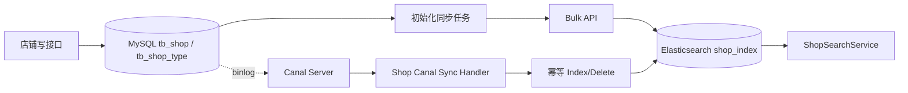

# MySQL 到 Elasticsearch 数据同步设计

## 1. 同步目标与原则

目标是让 MySQL 商户主数据形成可搜索的 Elasticsearch 读模型，同时不改变 MySQL 的权威数据源地位。

基本原则：

- MySQL 是唯一事实源，ES 数据允许删除后重建；
- 使用 MySQL `shop.id` 作为 ES 文档 `_id`，保证重复同步结果幂等；
- 新增和更新使用 upsert/index，删除使用 delete；
- 同步采用最终一致性，不把 ES 写入纳入店铺数据库事务；
- 初始化同步和实时同步分阶段交付，先证明数据模型和搜索价值，再引入 Canal 运维复杂度。

## 2. 总体架构



Redis 店铺详情缓存和 GEO 数据不作为 ES 的同步源。它们与 ES 都从 MySQL 主数据派生，避免形成“缓存再同步缓存”的数据链路。

## 3. 第一阶段：初始化同步

### 3.1 目标

将现有 `tb_shop` 全量导入 `shop_index`，验证 Mapping、中文分词、字段转换、分页、结果数量和查询相关性，为后续实时同步提供可验证基线。

### 3.2 同步步骤

1. 创建 `shop_index` 并验证 IK analyzer、Mapping 和集群健康状态。
2. 分页读取 `tb_shop`，同时读取或关联 `tb_shop_type` 补充类型名称。
3. 使用主键游标分页，例如 `WHERE id > :lastId ORDER BY id LIMIT :batchSize`，避免大 offset 分页。
4. 将 `x/y` 转换为 `location.lat/location.lon`，将数据库实体转换为 `ShopDocument`。
5. 使用 ES Bulk API 批量写入，以 MySQL `id` 作为文档 `_id`。
6. 对每个 Bulk 响应逐项检查，失败项记录 ID 和原因后有限重试，不能只判断 HTTP 请求是否成功。
7. 导入完成后比较 MySQL 与 ES 文档数量，并抽样校验名称、类型、地址、评分和坐标。
8. 执行典型中文关键词用例，确认名称权重和相关性排序符合预期。
9. 验证通过后，再让名称搜索接口读取 ES。

### 3.3 初始化同步的安全要求

- 任务必须可重复执行，相同 ID 只能覆盖同一文档；
- 批次大小通过压测确定，避免一次加载全部店铺到 JVM；
- 不依赖 ES 自动动态 Mapping，索引必须预先显式创建；
- 记录开始时间、结束时间、成功数、失败数和最后处理 ID；
- 首次切换前处理同步期间发生的增量变化，不能默认全量任务执行时数据库静止。

### 3.4 数据校验

最低校验项：

- 总数：MySQL 有效店铺数与 ES 文档数一致；
- 主键：随机抽样 ID 在两边都存在；
- 字段：名称、类型、地址、评分一致；
- 坐标：`x -> lon`、`y -> lat`，并验证一次距离查询；
- 删除：MySQL 已删除记录不应残留在重建后的新索引；
- 搜索：中文分词、精确名称、地址词和类型词都有预期结果。

## 4. 第二阶段：Canal 实时同步

### 4.1 目标

通过 MySQL binlog 捕获 `tb_shop` 和 `tb_shop_type` 的新增、更新、删除，在秒级内将变化同步到 ES，形成最终一致的搜索读模型。

### 4.2 前置条件

- MySQL 开启 binlog；
- `binlog_format=ROW`；
- Canal 使用只读复制账号并具备读取 binlog 的权限；
- 明确实例、库表白名单和字符集；
- 记录并持久化 Canal 消费位点，服务重启后可以续传；
- Elasticsearch Mapping 和目标索引已通过第一阶段验证。

### 4.3 事件处理

| MySQL 事件 | ES 操作 | 说明 |
| --- | --- | --- |
| `tb_shop` INSERT | Index/Upsert | 查询或映射类型名称，构造完整文档，以 shop ID 为 `_id`。 |
| `tb_shop` UPDATE | Index/Upsert | 建议重建完整文档而不是零散字段 patch，降低字段遗漏风险。 |
| `tb_shop` DELETE | Delete | 使用 shop ID 删除文档；文档不存在也按幂等成功处理。 |
| `tb_shop_type` UPDATE | Update by query 或按 typeId 批量重建 | 类型名称是店铺文档的冗余字段，需要更新所有关联店铺。 |

同步处理器只负责数据投影，不调用店铺 Controller，也不以 Redis 缓存内容作为输入。

### 4.4 一致性与幂等

- Canal 可能重复投递，同一 shop ID 的完整文档 upsert 是幂等的；
- 删除不存在文档按成功处理；
- 同一 Canal 分区/实例按 binlog 顺序处理，避免旧更新覆盖新更新；
- 文档保留 `updateTime`，用于识别和排查版本倒退；
- ES 写入失败时进行有限重试，耗尽后记录失败事件和 binlog 位点，不能静默 ACK；
- 定期执行 MySQL/ES 数量对比和 `updateTime` 抽样对账，发现漂移后按 ID 修复或全量重建。

## 5. 初始化与 Canal 的衔接

全量同步和增量同步之间最容易出现数据窗口。建议在 Canal 上线阶段使用以下顺序：

1. 记录初始化开始时的 binlog 位点，或先启动 Canal 并暂存增量事件；
2. 执行 MySQL 全量快照并写入新索引；
3. 从记录位点回放全量期间产生的增量事件；
4. 等 Canal 延迟归零后执行数量和抽样校验；
5. 最后切换搜索读流量。

如果第一阶段和第二阶段相隔较久，Canal 上线前应重新执行一次全量同步或差异校验，不能直接假设第一阶段索引仍然最新。

## 6. 为什么分两个阶段

### 6.1 降低一次性交付风险

初始化同步可以先验证索引结构、分词器、字段转换和查询效果。如果一开始同时接入 Canal，Mapping、查询和同步问题会相互叠加，定位成本更高。

### 6.2 先建立可重建能力

实时同步不是全量修复工具。只有先具备稳定的全量重建脚本，才能在 Mapping 升级、严重漂移或 ES 索引损坏时恢复数据。

### 6.3 独立验证运维依赖

Canal 依赖 MySQL binlog、复制账号、位点持久化和故障恢复。分阶段可以让搜索功能和 CDC 运维分别验收。

### 6.4 保持当前改造简单

第一阶段不要求修改店铺写事务，也不要求双写 MySQL 与 ES。第二阶段再通过 binlog 解耦写业务与搜索同步，避免在业务代码中增加跨系统事务。

## 7. 与现有缓存一致性的关系

当前 `ShopServiceImpl.update` 采用“更新 MySQL后删除 `cache:shop:{id}`”的方式维护详情缓存。Canal 同步 ES 后将出现两条派生数据链路：

```text
MySQL -> 业务代码删除 Redis 详情缓存
MySQL -> binlog -> Canal -> 更新 Elasticsearch
```

首期不改变 Redis 策略。后续 Canal 缓存一致性阶段可评估统一监听 binlog 后删除缓存，但必须与 ES 同步分别重试和监控，不能因为其中一个目标成功就认为另一个目标也成功。

## 8. 监控与验收

建议监控：

- Canal 当前 binlog 位点和同步延迟；
- 每分钟 INSERT/UPDATE/DELETE 数量；
- ES Bulk 成功率、失败数和写入耗时；
- 失败重试队列或失败记录数量；
- MySQL 与 ES 文档数量差；
- 搜索接口成功率、P95/P99 延迟和零结果率。

第二阶段验收至少覆盖新增、更新名称、变更类型、更新坐标、删除、重复事件、ES 短时不可用、Canal 重启续传和全量期间增量回放。

