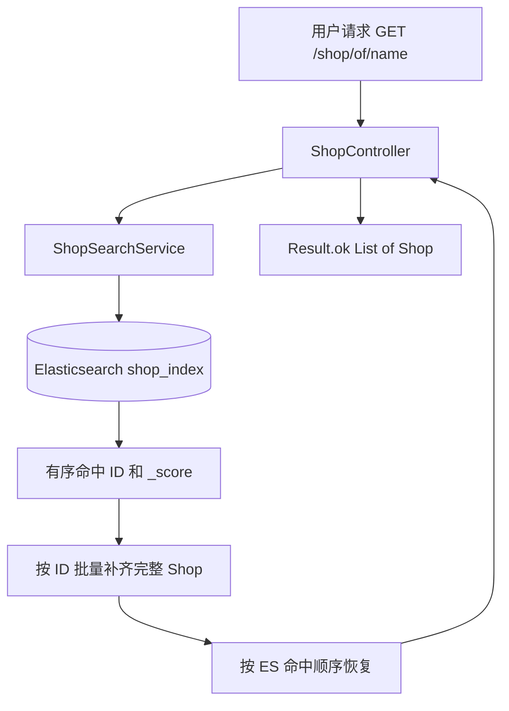

# Elasticsearch Phase 3：商户搜索服务接入设计

## 1. 设计范围与结论

本阶段只完成架构设计，不修改 Java、配置、SQL、Redis、Kafka 或 Lua，也不执行索引写入。

接入目标是把 `GET /shop/of/name` 的“搜索判定”从 MySQL `LIKE` 切换到 Elasticsearch `shop_index`。推荐采用：

```text
Elasticsearch 搜索并返回有序店铺 ID
                  ↓
MySQL 按主键批量补齐完整 Shop 展示字段
                  ↓
按 ES 命中顺序重排并返回
```

MySQL 补齐仅是主键批量查询，不再使用名称 `LIKE`，因此搜索能力已经由 ES 承担；同时避免现有 `ShopDocument` 不含 `images`、`avgPrice`、`sold`、`comments`、`score`、`openHours` 等字段而导致响应数据缩水。

## 2. 当前查询流程分析

### 2.1 ShopController

当前 `ShopController.queryShopByName` 暴露：

```http
GET /shop/of/name?name={name}&current={current}
```

- `name`：非必填。
- `current`：默认值为 1。
- 每页数量：`SystemConstants.MAX_PAGE_SIZE`，当前为 10。
- 返回：`Result.ok(page.getRecords())`，即 `data` 为 `List<Shop>`，`total` 当前为空。

搜索逻辑直接写在 Controller 内：

```text
用户请求
  ↓
ShopController.queryShopByName
  ↓
shopService.query()
  ↓
name 非空时追加 like("name", name)
  ↓
MyBatis-Plus Page(current, 10)
  ↓
ShopMapper / BaseMapper
  ↓
MySQL tb_shop
  ↓
Result.ok(List<Shop>)
```

这使 HTTP 层同时承担查询 DSL、分页和数据访问职责，后续加入 ES、异常降级和结果顺序恢复时会继续膨胀。

### 2.2 ShopService

`IShopService` 继承 MyBatis-Plus `IService<Shop>`，但没有名称搜索方法。Controller 通过继承的 `query()` 能力直接构造 Wrapper，因此当前名称搜索没有经过业务服务方法。

`ShopServiceImpl` 当前负责店铺详情缓存、店铺更新和按类型/距离查询。本阶段设计不改变这些职责。

### 2.3 ShopMapper

`ShopMapper` 仅继承 `BaseMapper<Shop>`，没有名称搜索专用 SQL。当前 MyBatis-Plus 最终生成的查询近似为：

```sql
SELECT ...
FROM tb_shop
WHERE name LIKE CONCAT('%', ?, '%')
LIMIT ?, 10;
```

名称为空时不追加 `LIKE`，表现为分页查询全部店铺。前置通配符查询通常不能有效利用普通 B-Tree 索引，也不提供分词或相关性评分。

## 3. 目标架构

### 3.1 主链路



从搜索职责看，核心结构保持为：

```text
ShopController
      ↓
ShopSearchService
      ↓
Elasticsearch
```

MySQL 只负责以主键批量补齐展示字段，不再决定关键词是否命中或结果相关性顺序。

### 3.2 为什么增加 ShopSearchService

- 隔离 HTTP 参数处理与 Elasticsearch Query DSL。
- 集中管理关键词分析、分页、排序、结果解析和顺序恢复。
- 统一处理 ES 超时、异常、降级和监控日志。
- 防止 ES 客户端对象或响应结构泄漏到 Controller。
- 后续加入类型过滤、地理距离、搜索高亮时无需继续扩大 Controller。
- 便于单独 Mock ES，测试正常、无结果和异常场景。

## 4. 代码改造方案

以下内容为下一实现阶段的改造清单，本阶段不执行。

### 4.1 新增 ShopSearchService

建议位置：

```text
src/main/java/com/hmdp/elasticsearch/service/ShopSearchService.java
```

建议职责和方法：

```java
List<Shop> searchByName(String keyword, Integer current);
```

接口返回领域数据而不是 `Result`，由 Controller 继续负责 HTTP 统一包装，避免搜索服务依赖 Web 响应模型。

### 4.2 新增 ShopSearchServiceImpl

建议位置：

```text
src/main/java/com/hmdp/elasticsearch/service/impl/ShopSearchServiceImpl.java
```

职责：

1. 校验并规范化 `keyword`、`current`。
2. 根据空/非空关键词构造 ES 查询。
3. 设置 `from`、`size` 和稳定排序。
4. 解析 hits，保留 `_score` 对应的 ID 顺序。
5. 按 ID 批量查询完整 `Shop`。
6. 使用 `Map<Long, Shop>` 按 ES ID 列表恢复顺序。
7. 捕获明确的 ES 连接、超时或响应异常并执行受控降级。

不要直接把当前 `ShopDocument` 转成最终 `Shop` 返回，因为它缺少现有接口需要的多个展示字段。首期使用 ES ID + MySQL 批量补齐；后续若索引扩展为完整展示文档，可再评估纯 ES 返回。

### 4.3 修改 ShopController

仅修改 `queryShopByName` 内部委托：

```text
原：Controller -> IShopService.query().like().page()
新：Controller -> ShopSearchService.searchByName()
```

保持以下契约不变：

- URL：`GET /shop/of/name`。
- 参数名：`name`、`current`。
- `name` 仍为非必填。
- `current` 默认仍为 1。
- 每页仍为 10 条。
- 返回仍为 `Result.ok(List<Shop>)`，不在本次切换中突然增加或删除 `total`。
- 其他 ShopController 接口不变。

### 4.4 保持不变

- `IShopService` 和 `ShopServiceImpl` 的详情缓存、更新、按类型和 Redis GEO 查询。
- `ShopMapper` 的现有 CRUD 能力；可复用 `selectBatchIds` 补齐详情，无需新增名称 LIKE SQL。
- `ShopDocument`、`ShopEsSyncService` 和 `shop_index` 初始化流程。
- Redis、Kafka、秒杀 Lua 及相关配置。

## 5. Elasticsearch 查询设计

### 5.1 非空关键词：match 查询

首期只切换名称搜索，建议请求：

```json
POST /shop_index/_search
{
  "from": 0,
  "size": 10,
  "_source": ["id"],
  "query": {
    "match": {
      "name": {
        "query": "火锅"
      }
    }
  },
  "sort": [
    { "_score": "desc" },
    { "id": "asc" }
  ]
}
```

- `from = (current - 1) * 10`，`size = 10`。
- 默认按 `_score` 降序体现相关性。
- `id` 升序作为同分时的稳定排序，降低分页抖动。
- `_source` 首期只取 `id`，完整展示数据通过主键批量补齐。

### 5.2 空关键词兼容

当前接口在 `name` 为空时分页返回全部店铺。为了保持行为不变，空白关键词不能发送空 `match`，应改用：

```json
"query": { "match_all": {} }
```

空关键词没有 `_score` 语义，建议固定按 `id asc` 排序，保证分页稳定。

### 5.3 为什么使用 match 而不是 term

- `name` 在 `shop_index` 中是 `text` 类型。
- `match` 会先使用该字段配置的 analyzer 分析查询字符串，再使用分析后的词项检索倒排索引。
- `term` 不分析输入，适合 `keyword`、ID、状态等精确值；直接对 `name` 文本字段使用 `term`，用户输入可能与索引中的实际词项不一致而漏检。
- ES 会根据词项匹配情况计算 `_score`，支持相关性排序；MySQL `LIKE` 和简单 `term` 不能提供同等语义。

当前 Mapping 使用内置 `standard` analyzer，只能作为基础验证方案。若要获得稳定的中文词语切分，应在实现中文搜索上线前选择 IK 等中文分析器、创建新版本索引并重新全量同步；分析器不能仅靠修改查询代码补救。

### 5.4 分页边界

- `current == null` 或小于 1 时按 1 处理。
- 保持每页 10 条。
- ES 默认结果窗口通常限制在 10,000 条以内；首期应限制最大页码并返回明确错误或空结果。
- 若后续确有深分页需求，再引入 `search_after`，本阶段不增加复杂度。

## 6. 结果转换与顺序保持

建议流程：

```text
ES hits: [id=8, id=2, id=5]
             ↓
ShopMapper.selectBatchIds([8,2,5])
             ↓
数据库返回顺序可能为 [2,5,8]
             ↓
转换为 Map<id, Shop>
             ↓
按 ES ID 顺序组装 [8,2,5]
```

必须显式恢复顺序，否则数据库批量查询会破坏 ES 相关性排序。若某个 ID 在 MySQL 已删除但 ES 尚未同步删除，应跳过该条、记录同步漂移指标，不返回空对象。

## 7. 异常与降级策略

### 7.1 推荐方案：受控降级到 MySQL

本项目当前数据量和实现复杂度允许首期保留原 MySQL LIKE 作为临时降级路径：

```text
ES 请求超时 / 连接失败 / 响应解析失败
                  ↓
记录 error 日志、关键词摘要、页码和异常类型
                  ↓
受限执行原 MySQL LIKE 分页
                  ↓
返回原 Result 结构
```

降级的价值是避免 ES 短时故障直接使商户搜索完全不可用，但必须明确：

- 只捕获预期的 ES 客户端异常，不能用 `catch (Exception)` 吞掉编程错误。
- ES 查询应使用短超时；搜索接口不应沿用过长阻塞时间。
- 记录降级次数、失败率和耗时并触发告警。
- 对降级请求设置并发限制，避免 ES 故障时大量 LIKE 查询压垮 MySQL。
- 降级结果只保证可用性，不保证与 ES 相同的分词、召回率和相关性顺序。
- 连续故障可增加简单开关临时固定走 MySQL；首期不强制引入复杂熔断框架。

### 7.2 不建议直接返回空列表

把 ES 异常伪装成“无搜索结果”会混淆业务无结果与基础设施故障，既影响用户判断，也使监控无法发现问题。若降级也失败，应返回 `Result.fail` 对应的明确搜索服务异常，而不是成功空列表。

## 8. 测试方案

### 8.1 ShopSearchService 单元测试

使用 Mock ES HTTP 服务和 Mock Mapper：

1. **正常搜索**：输入“火锅”，验证发送 `match name`、分页参数和 `_score desc`；返回多个 hit 后按 ES 顺序组装完整 `Shop`。
2. **无结果搜索**：ES hits 为空，不调用批量 MySQL 查询，返回空列表而非 `null`。
3. **空关键词**：验证使用 `match_all`，并按 ID 稳定分页。
4. **结果顺序**：Mapper 故意返回不同顺序，最终结果仍与 ES hits 一致。
5. **同步漂移**：ES 命中已不存在的 MySQL ID，跳过缺失记录并记录告警。
6. **ES 异常**：连接或超时异常触发一次受控 MySQL LIKE 降级。
7. **Bulk/JSON 无关错误**：响应格式非法时不误返回成功结果。

### 8.2 ShopController 契约测试

使用 MockMvc 和 Mock `ShopSearchService` 验证：

- 路径、HTTP 方法、参数名称和默认页码不变。
- 正常与空结果都保持 `Result` 包装。
- `data` 仍为 Shop 列表，`total` 行为不变。
- 搜索异常映射为统一失败响应，不泄漏 ES 内部异常和地址。

### 8.3 真实 ES 集成测试

使用已初始化的 `shop_index`：

- 已知完整店名可以命中。
- 部分关键词可以命中。
- 不存在的关键词返回空 hits。
- 多结果按 `_score` 排序且分页稳定。
- ES 停止后验证受控 MySQL 降级，不影响其他店铺接口。

环境测试继续使用显式开关，普通 `mvn test` 不应依赖本地 ES，也不应隐式修改索引。

## 9. 实施验收标准

- `/shop/of/name` 不再产生名称 LIKE SQL（ES 降级场景除外）。
- 接口参数、默认页码、每页数量和 `Result<List<Shop>>` 结构不变。
- 非空关键词使用 `match`，默认按 `_score desc`。
- 空关键词行为与旧接口兼容。
- 完整 Shop 字段保留，ES 命中顺序不被 MySQL 批量查询破坏。
- ES 无结果与 ES 故障可以区分。
- ES 故障可受控降级并产生可观测日志。
- 不影响店铺详情缓存、Redis GEO、Kafka 秒杀和 Lua。

## 10. 预计变更文件

下一实现阶段预计：

### 新增

- `src/main/java/com/hmdp/elasticsearch/service/ShopSearchService.java`
- `src/main/java/com/hmdp/elasticsearch/service/impl/ShopSearchServiceImpl.java`
- `src/test/java/com/hmdp/elasticsearch/service/ShopSearchServiceTest.java`
- `src/test/java/com/hmdp/controller/ShopControllerSearchTest.java`

### 修改

- `src/main/java/com/hmdp/controller/ShopController.java`：仅替换名称搜索内部委托。

### 不修改

- `IShopService`、`ShopServiceImpl` 现有业务方法。
- Redis、Kafka、SQL、Lua。
- 其他 ShopController 接口。
