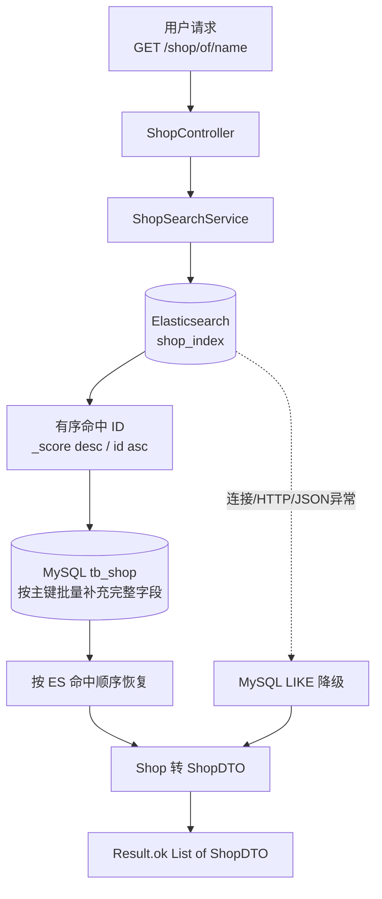

# Elasticsearch 商户搜索最终架构

## 1. 归档范围

本文记录截至 2026-09-09 已落地的 Elasticsearch 商户搜索基线，包括本地环境、索引模型、MySQL 首次全量同步、名称搜索接入、结果补齐、异常降级和测试。

当前状态需要明确区分：

- **已实现**：Elasticsearch 8 本地环境、`shop_index`、首次全量同步、`/shop/of/name` ES 查询、MySQL 完整字段补齐、排序恢复、异常降级。
- **尚未实现**：Canal binlog 实时增量同步、中文 IK 分词、多字段检索、高亮、联想和复杂相关性调优。

## 2. 最终搜索架构



主搜索职责链：

```text
ShopController
      ↓
ShopSearchService
      ↓
Elasticsearch
      ↓
MySQL 按主键补充完整 Shop
```

Elasticsearch 决定关键词是否命中以及相关性顺序；MySQL 补充图片、均价、销量、评分、营业时间等展示字段，不参与正常链路的名称匹配。

## 3. 各组件职责

| 组件 | 已实现职责 |
| --- | --- |
| `ShopController` | 保持 `/shop/of/name` 协议，只把名称搜索委托给 `ShopSearchService`。 |
| `ShopSearchService` | 定义按关键词和页码搜索商户的边界。 |
| `ShopSearchServiceImpl` | 构造 ES DSL、解析有序 ID、批量补齐 Shop、恢复排序、转换 DTO、执行降级。 |
| `ElasticsearchConfig` | 提供专用 `RestTemplate`，默认连接 `127.0.0.1:9200`。 |
| `ShopDocument` | 隔离 ES 搜索文档与 MyBatis 数据库实体。 |
| `ShopEsSyncService` | 创建索引、读取全部 MySQL 店铺并通过 Bulk 首次同步。 |
| `ShopMapper` | 保持原 BaseMapper；正常搜索中仅按 ID 批量读取完整 Shop，降级时执行 LIKE。 |
| `ShopDTO` | 保持原 Shop JSON 字段，避免数据库实体直接成为搜索接口契约。 |

## 4. ES 索引设计

索引名称：`shop_index`。

实际 Mapping：

| 字段 | 类型 | 来源/用途 |
| --- | --- | --- |
| `id` | `long` | MySQL 店铺主键，同时作为 ES `_id`；用于幂等覆盖和稳定排序。 |
| `name` | `text` + `keyword` | `text` 用于 match 名称搜索，`keyword` 预留精确匹配。 |
| `typeId` | `long` | 店铺类型精确过滤预留。 |
| `area` | `text` + `keyword` | 商圈文本搜索和精确过滤预留。 |
| `address` | `text` | 地址搜索预留。 |
| `description` | `text` | 描述搜索预留；当前数据库没有权威来源，首次同步不虚构值。 |
| `location` | `geo_point` | `lat=Shop.y`、`lon=Shop.x`，为距离检索预留。 |

索引设置：

- 单分片、零副本，适用于本地单节点开发环境。
- `dynamic: strict`，拒绝意外字段漂移。
- 文本字段当前使用内置 `standard` analyzer。
- 当前中文搜索仅为基础效果；引入中文分析器时需要创建新索引并重新同步，不能直接修改已有字段的分析器。

## 5. 数据初始化流程

```text
ShopEsSyncService.syncAllShops
              ↓
检查并创建 shop_index + Mapping
              ↓
ShopMapper.selectList(null)
              ↓
Shop -> ShopDocument
              ↓
每 500 条构造一批 NDJSON
              ↓
Elasticsearch Bulk API
              ↓
检查 HTTP 状态和 errors 字段
              ↓
统一 refresh 并返回同步数量
```

同步基线验证结果：MySQL 14 家店铺，成功写入 ES 14 条，`shop_index/_count=14`。

使用 MySQL ID 作为 ES `_id`，重复全量同步会更新同一文档而不是制造重复数据。同步服务不会自动删除现有索引，也不会删除 ES 中已经不存在于 MySQL 的历史文档；需要彻底重建时应显式创建新索引并切换。

## 6. 查询流程

### 6.1 非空关键词

请求示例：

```http
GET /shop/of/name?name=火锅&current=1
```

处理步骤：

1. Controller 调用 `ShopSearchService.searchByName(name, current)`。
2. 服务向 `/shop_index/_search` 发送 `match name`。
3. 分页保持每页 10 条，`from=(current-1)*10`。
4. 默认按 `_score desc`，同分时按 `id asc`。
5. ES 只返回店铺 ID。
6. `ShopMapper.selectBatchIds` 批量查询完整 Shop。
7. 数据库返回结果转换为 `Map<id, Shop>`。
8. 按 ES hits ID 顺序重新组装，保留相关性顺序。
9. 转为 `ShopDTO`，由 Controller 使用 `Result.ok(data)` 返回。

### 6.2 空关键词

原接口在名称为空时分页查询全部店铺，因此当前实现跳过 ES，继续执行 MySQL 无 LIKE 条件分页。这是协议兼容行为，不属于搜索故障降级。

### 6.3 数据漂移

如果 ES 命中的 ID 在 MySQL 已不存在，实现会跳过该条并打印警告，不返回字段为空的对象。该行为只能避免错误展示，不能替代增量同步和数据对账。

## 7. 降级策略

触发条件：

- ES 连接或读取失败。
- ES HTTP 响应失败。
- JSON 序列化或解析失败。
- 响应缺少合法 `hits.hits`。
- 命中文档没有有效 Long 类型店铺 ID。

降级链路：

```text
Elasticsearch 异常
        ↓
记录 error 日志、关键词、页码和异常堆栈
        ↓
MySQL name LIKE 分页
        ↓
Shop -> ShopDTO -> Result
```

当前实现保持简单，没有引入自动重试、熔断或复杂容错框架。降级保证基本可用性，但不保证与 ES 相同的分词、召回率和相关性排序。生产扩容前仍应增加降级指标、告警、短超时和并发保护，防止 ES 故障把搜索流量全部压向 MySQL。

## 8. MySQL 与 Elasticsearch 职责划分

| 能力 | MySQL | Elasticsearch |
| --- | --- | --- |
| 权威数据源 | 是 | 否 |
| 商户新增和更新 | 承担 | 不承担业务写入口 |
| 事务和数据约束 | 承担 | 不替代关系型事务 |
| 名称关键词匹配 | 仅异常降级 | 正常查询主路径 |
| 分词和相关性排序 | 不承担 | 承担 |
| 完整展示字段 | 保存并按 ID 补齐 | 当前只保存搜索字段 |
| 数据恢复 | 原始事实来源 | 可从 MySQL 重建 |
| 一致性模型 | 主数据即时提交 | 当前首次同步基线；未来最终一致 |

## 9. 一致性现状与后续方向

当前已经完成首次全量同步，但商户新增、更新或删除后，还没有自动写入 ES。因此现阶段不能宣称 MySQL 与 ES 已具备实时一致性。

下一阶段建议：

```text
MySQL binlog
    ↓
Canal
    ↓
商户变更事件
    ↓
按 shopId upsert/delete shop_index
    ↓
失败重试 + 告警 + 定期对账
```

在 Canal 上线前，商户数据变化后需要重新执行全量同步或提供受控的手工同步流程。

## 10. 最终验证基线

- ES 初始化单元测试：3 个通过。
- ES 搜索服务测试：5 个通过。
- Controller 搜索协议测试：1 个通过。
- 真实 ES `match name=火锅`：命中 4 条并按 `_score` 排序。
- 完整 Maven 回归：35 个测试，0 失败、0 错误、2 个环境测试跳过，`BUILD SUCCESS`。
- `/shop/of/name` 已切换；其他店铺接口、Redis、Kafka 和秒杀业务保持原样。
