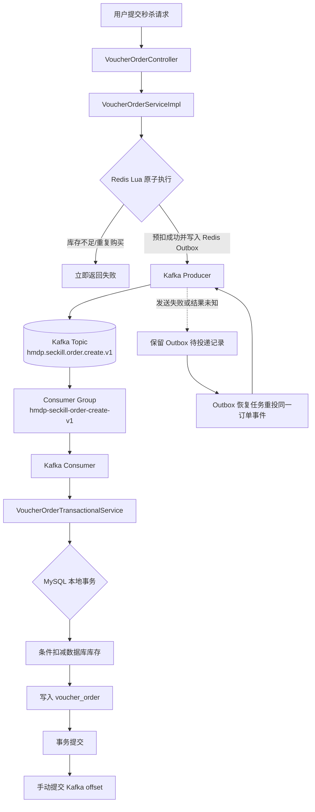

# Kafka 秒杀整体架构设计

## 1. 设计目标

在保留“Redis Lua 快速资格校验与库存预扣、MySQL 保存最终订单”的业务语义下，将当前 Redis Stream 异步下单链路迁移为 Kafka 异步订单系统。

本阶段只输出设计，不修改 Java、配置、SQL 或 Lua。目标状态不再使用 Redis Stream，但会保留一份轻量 Redis Outbox，解决 Redis Lua 成功后 Kafka 发送失败所产生的跨系统一致性缺口。

## 2. 设计边界与核心原则

- Redis 负责入口限流、秒杀库存预扣和一人一单资格判定。
- Kafka 负责订单事件的持久化、分区、削峰和异步投递。
- MySQL 是订单与数据库库存的最终事实来源。
- Kafka 与 MySQL 不追求分布式事务；通过“至少一次投递 + 数据库幂等约束”实现业务结果等效一次。
- Redis Lua 与 Kafka 不在同一事务中。必须显式处理“Lua 成功、Kafka 未确认”的场景，不能仅依赖一次 `send()` 调用。
- API 接口返回的是“秒杀请求已受理”和订单号，不等同于订单已经落库。客户端应通过订单状态接口确认最终结果。

## 3. 目标业务流程



主链路对应关系：

```text
用户请求
  ↓
Redis Lua 库存预扣 + 写入待投递记录
  ↓
Kafka Producer
  ↓
Kafka Topic
  ↓
Consumer Group
  ↓
订单事务服务
  ↓
MySQL
```

## 4. 请求阶段设计

### 4.1 Redis Lua 原子职责

目标版本的 Lua 脚本在一次原子执行中完成：

1. 校验 Redis 秒杀库存是否大于 0。
2. 校验用户是否已购买当前优惠券。
3. 扣减 Redis 预热库存。
4. 将用户加入该优惠券的已下单集合。
5. 将完整、不可变的订单事件写入 Redis Outbox，并记录待投递时间。

第 5 步替换当前脚本中的 `XADD stream.orders`。建议的数据结构：

- Hash：`seckill:kafka:outbox:data`，field 为 `orderId`，value 为完整消息 JSON。
- ZSet：`seckill:kafka:outbox:pending`，member 为 `orderId`，score 为首次待投递时间戳。

Hash 保存消息内容，ZSet 支持按超时时间扫描。两者必须在同一 Lua 脚本中与库存预扣同时写入。

### 4.2 为什么需要 Redis Outbox

如果流程只有“Lua 成功 → 调用 Kafka Producer”，进程可能在两步之间宕机；用户资格和 Redis 库存已经变化，但 Kafka 中没有订单事件。Redis Outbox 为这段间隙提供可恢复记录。

Outbox 不使用 Redis Stream，也不承担业务消费队列职责。它只保存未获得 Kafka broker 成功确认的事件：

- Kafka 确认成功后，通过幂等清理脚本删除 Hash 与 ZSet 记录。
- 发送失败、超时或进程宕机时，恢复任务重新发送同一 `orderId` 的同一消息。
- Kafka 已接收但 Outbox 清理失败时会产生重复消息，交由消费者与数据库唯一约束消重。
- Kafka 返回结果未知时不得回补 Redis 库存，因为 broker 可能已经接收消息；应保留记录并重投。

Redis Outbox 的可靠性依赖 Redis AOF、主从复制和禁止关键 key 被淘汰。若 Redis 集群发生超出持久化保障范围的灾难性数据丢失，仍可能丢失尚未进入 Kafka 的事件；这是设计的明确故障边界。

## 5. Kafka 与订单落库职责

### 5.1 Producer

Producer 使用 `userId` 作为消息 key，将事件写入主 Topic。只有收到 broker 成功确认后才清理 Outbox。Producer 的详细配置、消息协议和失败策略见 [02_topic_and_message_design.md](02_topic_and_message_design.md)。

### 5.2 Consumer Group

订单消费者组内的实例共同消费主 Topic。一个分区在同一时刻只分配给组内一个消费者，从而保证同一 `userId` 的事件在该 Topic 内按顺序处理。

消费者调用现有订单事务服务，在同一个 MySQL 本地事务内完成：

1. 幂等检查。
2. 条件扣减数据库库存。
3. 插入订单。

事务成功或确认属于幂等重复后，才允许提交 offset。

## 6. 一致性模型

本设计的可靠性语义如下：

| 边界 | 机制 | 结果 |
|---|---|---|
| Redis Lua → Kafka | Redis Outbox、broker 确认后清理、超时扫描重投 | 至少一次投递 |
| Kafka 内部 | 多副本、`acks=all`、ISR 约束、幂等 Producer | 已确认消息尽量不丢 |
| Kafka → Consumer | 禁止自动提交、成功后手动提交 offset | 至少一次消费 |
| Consumer → MySQL | 本地事务、订单主键、`(user_id, voucher_id)` 唯一索引 | 业务结果等效一次 |

Kafka 的幂等 Producer 只能抑制单个 Producer 会话中的网络重试重复，不能代替消费端幂等，也不能让 Redis、Kafka、MySQL形成一个原子事务。

## 7. 订单状态模型

异步下单不应让“接口返回成功”与“订单已经创建”混为一谈。建议提供下列状态：

- `ACCEPTED`：Redis Lua 成功，事件已进入 Outbox，正在投递或等待消费。
- `CREATED`：MySQL 订单事务提交成功。
- `FAILED`：经过有限次重试后确认无法创建，进入死信处理。
- `NOT_FOUND`：订单号不存在或已过状态保留期。

状态查询可优先查 Redis 短期状态，再以 MySQL 订单为最终依据。状态机制是后续实现项，不在本阶段修改代码。

## 8. 容量与部署假设

- 主 Topic 初始使用 12 个分区，消费者并发数不超过分区数，并且受 MySQL 实际写入能力约束。
- Kafka 集群生产环境至少 3 个 broker，Topic 副本因子为 3。
- Redis、Kafka、MySQL 均部署高可用与监控；任何单点部署都不属于生产可用目标。
- 在压测前，12 个分区只是可验证的初始基线，不是永久容量结论。应以峰值秒杀 QPS、单消费者事务吞吐、消费延迟和数据库锁等待重新核算。

## 9. 验收标准

- Lua 成功后即使应用进程立即退出，Outbox 恢复任务仍能重投订单事件。
- Kafka 发送成功但 Outbox 清理失败时，重复消息不会生成重复订单或重复扣减数据库库存。
- 数据库事务失败时不提交主 Topic offset，并按既定重试策略处理。
- 数据库事务成功但 offset 提交失败时，重启后的重复消费能被识别为幂等成功。
- Consumer 重启后从已提交 offset 继续，未提交记录会被重新处理。
- Redis Stream 消费者退出前完成 PEL 清理与迁移核对，迁移完成后目标链路不再依赖 Redis Stream。
