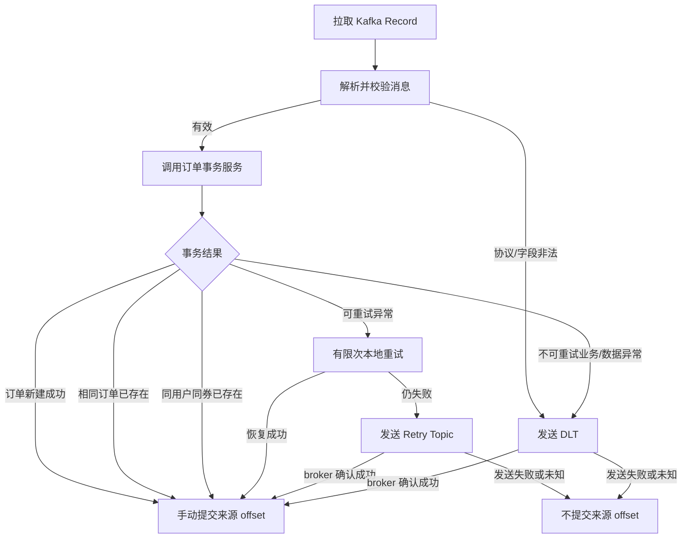

# Kafka 秒杀订单消费者设计

## 1. 消费者组

- Consumer Group：`hmdp-seckill-order-create-v1`
- 主 Topic：`hmdp.seckill.order.create.v1`
- 初始并发：不超过 12，并以数据库压测结果确定实际值。
- 自动提交：关闭。
- 提交方式：记录级手动确认；只有业务事务成功、幂等重复已确认，或消息已可靠转移到重试/DLT 后才提交来源 offset。

同一消费组的实例共同分担分区。增加实例数量超过分区数不会提高有效并发。

## 2. 消费流程

## 3. 手动提交 offset

禁止 `enable.auto.commit=true`。自动提交可能在数据库事务完成前推进 offset，导致服务宕机后消息不再被消费。

处理规则：

1. 数据库事务提交成功后，手动确认当前记录。
2. 确认是完全相同订单的重复投递后，将其视为幂等成功并确认。
3. 转发到 Retry Topic 或 DLT 时，必须先等待目标 Topic 获得 broker 成功确认，然后再确认来源记录。
4. 转发失败、结果未知或应用被中断时，不确认来源记录。

“MySQL 提交成功但 offset 提交失败”会导致消息再次投递，这是至少一次消费的正常现象，必须由数据库幂等处理。

实现时优先选择单记录监听与手动即时确认，降低批次中部分成功、部分失败时的提交复杂度。若后续改为批量消费，需要明确逐分区 offset 边界，不能按整批无条件确认。

## 4. 订单事务服务

继续复用现有 `VoucherOrderTransactionalService` 的职责边界。一个公开的 Spring 代理方法在同一个 MySQL 本地事务内完成：

1. 按 `orderId` 检查是否已存在订单。
2. 按 `(user_id, voucher_id)` 检查是否已经购买。
3. 执行带 `stock > 0` 条件的原子库存扣减。
4. 插入 `voucher_order`。
5. 提交事务。

库存扣减与订单插入必须处于同一事务。插入失败时库存扣减回滚；库存扣减未命中时不得插入订单。

建议事务服务返回明确结果枚举，而不是让消费者依赖异常文本判断：

- `CREATED`
- `DUPLICATE_SAME_ORDER`
- `DUPLICATE_USER_VOUCHER`
- `OUT_OF_STOCK`

异常只表达基础设施或非预期错误。结果枚举是后续代码修改建议，本阶段不实施。

## 5. 幂等设计

### 5.1 三层防线

1. `orderId` 为全局唯一订单主键，重复的同一事件只能对应同一订单。
2. 数据库唯一索引 `(user_id, voucher_id)` 保证同一用户不能重复购买同一优惠券。
3. 数据库库存使用条件更新保证高并发下不会扣成负数。

Redis 的一人一单集合是入口优化，不是最终一致性的唯一保障；Kafka key 也不是幂等保障。

### 5.2 重复场景处理

| 场景 | 处理 |
|---|---|
| 同 `orderId`、同 `userId/voucherId` | 视为幂等成功，提交 offset |
| 不同 `orderId`、同 `userId/voucherId` | 唯一索引阻止插入，视为重复购买并提交 offset |
| 同 `orderId`、不同业务字段 | 数据冲突，进入 DLT 并告警，不覆盖原订单 |
| DB 成功、offset 未提交 | 重投后命中前两类幂等规则，不重复扣库存 |

应用层预查询只能减少异常数量，不能替代数据库唯一索引；并发请求可能同时通过预查询，最终仍以唯一索引为准。

## 6. 异常分类与重试

### 6.1 可重试异常

例如：

- 临时数据库连接失败。
- 短时网络超时。
- 死锁或锁等待超时。
- 下游短暂不可用。

处理方式：

1. 消费线程内进行很少次数的快速重试，例如 2 次，并使用短退避。
2. 仍失败则写入第一级 Retry Topic。
3. 后续按 30 秒、5 分钟等分级延迟再次投递。
4. 总重试次数达到上限后写入 DLT。

本地重试必须有界，避免阻塞分区并使 `max.poll.interval.ms` 超时。

### 6.2 不可重试异常

例如：

- schemaVersion 不支持。
- 必填字段缺失、标识值非法。
- 同一 `orderId` 对应不同业务内容。
- 确定性的序列化或数据约束错误。

这类消息直接进入 DLT，不进行无意义的重复执行。

### 6.3 DLT 记录内容

DLT 保留原始消息、原始 key、来源 topic/partition/offset、已重试次数、异常分类、首次与最后失败时间。堆栈只写服务日志或受控存储，避免将敏感环境信息放入消息。

DLT 必须有监控、负责人和人工重放流程。没有告警和处置流程的 DLT 只是另一种静默丢单。

## 7. 服务重启与 Rebalance

- 重启后消费者从已提交 offset 继续；未确认记录重新投递。
- 关闭服务时停止拉取新记录，等待正在执行的数据库事务与 offset 确认在限定时间内完成。
- 调整 `max.poll.interval.ms`、`max.poll.records` 与事务耗时，防止业务处理尚未完成就被移出消费组。
- 使用协作式再均衡和稳定实例标识可降低扩缩容造成的暂停，但不能替代幂等。
- Rebalance 前未提交的处理结果可能再次消费，按正常重复消息处理。

## 8. 消息积压处理

发现 lag 上升时按顺序处理：

1. 判断是入口突增、消费者错误率升高，还是 MySQL 变慢。
2. 暂停非核心数据库负载，修复持续失败原因。
3. 在 MySQL 有余量的前提下，将消费者实例或并发扩展到不超过分区数。
4. 若 12 个分区不足，制定扩分区变更；接受扩容期间 key 映射变化，并依靠幂等保证正确性。
5. 控制 Retry Topic 回流速率，避免主链路刚恢复就被历史消息再次压垮。

不能只通过增加消费者解决积压。如果数据库已经达到瓶颈，盲目扩容会增加锁竞争并使恢复更慢。

## 9. 可观测性

至少采集：

- 每个 Topic/分区的 consumer lag 和最老消息年龄。
- 消费成功、幂等命中、库存不足、重试、DLT 数量。
- 数据库事务耗时、失败率、死锁和条件扣减未命中数。
- 消费吞吐、rebalance 次数、offset 提交失败数。
- 按 `traceId/eventId/orderId` 检索的结构化日志。

建议告警：lag 持续增长、最老消息超过订单时效、DLT 新增、offset 提交持续失败、消费成功率突降、数据库事务 P99 超阈值。
