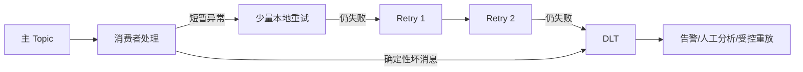

# Kafka 秒杀可靠性设计

## 1. 可靠性目标与语义

目标是：已被 Redis 成功受理的秒杀请求最终可进入 Kafka；Kafka 消息允许重复但不应静默丢失；重复消费不产生重复订单或重复扣减；消费失败可恢复、可追踪、可人工处置。

整体语义为：

```text
Redis → Kafka：至少一次投递
Kafka → Consumer：至少一次消费
Consumer → MySQL：业务结果等效一次
```

这里不宣称 Redis、Kafka、MySQL 之间具备端到端 exactly-once。Kafka 事务无法覆盖 Redis Lua 与 MySQL 本地事务；强行使用分布式事务会显著增加复杂度，也不是当前改造目标。

## 2. 消息不丢失

### 2.1 Redis Lua 到 Kafka

风险：Lua 已经扣减 Redis 库存并写入用户标记，应用在调用 Kafka 前宕机。

设计：Lua 同时原子写入 Redis Outbox。请求线程立即发送，后台恢复任务扫描超时未确认记录并重发。只有 broker 返回成功确认后才清理 Outbox。

关键规则：

- 消息在执行 Lua 前完整构建，`orderId/eventId` 不因重试变化。
- 发送失败或结果未知时保留 Outbox。
- 清理使用幂等 Lua，一次删除 Hash 数据与 ZSet 索引。
- Outbox 长时间滞留必须告警，不允许自动丢弃。
- Redis 开启 AOF 持久化、主从复制/集群高可用，并确保 Outbox key 不受淘汰策略影响。

### 2.2 Producer 到 Kafka broker

建议保障：

- `acks=all`。
- `enable.idempotence=true`。
- Topic 副本因子 3。
- `min.insync.replicas=2`。
- 禁止非同步副本强制成为 leader。
- 生产环境 Topic 预创建，不依赖自动创建。
- broker 磁盘、ISR 缩减、Under-Replicated Partitions 和 Produce 错误均有告警。

当 ISR 不足时，宁可发送失败并由 Outbox 重投，也不降低确认标准继续写入单副本。

### 2.3 Kafka 到 Consumer

- 关闭自动提交。
- 数据库事务成功后才手动提交 offset。
- 转移到 Retry Topic/DLT 时，目标写入获得 broker 确认后才提交来源 offset。
- 目标写入失败或确认结果未知时不提交来源 offset。

## 3. 重复消费

重复消息是至少一次系统的正常状态，常见来源包括：

- Producer 已发送成功但未收到确认，Outbox 再次发送。
- Kafka 客户端重试边界产生重复。
- MySQL 事务成功后应用在 offset 提交前宕机。
- Rebalance 导致未提交记录重新分配。
- 人工从 Retry Topic 或 DLT 重放。

防护机制：

1. `orderId` 主键保证同一订单事件不能重复插入。
2. `(user_id, voucher_id)` 唯一索引保证不同订单号也不能绕过一人一单。
3. 库存使用 `stock > 0` 条件更新。
4. 库存扣减与订单插入位于同一个 MySQL 本地事务。
5. 同 `orderId` 但业务字段不同视为数据污染，进入 DLT，不覆盖历史订单。

事务处理顺序必须确保唯一约束异常能回滚本次库存扣减。不能捕获插入异常后在同一事务内将库存扣减当成成功提交。

## 4. 消费失败

### 4.1 分层处理



- 本地重试：次数少、退避短，只处理瞬时故障。
- Retry Topic：延迟、削峰，防止坏消息长期阻塞主分区。
- DLT：有限次重试后的最终隔离区，必须关联告警和工单。

### 4.2 重试转移的原子性边界

“写 Retry Topic”和“提交来源 offset”不是一个原子动作。正确顺序是先确认 Retry Topic 写入，再提交来源 offset。

- Retry 写成功、来源 offset 提交失败：消息会重复进入 Retry Topic，可由幂等消费处理。
- 来源 offset 先提交、Retry 写失败：消息会丢失，因此禁止此顺序。

这仍是“宁可重复，不可静默丢失”的至少一次设计。

### 4.3 最终失败订单

进入 DLT 的事件要形成可查询的失败记录，至少包括：

- `eventId/orderId/userId/voucherId`。
- 原 Topic、partition、offset。
- 重试次数与失败分类。
- 首次、最后失败时间。
- 当前处置状态：待处理、已修复、已重放、已关闭。

失败记录可以先由 DLT 和日志承载；若运营需要检索和闭环，应后续增加专用失败订单表或管理端能力。无论采用哪种载体，都不得只打印日志后确认消息。

## 5. 服务重启恢复

### 5.1 Producer 服务重启

- 启动后恢复任务扫描 Redis Outbox 中超过确认阈值的事件。
- 使用相同 `orderId/eventId` 与 `userId` key 重投。
- 限流恢复，避免大量历史事件同时冲击 Kafka。
- 恢复期间新请求仍可正常写入，扫描游标和批次大小必须有上限。

### 5.2 Consumer 服务重启

- 从 Consumer Group 已提交的 offset 继续。
- MySQL 未提交的事务自动回滚，对应 offset 未确认，消息重新消费。
- MySQL 已提交但 offset 未确认的消息重新消费并命中幂等。
- 优雅停机时停止拉取新消息，等待当前事务完成到限定时间，然后离组。

### 5.3 Kafka broker 故障

- 只在 ISR 满足最小副本数时接受 `acks=all` 写入。
- leader 切换期间 Producer 由客户端重试，超过交付期限则保留 Outbox。
- 故障恢复后 Outbox 分批补发。

## 6. 故障矩阵

| 故障点 | 可能结果 | 恢复机制 | 是否可能重复 |
|---|---|---|---|
| Lua 执行前宕机 | 未预扣、无消息 | 用户可重新请求 | 否 |
| Lua 成功后、Producer 调用前宕机 | 已预扣、Kafka 无消息 | Outbox 扫描重投 | 否或一次以上投递 |
| broker 已写入、Producer 未收到确认 | Kafka 可能已有消息 | Outbox 重投同事件 | 是 |
| Kafka 成功、Outbox 清理失败 | Kafka 有消息、Outbox 仍在 | 再投后幂等清理 | 是 |
| 消费中 DB 事务失败 | 无订单提交 | 不提交 offset，重试 | 是 |
| DB 成功、offset 提交前宕机 | 订单已存在 | 重投后识别幂等 | 是 |
| Retry/DLT 写入失败 | 来源消息仍在 | 不提交来源 offset | 是 |
| Consumer Rebalance | 未确认消息重新分配 | 消费端幂等 | 是 |
| Redis 超出持久化保障的数据丢失 | 未发 Outbox 可能丢失 | 灾备/审计核对；非单机 Redis | 可能，属于明确故障边界 |

## 7. Redis 与 MySQL 状态偏差

Redis 预扣成功后，MySQL 最终可能因异常长期无法建单。生产方案需要明确补偿策略：

- 暂时故障：由重试链路恢复，不立即释放 Redis 资格。
- 最终失败：经人工或受控补偿流程确认 Kafka 与数据库状态后，再原子恢复 Redis 库存并移除用户标记。
- 补偿操作必须使用唯一补偿标识并可审计，不能因一次超时直接回滚。

直接在 Producer 发送失败回调中恢复库存是不安全的，因为发送结果可能未知，Kafka 中可能已经存在消息。

## 8. 可观测性与告警

### 8.1 必备指标

- `outbox_pending_count`、`outbox_oldest_age`、发送成功/失败/未知数量。
- Kafka Produce 延迟、错误率、ISR 数、未充分复制分区数。
- Consumer lag、最老消息年龄、消费成功率、offset 提交失败数。
- 本地重试、Retry Topic、DLT 数量与回流速率。
- 数据库事务 P95/P99、死锁、唯一约束冲突、库存条件更新失败数。

### 8.2 日志字段

所有关键日志统一包含：`traceId`、`eventId`、`orderId`、`userId`、`voucherId`、Topic、partition、offset、retryCount 和处理结果。日志不输出完整用户隐私数据。

### 8.3 对账

定期核对：Redis 已受理数量、Kafka 生产数量、Kafka 消费成功/失败数量、MySQL 新建订单数量与 DLT 数量。对账应以事件 ID 和订单 ID 为主，不只比较总数。

## 9. 可靠性验收演练

- 在 Lua 成功后强制终止 API 进程，验证 Outbox 可恢复。
- 注入 Produce 超时，验证不回补库存且同事件最终进入 Kafka。
- 在 MySQL 提交后、offset 提交前终止 Consumer，验证只生成一张订单。
- 注入数据库连接故障，验证有限重试、Retry Topic 与 DLT 路径。
- 重启 Consumer、触发 Rebalance，验证未提交消息可恢复。
- 暂停 Consumer 制造积压，再逐步恢复，验证限流、扩容和监控告警。
- 检查任一失败分支都不存在“提交 offset 后消息无处可查”的路径。
