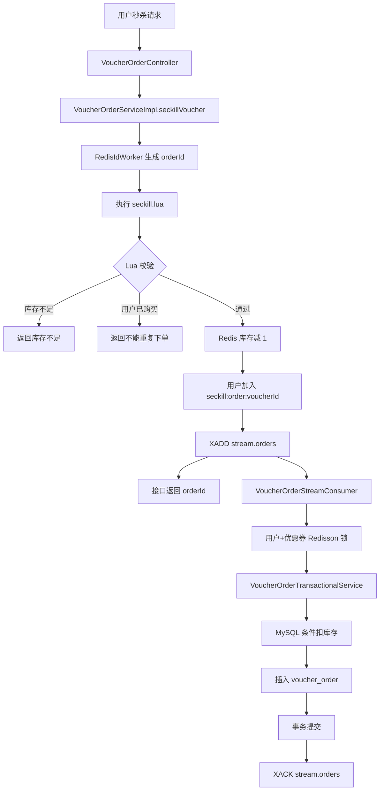
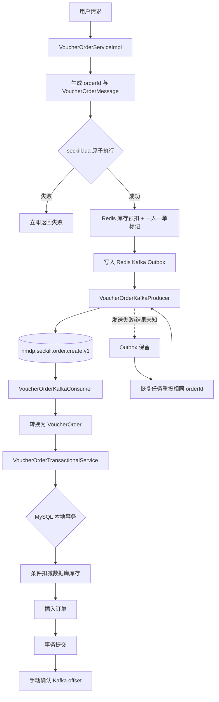

# Kafka 秒杀正式切换集成设计

## 1. 文档目标与边界

本文基于当前代码设计 Redis Stream 到 Kafka 的正式切换方案。本阶段只生成文档，不修改 Java、YAML、Lua、SQL 或依赖。

切换原则：

- 使用 `seckill.message.mode` 选择新订单事件写入 Redis Stream 或 Kafka。
- 默认保持 `redis`，确保升级发布不会自动改变现有业务流量。
- 灰度期间保留 Redis Stream 代码、数据和消费者，不做一次性删除。
- 同一条订单事件只选择一条主投递路径，不对 MySQL 进行无控制的双消费。
- Kafka 正式接单前，必须先替换当前“只打印后确认”的 Phase 1 Consumer。

## 2. 当前流程分析

### 2.1 当前完整链路



### 2.2 `VoucherOrderServiceImpl`

当前 `seckillVoucher(Long voucherId)` 的职责：

1. 从 `UserHolder` 取得 `userId`。
2. 通过 `RedisIdWorker` 生成 `orderId`。
3. 调用 `seckill.lua`，传入 `voucherId`、`userId`、`orderId`。
4. 根据 Lua 返回码响应库存不足、重复购买或受理成功。

它不直接创建数据库订单，也不显式调用消息组件。消息写入发生在 Lua 内部，因此当前请求线程只要收到 Lua 成功返回，就能确定 Redis 库存、一人一单标记和 Stream 消息已原子完成。

### 2.3 `seckill.lua`

当前脚本在 Redis 单次原子执行中完成：

1. 读取 `seckill:stock:{voucherId}`，检查库存。
2. 使用 `SISMEMBER seckill:order:{voucherId} userId` 检查一人一单。
3. `INCRBY` 预扣 Redis 库存。
4. `SADD` 写入已下单用户。
5. `XADD stream.orders` 写入 `id/userId/voucherId`。

库存预扣、用户标记和 Stream 事件处于同一个 Redis 原子边界，这是当前方案最重要的可靠性基础。

### 2.4 `VoucherOrderStreamConsumer`

当前组件启动单线程循环，并负责：

- 创建/复用 Redis Stream Consumer Group `g1`。
- 启动时优先恢复当前消费者的 Pending 消息。
- 读取 `stream.orders` 新消息。
- 将消息映射为 `VoucherOrder`。
- 获取 `lock:order:{userId}:{voucherId}` Redisson 锁。
- 调用 `VoucherOrderTransactionalService.createVoucherOrder()`。
- 事务成功后 ACK；ACK 结果不为 1 时视为失败。
- 使用 Redis Hash 记录失败次数，达到上限后通过 Lua 原子写失败 Stream并 ACK 原消息。

### 2.5 当前 Kafka Phase 1 状态

当前项目已经存在：

- `KafkaProducerConfig`、`KafkaConsumerConfig`。
- `VoucherOrderMessage`。
- `VoucherOrderKafkaProducer.sendOrderMessage()`。
- `VoucherOrderKafkaConsumer.listen()`。

但它们尚未形成订单业务链路：

- `VoucherOrderServiceImpl` 没有调用 Kafka Producer。
- Kafka Consumer 只打印消息，不调用订单事务服务。
- Consumer 使用 `ack-mode=record`，监听方法正常返回后会推进 offset。
- Producer 发送失败目前只有日志和异常 Future，没有持久化待投递记录。

因此，正式生产真实订单消息之前，必须先升级或禁用当前 Phase 1 Consumer。否则消息会被打印后确认，却不会创建订单，这是正式切换的 P0 阻断项。

## 3. 目标流程

### 3.1 Kafka 模式主链路



用户要求的逻辑主流程是：

```text
Lua
  ↓
Kafka Producer
  ↓
Kafka Consumer
  ↓
VoucherOrderTransactionalService
```

Redis Outbox 是 Lua 到 Producer 之间的可靠投递记录，不作为业务消息队列，也不使用 Redis Stream。

### 3.2 Redis 模式保留链路

当 `seckill.message.mode=redis` 时，继续执行当前逻辑：Lua 原子写 `stream.orders`，`VoucherOrderStreamConsumer` 消费并调用事务服务。该模式是初始默认值和灰度回滚路径。

## 4. 配置开关设计

### 4.1 主模式开关

按要求新增：

```yaml
seckill:
  message:
    mode: ${SECKILL_MESSAGE_MODE:redis}
```

合法值：

| 值 | 新订单事件写入路径 | 用途 |
|---|---|---|
| `redis` | `seckill.lua` 写 `stream.orders` | 默认、现网兼容、回滚 |
| `kafka` | `seckill.lua` 写 Kafka Outbox，服务调用 Producer | 正式 Kafka 链路 |

配置缺失时必须使用 `redis`。出现其他值应阻止应用启动或让 Lua 返回明确错误，不能默默跳过消息投递。

### 4.2 为什么消费者需要独立开关

只用一个模式开关同时控制“新消息写到哪里”和“旧消费者是否运行”会导致切换瞬间无法安全排空 Stream。因此建议补充两个生命周期开关：

```yaml
seckill:
  redis-stream:
    consumer-enabled: ${SECKILL_REDIS_STREAM_CONSUMER_ENABLED:true}
  kafka:
    consumer-enabled: ${SECKILL_KAFKA_CONSUMER_ENABLED:false}
```

- `message.mode` 只决定新请求的投递路径。
- `redis-stream.consumer-enabled` 决定是否继续排空历史 Stream/Pending。
- `kafka.consumer-enabled` 决定 Kafka Consumer 是否执行订单事务。

这样可以先启动 Kafka 消费能力，再切 Producer，最后等待 Redis Stream 排空后关闭旧消费者。辅助开关不增加新的业务模式。

### 4.3 建议的条件装配

- `VoucherOrderStreamConsumer`：由 `seckill.redis-stream.consumer-enabled=true` 控制，灰度期默认开启。
- `VoucherOrderKafkaConsumer`：由 `seckill.kafka.consumer-enabled=true` 控制，正式业务实现完成前默认关闭。
- Producer 和 Outbox 恢复组件：可常驻装配，但只有 `message.mode=kafka` 时接收新订单；恢复任务仍要处理切换前遗留 Outbox，不能仅因回滚到 redis 就丢弃待发送记录。

## 5. Lua 路由设计

### 5.1 推荐方式

保留一份资格校验逻辑，在 `seckill.lua` 中增加消息模式参数。库存判断、重复判断、库存预扣和用户标记保持不变，仅在最后一步选择投递介质：

```text
if mode == redis:
    XADD stream.orders
else if mode == kafka:
    HSET outbox:data orderId messageJson
    ZADD outbox:pending createTimestamp orderId
else:
    return 非法模式错误码
```

请求服务在执行脚本前构造完整、不可变的 `VoucherOrderMessage` JSON，并把模式、消息 JSON 和时间戳作为参数传入。Kafka 模式下，库存预扣、用户标记和 Outbox 写入必须由同一次 Lua 执行完成。

建议 Outbox key：

- `seckill:kafka:outbox:data`：Hash，field=`orderId`，value=消息 JSON。
- `seckill:kafka:outbox:pending`：ZSet，member=`orderId`，score=待投递时间戳。

### 5.2 不推荐方式

不应采用“Lua 只扣库存，Java 随后调用一次 `sendOrderMessage()`”的简单串联。应用可能在 Lua 成功与 Producer 调用之间宕机，从而出现 Redis 已扣库存、Kafka 没有订单消息且无法恢复。

也不应在 Producer 超时回调中立即恢复库存。超时可能发生在 broker 已写入但确认未返回之后，立即补库存可能与真实 Kafka 消息并发，造成超卖。

## 6. 代码改造点

以下是后续正式实施清单，本阶段不执行。

### 6.1 需要修改的类和方法

| 文件/类 | 方法或位置 | 改造内容 |
|---|---|---|
| `VoucherOrderServiceImpl` | `seckillVoucher(Long voucherId)` | 读取并校验 `seckill.message.mode`；创建 `VoucherOrderMessage`；将模式和消息传给 Lua；Kafka 模式成功后调用 Producer；Redis 模式维持现有返回语义 |
| `VoucherOrderServiceImpl` | 类注释和依赖 | 注入 Kafka Producer/模式配置，说明双模式；不要直接调用事务服务 |
| `seckill.lua` | 成功分支 | 保持资格校验不变；按模式执行 `XADD` 或原子写 Outbox；非法模式返回单独错误码 |
| `VoucherOrderKafkaProducer` | `sendOrderMessage()` | broker 确认成功后幂等删除 Outbox；失败/结果未知时保留；结构化记录 `orderId` 与发送元数据 |
| `VoucherOrderKafkaConsumer` | `listen()` | 从“仅打印”改为校验消息、构造 `VoucherOrder`、调用 `VoucherOrderTransactionalService`、业务成功后手动 ACK |
| `KafkaProducerConfig` | Producer 属性 | 增加幂等 Producer、交付超时等可靠性参数；保留 `acks=all` |
| `KafkaConsumerConfig` | Listener Factory | 从 `RECORD` 调整为正式链路的手动确认；配置有界重试与 DLT；禁止自动提交 |
| `VoucherOrderStreamConsumer` | 类装配条件 | 增加独立的 Stream Consumer 开关；内部消费、Pending、ACK 逻辑暂时不改 |
| `VoucherOrderTransactionalService` | `createVoucherOrder()` | 原事务边界原则上复用；可返回明确的创建/幂等结果，方便 Consumer 判断何时 ACK，不改变库存与订单同事务原则 |
| `RedisConstants` | 秒杀常量 | 新增 Outbox data/pending/status/补偿相关 key；Stream 常量灰度期保留 |
| `application.yaml` | 秒杀/Kafka 配置 | 新增主模式和两个消费者开关；补充正式 Topic、DLT 与可靠性参数 |

### 6.2 需要新增的类和资源

| 建议名称 | 职责 |
|---|---|
| `SeckillMessageModeProperties` | 将 `redis/kafka` 绑定为受校验枚举，避免散落字符串判断 |
| `VoucherOrderKafkaOutboxRepository` | 读取、抢占和幂等清理 Outbox 记录 |
| `VoucherOrderKafkaOutboxRecoveryJob` | 扫描超时未确认订单并限流重投相同事件 |
| `VoucherOrderKafkaFailureHandler` | 区分可重试/不可重试异常，并可靠写 Retry/DLT |
| `seckill-kafka-outbox-complete.lua` | 在 Kafka 确认后原子清理 Hash 和 ZSet |
| Kafka 集成测试 | 验证发送、消费、手动 ACK、重复消费、重启和 DLT |

不建议为了两个模式建立大而通用的消息框架。模式属性、Outbox 存取、恢复任务和失败处理是当前可靠切换所需的最小职责集合。

### 6.3 需要删除的 Redis Stream 内容

这些内容只在 Kafka 稳定、Stream 完全排空、回滚观察期结束后删除，不属于首次切换动作：

- `VoucherOrderStreamConsumer.java`。
- `seckill-record-failure.lua`。
- `RedisConstants` 中 `SECKILL_ORDER_STREAM_KEY`、Group、失败 Stream、重试 Hash 和最大重试次数。
- `application.yaml` 中 `hmdp.seckill.consumer-name` 与 Stream Consumer 开关。
- `VoucherOrderStreamConsumerTest` 等仅验证旧链路的测试。
- `seckill.lua` 中 `redis` 分支与 `XADD stream.orders`。
- 经对账和备份后的 `stream.orders`、Pending、失败 Stream 与重试 Hash 数据。

## 7. 四项一致性与可靠性保证

### 7.1 库存一致性

入口层：

- Redis Lua 原子检查并预扣库存，防止高并发请求穿透数据库。
- 投递意图与 Redis 预扣位于同一 Lua 原子边界：Redis 模式写 Stream，Kafka 模式写 Outbox。

落库层：

- MySQL 使用 `stock > 0` 条件更新作为不超卖最终防线。
- MySQL 库存扣减与订单插入处于同一事务；插入失败则库存回滚。

最终失败补偿：

- 可重试失败不立即恢复 Redis 库存。
- 进入 DLT 且确认不会继续自动消费后，先核对 MySQL 不存在订单，再通过幂等 Lua 恢复 Redis 库存并移除用户标记。
- 补偿需要唯一 `orderId` 防重标记；补偿后的 DLT 重放必须重新获取秒杀资格，不能直接创建订单。

### 7.2 一人一单

- Redis `seckill:order:{voucherId}` 集合负责入口快速判定。
- Kafka 使用 `userId` 作为 key，使同一用户消息进入同一分区。
- MySQL `(user_id, voucher_id)` 唯一索引是最终防线。
- 应用层查询只能减少冲突，不能替代数据库唯一索引。

### 7.3 消息可靠

- Lua 原子写 Outbox，消除 Lua 成功后进程宕机造成的不可恢复间隙。
- Producer 使用 `acks=all`、幂等发送、有限交付超时；Topic 生产配置使用 3 副本和 `min.insync.replicas=2`。
- 只有 broker 成功确认后才清理 Outbox；发送失败或结果未知由恢复任务重投同一 `orderId`。
- Consumer 关闭自动提交，业务成功后手动确认。
- Retry/DLT 写入成功后才确认来源消息；写入失败则来源消息保持未确认。

系统选择至少一次投递，允许重复但不允许静默丢失。Kafka 的幂等 Producer 不能代替 Redis Outbox，也不能代替消费端幂等。

### 7.4 消费幂等

- 同一 `orderId` 由订单主键约束阻止重复插入。
- 不同 `orderId` 但相同 `(userId, voucherId)` 由唯一索引阻止重复购买。
- 条件库存更新与订单插入同事务，唯一约束异常会回滚本次库存扣减。
- MySQL 成功但 offset 提交失败时，消息会再次消费并被识别为幂等成功，然后重新提交 offset。
- 同一 `orderId` 对应不同用户或优惠券时视为数据冲突，进入 DLT，不能覆盖原订单。

## 8. 灰度切换方案

### 阶段 0：正式消费能力就绪

配置：

```text
seckill.message.mode=redis
seckill.redis-stream.consumer-enabled=true
seckill.kafka.consumer-enabled=false
```

动作：

- 完成 Kafka Consumer 事务调用、手动确认、重试/DLT 和幂等测试。
- 完成 Outbox、恢复任务和 Producer 确认后清理。
- 准备 Topic、ACL、监控与对账。
- 确认当前 Phase 1 日志 Consumer 已禁用，避免提前确认真实消息。

门禁：在正式 Consumer 完成前，不允许秒杀入口发送真实 Kafka 订单事件。

### 阶段 1：Kafka 影子验证

- 保持 Redis 为唯一订单写入链路。
- 使用独立 shadow Topic 或独立 shadow Consumer Group 验证消息格式、分区、延迟和 Outbox 恢复。
- Shadow Consumer 只能校验和统计，不能与正式 Consumer 共享 group，也不能写 MySQL。

门禁：事件字段、数量、延迟和故障恢复达到目标；不存在打印后确认主 Topic 的消费者。

### 阶段 2：小流量 Kafka 灰度

- 部署少量 `message.mode=kafka` 的入口实例，并只路由明确的小比例流量。
- 开启正式 Kafka Consumer。
- 其他入口实例继续使用 `message.mode=redis`。
- Redis Stream Consumer 保持开启，处理 Redis 模式流量和历史 Pending。

两条链路会处理不同的新事件，但最终共享 Redis 库存和 MySQL 约束。持续按 `orderId` 对账 Redis 受理、Stream、Outbox、Kafka、数据库和 DLT。

门禁：Kafka 灰度订单创建率、延迟、重复命中、库存差异、Outbox 最老年龄和 DLT 均在阈值内。

### 阶段 3：Kafka 全量生产

配置：

```text
seckill.message.mode=kafka
seckill.redis-stream.consumer-enabled=true
seckill.kafka.consumer-enabled=true
```

- 所有新请求写 Kafka Outbox并发送 Kafka。
- Stream Consumer 暂时继续运行，用于排空切换前消息与 Pending。
- 记录最后一条 Redis 模式事件水位，确认 Stream 不再新增。

门禁：Stream 新消息为 0、PEL 为 0、失败 Stream 已处置；Kafka 链路稳定经过完整观察周期。

### 阶段 4：停止 Stream Consumer，但保留代码

配置：

```text
seckill.message.mode=kafka
seckill.redis-stream.consumer-enabled=false
seckill.kafka.consumer-enabled=true
```

- 不删除 Stream 代码和 Redis 数据。
- 保留快速回滚所需版本与操作手册。
- 继续对账 Kafka、MySQL、Outbox、DLT 和 Redis 库存。

### 阶段 5：观察期后清理

完成审批、备份和对账后，才删除 6.3 节列出的 Redis Stream 代码与数据。这一步应独立发布，不与全量切流同批执行。

## 9. 回滚方案

在阶段 2 至阶段 4 发现问题时：

1. 停止向 Kafka 分配新的秒杀入口流量，将 `seckill.message.mode` 切回 `redis`。
2. 保持 Kafka Consumer 运行，排空已经成功进入 Kafka 的事件；不能直接关停并遗留订单。
3. 确认 Redis Stream Consumer 为开启状态。
4. 保留 Outbox 恢复任务，继续重投切换前已被 Kafka 模式受理的事件。
5. 按 `orderId` 对账两个通道与 MySQL，依靠数据库幂等处理可能的重复。
6. 不删除 Kafka Topic、offset、Outbox 或 Stream 数据，直到事故分析完成。

回滚的是“新请求投递路径”，不是丢弃已经被 Kafka 路径受理的订单。

## 10. 实施验收清单

- `redis` 模式回归测试通过，当前 Stream 流程行为不变。
- `kafka` 模式下 Lua 成功后立即杀进程，Outbox 能恢复发送。
- Kafka Consumer 不再是打印空实现，并且业务失败不提交 offset。
- MySQL 提交后、offset 提交前杀进程，恢复后不重复订单、不重复扣库存。
- 相同用户和优惠券并发请求只生成一单。
- Producer 超时、broker leader 切换、数据库故障、Retry/DLT 失败均完成演练。
- 灰度期间两个 Consumer 的启停可独立控制。
- Stream 新消息、PEL 和失败记录完成核对后才允许停用旧消费者。
- Git 变更范围与实施清单一致，未提前删除 Redis Stream。
