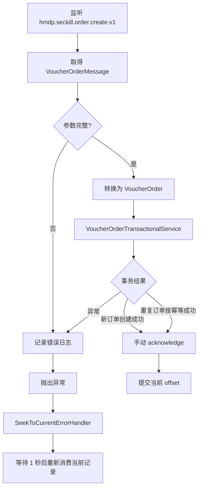

# Kafka 秒杀 Phase 2：Consumer 实现

## 1. 阶段目标

将 Phase 1 中仅打印消息的 `VoucherOrderKafkaConsumer` 升级为真实订单消费者，同时保持 Producer、秒杀入口、Lua 和 Redis Stream 链路不变。

本阶段只涉及：

- Kafka Consumer 业务实现。
- Kafka Consumer 容器配置。
- Consumer 单元测试。
- Kafka 秒杀文档与开发日志。

未切换或新增 `seckill.message.mode`，`VoucherOrderServiceImpl` 仍不会向 Kafka 发送真实秒杀订单消息。

## 2. 消费流程



## 3. `VoucherOrderKafkaConsumer` 改造

### 3.1 依赖

Consumer 通过构造器注入现有 `VoucherOrderTransactionalService`，不在 Kafka 监听器中直接操作 Mapper，也不复制库存扣减与订单插入逻辑。

### 3.2 Topic

监听声明：

```java
@KafkaListener(
        topics = "${hmdp.kafka.topics.voucher-order:hmdp.seckill.order.create.v1}",
        groupId = "${spring.kafka.consumer.group-id}",
        containerFactory = "voucherOrderKafkaListenerContainerFactory")
```

默认 Topic 为 `hmdp.seckill.order.create.v1`，保留现有配置覆盖能力。

### 3.3 参数校验

进入事务服务前校验：

- 消息对象不为空。
- `orderId` 不为空。
- `userId` 不为空。
- `voucherId` 不为空。
- `createTime` 不为空。

任一字段不符合要求时抛出 `IllegalArgumentException`，不调用订单服务、不调用 `acknowledge()`。

### 3.4 实体转换与事务调用

校验成功后，将消息转换为 `VoucherOrder`：

- `message.orderId` → `voucherOrder.id`
- `message.userId` → `voucherOrder.userId`
- `message.voucherId` → `voucherOrder.voucherId`
- `message.createTime` → `voucherOrder.createTime`

随后调用：

```java
transactionalService.createVoucherOrder(voucherOrder);
```

现有事务服务继续负责：

1. 验证订单核心字段。
2. 查询 `(user_id, voucher_id)` 是否已经存在。
3. 使用 `stock > 0` 条件更新数据库库存。
4. 插入订单。
5. 在同一个 MySQL 事务中提交或回滚库存和订单。

### 3.5 手动确认

监听方法增加 `Acknowledgment` 参数。调用顺序固定为：

```text
参数校验
  ↓
事务服务
  ↓
事务方法正常返回
  ↓
acknowledgment.acknowledge()
```

如果事务服务抛出异常，Consumer 只记录结构化错误日志并继续抛出，不执行 ACK。

## 4. Consumer 配置改造

### 4.1 禁止自动提交

继续保持：

```text
enable.auto.commit=false
```

### 4.2 ACK 模式

容器工厂和 YAML 均调整为 `MANUAL_IMMEDIATE`：

```text
spring.kafka.listener.ack-mode=manual_immediate
```

监听方法在 Consumer 线程调用 `acknowledge()` 时立即提交当前 offset。不会再像 Phase 1 的 `RECORD` 模式一样，仅因监听方法返回就自动确认。

### 4.3 反序列化异常

key 与 value 的反序列化器使用 `ErrorHandlingDeserializer` 包装：

- 正常 JSON 转换为 `VoucherOrderMessage`。
- 畸形 JSON 的异常保存在 Kafka record header 中，value 变为 `null`。
- Consumer 的空消息校验抛出异常，因此不会空提交 offset。

### 4.4 简单重试机制

当前不创建 Retry Topic，监听容器使用：

```text
SeekToCurrentErrorHandler
FixedBackOff(interval=1000ms, maxAttempts=UNLIMITED)
ackAfterHandle=false
```

消费异常后的行为：

1. Consumer 记录订单号、用户、优惠券、Topic、partition、offset 和异常堆栈。
2. 异常继续抛给容器。
3. 错误处理器将当前位置重新定位到失败记录。
4. 等待 1 秒后重新消费。
5. 整个失败路径不提交 offset。

阶段性取舍：永久坏消息会持续阻塞所属分区，但不会被静默越过。这符合当前“失败不提交、暂不实现复杂 Retry Topic”的要求。后续必须用有限本地重试、Retry Topic 和 DLT 替代无限阻塞。

## 5. 幂等设计

### 5.1 重复消息来源

- 数据库事务成功后，应用在 offset 提交前宕机。
- Consumer Rebalance 导致未确认消息重新投递。
- Producer 网络重试产生重复事件。
- 后续人工重放 Kafka 消息。

### 5.2 当前处理方式

复用 `VoucherOrderTransactionalService` 的幂等判断和数据库约束：

- 事务服务按 `(user_id, voucher_id)` 查询已有订单；存在时直接按幂等成功返回。
- 数据库唯一索引 `(user_id, voucher_id)` 处理并发查询同时未命中的竞态。
- `orderId` 主键阻止同一订单号重复插入。
- 唯一约束冲突发生时，MySQL 事务会回滚该次库存扣减。

事务服务正常返回代表“新建成功”或“重复消息已确认存在”，这两种结果都可以 ACK。异常则不 ACK。

应用层查询只能降低重复插入异常，最终保障仍是数据库唯一索引。

## 6. 修改文件

| 文件 | 修改内容 |
|---|---|
| `src/main/java/com/hmdp/kafka/consumer/VoucherOrderKafkaConsumer.java` | 参数校验、DTO 转换、调用事务服务、手动 ACK、异常日志与异常上抛 |
| `src/main/java/com/hmdp/config/kafka/KafkaConsumerConfig.java` | 手动确认、错误反序列化包装、固定退避无限重试 |
| `src/main/resources/application.yaml` | Consumer ACK 模式从 `record` 改为 `manual_immediate` |
| `src/test/java/com/hmdp/kafka/consumer/VoucherOrderKafkaConsumerTest.java` | 新增 Consumer 单元测试 |
| `docs/kafka-seckill/09_kafka_consumer_implementation.md` | Phase 2 实现说明 |
| `docs/kafka-seckill/10_kafka_consumer_test.md` | 测试记录 |
| `docs/kafka-seckill/development_log.md` | 开发记录 |

## 7. 未修改范围

- `VoucherOrderKafkaProducer` 未修改。
- `KafkaProducerConfig` 未修改。
- `VoucherOrderServiceImpl` 未修改。
- `VoucherOrderMessage` 未修改。
- `seckill.lua` 未修改。
- `VoucherOrderStreamConsumer` 及其测试未修改。
- `VoucherOrderTransactionalService` 及其事务逻辑未修改。
- 未增加或切换 `seckill.message.mode`。
- 未删除 Redis Stream 代码或 Redis key。

## 8. 当前结论

Kafka Consumer 已具备真实订单调用、手动 offset 和失败重试能力，但秒杀 Producer 尚未接入入口，因此现网业务仍走 Redis Stream。正式切流前仍需完成 Kafka broker 集成测试、有限重试/失败隔离以及 Consumer 灰度开关。
