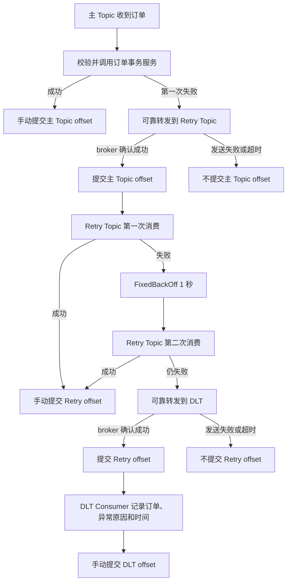

# Kafka 秒杀 Retry/DLT 设计

## 1. 改造目标与边界

本阶段只加固 Kafka Consumer 失败处理，解决原实现对当前分区无限重试的问题。Redis Stream 消费链路、`VoucherOrderServiceImpl` 秒杀入口、Lua 脚本、Kafka Producer 与消息模式均不修改、不切换。

## 2. 问题基线

Phase 2 使用 `FixedBackOff(1000, UNLIMITED_ATTEMPTS)` 在原分区无限重试。只要某条订单消息持续失败，该分区后续消息就永远无法推进；同时会重复访问数据库并持续产生异常日志，无法形成可观测、可人工处置的失败终态。

## 3. Topic 职责

| Topic | 职责 | 消费组 |
| --- | --- | --- |
| `hmdp.seckill.order.create.v1` | 接收正常秒杀订单创建事件 | `hmdp-seckill-order-create-v1` |
| `hmdp.seckill.order.retry.v1` | 隔离主链路失败消息，执行一次固定退避后的额外尝试 | `hmdp-seckill-order-retry-v1` |
| `hmdp.seckill.order.dlt.v1` | 保存重试耗尽的失败终态，供日志、告警、人工核对和受控重放 | `hmdp-seckill-order-dlt-log-v1` |

三个 Topic 必须配置相同或兼容的分区数量。本实现保持失败记录的原分区号和 `userId` key；如果 Retry/DLT 分区数少于主 Topic，失败转发将失败，源 offset 不会提交。

## 4. 有限重试流程

总业务尝试次数为三次：主 Topic 一次、Retry Topic 初次一次、Retry Topic 固定退避后再尝试一次。不存在无限重试。

## 5. offset 边界

- 正常消费：订单数据库事务正常结束后，由监听方法调用 `Acknowledgment.acknowledge()`。
- 主 Topic 失败：监听方法不 ACK；只有消息已获得 Retry Topic 的 broker 发送结果后，错误处理器才把源记录标记为已恢复并提交 offset。
- Retry 耗尽：监听方法不 ACK；只有消息已获得 DLT 的 broker 发送结果后，才提交 Retry Topic offset。
- 转发失败：可靠恢复器抛出异常，不把源消息视为已恢复，不应推进源 offset。
- DLT：失败信息完成日志记录后手动 ACK。

## 6. Spring Kafka 版本兼容说明

项目由 Spring Boot `2.3.12.RELEASE` 管理 Spring Kafka `2.5.14.RELEASE`。该版本尚未提供 `DefaultErrorHandler`；强行只升级 Spring Kafka 会突破本阶段范围，并可能造成 Boot 自动配置兼容问题。

因此本阶段采用该版本中语义等价的组合：

- `SeekToCurrentErrorHandler`
- `FixedBackOff`
- `DeadLetterPublishingRecoverer` 的可靠扩展
- `MANUAL_IMMEDIATE`
- `setCommitRecovered(true)`

未来整体升级到 Spring Boot 2.6+/对应 Spring Kafka 后，将两个 `SeekToCurrentErrorHandler` 替换为 `DefaultErrorHandler(recoverer, fixedBackOff)` 即可；Topic、监听器、确认边界和测试场景保持不变。

## 7. 幂等与顺序

Kafka 失败转发是至少一次语义，进程在数据库提交和 offset 提交之间退出时仍可能重复消费。订单服务继续复用订单主键与 `(user_id, voucher_id)` 唯一索引实现幂等；重试机制不能替代数据库唯一约束。

相同用户消息使用同一 key 并保持分区号，但失败消息进入独立 Topic 后，不保证与仍在主 Topic 中的后续消息形成跨 Topic 的全局顺序。秒杀订单创建依靠订单幂等和业务约束保证结果正确，不依赖跨 Topic 顺序。

## 8. 运维要求

- 监控主 Topic、Retry Topic 和 DLT 的 lag、转发失败率与 DLT 增量。
- DLT 出现记录时告警，并按 `orderId/userId/voucherId` 核对 MySQL 订单与 Redis 预扣状态。
- 禁止直接批量重放 DLT；修复根因后，使用原 `userId` key 进行受控重放。
- 当前 DLT 处理按任务要求记录日志，生产环境应接入集中日志平台并配置保留策略和告警。

