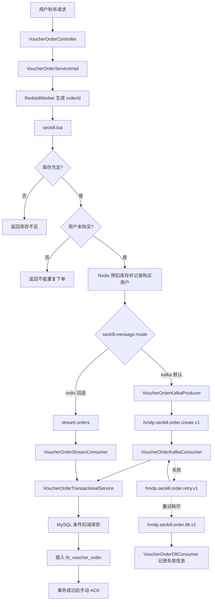
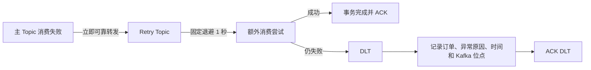

# Kafka 秒杀最终架构

## 1. 最终架构定位

当前秒杀模块采用“Redis 原子准入 + Kafka 异步削峰 + MySQL 本地事务落库”的结构。Kafka 是默认订单消息通道；Redis Stream 代码仍保留，通过 `seckill.message.mode=redis` 可灰度回退。

默认主链路：



## 2. 秒杀完整流程

1. Controller 接收已登录用户的秒杀请求，调用 `VoucherOrderServiceImpl.seckillVoucher(voucherId)`。
2. `RedisIdWorker` 生成全局订单 ID。
3. 服务在执行 Lua 前校验消息模式，只接受 `kafka` 或 `redis`。
4. `seckill.lua` 在 Redis 内原子完成库存判断、一人一单判断、库存预扣和购买用户标记。
5. Lua 返回 `1` 表示库存不足，返回 `2` 表示重复购买；只有返回 `0` 才继续投递消息。
6. Kafka 模式构造 `VoucherOrderMessage` 并发送到主 Topic；Redis 模式由 Lua 原子写入原 `stream.orders`。
7. Kafka Consumer 校验消息并转换为 `VoucherOrder`。
8. `VoucherOrderTransactionalService` 在一个 MySQL 事务内执行幂等查询、条件扣库存和订单插入。
9. 数据库事务成功或判断为重复消息的幂等成功后，Consumer 手动 ACK。
10. 业务失败不手动 ACK，由有限重试和 DLT 链路接管。

## 3. Producer 流程

```text
Lua 准入成功
  ↓
构造 VoucherOrderMessage
  ↓
使用 userId 字符串作为 Kafka key
  ↓
KafkaTemplate 异步发送主 Topic
  ↓
入口最多等待 10 秒取得 broker 结果
  ├─ 成功：记录 topic/partition/offset，返回 orderId
  └─ 异常或超时：记录错误，返回“秒杀服务繁忙”
```

消息字段为 `orderId`、`userId`、`voucherId`、`createTime`。使用 `userId` 作为 key，可以让同一用户的订单事件稳定进入同一分区，便于保持用户维度的消费顺序，同时避免全部按热门 `voucherId` 聚集到单一分区。

Producer 配置为字符串 key、JSON value、`acks=all`、`retries=3`。`VoucherOrderKafkaProducer` 返回 `ListenableFuture`，既记录异步回调日志，也允许秒杀入口等待 broker 确认。

## 4. Consumer 流程

```text
收到 ConsumerRecord
  ↓
校验 message/orderId/userId/voucherId/createTime
  ↓
转换为 VoucherOrder
  ↓
事务服务检查 userId + voucherId 是否已存在
  ├─ 已存在：按幂等成功返回
  └─ 不存在：条件扣减数据库库存并插入订单
  ↓
事务成功
  ↓
Acknowledgment.acknowledge()
```

主消费者组为 `hmdp-seckill-order-create-v1`。Retry Topic 使用独立组 `hmdp-seckill-order-retry-v1`，但复用相同的消息校验、实体转换、事务和 ACK 边界。

## 5. ACK 机制

- `enable-auto-commit=false`，监听容器使用 `MANUAL_IMMEDIATE`。
- 参数校验失败、反序列化失败或数据库事务异常时，业务监听器不调用 ACK，并继续抛出异常。
- 数据库事务正常完成后才手动 ACK，避免先提交 offset、后落库失败造成订单丢失。
- 已存在的 `(user_id, voucher_id)` 订单被事务服务判定为幂等成功，允许 ACK 重复消息。
- 主 Topic 或 Retry Topic 的失败消息只有在可靠恢复器确认成功转发到下一 Topic 后，错误处理器才提交源 offset；转发失败或超时会抛出异常，不错误提交。

## 6. 幂等方案

幂等由三层共同保证：

1. Redis Lua 使用 `seckill:order:{voucherId}` Set，在入口阶段阻止同一用户重复抢同一优惠券。
2. 事务服务落库前按 `userId + voucherId` 查询，重复消息直接按成功处理。
3. MySQL 唯一索引 `uk_voucher_order_user_voucher(user_id, voucher_id)` 是并发竞态下的最终防线；订单 ID 主键同时阻止同一订单重复插入。

Kafka 提供至少一次语义，业务通过上述幂等措施把重复投递收敛为“业务结果等效一次”。

## 7. Retry 与 DLT



- 主 Topic：`hmdp.seckill.order.create.v1`，承载正常订单创建事件。
- Retry Topic：`hmdp.seckill.order.retry.v1`，隔离暂时性失败，避免永久占用主分区。
- DLT：`hmdp.seckill.order.dlt.v1`，保存重试耗尽的失败终态，当前由 `VoucherOrderDltConsumer` 记录日志并交给人工判断，不自动补单。
- 当前 Spring Kafka 2.5.14 使用 `SeekToCurrentErrorHandler + FixedBackOff` 实现有限重试，语义等价于该版本可实现的有限错误处理方案。

## 8. 灰度回退与当前边界

`seckill.message.mode` 默认是 `kafka`，可通过 `SECKILL_MESSAGE_MODE=redis` 回退。Kafka 模式下 Lua 不写 Redis Stream，Redis 模式下入口不发送 Kafka，因此单次请求不会双写。保留 Stream Consumer 可以继续处理切换前的存量消息。

当前实现没有引入 Outbox 或分布式事务。Redis Lua 成功与 Kafka 发送属于两个系统，`acks=all`、Producer 重试和入口等待 broker 结果只能缩小跨系统不一致窗口，不能提供绝对原子性。若未来可靠性目标要求消除该窗口，应单独评估轻量 Outbox/补偿机制。

## 9. 已验证基线

- 完整 `mvn test`：25 个测试，0 失败，0 错误，1 个环境测试按设计跳过，构建成功。
- 显式真实 Kafka 联调：2 个测试全部通过。
- 已覆盖入口、Lua 模式参数、Producer、真实 broker、Consumer、事务服务调用、手动 ACK、Retry/DLT 路由和 Redis Stream 回退。

