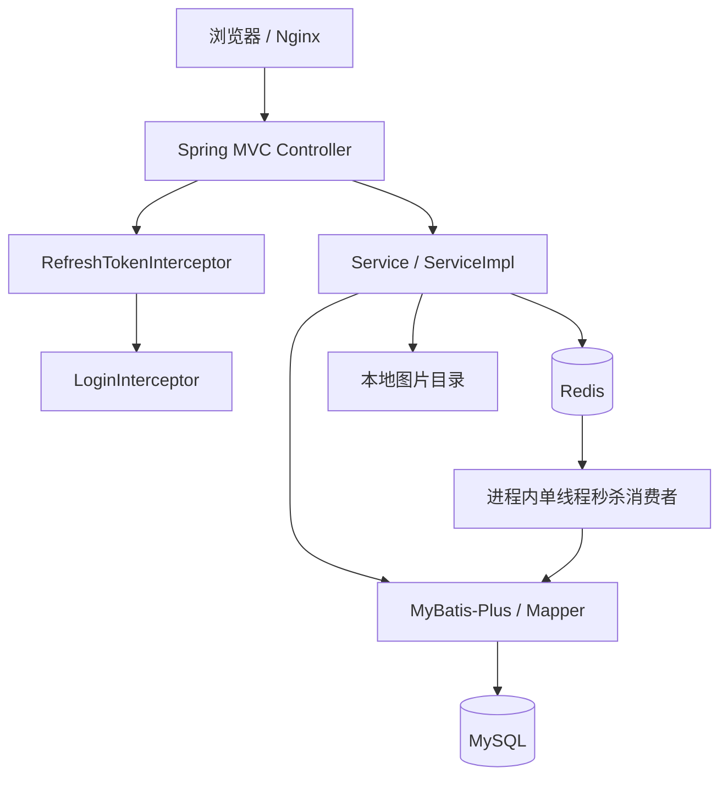

# 架构与代码结构分析

## 1. 总体形态

当前系统是单 Maven 模块、单进程部署的 Spring Boot 单体应用。Controller、Service、Mapper、实体都位于 `com.hmdp` 包内，MySQL 是业务事实源，Redis 同时承担登录态、缓存、社交集合、地理索引、ID 序列、分布式锁和秒杀消息队列。



没有独立领域模块、消息中间件、搜索服务、CDC 管道或后台管理边界。部分 Controller 直接使用 MyBatis-Plus 的链式查询，分层约束并不严格。

## 2. 包结构与职责

| 包/目录 | 数量 | 职责 |
| --- | ---: | --- |
| `controller` | 9 | HTTP API |
| `service` | 10 | Service 接口 |
| `service.impl` | 10 | 业务实现与 MyBatis-Plus ServiceImpl |
| `mapper` | 10 | MyBatis-Plus BaseMapper |
| `entity` | 10 | 表映射实体 |
| `dto` | 5 | 登录、用户、安全输出、滚动分页、统一响应 |
| `config` | 4 | MVC、MyBatis、Redisson、异常处理 |
| `utils` | 12 | Redis 缓存/ID/锁、拦截器、ThreadLocal、正则等 |
| `resources/mapper` | 1 | Voucher 自定义联表 SQL |
| `resources/*.lua` | 2 | 秒杀原子准入、锁安全释放 |

## 3. Controller 层

| Controller | 基础路径 | 主要接口与职责 |
| --- | --- | --- |
| `UserController` | `/user` | 验证码、登录、未完成的登出、当前用户、用户资料、签到 |
| `ShopController` | `/shop` | 店铺详情、新增、更新、按类型/距离查询、名称模糊查询 |
| `ShopTypeController` | `/shop-type` | 店铺类型列表；直接在 Controller 查询数据库 |
| `VoucherController` | `/voucher` | 新增普通券/秒杀券、查询店铺优惠券 |
| `VoucherOrderController` | `/voucher-order` | 秒杀下单入口 `POST /voucher-order/seckill/{id}` |
| `BlogController` | `/blog` | 发布、点赞、热门、详情、作者笔记、关注流 |
| `FollowController` | `/follow` | 关注/取关、关注判断、共同关注 |
| `UploadController` | `/upload` | 博客图片上传和删除，直接访问本地文件系统 |
| `BlogCommentsController` | `/blog-comments` | 空壳 Controller，暂无业务接口 |

边界观察：

- `ShopController.queryShopByName`、`ShopTypeController.queryTypeList`、`BlogController` 的部分查询直接拼装 ORM 查询，业务规则散落在 Controller。
- `/voucher/**`、`/shop/**` 和 `/upload/**` 全部绕过登录拦截，因此新增/更新店铺、创建优惠券和文件删除也可匿名调用；这是权限边界风险。
- `UploadController` 的删除操作使用 GET，不符合 HTTP 语义，并且上传根目录硬编码。

## 4. Service 层

| 接口 | 实现 | 主要职责 |
| --- | --- | --- |
| `IUserService` | `UserServiceImpl` | 验证码登录、用户自动注册、Redis Token、签到 |
| `IUserInfoService` | `UserInfoServiceImpl` | 用户扩展信息通用 CRUD |
| `IShopService` | `ShopServiceImpl` | 店铺缓存、更新失效、分类与 GEO 查询 |
| `IShopTypeService` | `ShopTypeServiceImpl` | 店铺类型通用 CRUD |
| `IVoucherService` | `VoucherServiceImpl` | 店铺券查询、创建秒杀券并写 Redis 库存 |
| `ISeckillVoucherService` | `SeckillVoucherServiceImpl` | 秒杀券明细通用 CRUD |
| `IVoucherOrderService` | `VoucherOrderServiceImpl` | Lua 秒杀准入、Stream 消费、订单落库 |
| `IBlogService` | `BlogServiceImpl` | 博客、点赞排行、Feed 推送与滚动分页 |
| `IFollowService` | `FollowServiceImpl` | 关注关系、Redis Set、共同关注 |
| `IBlogCommentsService` | `BlogCommentsServiceImpl` | 当前仅通用 CRUD，无显式业务方法 |

所有实现都继承 MyBatis-Plus `ServiceImpl`。好处是 CRUD 简洁；代价是任意层都容易绕过领域服务直接访问数据库，后续接入 ES、Canal 和 Kafka 时需要明确唯一写入口和事件边界。

## 5. Mapper 层

10 个 Mapper 均继承 `BaseMapper<T>`：

`UserMapper`、`UserInfoMapper`、`ShopMapper`、`ShopTypeMapper`、`VoucherMapper`、`SeckillVoucherMapper`、`VoucherOrderMapper`、`BlogMapper`、`BlogCommentsMapper`、`FollowMapper`。

只有 `VoucherMapper` 声明自定义方法 `queryVoucherOfShop(shopId)`，对应 `resources/mapper/VoucherMapper.xml`，通过 `tb_voucher LEFT JOIN tb_seckill_voucher` 同时返回券基础信息及瞬时字段 `stock/beginTime/endTime`。MyBatis 分页插件固定为 MySQL 方言。

## 6. 核心实体

| 实体 | 表 | 核心含义 |
| --- | --- | --- |
| `User` | `tb_user` | 手机号、密码、昵称、头像 |
| `UserInfo` | `tb_user_info` | 城市、简介、粉丝/关注数、等级等 |
| `Shop` | `tb_shop` | 店铺名称、分类、地址、经纬度、价格、销量、评分 |
| `ShopType` | `tb_shop_type` | 店铺分类与排序 |
| `Voucher` | `tb_voucher` | 优惠券基础信息；秒杀库存/时段是非表字段 |
| `SeckillVoucher` | `tb_seckill_voucher` | 秒杀库存、开始和结束时间 |
| `VoucherOrder` | `tb_voucher_order` | 用户券订单、支付/核销/退款状态 |
| `Blog` | `tb_blog` | 探店笔记、图片、点赞与评论计数 |
| `BlogComments` | `tb_blog_comments` | 评论及回复关系 |
| `Follow` | `tb_follow` | 用户关注关系 |

## 7. 核心业务流程

### 7.1 验证码登录

验证码发送：

```text
POST /user/code
  ↓ UserController
UserServiceImpl 校验手机号并生成 6 位验证码
  ↓ SET login:code:{phone}，TTL 2 分钟
Redis
  ↓
DEBUG 日志输出验证码（未接短信供应商）
```

登录与鉴权：

```text
POST /user/login
  ↓ UserController
UserServiceImpl
  ↓ GET login:code:{phone}
Redis 校验验证码
  ↓ 按 phone 查询，不存在则创建
MySQL tb_user
  ↓ 生成随机 token，写 Hash
Redis login:token:{token}
  ↓
客户端收到 token
  ↓ 后续请求 authorization 请求头
RefreshTokenInterceptor → Redis → UserHolder(ThreadLocal)
  ↓
LoginInterceptor 判断是否放行
```

现状问题：验证码仅写日志、成功登录后未删除验证码、没有发送频率/失败次数限制、Token 约 25 天滑动有效、登出未实现、没有角色与管理权限模型。

### 7.2 店铺详情查询

```text
GET /shop/{id}
  ↓ ShopController
ShopServiceImpl.queryById
  ↓ CacheClient.queryWithPassThrough
GET cache:shop:{id}
  ├─ 命中 JSON → 返回店铺
  ├─ 命中空字符串 → 返回“店铺不存在”
  └─ 未命中 → MySQL tb_shop
                 ├─ 不存在 → Redis 写空值 2 分钟
                 └─ 存在 → Redis 写 JSON 30 分钟 → 返回
```

更新流程为 MySQL 更新后删除 `cache:shop:{id}`。当前启用的是缓存穿透防护；互斥锁和逻辑过期实现存在于 `CacheClient`，但在 `ShopServiceImpl` 中被注释，没有进入活动链路。

### 7.3 店铺列表与搜索

- 无坐标的分类查询：Controller → Service → MySQL 按 `type_id` 分页。
- 带坐标的附近店铺：Redis `shop:geo:{typeId}` 做半径 5km 和距离排序 → MySQL 按 ID 批量回表 → 附加 distance。
- 名称查询：Controller → MyBatis-Plus `LIKE name` → MySQL 分页；没有 ES。
- 店铺类型列表：Controller → MySQL 按 `sort` 排序；没有 Redis 缓存。

### 7.4 优惠券秒杀

简图如下，完整分析见 `04_seckill_current_flow.md`：

```text
用户请求
  ↓ VoucherOrderController
VoucherOrderServiceImpl
  ↓ RedisIdWorker + seckill.lua
Redis：校验/预扣/一人一单/XADD stream.orders
  ↓ 立即返回订单 ID
单线程 Stream Consumer
  ↓ Redisson 用户锁
MySQL 条件扣库存
  ↓
MySQL 创建订单
```

这是异步落库模型，但消息队列是 Redis Stream，不是 Kafka。

## 8. 横切能力

- 认证：两个 MVC Interceptor，先恢复用户与续期，再执行登录校验。
- 异常：只捕获 `RuntimeException`，对外统一“服务器异常”，内部记录堆栈。
- 事务：店铺更新和新增秒杀券标注事务；当前异步订单创建没有事务。
- ID：Redis 日计数器 + 时间戳拼接 64 位 ID。
- 锁：Redisson 用于订单；自研 Lua 安全解锁实现保留，但活动订单链路使用 Redisson。
- 线程：缓存重建固定 10 线程；秒杀消费固定单线程；都由静态 ExecutorService 创建，未纳入 Spring 生命周期和指标体系。

## 9. 架构结论

当前架构适合单机课程演示，已经覆盖缓存穿透、Redis GEO、Bitmap、ZSet Feed、Lua 原子操作和 Stream 异步下单等典型模式。进入可扩展版本前，第一优先级不是直接增加中间件，而是先修复秒杀消息确认、事务、幂等与初始化闭环；随后再把搜索读模型、CDC 缓存失效和 Kafka 订单事件拆成明确边界。

