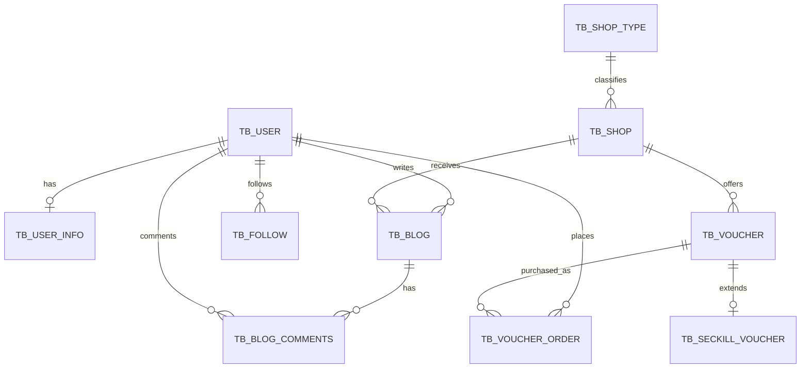

# 数据库分析

## 1. 数据库基线

- 数据源：MySQL，数据库名配置为 `hmdp`。
- SQL 导出源版本：MySQL `5.6.22`，源 schema 标注为 `hmdp2`；SQL 文件本身不包含 `CREATE DATABASE/USE`，应由部署过程指定导入目标。
- 存储引擎：全部 InnoDB。
- 字符集：全部 `utf8mb4`，但列级排序规则混用 `utf8mb4_general_ci` 和 `utf8mb4_unicode_ci`。
- 表数量：10。
- Schema 管理：仅有全量 SQL dump，无 Flyway/Liquibase 迁移记录。
- 外键：脚本没有实际 `FOREIGN KEY` 约束，关联完整性依赖应用。

## 2. 表清单

| 表 | 主键 | 已有索引 | 用途与关键关系 |
| --- | --- | --- | --- |
| `tb_user` | `id` 自增 | `UNIQUE(phone)` | 用户主表；登录按手机号查询 |
| `tb_user_info` | `user_id` | 主键 | 与用户逻辑 1:1 |
| `tb_shop_type` | `id` 自增 | 主键 | 店铺分类 |
| `tb_shop` | `id` 自增 | `INDEX(type_id)` | 店铺；逻辑关联分类 |
| `tb_voucher` | `id` 自增 | 主键 | 普通券/秒杀券公共信息；逻辑关联店铺 |
| `tb_seckill_voucher` | `voucher_id` | 主键 | 与券逻辑 1:1；库存和生效时段 |
| `tb_voucher_order` | `id`（应用生成） | 主键 | 用户购买优惠券订单 |
| `tb_blog` | `id` 自增 | 主键 | 探店笔记；逻辑关联用户和店铺 |
| `tb_blog_comments` | `id` 自增 | 主键 | 博客评论和层级回复 |
| `tb_follow` | `id` 自增 | 主键 | 用户关注关系 |

## 3. 逻辑关系

图中均为应用层逻辑关系，不代表数据库已经创建外键。

## 4. 核心数据访问

### 用户

- 登录通过 `tb_user.phone` 唯一索引查询。
- 新手机号验证码登录会即时插入用户。
- 用户扩展信息独立存储在 `tb_user_info`。

### 店铺与搜索

- 详情按 `tb_shop.id` 查询。
- 分类列表利用 `type_id` 索引。
- 名称搜索使用 `%keyword%` 风格 `LIKE`，现有普通索引无法有效承担前导模糊匹配。
- 附近查询先从 Redis GEO 得到 ID，再用 `IN (...) ORDER BY FIELD(...)` 回表。

### 优惠券与订单

- `VoucherMapper.xml` 联结 `tb_voucher` 和 `tb_seckill_voucher`，筛选 `v.shop_id` 与 `v.status=1`。
- 秒杀消费者执行 `UPDATE tb_seckill_voucher SET stock=stock-1 WHERE voucher_id=? AND stock>0`，再插入 `tb_voucher_order`。
- Redis 库存用于入口准入，MySQL 库存用于最终防超卖。

### 博客与关注

- 热门博客按 `liked DESC` 分页，当前无对应索引。
- 用户博客按 `user_id` 分页，当前无对应索引。
- 粉丝推送查询 `tb_follow.follow_user_id`，关注判断查询 `(user_id, follow_user_id)`，当前均无组合索引。

## 5. 事务现状

| 写流程 | 事务状态 | 结论 |
| --- | --- | --- |
| 新增秒杀券：券表 + 秒杀券表 + Redis 库存 | 方法有 `@Transactional` | 两张 MySQL 表可一起回滚；Redis 写入不参与事务，仍可能双写不一致 |
| 更新店铺 + 删除 Redis 缓存 | MySQL 方法有 `@Transactional` | Redis 删除发生在事务方法内部，数据库提交失败/提交时序仍可能与缓存不一致 |
| 秒杀订单：MySQL 库存扣减 + 订单插入 | 私有方法无 `@Transactional` | 两条语句可能分别提交，存在扣库存成功但订单失败 |
| 关注/取关 + Redis Set | 无跨资源事务 | 数据库成功后 Redis 失败会不一致 |
| 点赞计数 + Redis ZSet | 无跨资源事务 | 数据库与点赞成员集合可能不一致 |

## 6. 索引与约束缺口

### P0：秒杀幂等约束

`tb_voucher_order` 只有订单主键，没有 `UNIQUE(user_id, voucher_id)`。应用中的“先查再插”无法替代数据库最终唯一约束。Kafka/Stream 都可能重复投递，后续必须以数据库唯一键或独立幂等表兜底。

### P1：建议按查询验证的候选索引

以下是规划建议，实施前需用真实数据量和 `EXPLAIN` 验证列顺序：

- `tb_voucher(shop_id, status)`：店铺可用券列表。
- `tb_follow(user_id, follow_user_id)` 唯一索引：防重复关注，并支持关注判断。
- `tb_follow(follow_user_id, user_id)`：粉丝列表与 Feed 推送。
- `tb_blog(user_id, id)`：用户笔记分页。
- `tb_blog(liked, id)`：热门排序；若数据量增长，更适合专用排行/搜索读模型。
- `tb_blog_comments(blog_id, parent_id, create_time)`：评论树查询。
- `tb_voucher_order(voucher_id, create_time)`：券维度订单统计。

名称模糊搜索不建议仅靠新增 B-Tree 索引解决，应迁移到 Elasticsearch。

## 7. 数据模型风险

- 无实际外键，也没有统一软删除/数据状态策略，容易产生孤儿记录。
- `tb_follow` 缺少唯一约束，可插入重复关注。
- `tb_voucher_order` 缺少业务唯一约束，是消息化改造的首要阻塞项。
- `tb_seckill_voucher` 使用 `'0000-00-00 00:00:00'` 默认值；迁移到启用严格 SQL 模式的较新 MySQL 时需清理。
- `timestamp` 与应用 `LocalDateTime` 混用，JDBC URL 固定 `serverTimezone=UTC`，而业务运行时区为 Asia/Shanghai；秒杀起止时间需做端到端时区验证。
- `Voucher.stock/beginTime/endTime` 是 `@TableField(exist=false)`，依赖自定义联表查询填充；普通 `getById` 不会得到这些字段。
- 缺少 `version` 或事件序列字段，Canal 消费乱序/重复时难以做版本比较。
- 缺少数据库迁移工具，后续 Kafka 幂等索引、AI 审计表和 ES 同步字段无法形成可追踪发布历史。

## 8. 面向后续改造的数据准备

1. 引入版本化迁移，第一份迁移只做安全索引/约束，并在加唯一键前清理重复数据。
2. 为 `tb_voucher_order(user_id, voucher_id)` 建唯一约束，以订单 `id` 作为消息幂等键。
3. 明确 MySQL 为店铺和订单的事实源；ES 与 Redis 都是可重建读模型。
4. 为 Canal 启用 ROW 模式 binlog，并保证主键、变更前后镜像和保留期满足重放。
5. 对店铺搜索定义稳定的索引文档版本与别名，不把 ES 反向当写库。
6. AI 助手新增的对话、工具调用、审批与成本数据应使用独立表/库，不混入交易表。

