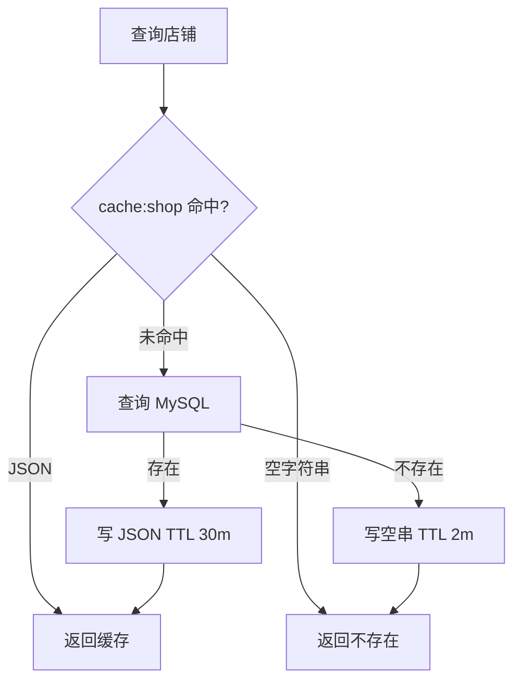

# Redis 使用分析

## 1. 总览

Redis 当前承担 8 类职责：验证码、登录会话、店铺缓存、分布式锁、秒杀库存与资格、秒杀 Stream、社交 Feed/点赞/关注、GEO/Bitmap/ID 计数。所有业务默认使用本机 `6379`，没有命名空间、环境前缀、集群/哨兵配置或统一 key 版本。

## 2. Key 设计清单

| Key 模式 | 数据结构 | 用途 | 写入位置 | 读取/删除位置 | 生命周期 |
| --- | --- | --- | --- | --- | --- |
| `login:code:{phone}` | String | 6 位短信验证码 | `UserServiceImpl.sendCode` | `UserServiceImpl.login` | 2 分钟；登录成功不主动删除 |
| `login:token:{token}` | Hash | `UserDTO` 登录态 | `UserServiceImpl.login` | `RefreshTokenInterceptor` 读取并续期 | 36000 分钟滑动过期，约 25 天 |
| `cache:shop:{shopId}` | String(JSON/空串) | 店铺详情与空值缓存 | `CacheClient` | `CacheClient` 读取；`ShopServiceImpl.update` 删除 | 正常值 30 分钟；空值 2 分钟 |
| `lock:shop:{shopId}` | String | 缓存重建互斥锁 | `CacheClient.tryLock` | `CacheClient.unlock` | 10 秒；仅备用的互斥/逻辑过期方法使用，当前主查询未启用 |
| `seckill:stock:{voucherId}` | String 数字 | Redis 预扣库存 | `VoucherServiceImpl.addSeckillVoucher` | `seckill.lua` 读取并 `INCRBY -1` | 无 TTL，无启动回填 |
| `seckill:order:{voucherId}` | Set | 已获秒杀资格的 userId，一人一单 | `seckill.lua` | `seckill.lua` `SISMEMBER` | 无 TTL，无活动结束清理 |
| `stream.orders` | Stream | 秒杀订单事件 | `seckill.lua` `XADD` | `VoucherOrderServiceImpl` 消费 | 无 TTL、无 MAXLEN；组 `g1` 需人工创建 |
| `lock:order:{userId}` | Redisson 锁结构 | 异步落库时按用户互斥 | Redisson `tryLock` | `VoucherOrderServiceImpl.createVoucherOrder` | 成功 unlock 或 watchdog/连接状态处理；由 Redisson 管理 |
| `icr:{biz}:{yyyy:MM:dd}` | String 数字 | 分布式 ID 日序列，如 `icr:order:2026:09:05` | `RedisIdWorker.nextId` | 同位置 `INCR` | 无 TTL，永久累积日 key |
| `blog:liked:{blogId}` | ZSet | 点赞 userId，score 为点赞时间 | `BlogServiceImpl.likeBlog` | 博客详情、点赞、Top 5 | 无 TTL |
| `feed:{userId}` | ZSet | 收件箱 blogId，score 为发布时间 | `BlogServiceImpl.saveBlog` | `queryBlogOfFollow` 滚动分页 | 无 TTL、无长度裁剪 |
| `follows:{userId}` | Set | 当前用户关注的 userId | `FollowServiceImpl.follow` | 共同关注求交集 | 无 TTL；关注判断仍查 MySQL |
| `shop:geo:{typeId}` | GEO/ZSet | 店铺坐标与距离排序 | 仅测试 `loadShopData`/人工初始化 | `ShopServiceImpl.queryShopByType` | 无 TTL，无生产同步 |
| `sign:{userId}:{yyyyMM}` | Bitmap/String | 月度签到位图 | `UserServiceImpl.sign` | `signCount` | 无 TTL；按月永久保留 |

测试代码还会写 `hl2` HyperLogLog；它不属于生产业务 key。

## 3. 店铺缓存策略

当前活动策略是 Cache Aside + 空值防穿透：



更新策略：

```text
PUT /shop
  ↓
MySQL updateById
  ↓
DEL cache:shop:{id}
```

已有但未启用的策略：

- `queryWithMutex`：用 `lock:shop:{id}` 防击穿，失败后递归重试。
- `queryWithLogicalExpire`：返回旧值，由固定线程池异步重建。

## 4. 缓存与一致性风险

| 等级 | 风险 | 影响 |
| --- | --- | --- |
| P0 | Stream ACK 对 `s1` 而不是 `stream.orders` | 消息不出 Pending List，可能反复处理/死循环 |
| P0 | 秒杀 Redis 预扣成功后，数据库失败没有补偿 | Redis 库存、资格集合和数据库订单不一致 |
| P1 | 外部写 MySQL 不会删除店铺缓存 | Canal 接入前可能保留脏数据至 TTL |
| P1 | 更新事务内立即删缓存，存在并发读回填旧值窗口 | 更新后仍可能重新出现旧缓存 |
| P1 | `shop:geo` 无生产初始化和增量维护 | 新增、修改坐标、删除店铺后 GEO 失真 |
| P1 | 多个永久 key 无清理/裁剪 | Stream、Feed、点赞、签到、ID 计数持续增长 |
| P1 | 登录 Token TTL 约 25 天且登出不删 key | 会话暴露窗口过长 |
| P2 | key 常量与硬编码混用 | `seckill:order`、`stream.orders`、`follows`、`lock:order` 难统一治理 |
| P2 | 没有环境/应用前缀 | 多环境共用 Redis 时可能冲突 |

## 5. 并发控制分析

- `seckill.lua` 将查库存、查重、预扣、记录资格和写 Stream 放在一次 Redis 原子脚本中，入口层原子性较好。
- `SimpleRedisLock` 使用随机进程标识 + 线程 ID，并通过 `unlock.lua` 比较后删除，能避免误删；当前订单活动链路改用 Redisson。
- `CacheClient` 的内部互斥锁只存固定值 `1`，删除锁不是 compare-and-delete；锁过期后旧线程可能删除新线程的锁。由于主店铺查询没有启用该方法，属于潜在风险。
- Redisson 单机地址与 Spring Redis 配置分离，切换密码、主机或集群时容易只改到一处。

## 6. Canal 改造前的 Key 治理建议

1. 统一前缀：`hmdp:{env}:{domain}:...`，将所有 key 定义集中到 key builder。
2. 店铺事实源固定为 MySQL；Canal 消费者只做删除/版本化更新 Redis 和同步 ES。
3. 对 `stream.orders` 设置可观测的长度/Pending 指标和保留策略；Kafka 上线后明确其作为 Redis Outbox 还是下线。
4. 秒杀活动结束后按活动维度清理库存与资格 key，但清理前保留审计/对账窗口。
5. 对 Feed 做按数量或时间裁剪；对 ID 日计数设置足够长 TTL；签到按合规/产品要求设置保留期。
6. 缓存 TTL 增加随机抖动，避免批量过期；热点 key 再选择互斥或逻辑过期策略。
7. 建立指标：命中率、空值命中、重建次数、锁等待、内存占用、Stream lag/Pending、慢命令和大 key。

