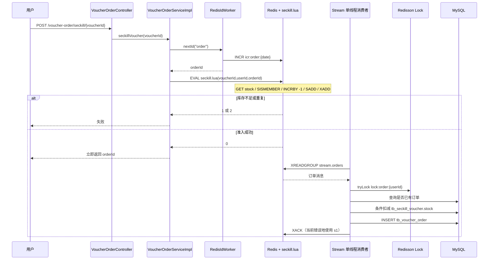

# 优惠券秒杀当前流程

## 1. 相关组件定位

| 组件 | 当前职责 |
| --- | --- |
| `VoucherController` | 管理优惠券：创建秒杀券、创建普通券、查询店铺券；不是用户秒杀入口 |
| `VoucherOrderController` | 用户秒杀入口：`POST /voucher-order/seckill/{id}` |
| `VoucherServiceImpl` | 创建秒杀券时同时写 `tb_voucher`、`tb_seckill_voucher` 和 Redis 库存 |
| `VoucherOrderServiceImpl.seckillVoucher` | 生成订单 ID，执行 Lua 准入，成功后立即返回订单 ID |
| `seckill.lua` | 原子检查库存/重复下单，Redis 预扣库存并写 Stream |
| `VoucherOrderHandler` | 应用启动后由单线程循环消费 Redis Stream |
| `createVoucherOrder(VoucherOrder)` | Redisson 加锁、数据库查重、条件扣库存、保存订单 |
| `RedisIdWorker` | 基于 UTC 秒时间戳和 Redis 日计数生成 64 位订单 ID |
| `SeckillVoucherMapper` | 秒杀库存数据库访问（通过 MyBatis-Plus） |
| `VoucherOrderMapper` | 订单数据库访问（通过 MyBatis-Plus） |

## 2. 秒杀券创建流程

```text
POST /voucher/seckill
  ↓ VoucherController.addSeckillVoucher
VoucherServiceImpl.addSeckillVoucher（@Transactional）
  ├─ INSERT tb_voucher
  ├─ INSERT tb_seckill_voucher
  └─ SET seckill:stock:{voucherId} = stock（无 TTL）
```

两张 MySQL 表在同一 Spring 事务中；Redis 不参与事务。如果 Redis 写失败，RuntimeException 通常会促使数据库事务回滚，但如果数据库提交成功后响应异常或发生不确定结果，仍需要对账。已有历史秒杀券不会在应用启动时自动加载到 Redis。

## 3. 用户请求主流程



## 4. Lua 原子步骤

`src/main/resources/seckill.lua` 接收 `voucherId`、`userId`、`orderId`：

1. 计算 `seckill:stock:{voucherId}` 和 `seckill:order:{voucherId}`。
2. `GET` Redis 库存，库存小于等于 0 返回 1。
3. `SISMEMBER` 判断用户是否已有资格，重复返回 2。
4. `INCRBY -1` 预扣 Redis 库存。
5. `SADD` 记录用户资格。
6. `XADD stream.orders` 写入用户、券和订单 ID。
7. 返回 0。

Lua 保证上述 Redis 内部操作原子执行，但不校验优惠券状态、开始时间或结束时间，也不覆盖 Redis 与 MySQL 之间的原子性。

## 5. 异步订单创建流程

应用 `@PostConstruct` 后启动一个静态单线程 Executor：

1. 以消费者组 `g1`、固定消费者名 `c1` 阻塞读取 `stream.orders`，一次 1 条。
2. 将消息 Map 映射为 `VoucherOrder`。
3. 尝试获取 `lock:order:{userId}` Redisson 锁。
4. 查询 `tb_voucher_order` 是否已存在相同用户和券。
5. 条件更新 `tb_seckill_voucher`，仅在数据库库存大于 0 时减 1。
6. 插入 `tb_voucher_order`。
7. ACK 消息；发生异常时进入 Pending List 处理循环。

当前实现是“Redis Stream 异步落库”，不是请求线程同步写数据库，也没有 Kafka。

## 6. 正确性与高并发问题

### P0：ACK 的 Stream key 错误

读取 key 是 `stream.orders`，但正常和 Pending 分支都调用：

```text
acknowledge("s1", "g1", recordId)
```

ACK 不会从 `stream.orders` 的消费者组 Pending List 中移除消息。处理异常后，Pending 循环可能反复读取同一消息。Kafka 改造前必须先修复并建立 lag/Pending 告警。

### P0：数据库事务缺失

活动方法 `createVoucherOrder(VoucherOrder)` 是私有方法且没有 `@Transactional`。库存扣减和订单插入可能分别提交：

```text
数据库库存扣减成功
  ↓
订单插入失败
  ↓
数据库库存减少但订单不存在
```

该问题不能只靠 Redisson 解决，需要由公开事务服务方法包裹两条 SQL。

### P0：幂等只靠“先查再写”

`tb_voucher_order` 没有 `(user_id, voucher_id)` 唯一约束。消息队列天然可能重复投递，应用查询不是最终并发屏障。必须补数据库唯一键，并把重复键识别为幂等成功。

### P0：业务失败仍可能 ACK

以下分支只记录日志并 `return`，外层仍继续 ACK：

- Redisson `tryLock()` 失败。
- 查询发现重复订单。
- 数据库条件扣库存失败。

“重复订单”可以作为幂等成功确认；锁失败和库存异常则应重试、对账或补偿，不能直接丢弃。当前 Redis 资格与库存已改变，失败后没有恢复。

### P1：消费者组和基础数据不自举

- 代码没有创建 `stream.orders/g1`；组缺失会触发读取异常。
- `handlePendingList` 捕获异常后没有退避或退出；如果组持续不存在，可能形成持续日志与 CPU 压力。
- Redis 库存仅在新增秒杀券时写入；重启、flush 或历史数据导入后没有回填。

### P1：活动规则缺失

活动代码版本没有检查 `begin_time`、`end_time`、券上架状态。注释掉的旧同步实现曾校验时间，但当前 Lua 流程没有。库存 key 不存在时，Lua 对 `nil` 执行 `tonumber` 后比较会报错，而不是返回稳定业务码。

### P1：吞吐与多实例能力受限

- 只有一个固定单线程消费者，一次读取一条消息。
- 消费者名硬编码为 `c1`，多个实例会共享同一名称，故障归属与 Pending 回收不清晰。
- 没有消费者并发、批量、背压、优雅停机或线程池指标。
- 锁粒度是 userId，同一用户购买不同券也会互斥；锁失败没有等待。

### P1：消息可靠性和运维能力不足

- Stream 无长度裁剪/保留策略。
- 无最大重试次数、死信队列、失败原因持久化和人工重放。
- Pending 仅处理当前固定消费者视角，缺少对宕机消费者消息的 claim 策略。
- API 返回的是“受理成功的订单 ID”，没有订单创建状态查询，客户端无法区分处理中、成功和失败。
- 无秒杀 QPS、Lua 返回码、队列 lag、数据库落库耗时、失败/补偿数量等指标。

## 7. 当前一致性状态机

| 阶段 | Redis 库存 | Redis 资格 | Stream | MySQL 库存 | MySQL 订单 |
| --- | --- | --- | --- | --- | --- |
| 请求前 | N | 无 | 无 | N | 无 |
| Lua 成功 | N-1 | 有 | 有消息 | N | 无 |
| 正常落库 | N-1 | 有 | 应 ACK | N-1 | 有 |
| 落库失败 | N-1 | 有 | Pending/可能被错误 ACK | 可能 N 或 N-1 | 无/不确定 |

因此 Redis 是“准入库存”，MySQL 是“最终库存”，中间必须依靠可靠消息、幂等事务和补偿对账收敛。

## 8. Kafka 改造前置门槛

1. 修复 Stream ACK key，并自动创建/验证消费者组。
2. 将数据库库存扣减与订单插入放入单独事务 Bean。
3. 增加订单业务唯一约束和重复消息幂等测试。
4. 明确锁失败、数据库库存失败、订单插入失败的重试/补偿语义。
5. 增加活动时间/状态校验和库存 key 缺失返回码。
6. 建立订单状态查询、对账任务、Stream lag/Pending 监控。
7. 完成这些基线后再用 Kafka 承担可扩展消费，避免把现有正确性缺陷原样迁移。

