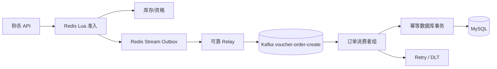
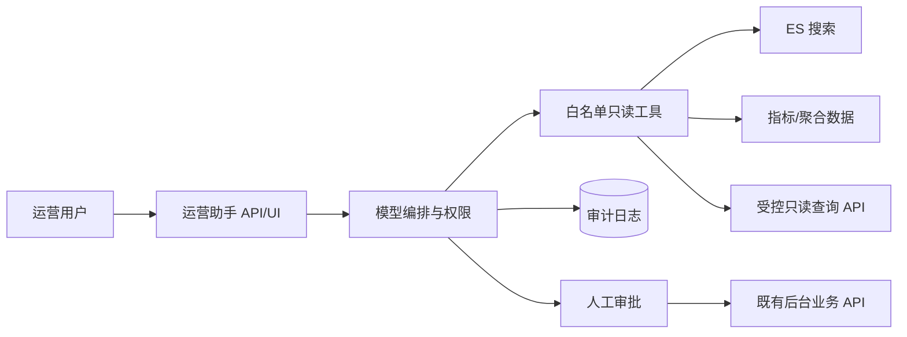

# 后续升级规划

## 1. 总体原则与顺序

```text
P0 正确性与安全基线
  ↓
P1 Kafka 秒杀事件化
  ↓
P2 Canal CDC 一致性总线
  ├─ Redis 缓存/GEO 失效与维护
  └─ Elasticsearch 搜索索引同步
  ↓
P3 AI 运营助手（只读先行、审批后写）
```

共同原则：MySQL 是交易事实源；Redis 和 Elasticsearch 是可重建状态；所有消息按至少一次投递设计；数据库约束与消费幂等是最后防线；每个阶段都要能灰度和回滚。

## 2. 阶段 0：改造前基线加固

### 目标

- 修复当前秒杀丢单/重复处理路径。
- 建立版本化数据库迁移、环境配置、可执行测试和基础监控。
- 在引入更多中间件前固定事件语义与数据所有权。

### 预计修改文件

| 类型 | 文件/目录 |
| --- | --- |
| 现有 | `pom.xml`、`application.yaml`、`VoucherOrderServiceImpl.java`、`seckill.lua`、`RedisConstants.java` |
| 新增 | `src/main/resources/db/migration/`、秒杀事务 Service、初始化/健康检查、业务集成测试、指标配置 |

### 实现要点

1. `XACK` 使用正确的 `stream.orders`；消费者名带实例 ID。
2. 事务 Bean 原子完成数据库条件扣库存和订单插入。
3. 数据清洗后增加 `UNIQUE(user_id, voucher_id)`。
4. 重试可恢复异常，死信隔离不可恢复异常；所有分支明确 ACK 条件。
5. 启动时检查 Stream 组、Redis 库存、GEO 数据和依赖连通性。
6. 配置全部环境变量化；缩短 Token 时长、登录后删除验证码、补登出和后台权限。

### 验收标准

- 重复投递不会生成重复订单或重复扣数据库库存。
- 在订单插入故障、进程崩溃、Redis 短暂不可用后可以重试并最终收敛。
- 秒杀 Stream Pending 可归零，失败消息可定位和重放。

## 3. Kafka 秒杀改造计划

### 目标

- 用 Kafka 承载可水平扩展、可观测、可回放的秒杀订单事件。
- 保留 Redis Lua 的高并发原子准入能力。
- 通过幂等消费、数据库事务、重试与死信保证最终一致性。

### 推荐架构

Redis 与 Kafka 无法组成普通本地事务。推荐先保留 `stream.orders` 作为“Redis 原子 Outbox”：Lua 在预扣库存的同一原子操作里写 Stream；独立 Relay 读取 Stream 并投递 Kafka，Kafka broker 确认后才 ACK Stream。这样避免“Lua 成功但进程在 Kafka send 前崩溃”的消息丢失窗口。



长期可选方案是将准入与事件写入设计为专用库存服务，但不应在第一阶段同时扩大边界。

### 事件契约

建议事件至少包含：

- `eventId`：可取订单 ID 或独立全局 ID。
- `eventType`、`schemaVersion`、`occurredAt`、`traceId`。
- `orderId`、`voucherId`、`userId`。
- `source`、`attempt`；不得携带手机号等无关 PII。

Topic 建议以 `voucherId` 作为 message key，保证同券事件进入同一分区；分区数根据压测结果确定。消费者以订单主键和 `(user_id,voucher_id)` 唯一键做幂等。

### 预计修改文件

| 类型 | 文件/目录 |
| --- | --- |
| 依赖/配置 | `pom.xml`、`src/main/resources/application.yaml` 及环境 profile |
| 现有业务 | `VoucherOrderServiceImpl.java`、`seckill.lua`、`RedisConstants.java` |
| 新增代码 | `config/KafkaConfig.java`、`event/VoucherOrderEvent.java`、`messaging/SeckillOutboxRelay.java`、`messaging/VoucherOrderConsumer.java`、事务订单服务、重试/DLT 处理器 |
| 数据库 | 版本化 migration：订单唯一键、必要索引、可选消费审计表 |
| 测试 | Lua 契约测试、Kafka Testcontainers 集成测试、重复/乱序/崩溃恢复测试、压测脚本 |

### 涉及技术

Spring for Apache Kafka、Kafka consumer group、partition key、手动确认、retry topic/DLT、Redis Stream Outbox、MySQL 本地事务、唯一约束、Micrometer/OpenTelemetry、Testcontainers。

### 预计实现步骤

1. 完成阶段 0 并冻结 `VoucherOrderEvent v1`。
2. 部署 Kafka topic、ACL、保留期和监控。
3. 新增 Relay，先影子发布到 Kafka，不驱动订单写库；对比 Stream 与 Kafka 数量。
4. 新增 Kafka 消费者，复用已验证的事务订单服务。
5. 灰度切换消费者，保留 Stream 作为 Outbox；确认无丢失后删除旧直接落库线程。
6. 加入限流、积压降级、重试、DLT、补偿和每日 Redis/MySQL 对账。

### 验收标准

- 峰值吞吐达到目标且 Kafka lag 可控。
- 重复、乱序和重启场景下不超卖、不重复下单。
- Relay/Kafka/DB 任一阶段失败都可观测、可恢复、可对账。

## 4. Elasticsearch 搜索改造计划

### 目标

- 替换 `/shop/of/name` 的 MySQL 前导模糊 `LIKE`。
- 支持中文分词、相关性、拼写/前缀匹配、分类/商圈/价格过滤、评分/销量排序及地理距离。
- 构建可重建、可版本化、零停机切换的店铺搜索读模型。

### 索引建议

第一期只建立店铺索引 `shop_v1`，通过别名 `shop_read/shop_write` 访问。核心字段：

- 精确/过滤：`id`、`typeId`。
- 全文：`name`、`area`、`address`。
- 数值排序/过滤：`avgPrice`、`sold`、`comments`、`score`。
- 地理：`location` 为 `geo_point`。
- 同步控制：`dbUpdateTime`、`sourceVersion`。

博客全文检索可作为第二个独立索引，不与店铺一期混做。

### 预计修改文件

| 类型 | 文件/目录 |
| --- | --- |
| 依赖/配置 | `pom.xml`、`application.yaml`/profile、ES 客户端配置 |
| 现有 API | `ShopController.java`、`IShopService.java`、`ShopServiceImpl.java`（或抽出 SearchService） |
| 新增代码 | `search/ShopDocument.java`、`search/ShopSearchService.java`、`search/ElasticsearchShopRepository.java`、查询 DTO/响应 DTO |
| 资源 | `src/main/resources/elasticsearch/shop-v1-mapping.json`、索引初始化/重建脚本 |
| 测试 | ES Testcontainers、相关性样例、分页/过滤/排序/地理查询、故障降级测试 |

### 涉及技术

Elasticsearch Java Client（版本必须与服务端锁定）、中文分析器、index template、alias、bulk API、`search_after`、geo distance、Canal/Kafka CDC、Testcontainers。

### 预计实现方式

1. 根据产品查询定义 mapping 和 analyzer，建立版本化索引与别名。
2. 从 MySQL 按主键游标全量 bulk 构建，并核对数量、抽样字段与校验和。
3. 使用 Canal 变更事件增量 upsert/delete，保证重复消费幂等。
4. 新搜索接口先影子查询，对比 MySQL 结果与延迟；随后灰度切换。
5. ES 故障时定义明确降级：有限条件回退 MySQL 或返回搜索暂不可用，避免无界模糊查询压垮数据库。
6. 重建时写新版本索引，追平 CDC 位点后原子切 alias。

### 验收标准

- 搜索 P95/P99、相关性样例和召回率达到约定目标。
- 全量 + 增量切换期间无明显丢文档，删除能传播。
- 可以从 MySQL 独立重建，ES 不承担交易写入。

## 5. Canal 缓存一致性计划

### 目标

- 捕获 MySQL 已提交变更，自动失效店铺缓存并维护 Redis GEO/ES 索引。
- 覆盖后台脚本、人工 SQL 和未来其他服务写库，消除仅依赖当前应用删缓存的盲区。
- 建立可重放、幂等、可监控的 CDC 管道。

### 推荐链路

```text
MySQL ROW binlog
  ↓ Canal Server
Kafka hmdp-cdc（按 table + primaryKey 分区）
  ↓
CDC Consumer
  ├─ DEL cache:shop:{id}
  ├─ GEOADD/GEOREM shop:geo:{typeId}
  └─ upsert/delete Elasticsearch shop document
```

Canal 只读取已提交 binlog。Redis/ES 消费都按至少一次处理，删除和覆盖写必须幂等。对“并发读在删除后回填旧值”的窗口，可采用短延时二次删除，或在缓存值中携带数据库版本并拒绝旧版本覆盖；具体方案应通过并发测试确定。

### 预计修改文件

| 类型 | 文件/目录 |
| --- | --- |
| MySQL/部署 | MySQL binlog 配置、Canal 实例配置、Kafka topic/ACL、部署清单 |
| 依赖/配置 | `pom.xml`、`application.yaml`/profile |
| 现有业务 | `ShopServiceImpl.java` 的缓存策略、统一 Redis key builder |
| 新增代码 | `cdc/CanalChangeEvent.java`、`cdc/ShopChangeConsumer.java`、`cdc/CacheInvalidationService.java`、GEO/ES projector、重放与对账任务 |
| 数据库 | migration：必要的更新时间/版本字段与索引 |
| 测试 | insert/update/delete、重复、乱序、消费者宕机、全量与增量交接测试 |

### 涉及技术

MySQL ROW binlog、Canal、Kafka、幂等消费、分区有序、缓存旁路、延时双删/版本缓存、GEO 更新、ES upsert/delete、位点与 lag 监控。

### 预计实现步骤

1. 检查 binlog 格式、server-id、保留期、Canal 最小权限和时区。
2. 定义通用 CDC envelope 与店铺 projector 契约。
3. 先记录影子事件和指标，不修改在线缓存。
4. 灰度启用店铺缓存删除，再启用 GEO 和 ES 投影。
5. 增加每日 MySQL-Redis-ES 对账和一键按店铺/分片重放。
6. 验证稳定后，应用写路径仍保留主动删缓存作为低延迟优化，Canal 作为最终兜底。

### 验收标准

- 任意来源修改店铺后，Redis/ES 在约定 SLA 内收敛。
- 重复和重放不产生错误，乱序不会用旧数据覆盖新数据。
- Canal/Kafka 中断后恢复可追平，无需人工清库。

## 6. AI 运营助手计划

### 目标

- 面向运营人员提供自然语言数据问答、店铺/优惠券洞察、活动方案与文案草拟、秒杀异常解释。
- 第一期严格只读；所有影响价格、库存、券状态或外发内容的动作必须人工确认并审计。
- 复用 ES 搜索、Kafka 指标和经过脱敏的分析数据，不让模型直接访问交易数据库或 Redis 管理命令。

### 推荐边界

现有项目是 Java 8 + Spring Boot 2.3。现代 AI 框架通常会推动更高 Java/Spring 基线，建议将助手作为独立服务/模块部署，通过受控内部 API 读取聚合数据，而不是把 SDK 直接塞入交易进程。是否升级主应用应单独立项。



### 首期用例

1. “过去 7 天哪些店铺搜索高但转化低？”——调用预定义聚合查询。
2. “为低销量店铺生成三套优惠券文案。”——只生成草稿，不直接发布。
3. “解释当前秒杀失败率上升原因。”——读取 Kafka lag、Lua 返回码、DB 错误和库存对账结果。
4. “查找某商圈评分高且客单价合适的店铺。”——使用 ES 工具，不生成 SQL。

### 预计修改文件

| 类型 | 文件/目录 |
| --- | --- |
| 新模块/服务 | `hmdp-ai-assistant/` 或独立仓库的构建文件、配置、Docker/部署清单 |
| API | 运营助手 Controller、会话 Service、Tool Registry、模型 Provider Adapter、审批 Service |
| 现有应用 | 新增最小化、鉴权的内部只读聚合 API；必要时增加管理动作的审批后 API |
| 数据 | AI 会话、提示词版本、工具调用、审批、成本、反馈与评测表 migration |
| 安全 | RBAC、字段脱敏、审计、限流、内容安全和密钥管理配置 |
| 测试 | 提示词/工具契约评测、越权与注入测试、敏感信息泄漏测试、成本和延迟基准 |

### 涉及技术

LLM Provider Adapter、tool calling、RAG/ES、结构化输出、RBAC、人工审批、提示词版本化、离线评测、PII 脱敏、审计追踪、token 成本与限流。

### 预计实现步骤

1. 定义 3–4 个只读用例、数据口径和不可触碰边界。
2. 建立受控工具 API；工具参数用结构化 schema 校验，禁用自由 SQL/Redis 命令。
3. 接入模型并实现引用数据来源、拒答、超时、限额与完整审计。
4. 建立固定问题集，评估正确性、幻觉、越权、延迟和成本。
5. 小范围运营灰度；收集反馈后再增加“生成草稿”。
6. 任何写操作都走“计划 → 展示差异 → 人工审批 → 既有业务 API → 审计”，不允许模型直写库。

### 验收标准

- 所有回答可追溯到查询结果或明确标注推断。
- 无未授权 PII 输出，无自由 SQL/Redis/文件执行能力。
- 模型失败不影响交易服务；预算、延迟和调用成功率可观测。

## 7. 跨阶段开发记录要求

每次实施均更新 `development_log.md`，至少记录日期、目标、实际修改文件、数据库 migration、配置/Topic/索引变化、验证结果、风险和回滚方式。事件 schema、Redis key、ES mapping 和 AI 工具 schema 都必须版本化，避免只在代码注释或运维命令中存在。

