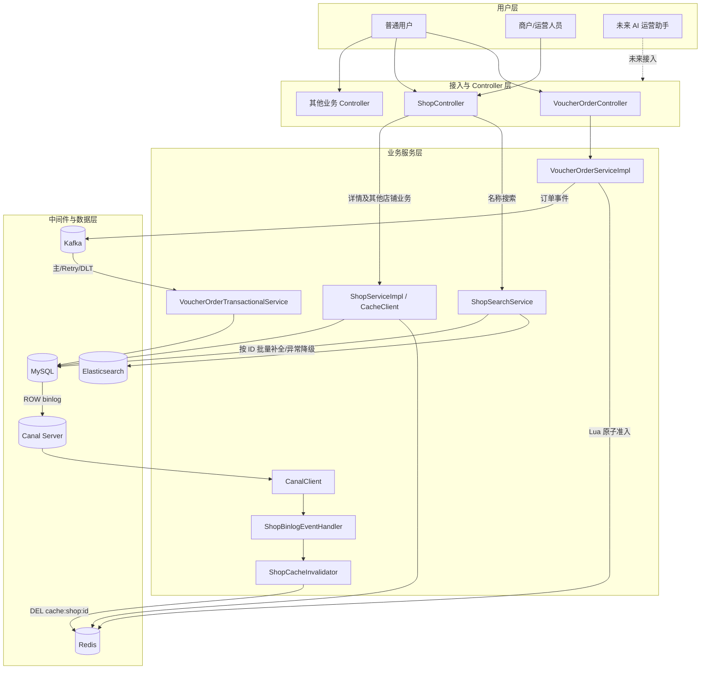
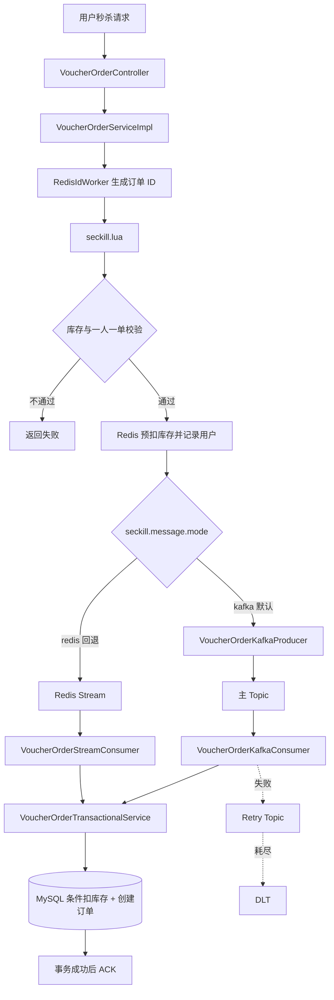
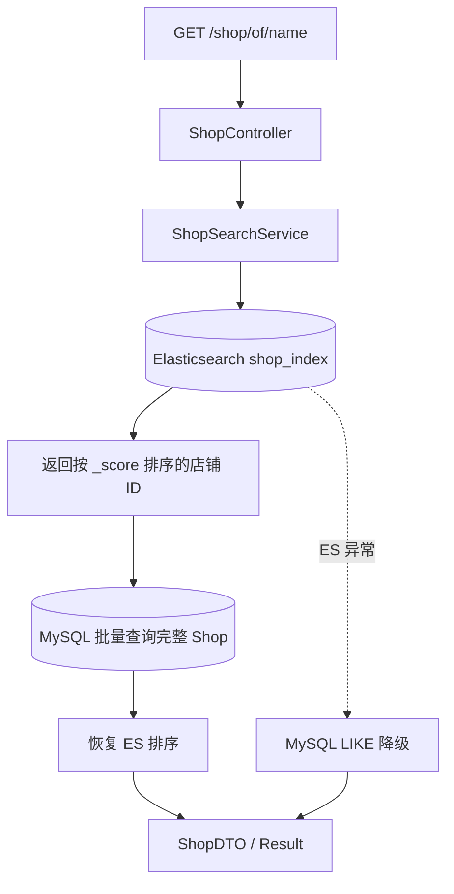
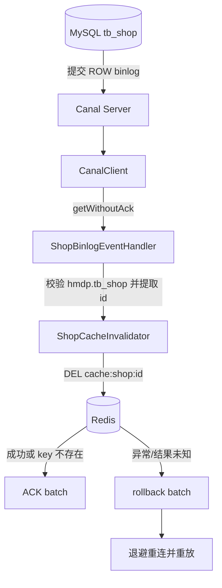

# HM-DianPing Plus 系统架构

## 1. 归档范围

本文记录截至 2026-09-09 已实现的阶段性架构。系统在原黑马点评业务基础上，完成了 Kafka 秒杀异步化、Elasticsearch 商户名称搜索和 Canal 店铺详情缓存失效。

需要区分：

- 已实现：Kafka 秒杀主链路、Redis Stream 灰度回退、ES 名称搜索、MySQL 补全与降级、Canal 驱动店铺详情缓存删除。
- 尚未实现：Canal 驱动 ES 实时增量同步、AI 运营助手、跨 Redis Lua 与 Kafka 的严格原子投递。

## 2. 最终系统架构



## 3. 分层职责

| 层次 | 主要职责 |
| --- | --- |
| 用户层 | 发起登录、店铺、博客、优惠券与秒杀等请求；未来 AI 助手作为受控业务入口。 |
| Controller | 维护 HTTP 参数和返回协议，只做请求接入与服务编排。 |
| 业务服务层 | 实现秒杀准入、订单事务、搜索编排、缓存查询和 binlog 事件处理。 |
| Redis | 热点缓存、登录状态、Geo、计数结构，以及秒杀 Lua 库存预扣和一人一单准入。 |
| Kafka | 承载秒杀订单事件，削峰并把请求线程与数据库订单事务解耦。 |
| Elasticsearch | 承担商户名称 match 查询和相关性排序。 |
| Canal | 模拟 MySQL replica 读取 ROW binlog，并向 Spring Consumer 交付店铺变更。 |
| MySQL | 权威业务数据、事务、库存条件更新和唯一约束。 |

## 4. 核心链路一：秒杀



关键保证：

- Redis Lua 原子完成库存准入与一人一单判断。
- Kafka 默认承担异步削峰；Redis Stream 保留为配置化回退通道。
- MySQL 事务内完成数据库库存扣减和订单创建。
- `(user_id, voucher_id)` 唯一索引是重复消费的最终防线。
- Consumer 成功后手动 ACK，失败进入有限 Retry/DLT。

当前边界：Lua 成功与 Kafka 发送跨两个系统，不是严格原子事务。Producer 的 `acks=all`、重试和发送结果等待缩小风险窗口，但不能完全消除“Redis 已预扣、Kafka 未投递”的可能。

## 5. 核心链路二：商户搜索



关键设计：

- 对外接口参数和返回结构保持不变。
- 非空关键词使用 ES `match` 和相关性排序。
- ES 只决定命中与顺序，MySQL 补充完整展示字段。
- 空关键词保留原 MySQL 分页。
- ES 不可用时记录异常并降级 MySQL LIKE。

当前边界：`shop_index` 已支持首次全量同步，但 Canal 尚未驱动 ES 增量 upsert/delete。数据变更后仍需重新执行同步或后续补充增量链路。

## 6. 核心链路三：缓存一致性



处理 INSERT、UPDATE、DELETE：

- INSERT/UPDATE 从 after image 获取店铺 id。
- DELETE 从 before image 获取店铺 id。
- 同一 batch 内对 id 去重。
- Redis DEL 返回 false 代表 key 原本不存在，按幂等成功。
- 只有事件解析和全部目标缓存删除完成后才 ACK。

当前边界：首期只删除 `cache:shop:{id}`，不处理 Redis GEO 和 Elasticsearch 索引。

## 7. 数据职责

| 数据/能力 | 权威来源 | 派生存储 | 一致性方式 |
| --- | --- | --- | --- |
| 店铺业务数据 | MySQL | Redis 详情缓存 | 应用更新删除 + Canal binlog 补偿删除 |
| 商户搜索文档 | MySQL | Elasticsearch | 当前首次全量同步；增量同步待实现 |
| 秒杀准入状态 | Redis Lua | MySQL 订单与库存 | 异步最终落库，数据库事务与唯一约束兜底 |
| 秒杀订单事件 | Kafka | MySQL 订单 | 手动 ACK、有限重试、DLT、消费幂等 |

## 8. 后续 AI 助手接入原则

未来 AI 运营助手应复用现有服务边界，而不是直接写 Redis、ES 或 MySQL：

```text
AI 助手
  ↓ 意图识别 / 参数校验 / 权限控制
既有 Controller 或应用服务
  ↓
MySQL 权威写入
  ↓
Canal 驱动缓存失效（未来同时驱动 ES 增量）
```

AI 生成内容必须经过权限、审计、人工确认和结构化参数校验；搜索类只读工具可调用 `ShopSearchService`，写操作应调用受事务保护的业务服务。

## 9. 当前验证基线

- Kafka 阶段：业务入口、Producer、Consumer、事务、ACK、Retry/DLT 和回退模式均有测试。
- ES 阶段：索引创建、Bulk 首次同步、match、排序恢复、降级和接口协议均有测试。
- Canal 阶段：7 个单元测试与 1 个显式真实链路测试通过。
- 最近完整回归：43 个测试，0 失败，0 错误，3 个环境测试按设计跳过，`BUILD SUCCESS`。
