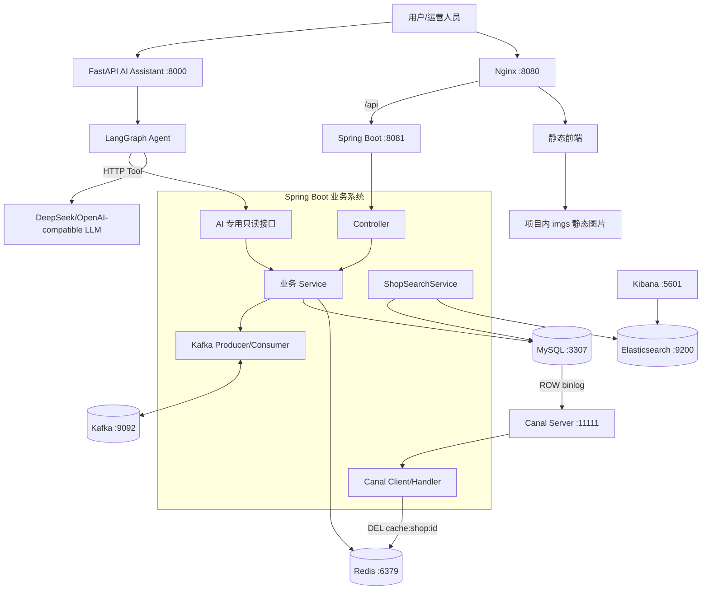
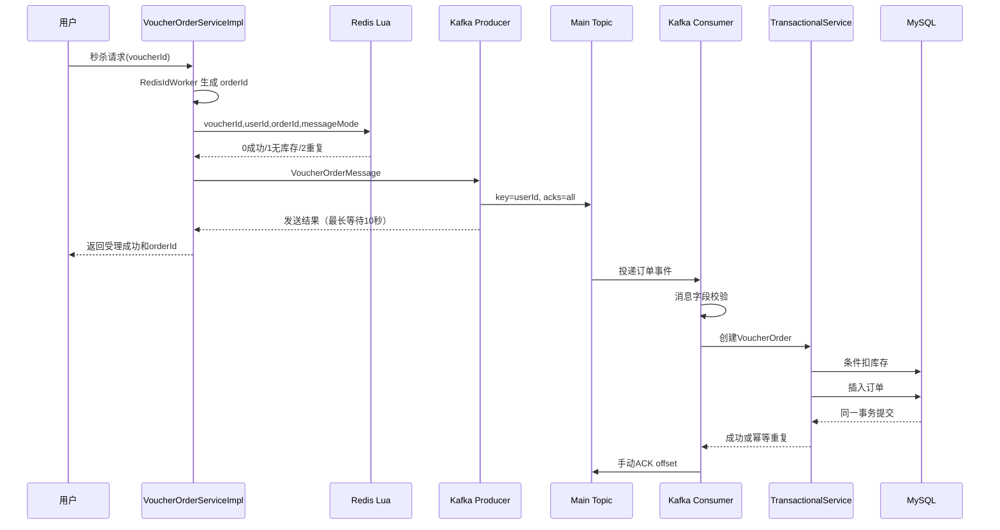
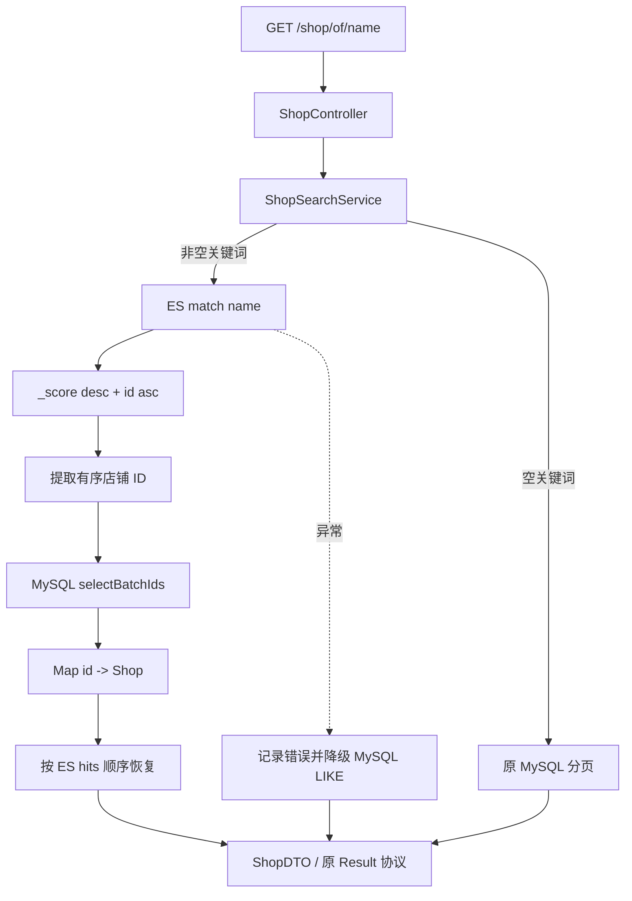
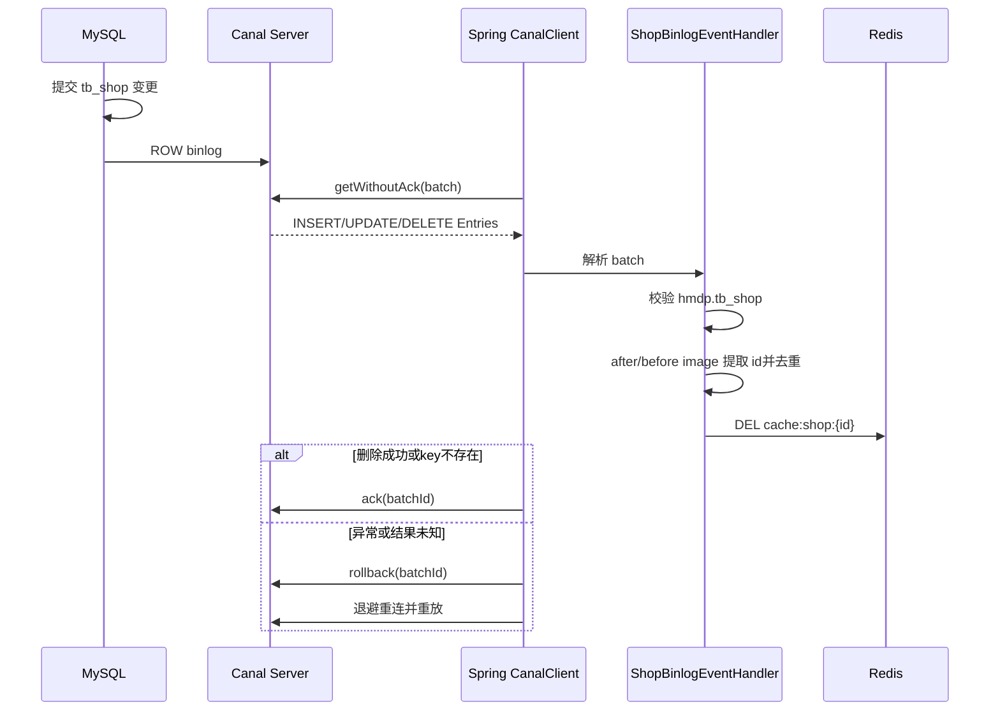

# HM-DianPing Plus 秋招项目复盘与面试准备

> 文档基线：截至 2026-09-14 的当前代码、阶段归档和 `docs/development-log.md`。  
> 用途：项目介绍、技术复习、面试追问准备、后续开发交接。  
> 表达原则：只陈述已经实现和验证的能力；规划中的能力明确标注为“未实现”。

## 1. 一句话介绍

HM-DianPing Plus 是在黑马点评课程项目基础上完成的工程化与生产化改造：保留 Redis 缓存和 Lua 秒杀准入，使用 Kafka 构建异步订单链路，使用 Elasticsearch 提升商户搜索能力，使用 Canal 监听 MySQL binlog 自动失效店铺缓存，并通过独立 FastAPI + LangGraph + DeepSeek 服务实现只读 AI 商家运营助手。

## 2. 三分钟项目介绍

> 这个项目是我基于黑马点评完成的一次完整架构升级。原项目具备登录、店铺、博客、优惠券和秒杀等本地生活业务，但更偏课程 Demo：秒杀异步链路的确认与失败治理不完整，商户名称仍依赖 MySQL LIKE，缓存一致性只依赖业务代码主动删除，部署和测试也高度依赖个人电脑环境。
>
> 我首先加固了秒杀基线，把数据库库存扣减和订单创建放进同一事务，通过 `(user_id, voucher_id)` 唯一索引兜底一人一单，并修正 Redis Stream 的 ACK 和失败处理。随后保留 Redis Lua 的原子准入，把订单事件默认切换到 Kafka：Producer 使用 `userId` 作为 key，Consumer 参数校验和事务成功后手动 ACK；主 Topic 失败转 Retry Topic，Retry 有限尝试后进入 DLT，避免毒消息无限占用分区。Redis Stream 没有立即删除，而是通过配置开关保留灰度回退。
>
> 商户搜索方面，我建立了独立 `shop_index` 和 `ShopDocument`，先完成 MySQL 到 ES 的全量 Bulk 同步，再将 `/shop/of/name` 的非空关键词查询切换为 ES `match`。ES 负责分词、相关性和有序 ID，MySQL 批量补齐完整店铺信息，最后恢复 ES 排序；ES 异常时降级到原 MySQL LIKE，接口协议保持不变。
>
> 缓存一致性方面，我部署 Canal Server 订阅 MySQL ROW binlog，实现 Spring Boot Canal Client。它只处理 `hmdp.tb_shop` 的 INSERT、UPDATE、DELETE，提取 shopId 后删除 `cache:shop:{id}`，全部删除成功才 ACK，异常则 rollback 并重放。这样可以覆盖直接 SQL 和其他入口绕过业务更新逻辑的情况。
>
> 最后，我增加了独立 AI 运营助手。Python 不直连数据库，只能通过三个白名单 Tool 调用 Spring Boot AI 专用只读接口。LangGraph 使用 `START → Agent → ToolNode → Agent → END`，真实 DeepSeek 已验证能够自主调用店铺信息、最近 7 天订单统计和优惠券统计工具，并生成经营分析。
>
> 工程化上，我统一了 MySQL、Redis、Kafka、ES、Kibana、Canal 的 Docker Compose 入口，并增加 Nginx、Spring Boot、FastAPI 的一键启停和状态脚本。当前完整 Maven 基线为 50 个测试、0 失败、0 错误、5 个环境或课程手工测试跳过；Kafka、ES、Canal、AI Tool Calling 和前端图片链路均做过真实环境验证。

## 3. 项目背景与原始问题

原黑马点评适合学习 Redis 数据结构、缓存、Lua、分布式锁和异步下单，但要作为秋招项目展示，还存在以下不足：

| 领域 | 原始实现/问题 | 改造方向 |
| --- | --- | --- |
| 秒杀 | Redis Stream 消费确认容易错 ACK；订单事务边界不清；失败可能无限重试；缺少数据库唯一约束 | 先加固 Stream，再切换 Kafka，增加事务、幂等、手动 ACK、有限 Retry/DLT |
| 搜索 | `name LIKE '%keyword%'`，没有分词和相关性排序 | ES `match` 检索，MySQL 补齐完整数据，异常降级 |
| 缓存一致性 | 更新数据库后由业务代码主动删缓存，覆盖不了旁路写库和删除失败 | Canal 监听提交后的 binlog，异步删除店铺缓存 |
| AI 分析 | 没有自然语言经营分析能力 | 独立无状态 Agent，通过只读 Tool 调用 Java 业务接口 |
| 环境 | Kafka、ES、Canal 分散启动；Java、Python、Nginx 分别手动运行 | 根 Compose + PowerShell 一键启停与状态检查 |
| 可移植性 | MySQL、图片目录等依赖课程机器路径和端口 | MySQL 默认 3307；上传路径改为项目内前端目录；均支持环境变量覆盖 |
| 测试 | 课程 Demo 测试会写真实 Redis，甚至启动正式消费者 | 环境测试显式门控，手工 Demo 隔离，标准回归不污染运行数据 |

## 4. 最终系统架构



核心职责划分：

- MySQL 是权威业务数据库，负责事务、约束和最终业务事实。
- Redis 负责热点缓存、登录态、ID 生成辅助结构、GEO、秒杀库存准入和 Stream 回退。
- Kafka 负责秒杀订单事件削峰、解耦、重试和失败隔离。
- Elasticsearch 是可从 MySQL 重建的搜索读模型，不承担业务主库职责。
- Canal 负责读取和交付 binlog 事件；Java 业务代码负责解释事件和删除缓存。
- Python AI 服务只负责意图理解、工具编排和自然语言生成，不拥有业务数据源。

## 5. 原有业务能力简述

### 5.1 登录链路

```text
手机号请求验证码
    ↓
UserController / UserService
    ↓
验证码写入 Redis（短 TTL）
    ↓
登录时校验验证码
    ↓
不存在用户则创建用户
    ↓
生成 token，将 UserDTO Hash 写入 Redis
    ↓
RefreshTokenInterceptor 刷新登录状态 TTL
    ↓
LoginInterceptor 对受保护接口校验 UserHolder
```

登录态不放在单机 Session 中，适合多实例共享；业务线程结束后拦截器清理 `UserHolder`，避免线程复用导致用户数据串扰。

### 5.2 店铺详情缓存

当前实际启用的是 Cache Aside + 缓存穿透保护：

```text
GET /shop/{id}
    ↓
查询 cache:shop:{id}
    ├─ 命中 Shop JSON → 返回
    ├─ 命中空字符串 → 返回不存在
    └─ 未命中 → 查询 MySQL
                    ├─ 不存在：缓存空值 2 分钟
                    └─ 存在：缓存 Shop 30 分钟
```

课程代码中仍保留互斥锁和逻辑过期思路，但当前详情入口使用缓存穿透版本，因此 Redis 中必须保存原始 `Shop` JSON，不能混入 `{data, expireTime}` 包装格式。

### 5.3 发布笔记与图片

上传接口保持原协议：后端返回 `/blogs/...`，前端拼接为 `/imgs/blogs/...`。物理文件默认保存到：

```text
nginx-1.18.0/html/hmdp/imgs/blogs/{d1}/{d2}/{uuid}.{suffix}
```

两级散列目录避免大量图片集中在单目录；`HMDP_IMAGE_UPLOAD_DIR` 可覆盖部署路径。删除接口会同时兼容 `/blogs/...` 和 `/imgs/blogs/...`，并验证目标仍位于图片根目录内。

## 6. 改造一：秒杀链路生产化

### 6.1 为什么保留 Redis Lua

Kafka 解决的是异步传输和削峰，不适合替代入口处的原子资格裁决。Redis Lua 将以下操作放在一个脚本中执行：

1. 检查 `seckill:stock:{voucherId}` 是否大于 0。
2. 使用 `SISMEMBER seckill:order:{voucherId} userId` 检查一人一单。
3. `INCRBY stock -1` 预扣 Redis 库存。
4. `SADD` 记录已获得资格的用户。
5. Redis 回退模式下才向 `stream.orders` 写消息；Kafka 模式由 Java 在 Lua 成功后发送 Kafka 消息。

Lua 的价值是低延迟、原子执行和快速失败，让无资格流量不进入数据库和消息系统。

### 6.2 最终请求流程



### 6.3 消息设计

Topic：

- 主 Topic：`hmdp.seckill.order.create.v1`
- Retry Topic：`hmdp.seckill.order.retry.v1`
- DLT：`hmdp.seckill.order.dlt.v1`

消息 DTO：

```text
VoucherOrderMessage
├─ orderId
├─ userId
├─ voucherId
└─ createTime
```

选择 `userId` 作为 Kafka key 的原因：同一用户的秒杀消息进入同一分区，可以降低同一用户并发消息乱序带来的复杂度。最终幂等仍由数据库保证，不能只依赖分区顺序。

### 6.4 事务与幂等

`VoucherOrderTransactionalService` 在一个数据库事务中执行：

1. 校验订单字段。
2. 查询 `(userId, voucherId)` 是否已经存在；存在按幂等成功返回。
3. 使用 `stock > 0` 条件更新扣减 `tb_seckill_voucher.stock`。
4. 插入 `tb_voucher_order`。
5. 插入失败时回滚库存扣减。

数据库唯一索引 `(user_id, voucher_id)` 是并发竞争和重复消费场景下的最终防线。应用层查询用于快速识别重复，唯一索引用于消除查询与插入之间的竞态窗口。

### 6.5 ACK、Retry 与 DLT

实际策略保持简单：

```text
Main Topic 消费失败
    ↓ 立即转发成功后推进主 Topic offset
Retry Topic
    ↓ 固定退避 1 秒，再额外尝试 1 次
仍失败
    ↓ 转发成功后推进 Retry Topic offset
DLT
    ↓ 记录订单、异常原因、时间、topic/partition/offset
日志成功后手动 ACK
```

关键点：

- 正常消费只有事务成功或事务服务识别为幂等重复后才手动 ACK。
- 空消息和字段不完整消息不会进入事务，也不会被业务代码错误确认。
- 源 offset 只有在业务完成，或者失败消息已可靠交给下一级 Topic 后才推进。
- 不在主分区无限重试，避免单条毒消息永久阻塞后续订单。
- DLT 当前只记录错误日志，不自动补单；必须人工判断后再重放。

### 6.6 Redis Stream 灰度回退

配置：

```yaml
seckill:
  message:
    mode: kafka
```

支持 `kafka` 和 `redis`。默认 Kafka，但 Stream Consumer 与事务服务仍保留。这样切换出现问题时可以回退，又避免一次性删除已验证链路。

### 6.7 秒杀链路的真实边界

Redis Lua 成功与 Kafka 发送分属两个系统，目前不是一个原子事务。极端情况下可能出现“Redis 已预扣并记录用户，但 Kafka 最终发送失败”。当前通过 `acks=all`、Producer 重试和同步等待发送结果缩小窗口，但没有完全消除。

如果继续生产化，应增加：发送失败资格回滚或补偿记录、定期对账、可重放事件表/本地消息表，或者根据业务成本评估事务消息方案。面试中不能把当前实现描述成跨 Redis、Kafka、MySQL 的强一致。

## 7. 改造二：Elasticsearch 商户搜索

### 7.1 为什么不用 MySQL LIKE 作为主搜索

`LIKE '%关键词%'` 难以利用普通 B+Tree 索引，数据量增长后容易扫描大量记录；同时缺少分词、相关性评分、多字段组合、高亮和搜索调优能力。ES 的倒排索引更适合“根据词找文档”的搜索场景。

### 7.2 索引模型

`shop_index` 使用 MySQL 店铺 ID 作为 ES `_id`：

| 字段 | 类型 | 设计理由 |
| --- | --- | --- |
| `id` | `long` | 与 MySQL 主键一致，重复同步可幂等覆盖 |
| `name` | `text` + `keyword` | `text` 用于 match；keyword 预留精确匹配 |
| `typeId` | `long` | 类型精确过滤预留 |
| `area` | `text` + `keyword` | 商圈文本和精确过滤预留 |
| `address` | `text` | 地址搜索预留 |
| `description` | `text` | 描述检索预留；没有权威数据时不虚构 |
| `location` | `geo_point` | 距离排序和附近搜索预留 |

本地单节点配置为 1 分片、0 副本，`dynamic: strict` 防止意外字段漂移。当前使用 `standard` analyzer，仅提供基础中文切分效果，没有宣称已实现 IK 分词。

### 7.3 首次全量同步

```text
创建/检查 shop_index 和 Mapping
    ↓
ShopMapper 查询 MySQL 全部店铺
    ↓
Shop 转 ShopDocument
    ↓
每 500 条构造 NDJSON Bulk 请求
    ↓
检查 HTTP 状态与 Bulk errors
    ↓
refresh 并核对文档数量
```

实测 MySQL 14 家店铺同步为 ES 14 条文档。固定 `_id` 使重复全量同步成为覆盖更新，不会创建重复文档。

### 7.4 搜索查询链路



这里没有把完整业务读取迁移到 ES：ES 只负责“命中谁、顺序如何”，MySQL 负责完整店铺事实。这样减少搜索索引字段膨胀和一致性成本，也保留 MySQL 作为权威来源。

### 7.5 搜索边界

- 已实现：首次全量同步、名称 match、相关性排序、MySQL 补齐、顺序恢复、无结果、空关键词和 ES 异常降级。
- 未实现：Canal 驱动 ES 实时 upsert/delete、IK 中文分词、高亮、联想、多字段搜索和复杂相关性调参。
- 当前 ES 与 MySQL 是最终一致思路，但增量同步仍未落地；店铺变更后需要重新全量同步或手工同步。

## 8. 改造三：Canal 缓存一致性

### 8.1 为什么不能只依赖业务代码删缓存

原有 `ShopServiceImpl.update` 在更新数据库后删除 Redis，可以覆盖正常应用写入，但覆盖不了：

- 直接 SQL 修改数据库。
- 其他服务或脚本绕过当前更新方法。
- Redis 短暂异常导致删除失败。
- 事务提交前后与并发回填形成的时序窗口。

固定延迟双删依赖经验性的 sleep 时间，不能从根本上覆盖所有并发时序。因此增加 Canal 作为数据库提交事实的异步补偿链路。

### 8.2 完整流程



INSERT/UPDATE 从 after image 取 ID，DELETE 从 before image 取 ID。Redis `DEL` 返回 false 表示 key 本来就不存在，这仍然是确定的幂等成功；返回 null 或抛异常才禁止 ACK。

### 8.3 职责边界

- Canal Server：模拟 MySQL replica，读取和解析 ROW binlog，保存消费位点。
- Java Canal Client：订阅、拉取、ACK/rollback、断线重连。
- Handler：过滤库表、识别事件类型、提取 shopId。
- Cache Invalidator：只负责删除 `cache:shop:{id}`。
- 下一次店铺查询：按原 Cache Aside 逻辑从 MySQL 回填，不由 Canal 主动加载缓存。

当前只处理店铺详情缓存，没有同步 Redis GEO 或 ES 索引。

## 9. 改造四：AI 商家运营助手

### 9.1 为什么使用 Agent，而不是直接做 RAG

首期问题需要查询实时结构化业务数据，例如店铺、订单量、交易金额和优惠券使用率。RAG 更适合从非结构化文档中检索知识，直接用向量检索回答精确统计会引入同步延迟、召回误差和数值不确定性。

因此当前选择 Tool-Calling Agent：LLM 决定需要什么数据，Spring Boot 按确定业务口径查询；未来出现运营手册、活动规则等文档问答时，再把 RAG 作为一个额外只读工具，而不是替代业务查询。

### 9.2 服务边界

```text
POST /chat
    ↓
FastAPI
    ↓
LangGraph Agent Node
    ↓ tool_calls
ToolNode
    ├─ get_shop_info
    ├─ get_order_statistics
    └─ get_coupon_statistics
    ↓ HTTP
Spring Boot AI 专用只读 Controller
    ↓
业务 Service / Mapper
    ↓
MySQL
    ↓ ToolMessage
Agent Node 生成最终回答
```

Python 不持有 MySQL、Redis、Kafka、ES 或 Canal 凭据。LLM 只看见工具白名单和裁剪后的字段，Spring Boot 仍拥有业务口径。

### 9.3 LangGraph 实现

```text
START → Agent → tools_condition
                  ├─ 普通回答 → END
                  └─ tool_calls → ToolNode → Agent → ... → END
```

`AgentState` 保存本次请求的问题、消息和答案；没有 Checkpointer，不跨请求保存状态，因此不是 Memory。LLM 使用 `bind_tools` 注册三个工具，`ToolNode` 执行结构化调用并将 ToolMessage 返回 Agent。

### 9.4 三个业务 Tool

| Tool | Java API | 数据口径 |
| --- | --- | --- |
| `get_shop_info` | `GET /api/ai/shop/{id}` | id、name、type、address |
| `get_order_statistics` | `GET /api/ai/shop/{id}/orders` | 最近 7 天订单数量和交易金额 |
| `get_coupon_statistics` | `GET /api/ai/shop/{id}/coupons` | 累计发放量、使用量、使用率 |

工具校验正整数 shopId，设置 5 秒 HTTP 超时，检查 HTTP、JSON 和业务 `success`，并对返回字段再次执行白名单过滤。真实测试中，“分析一下店铺1最近经营情况”由 DeepSeek 自主调用订单和优惠券两个 Tool 后生成回答。

### 9.5 AI 安全边界与不足

已实现：

- 只有三个固定只读工具，没有 SQL 工具、通用 HTTP 工具或写操作。
- Python 不直接访问业务数据库。
- LLM Key 只来自本地 `.env`/环境变量，`.env` 被 Git 忽略。
- 无 RAG、无向量库、无 Memory、无 MCP、无多 Agent。

当前不足：

- AI 专用接口仍是本地 MVP，缺少服务间认证、租户/商户权限、审计、限流和调用追踪。
- DLT、AI 调用和业务异常仍主要依赖日志观测，没有统一监控告警平台。
- 没有系统化 LLM 评测集，当前以单元测试、Mock Tool 和真实联调轨迹为主。

## 10. 改造五：本地工程化与可运行性

### 10.1 统一运行单元

| 组件 | 当前版本/实现 | 端口 |
| --- | --- | --- |
| Nginx | 1.18.0，本地静态前端与 `/api` 代理 | 8080 |
| Spring Boot | 2.3.12.RELEASE，Java 8 目标版本 | 8081 |
| FastAPI | 独立 Python AI 服务 | 8000 |
| MySQL | 8.0.30 | 默认宿主机 3307 |
| Redis | 7-alpine | 6379 |
| Kafka | 3.9.2，KRaft，无 ZooKeeper | 9092 |
| Elasticsearch | 8.19.21 | 9200 |
| Kibana | 8.19.21 | 5601 |
| Canal | 1.1.8 | 11111 |

### 10.2 统一启动

根 `docker-compose.yml` 使用 `include` 复用原 Kafka、ES/Kibana、Canal Compose，再补充 MySQL 和 Redis。日常命令：

```powershell
docker compose up -d
powershell -ExecutionPolicy Bypass -File .\scripts\start-all.ps1
powershell -ExecutionPolicy Bypass -File .\scripts\status.ps1
powershell -ExecutionPolicy Bypass -File .\scripts\stop-all.ps1
```

`start-all.ps1` 顺序启动 Docker 依赖、Spring Boot、Nginx 和 FastAPI，并把 PID/日志保存到 `target/runtime`。`stop-all.ps1` 不使用 `-v`，因此停止容器不会删除命名卷数据。

MySQL 默认发布到 3307，避免与本机 MySQL 常用的 3306 冲突；Spring Boot 和根 Compose 下的 Canal 默认同步使用 3307，环境变量仍可覆盖。

## 11. 失败尝试、排障过程与经验教训

这些问题比“最终用了什么中间件”更适合作为面试追问素材。

### 11.1 Redis Stream 错误 ACK 与无限重试

**现象：** 消费异常后确认边界不清，可能错误 ACK；持续失败消息可能反复处理并阻塞正常订单。

**处理：** 将订单数据库逻辑抽到独立事务服务；只有业务成功才 ACK；失败记录和有限处理先在 Stream 基线上加固，Kafka 阶段再明确 Main → Retry → DLT。

**教训：** ACK 表示“业务责任已经完成或可靠转移”，不是“消费者收到过消息”。重试必须有上限和失败出口。

### 11.2 Kafka 主分区无限重试方案被放弃

**风险：** 在主 Topic 原分区持续 seek/retry 虽然简单，但毒消息会阻塞该分区所有后续订单。

**最终方案：** 主 Topic 失败立即转 Retry Topic；Retry Topic 内固定退避并有限尝试；耗尽进入 DLT。只有下一级 Topic 发送成功才推进源 offset。

**教训：** 可靠性不能只看“不丢消息”，还要考虑故障隔离、吞吐和可恢复性。

### 11.3 Redis Lua 与 Kafka 不是原子事务

**现象：** Lua 已预扣成功后，Kafka 仍可能在极端故障下发送失败。

**处理：** 当前使用 `acks=all`、Producer 重试、发送结果等待，并如实记录架构边界，没有通过口头表述把它包装成强一致。

**教训：** 分布式系统的正确设计包含“承认剩余窗口”。后续补偿和对账往往比盲目追求跨系统强事务更实用。

### 11.4 Canal 订阅正则多转义一层

**现象：** Canal Client 已连接，但修改 `tb_shop` 后没有触发缓存删除；日志中的订阅值为 `hmdp\\.tb_shop`，与实际表名不匹配。

**处理：** 区分 YAML、Java 字符串和正则三层转义，最终传给 Canal 的正则修正为 `hmdp\.tb_shop`，真实 UPDATE 联调通过。

**教训：** “连接成功”不等于“业务链路成功”。必须使用真实变更验证事件过滤、解析、删除和 ACK 全链路。

### 11.5 Canal 遗留旧 binlog 位点

**现象：** 更换 MySQL 实例/端口后，Canal 报 `PositionNotFoundException`，持久化位点仍指向旧主机和已不存在的 binlog 文件。

**处理：** 先备份 `meta.dat` 和 TSDB 文件，在 Canal 停止状态下移走可重建元数据，再启动并通过真实缓存删除验证新位点。第一次在 Canal 运行时移动文件失败，因为进程关闭时又写回了旧状态。

**教训：** 有状态中间件排障前先理解持久化内容；重置状态必须先停止写入者，并先备份而不是直接删除。

### 11.6 MySQL 8 初始化只生成三张表

**现象：** 容器端口健康，但首页店铺类型和热门博客返回“服务器异常”。数据库检查发现 10 张核心表只存在 3 张。

**根因：** 原课程 SQL 来自 MySQL 5.6，`tb_seckill_voucher` 使用零日期默认值；MySQL 8 的 `NO_ZERO_DATE/NO_ZERO_IN_DATE` 使初始化脚本中途失败，但简单的 `mysqladmin ping` 仍把容器判为健康。

**处理：** 先备份正式库，在隔离临时库完整验证原 SQL，只补齐缺失的 7 张表，不覆盖已有数据；本地 MySQL 仅关闭零日期检查；健康检查增加 10 张业务表完整性验证。

**教训：** 基础设施健康不等于业务健康。数据库容器检查应覆盖 schema 基线，修复数据前必须备份并在隔离环境演练。

### 11.7 Docker MySQL 3306 端口冲突

**现象：** `docker compose up -d` 报端口不可用；本机已有 `mysqld` 监听 3306，Compose 中部分组件已启动、MySQL 只停在 Created。

**处理：** 将根 Compose、Spring Boot 和根 Compose 下 Canal 的本地默认端口统一为 3307，同时保留环境变量覆盖。

**教训：** Compose 启动不是事务性的，单个服务失败不会回滚其他服务；看到 `up 8/9` 后必须执行 `docker compose ps -a` 检查每个服务。

### 11.8 Docker Desktop 未启动被误认为代码错误

**现象：** IDEA 启动失败，异常表面指向 `voucherOrderStreamConsumer`，最底层原因却是 Redisson 无法连接 `127.0.0.1:6379`。

**处理：** 沿异常链找到最深层 `Connection refused`，再检查 Docker daemon、容器和端口监听。

**教训：** Spring 的 `UnsatisfiedDependencyException` 往往只是传播路径；排障应从最底层 `Caused by` 开始。

### 11.9 8081/8000 没有前端页面

**现象：** Spring Boot 8081 和 FastAPI 8000 已监听，但浏览器没有黑马点评页面。

**根因：** 两者都是 API 服务，原静态前端由项目内 Windows Nginx 提供，尚未纳入统一脚本。

**处理：** 将 Nginx 校验、启动、PID、状态和优雅停止加入统一脚本，前端固定访问 8080。

**教训：** “应用已启动”需要按运行单元拆分验证：静态前端、API、AI 服务和中间件不能混为一个端口。

### 11.10 课程测试污染真实 Redis 缓存

**现象：** 完整 `mvn test` 成功后，`GET /shop/1` 返回空对象。测试把 `cache:shop:1` 写成逻辑过期包装，但当前线上查询按原始 Shop JSON 反序列化。

**处理：** 删除单个错误缓存让业务自动回填；将会写真实 Redis、批量生成 ID、写 GEO/HLL 的课程演示测试整体标记为手工运行；Redisson 手工测试也隔离，防止测试上下文临时加入正式 Kafka Consumer Group 和 Canal。

**教训：** 测试通过不代表环境没有副作用。自动化测试必须隔离外部状态，课程演示和标准回归应分开。

### 11.11 AI Key 类型复制错误

**现象：** FastAPI 和 LangGraph 配置读取正常，但真实模型调用失败，最初提供的是 LangSmith tracing key，而不是模型提供商的推理 API key。

**处理：** 对照另一个可运行 `.env`，分别验证 provider `/ping`、最小 Chat Completions、模型是否支持 Tool Calling，再验证完整 Agent 轨迹；文档和日志不记录真实密钥。

**教训：** 环境变量名字相似不代表凭据用途相同。真实联调应分层：凭据 → 最小模型请求 → tools 绑定 → Tool HTTP → 完整 Agent。

### 11.12 图片上传仍指向课程电脑目录

**现象：** 发布笔记上传路径仍硬编码为 `D:\\lesson\\nginx-1.18.0\\html\\hmdp\\imgs`，当前机器上传后无法由项目 Nginx 提供。

**处理：** 默认路径改为当前项目 `nginx-1.18.0/html/hmdp/imgs`；保持 URL 协议；修复删除接口路径解析并增加目录边界检查；测试使用临时目录避免污染真实前端。

**教训：** 文件存储需要同时验证“写到哪里、返回什么 URL、Web Server 从哪里读、删除时如何反解”四个环节。

## 12. 测试与验证方法

### 12.1 自动化测试

当前最新完整回归：

```text
Tests run: 50
Failures: 0
Errors: 0
Skipped: 5
BUILD SUCCESS
```

跳过项为显式环境门控集成测试和课程手工演示，不是假装通过：真实中间件链路在独立步骤中执行，避免普通 `mvn test` 修改本地数据库、Redis、Kafka offset 或 Canal 位点。

主要覆盖：

- 秒杀事务、唯一约束、Stream Consumer、Kafka Producer/Consumer、ACK、Retry/DLT、消息模式开关。
- ES 索引创建、Bulk 失败检查、正常搜索、无结果、排序恢复、空关键词和 MySQL 降级。
- Canal Entry 解析、库表过滤、缓存删除幂等、ACK/rollback。
- Java AI Controller/Service、Python Tool Mock、LangGraph 单 Tool 和多 Tool 轨迹。
- 图片上传目录、URL 路径解析和删除流程。

### 12.2 真实环境验证

- Kafka：真实 Broker 发送与消费、Consumer Group、主/Retry/DLT Topic。
- ES：集群 green、Mapping、MySQL 14 条店铺 Bulk 为 14 条文档、真实 match 搜索。
- Canal：真实 `UPDATE tb_shop` 后 `cache:shop:1` 被删除，并恢复测试字段。
- AI：真实 DeepSeek 产生 `tool_calls`，调用 Java HTTP Tool 后生成最终回答。
- 前端：Playwright 实测首页和店铺详情，控制台 0 错误；核心 API、本地图片和外链图片均返回 200。
- 上传：真实上传临时 PNG 到项目目录，Nginx URL 返回 200，随后删除并清理测试文件。

## 13. 面试高频追问简答

### 13.1 为什么 Kafka 和 Redis Lua 都要保留？

Lua 解决入口原子准入和快速失败，Kafka 解决订单事件的削峰、解耦、重试和恢复。二者职责不同，Kafka 不能代替 Redis 在热点入口做库存资格裁决。

### 13.2 Kafka 如何保证不丢消息？

Producer 使用 `acks=all` 和有限重试，并等待发送结果；Consumer 关闭自动提交，事务成功后手动 ACK；失败转发成功后才推进源 offset；服务重启后从已提交 offset 恢复。需要补充说明：Lua 与 Kafka 之间仍有非原子窗口。

### 13.3 如何防止重复订单？

Redis Lua 在入口使用 Set 判断一人一单；Consumer 事务服务先做幂等查询；数据库 `(user_id, voucher_id)` 唯一索引处理最终并发竞态。消息重复可以接受，业务结果必须幂等。

### 13.4 为什么 ES 不作为主数据库？

ES 擅长倒排检索和相关性排序，但不替代 MySQL 的事务、关系约束和权威写入。当前 ES 只返回有序 ID，完整业务数据仍从 MySQL 获取，而且索引可以从 MySQL 重建。

### 13.5 Canal 和业务删缓存是否重复？

业务更新后删除缓存提供低延迟，Canal 在数据库提交后根据 binlog 再删除，覆盖删除失败和旁路写库。Redis DEL 幂等，因此重复删除成本可控。

### 13.6 为什么不用 RAG？

当前场景是实时结构化数据查询和精确统计，不是非结构化知识检索。Agent Tool Calling 让 LLM 做意图判断，让 Spring Boot 给出确定业务数据。未来有运营知识库时，可把 RAG 增加为一个工具。

### 13.7 为什么 Python 不直连 MySQL？

避免复制 Java 业务规则和统计口径，减少数据库凭据扩散；Spring Boot 可以统一鉴权、字段裁剪、审计和版本管理，AI 服务只做编排和表达。

## 14. 项目亮点与准确表达边界

### 14.1 可以重点介绍的亮点

- 不是简单堆中间件，而是按职责拆分 Redis、Kafka、ES、Canal、MySQL 和 AI 服务。
- Kafka Consumer 的 ACK、Retry、DLT 与数据库事务边界清晰。
- ES 搜索保持原接口协议，并通过 MySQL 补齐与降级保证可用性。
- Canal 使用真实 binlog 事件完成缓存失效，而不是只写设计文档。
- AI Agent 有真实 Tool Calling 轨迹，Python 与 Java 数据权限边界明确。
- 对历史 SQL、端口、持久化位点、测试污染和文件路径做了完整工程排障。

### 14.2 不能过度表述的地方

- 不能说 Redis Lua、Kafka、MySQL 已经实现跨系统强一致。
- 不能说 Kafka DLT 已自动补单；当前只可靠记录并等待人工处理。
- 不能说 ES 已通过 Canal 实时同步；当前只有全量初始化同步。
- 不能说使用了成熟中文分词；当前 Mapping 使用 standard analyzer。
- 不能说 Canal 更新缓存；它只删除缓存，数据由下次查询回填。
- 不能说 AI 已具备生产级权限体系；当前是只读白名单 MVP，仍缺服务认证、租户隔离、审计与限流。
- 不能把环境门控测试描述成普通回归自动执行；应说明真实环境测试独立运行。

## 15. 后续演进优先级

### P0：可靠性闭环

1. 补齐 Lua 成功但 Kafka 发送失败的补偿和对账。
2. 将 DLT 失败订单写入专用持久化表，并提供受控重放工具。
3. 增加 Kafka lag、DLT 数量、Canal 重连、Redis 删除失败和 ES 降级指标告警。

### P1：数据一致性与搜索质量

1. 使用 Canal 事件驱动 `shop_index` upsert/delete。
2. 增加 MySQL–ES 定期对账和索引重建流程。
3. 根据数据量和搜索效果评估 IK 中文分词、多字段查询与高亮。

### P1：AI 安全与可评测性

1. 增加 Java–Python 服务认证、商户权限、审计和限流。
2. 建立固定问题集，评测 Tool 选择、参数正确率、事实一致性和延迟。
3. 增加 traceId，串联 FastAPI、Tool、Spring Boot 和数据库查询日志。

### P2：部署与存储

1. 将上传图片迁移到对象存储/CDN，数据库只保存 URL。
2. 增加 Linux 部署脚本、生产配置和 Secret 管理。
3. 补充备份恢复、容量规划和压测数据。

## 16. 面试前演示清单

1. `docker compose up -d` 后确认六个容器状态。
2. 启动 Spring Boot、Nginx、FastAPI，检查 8081、8080、8000。
3. 首页展示店铺类型和热门博客；说明原始店铺数据只有美食 9 家、KTV 5 家。
4. 演示 `/shop/of/name` 的 ES 搜索，并准备关闭 ES 后的 MySQL 降级说明。
5. 准备一张秒杀时序图，重点讲 Lua、Kafka、事务、唯一索引和 ACK。
6. 修改测试店铺字段，演示 Canal 自动删除 `cache:shop:{id}`，随后恢复原值。
7. 调用 AI：“查询店铺1的信息”和“分析一下店铺1最近经营情况”，展示单 Tool 和多 Tool。
8. 演示发布笔记图片保存到项目 `imgs/blogs` 并可由 Nginx 访问。
9. 准备说明当前限制，避免把规划功能回答成已实现。

## 17. 推荐回答结构

面对任何项目追问，可以使用以下四步：

1. **场景与问题**：原来哪里不够，真实风险是什么。
2. **方案与取舍**：为什么选择该组件，为什么没有选择更复杂方案。
3. **实现与保证**：类、Topic、Key、事务、ACK、索引、降级等具体细节。
4. **验证与边界**：怎么测试、出现过什么失败、目前还剩什么风险。

这样的表达比只罗列“用了 Redis、Kafka、ES、Canal、LangGraph”更有说服力，因为它能够证明方案来自真实问题、实现经过验证，并且对系统边界有清醒认识。

