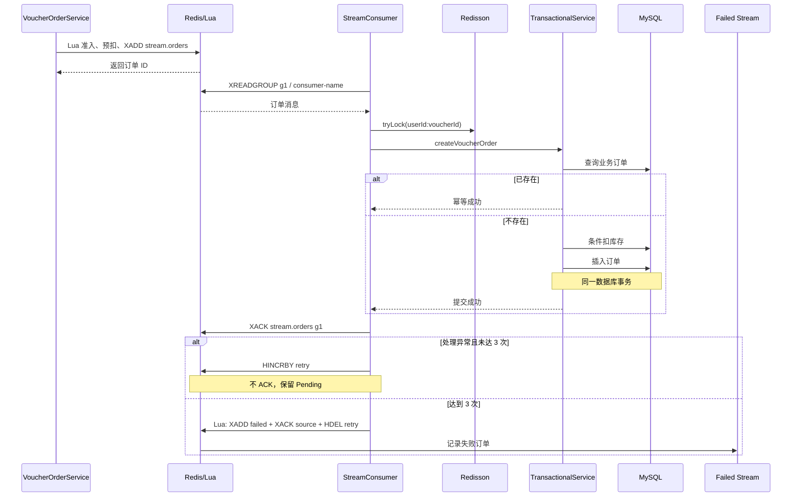

# 秒杀模块加固设计

## 1. 设计目标

- 保留 Lua + Redis Stream + MySQL 的原业务流程。
- 数据库库存扣减与订单插入同事务提交或回滚。
- 正确 ACK，任何未完成处理的消息不丢失。
- 以数据库唯一索引保证一人一券。
- 有限重试，失败后形成可查询记录。
- 不引入 Kafka 或复杂 MQ。

## 2. 加固后流程



## 3. 组件职责

### `VoucherOrderServiceImpl`

只保留请求入口职责：生成订单 ID、执行 `seckill.lua`、返回受理结果并记录准入日志。异步消费不再和 HTTP Service 混在同一类。

### `VoucherOrderStreamConsumer`

- 自动执行 `XGROUP CREATE stream.orders g1 0 MKSTREAM`；`BUSYGROUP` 视为已初始化。
- 优先处理当前消费者的 Pending 消息，再阻塞读取新消息。
- 使用 `lock:order:{userId}:{voucherId}` 避免同一业务键并发处理。
- 只调用独立事务 Service，不直接写数据库。
- 数据库成功后对 `stream.orders/g1` ACK，并校验 ACK 必须返回 1。
- 失败写持久化重试计数，500ms 退避，最多处理 3 次。
- 达到上限后写失败 Stream；失败记录写入不成功则绝不 ACK。
- 容器关闭时中断消费线程。

### `VoucherOrderTransactionalService`

公开方法使用：

```java
@Transactional(rollbackFor = Exception.class)
```

事务内步骤：

1. 校验消息必须有 `id/userId/voucherId`。
2. 查询业务订单；已存在则按幂等成功返回。
3. `stock = stock - 1 WHERE voucher_id=? AND stock>0`。
4. 插入订单。
5. 任一步骤异常，库存更新和订单插入一起回滚。

## 4. ACK 设计

### 成功 ACK

```text
事务提交成功
  ↓
XACK stream.orders g1 recordId
  ↓
校验返回值 == 1
```

如果数据库已提交但 ACK 失败，消息保持 Pending 并再次投递。第二次事务查询识别已有订单，按幂等成功处理后再次 ACK，不重复扣库存。

### 失败 ACK

`seckill-record-failure.lua` 在一次 Redis 原子执行中完成：

1. `XADD stream.orders.failed` 写失败上下文。
2. `XACK stream.orders g1 recordId`。
3. `HDEL seckill:order:retry recordId`。

这样不会出现“先 ACK，随后写失败记录失败”导致的静默丢单。

## 5. 重试与失败记录

| 项目 | 设计 |
| --- | --- |
| 重试计数 | Redis Hash `seckill:order:retry`，field 为原消息 ID |
| 最大次数 | 3 次 |
| 退避 | 每轮 500ms |
| 未达上限 | 不 ACK，继续留在 Pending List |
| 达到上限 | 原子写 `stream.orders.failed` 并 ACK 原消息 |
| 失败字段 | originalRecordId、orderId、userId、voucherId、retryCount、error、failedAt |

失败 Stream 是记录与人工补偿入口，不会自动再次创建订单。值班处理应先检查 MySQL 是否已有订单、数据库库存、Redis 库存与资格 Set，再决定幂等重放或补偿，禁止直接盲目重放。

## 6. 一人一券约束

新安装脚本与增量 migration 都声明：

```sql
UNIQUE INDEX uk_voucher_order_user_voucher (user_id, voucher_id)
```

上线前必须执行重复数据检查：

```sql
SELECT user_id, voucher_id, COUNT(*) AS duplicate_count
FROM tb_voucher_order
GROUP BY user_id, voucher_id
HAVING COUNT(*) > 1;
```

若有结果，必须先根据订单状态和业务规则人工清理，再执行 migration。数据库约束是最终防线，Redis Set、Redisson 锁和代码查询都是减压与友好处理手段。

## 7. 消费者命名与恢复

配置项：

```yaml
hmdp:
  seckill:
    consumer-name: ${SECKILL_CONSUMER_NAME:c1}
```

- 单实例开发环境可使用默认 `c1`。
- 多实例必须为每个实例设置唯一且重启后稳定的名称，例如 StatefulSet ordinal。
- 当前消费者只恢复属于自身名称的 Pending；实例永久下线时应由运维通过 `XAUTOCLAIM/XCLAIM` 转移超时消息。

## 8. 日志设计

| 场景 | 级别 | 核心字段 |
| --- | --- | --- |
| Lua 准入成功 | INFO | voucherId、userId、orderId |
| Lua 业务拒绝 | INFO | voucherId、userId、resultCode |
| 单次消费失败 | WARN | recordId、orderId、retry/max、堆栈 |
| 事务/ACK 成功 | INFO | recordId、orderId、userId、voucherId |
| 达到重试上限 | ERROR | recordId、orderId、retry、堆栈 |
| 失败记录写入异常 | ERROR | recordId、orderId、堆栈 |

## 9. 发布顺序

1. 停止秒杀写流量或进入维护窗口。
2. 查询并清理重复订单。
3. 执行 `V20260906_01__add_voucher_order_unique_index.sql`。
4. 为每个实例设置稳定的 `SECKILL_CONSUMER_NAME`。
5. 部署应用；消费者自动确认/创建 `stream.orders/g1`。
6. 检查旧 Pending 是否由 `c1` 接管，确认 `XPENDING stream.orders g1` 持续下降。
7. 监控 `stream.orders.failed`，按失败处理手册对账。

## 10. 已知边界

- 当前 Redis 为单机配置；失败 Lua 使用三个 key，若未来切 Redis Cluster，需要统一 hash tag 或调整原子方案。
- 失败 Stream 尚无自动补偿消费者，避免错误自动化扩大损失。
- 仍需后续增加活动时段校验、库存初始化/对账、Pending 自动认领、指标告警和高并发压测。

